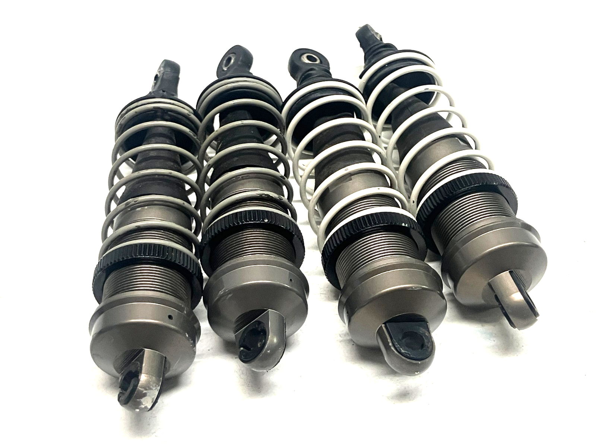
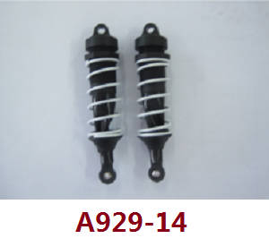
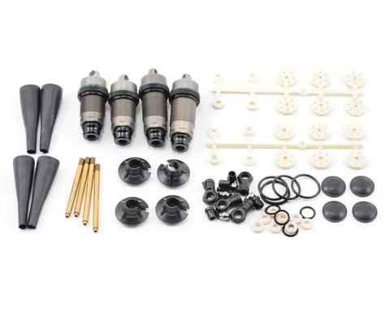
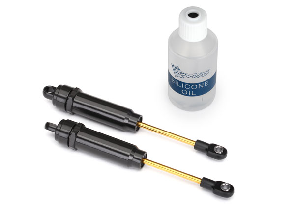
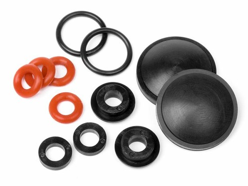
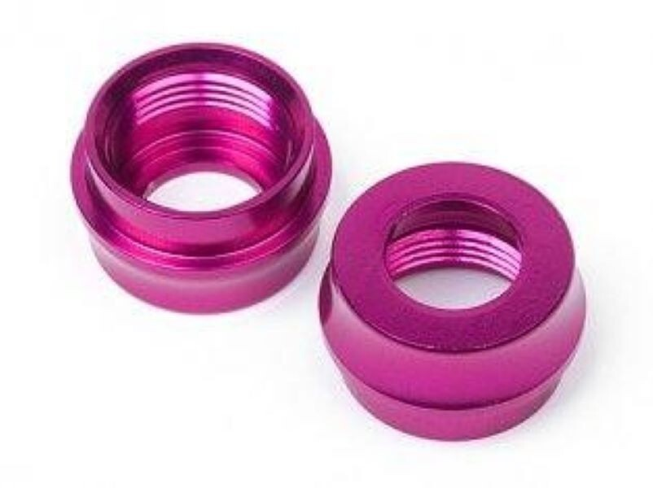
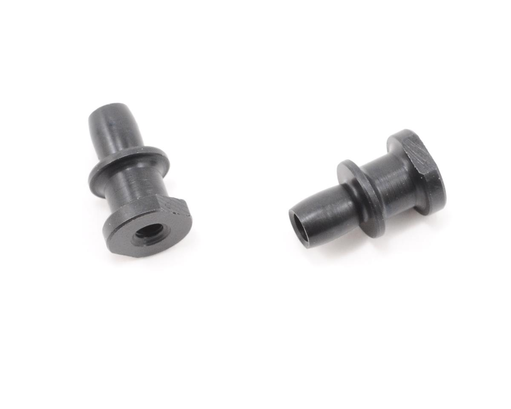

# Shock Selection — FastAzJato4x4

> **Chosen: Hot Bodies D8 metal big bore front + rear (HBS67296)** — the metal-bodied 97mm **16mm big-bore** shock. A **used set of 4 is already in hand** (buy-new ~$57.99, discontinued). The metal body shrugs off the impacts that crack plastic, so it is the running config. The plastic **HPI Apache C1 / Wltoys A929** is the same shock internally and stays as the backup. **Springs: white 59gf front, grey 52gf rear** — this car is **lighter than the K939**, so it wants the softer rear. The metal shocks mount on **HB HBS67410 standoffs — two pairs needed** (4 standoffs, 1 per shock; both purchased packs go on the car, none spare). See [shock standoffs](#shock-standoffs--mounting).
>
> **Current spec target** (subject to TBD on oil weight):
> - **Springs:** **white 59gf (HB 67454, 76mm) front + gray 52gf (HB 67453, 76mm) rear** — same as K939 spec
> - **Pistons:** 1.4mm × 6 holes, front + rear
> - **Oil:** 45wt front, **50-60wt rear (TBD)** — final pick depends on track conditions
> - **Shock length:** 97 mm **shaft length** (Apache C1 / D8 front spec — this is shaft length, *not* eye-to-eye, which is [still TBD](#hot-bodies-big-bore-shock-spring-chart-full-lineup)); D8 rears optionally 112 mm if going the full mixed-length D8 setup
>
> **Traxxas Big Bore XX-Long (2662) is vetoed:** it was "big bore" years ago, but its **10mm bore** isn't by today's standards (vs the C1/D8's 16mm) — a waste of money even at $26.95. The aluminum **GTR XX-Long (7462X, 13mm bore)** is the better OEM option if you want an in-production aluminum shock, but still less plush than the big-bore C1/D8.

  &nbsp; 
  <em>Chosen: Hot Bodies D8 metal big bore — the actual used set of 4 (in hand) · Backup: HPI Apache C1 plastic (same shock internally)</em>

---

## Table of Contents

- [Key Requirements](#key-requirements)
- [Shock Comparison](#shock-comparison) — body / brand options
- [Replacement Parts (shock bodies)](#replacement-parts-shock-bodies) — spare HB 67435 bodies
- [Shock Standoffs / Mounting](#shock-standoffs--mounting) — HB HBS67410, or force-fit hollow balls on the plastic shocks
- [Setup Spec (Springs / Pistons / Oil)](#setup-spec-springs--pistons--oil)
- [Plastic vs Metal Body Trade-off](#plastic-vs-metal-body-trade-off)
- [Notes](#notes)

---

## Key Requirements

| Requirement | Type | Why |
|---|---|---|
| **97mm big-bore class** | Must | Matches the FastAzJato4x4 ride height + arm geometry; smaller shocks don't have the travel |
| **Threaded body for adjustable preload** | Must | Setup tunability is the whole point of an aftermarket shock |
| **Standard pistons + shaft** | Must | Common spares + tunable pistons available off the shelf |
| **Rebuildable** | Must | Must come apart to service — but rebuild only when one leaks or breaks, no fixed schedule |
| **Reasonably priced** | May | Premium racing shocks cost more than the chosen motor — diminishing returns for offroad use |
| **Metal body** | May | Light enough plastic is acceptable; metal is the optimization for crash resistance |

---

## Shock Comparison

> *Spec format: Type · Bore · Length · Body material · Piston · Mounting · Part · Spring · Oil · Price*

| Shock | Spec | Pros / Cons | Photo / Link |
|---|---|---|---|
| ⭐ **Hot Bodies D8 metal big bore** (set of 4) — *chosen; used set in hand* | **Type:** Big bore (set of 4)  **Bore:** 16mm  **Length:** 97mm  **Body material:** **Aluminum (metal)**  **Piston:** Incl. set (1.3 / 1.4 / 1.5mm)  **Mounting:** HB HBS67410 standoffs — **2 pairs (1 per shock)**  **Part:** **HBS67296**  **Spring:** White 59gf front / grey 52gf rear  **Oil:** 45wt F / 50-60wt R  **Price:** **$65.99 used** (set of 4, in hand); ~$57.99 buy-new (disc.) | Pro: **The chosen running shock — metal body shrugs off the impacts that crack plastic.** Scored used as a set of 4, already in hand, so going metal costs nothing extra here. Same 16mm big-bore internals as the Apache C1, all parts interchange  Con: ~15-20g/shock heavier than the plastic C1. **Discontinued new** — scarce to find more, but the set is already here |  |
| 🥈 **HPI Racing Apache C1** — 97mm big bore — *backup; same internals, plastic body* | **Type:** Big bore  **Bore:** 16mm  **Length:** 97mm  **Body material:** Plastic  **Piston:** N/A  **Mounting:** N/A  **Part:** #107365 (MPN H107365)  **Spring:** N/A  **Oil:** N/A  **Price:** ~$20–30/pair | Pro: Light, threaded, rebuildable, well-tuned out of the box, **same internal design as the Hot Bodies D8**. Apache C1 = HPI's plastic version of the D8 shock  Con: Plastic body cracks under hard impacts (rocks, rollovers, rear-end hits) |  |
| 🔵 **Wltoys A929** (Apache C1 knock-off) — *budget backup* | **Type:** Big bore  **Bore:** 16mm  **Length:** 97mm  **Body material:** Plastic  **Piston:** N/A  **Mounting:** N/A  **Part:** A929-14  **Spring:** White springs incl.  **Oil:** N/A  **Price:** ~$15.99/set | Pro: **Knock-off of the Apache C1 — the same 97mm big-bore plastic shock for a fraction of the price.** Parts interchange with the C1 / D8. Cheapest way into the backup shock  Con: **Ships from China — slow delivery.** Knock-off QC on paper. **Horror story: some ship with the shock caps super-glued shut** — soak in **acetone** to free them for rebuilds. **Would happily run these, but availability is unproven** — no order placed yet |  |
| 🔵 **Losi 8IGHT shocks** (8B/8T) | **Type:** Big bore (set of 4)  **Bore:** Big bore  **Length:** N/A  **Body material:** Aluminum  **Piston:** N/A  **Mounting:** N/A  **Part:** LOSA5417  **Spring:** N/A  **Oil:** N/A  **Price:** Pricey — unobtanium | Pro: 1/8-class big-bore option, community-confirmed on Slash 4x4 (RCU). **Two ways to fit:** (1) full LOSA5417 set with the **original Slash 4x4 tower** (the fronts are slightly shorter), or (2) **buy two rears and run rears front + back with the Jato towers** (rear tower height is the same across all rear-tower variants)  Con: **LOSA5417 is unobtanium right now** — discontinued / very hard to find. Pricey; metal-body weight |  |
| 🔵 **Traxxas GTR shocks** — XX-Long, aluminum PTFE — *(stock OEM option)* | **Type:** XX-Long  **Bore:** 13mm  **Length:** N/A  **Body material:** Aluminum (PTFE hard-anodized)  **Piston:** N/A  **Mounting:** N/A  **Part:** 7462X (variants: 7462 / 7462G anodized alum · 7462-GRAY composite · 7461 shorter "Long")  **Spring:** Sold separately  **Oil:** 30wt incl.  **Price:** $36.95/pair | Pro: **Come stock on the higher Slash 4x4 trims (Ultimate / Platinum).** Hard-anodized aluminum, PTFE bores, TiN shafts (no stiction), threaded collars, X-rings. Native Traxxas fit, **in production** (unlike the discontinued D8)  Con: **13mm bore vs the C1/D8's 16mm** — holds less oil, so the **C1/D8 are significantly more plush and consistent**. Heavier than the plastic C1; springs sold separately |  |
| ❌ ~~**Traxxas Big Bore XX-Long**~~ | **Type:** XX-Long  **Bore:** 10mm  **Length:** N/A  **Body material:** Aluminum (PTFE hard-anodized)  **Piston:** N/A  **Mounting:** N/A  **Part:** 2662  **Spring:** N/A  **Oil:** N/A  **Price:** $26.95/pair | Pro: Classic shock — aluminum PTFE body, TiN shafts, native Traxxas fit, cheap  Con: **Waste of money.** Was "big bore" back in the day, but **10mm is not big bore by modern standards** — smaller than the GTR (13mm) and well under the C1/D8 (16mm). For similar money the Apache C1 is far more plush |  |

### Replacement Parts (shock bodies)

Spares to keep on hand for when an Apache C1 shock body gets destroyed in a crash. Worth stashing one set so a cracked body doesn't sideline the car.

| Part | Spec | Fits | Photo |
|---|---|---|---|
| **Hot Bodies 67435** — Big Bore shock body set | Threaded **aluminum** bodies, **2 pcs** | Apache C1 / HB D8 big-bore shocks |  |
| **HPI 67515** — Big Bore Shock Maintenance Set | Rebuild kit: X-rings, silicone o-rings, bladders + caps, seal spacers | Apache C1 / HB D8 big-bore shocks |  |
| **Hot Bodies 67437** — Big Bore Shock Bottom Cap | O-ring sealed threaded **bottom caps, 2-pack** (Vorza / D8S big bore), **pink anodized** | Apache C1 / HB D8 big-bore shocks |  |

> **Bonus:** because the 67435 bodies are aluminum, replacing a cracked plastic Apache C1 body with these effectively does the [metal-body upgrade](#plastic-vs-metal-body-trade-off) one shock at a time — no need to buy whole D8s.

### Shock Standoffs / Mounting

The standoff is the pivot post the shock eyelet rides on where the shock bolts to the tower and arm.

| Part | Spec | Fits | Photo |
|---|---|---|---|
| ⭐ **HB Racing Shock Standoff (2)** — **HBS67410**, ✅ **purchased 2026-08-16** ($3.99/pair) | Molded shock standoffs, 2 per pack. **Bought 2 packs = 4 standoffs, 1 per shock — all on the metal D8 set, none spare** | Hot Bodies D8 + Apache C1 big-bore shocks |  |

> **Plastic (HPI Apache C1) alternative — free:** on the plastic HPI shocks you can skip the HB standoff and **force a Traxxas hollow ball straight into the shock eyelet** — the same [hollow balls used in the tie rod ends](tie_rod_analysis.md#pivot-balls). It press-fits and holds; tested, it works. So HBS67410 is the tidy option for the metal D8 path, while the plastic path can reuse the hollow balls already on hand.

---

## Setup Spec (Springs / Pistons / Oil)

This is the target tuning — based on the K939 build, but the FastAzJato4x4 is **lighter than the K939**, so it wants the **softer rear** (the grey 52gf) for grip and compliance under less weight.

| Position | Spring | Piston | Oil |
|---|---|---|---|
| **Front** | **White 59gf** (Hot Bodies #67454, 76mm — stock Apache C1 / D8) | **1.4mm × 6 holes** | **45wt** |
| **Rear** | **Grey 52gf** (Hot Bodies #67453, 76mm — soft for bump compliance) | **1.4mm × 6 holes** | **50-60wt (TBD)** — start at 50, bump to 60 if too plush |

**Why this setup:**
- **White 59gf front + grey 52gf rear** = stock Apache C1 / D8 spec, K939-tested. The softer rear gives more bump compliance and rear grip — and this car is **lighter than the K939**, so the lighter rear end wants the softer spring, not a stiffer one
- **Spring sourcing:** the HPI Apache C1 and Hot Bodies D8 both ship stock with **white** springs. On real **D8 buggy take-offs** you'll typically find a **grey + white combo** — which is exactly this front (white) / rear (grey) pairing, so used take-off springs are a cheap, easy source
- 1.4mm × 6 holes = mid-range damping, good general-purpose piston. Tighter holes (1.2-1.3mm) increase damping for smoother tracks; bigger holes (1.5-1.6mm) loosen damping for whoops
- 45wt front / 50-60wt rear = rear heavier to control squat under power and rebound from jumps. 60wt is the upper end if 50wt feels too floaty on landings

### Hot Bodies Big Bore Shock Spring chart (full lineup)

All HB Big Bore springs sold as a pair. The chosen pair is bolded. **Shorter springs (60mm)** suit shorter shock bodies / tighter packaging; **76mm** is the most common length for 97mm-eye-to-eye Apache C1 / D8 fronts.

| Part # | Color | Length | Rate | Sold as |
|---|---|---|---|---|
| HB 67446 | Gray | 60 mm | 74 gf | pair |
| HB 67448 | Blue | 60 mm | 89 gf | pair |
| HB 67449 | Orange | 60 mm | 98 gf | pair |
| HB 67450 | Green | 68 mm | 59 gf | pair |
| HB 67451 | Yellow | 68 mm | 68 gf | pair |
| HB 67452 | Red | 68 mm | 81 gf | pair |
| **HB 67453** | **Gray** | **76 mm** | **52 gf** | **pair — chosen rear** |
| **HB 67454** | **White** | **76 mm** | **59 gf** | **pair — chosen front** |
| HB 67455 | Blue | 76 mm | 63 gf | pair |
| HB 67456 | Orange | 76 mm | 74 gf | pair |

> **Shock length reference**: Apache C1 / D8 fronts are spec'd as **97 mm (shaft length)**. Hot Bodies D8 rears are an optional **112 mm** (HBS67298) if you want longer rear droop / travel — note the longer rear shock body changes which spring length fits cleanly.
>
> **What "97mm" / "112mm" actually means — it's the shaft length, not eye-to-eye.** These numbers refer to the **shock shaft length**, *not* the overall pin-to-pin / eye-to-eye length. **The eye-to-eye length is still TBD** — measure an actual shock with a caliper to get it. Confirm the real installed length before ordering any aftermarket parts (springs, shafts, bodies) that depend on it.

---

## Plastic vs Metal Body Trade-off

The Apache C1 (plastic) and Hot Bodies D8 (metal) are **the same shock internally** — same shaft, same piston interface, same internal volume, same external dimensions. The body material is the only meaningful difference.

| | Apache C1 (plastic) | D8 (metal) |
|---|---|---|
| Weight (each) | ~45-50g | ~60-65g |
| Impact resistance | Cracks under hard hits on body | **Bulletproof — never seen a metal body dent *or* crack** on any metal shock |
| Repairability after impact | Replace whole body | N/A — they just keep going |
| Price (pair) | $20-30 | $58 new (disc.), $30-80 used |
| Heat (sustained running) | Plastic insulates — oil stays hotter, fades faster | Aluminum sheds heat — more consistent damping over a long pack |
| Handling impact of weight | Lighter unsprung mass = better bump response | 4×15-20g = ~80g added across all corners — small but measurable |

**Take:** going metal from the start on this build — the **Hot Bodies D8 set is already in hand** (used), so the metal body's crash resistance costs nothing extra here. The plastic Apache C1 stays as the identical-internals backup. (On a build without a metal set already owned, the call would flip: start plastic, upgrade only once a body cracks — no point pre-paying the weight + cost penalty otherwise.)

---

## Notes

- **One shock, three flavors — and all parts interchange.** The genuine **Hot Bodies D8 (HBS67296)**, the **HPI Apache C1 (107365)**, and the **Wltoys A929 knock-off** are the same 97mm big-bore shock. Bodies, shafts, pistons, springs, caps, and boots **swap freely between Apache C1 and D8** — so you can rebuild or upgrade one piece at a time (e.g. drop a metal [67435 body](#replacement-parts-shock-bodies) into a plastic Apache C1). If you find unlabeled "big bore buddy shocks" with no size listed, they're most likely these — run them front and rear.
- **Losi 8IGHT (LOSA5417) fitment, two ways:** the full set has **slightly shorter fronts**, so to run the whole set you need the **original Slash 4x4 tower**. The simpler path is to **buy two of the rear shocks and run rears at both ends with the Jato towers** — the **rear tower height is the same across all rear-tower variants**, so any rear tower mounts them at the same height. Note LOSA5417 is currently unobtanium.
- **"XXL" / "XX-Long" = long travel, not big bore.** The XX-Long designation refers to the shock's **travel / length** (longer shaft + body), which is independent of bore diameter. A shock can be XX-Long but small-bore — the GTR (13mm) and 2662 (10mm) both are. Don't read "XX-Long" as "big bore."
- **Bore size is why the C1/D8 win over the GTR:** the Apache C1 / D8 are **16mm bore**, the Traxxas GTR XX-Long is **13mm**. The bigger bore holds more oil, which makes the C1/D8 **significantly more plush and consistent** — the GTR is a good, in-production aluminum shock, but it can't match the big-bore damping. The GTR's edge is availability (the D8 is discontinued) and a PTFE/TiN-slick, in-stock OEM option.
- The K939 build uses Apache C1 (plastic) and has not had a body-cracking problem in ~~years~~ many packs — the FastAzJato4x4 *might* be fine on plastic too. The trigger to swap to metal D8 would be **first cracked body**, not pre-emptive optimization.
- **Shock tower geometry interacts with shock survival** — see the [aero analysis cascade](aero_analysis.md#shock-tower-compatibility-cascade). The "shocks at the back of the car" geometry from the OEM Jato wing mount + #9034 stock tower is the root cause of past shock body damage. **The fix on this build is the special combo: a Slash 4x4 rear tower (old *or* new version) + the metal plate + the OEM Jato 4x4 wing mount** — it corrects the geometry so the plastic shocks survive, which is cheaper insurance than upgrading to metal bodies (or the STRC backflash kit).
- **Oil weight is climate-dependent** — silicone shock oil thickens in cold weather. The 45wt front / 50-60wt rear target assumes mild conditions; bump down 5wt per side if running in cold.
- **Maintenance: run them till something breaks or leaks** — no scheduled rebuild interval. When a shock starts leaking or a seal/o-ring fails, rebuild *that* shock then. Otherwise leave them alone.
- **Shock boots ("condoms") — recommended, not required.** The rubber boots that sleeve the shaft keep grit off the shaft and seal, so **when installed properly the seal stays nicer and lasts longer**. Totally fine to run without them — take it or leave it.
