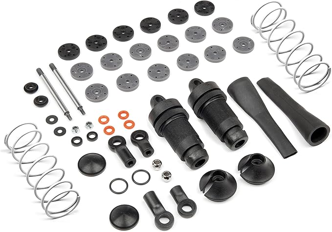
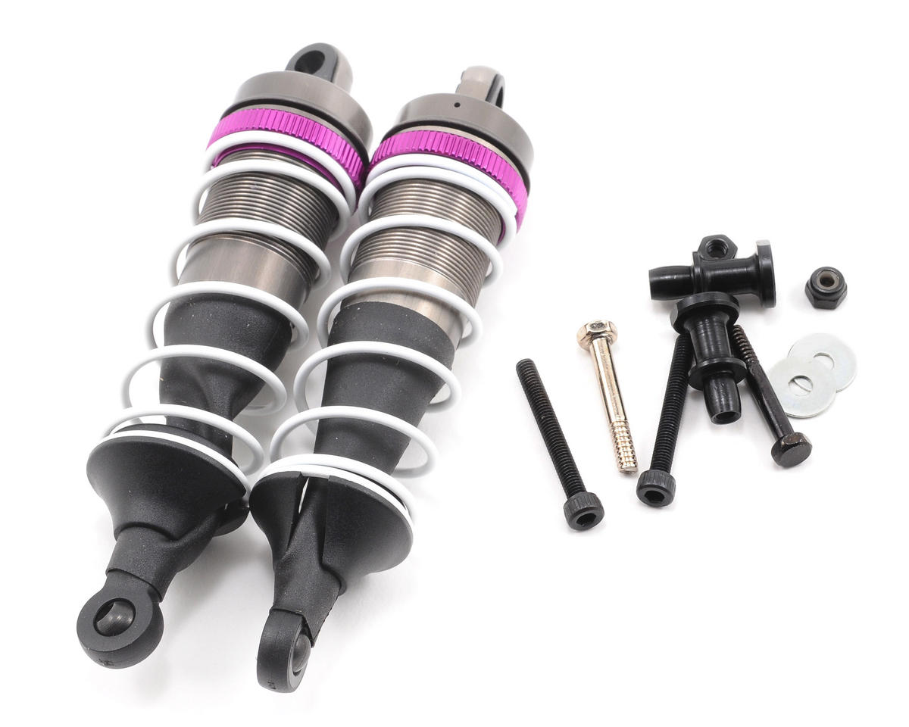
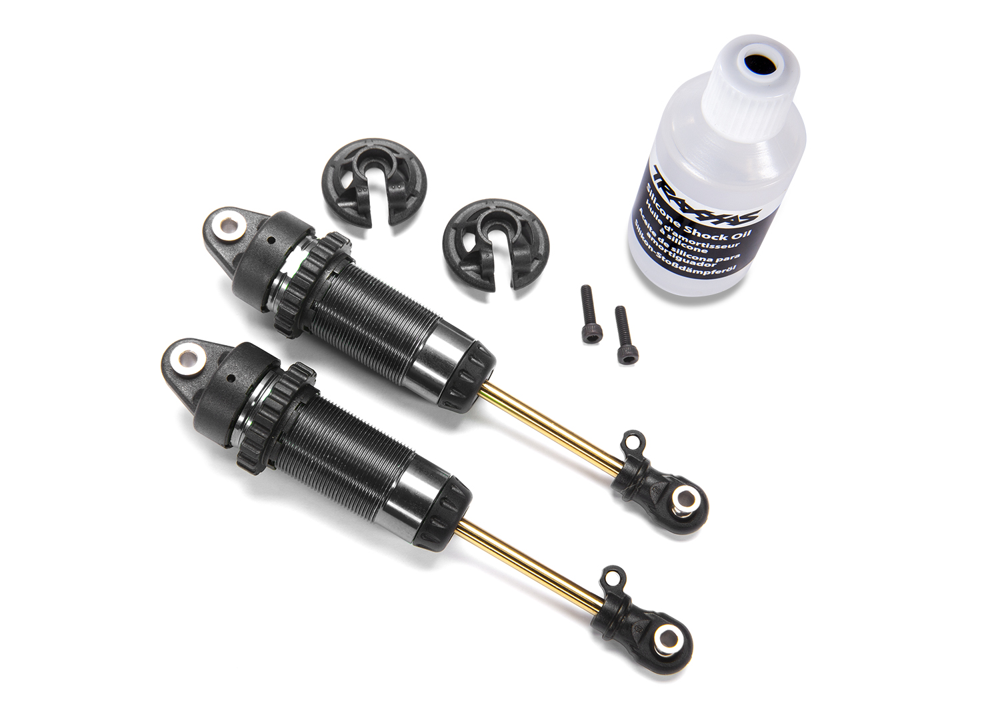
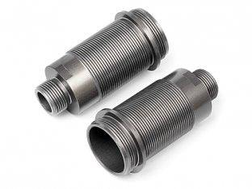

# Shock Selection — FastAzJato4x4

> **Leaning toward: Hot Bodies D8 (metal-body version)** — same physical design as the HPI Apache C1 already in hand on the K939 build, but **metal body** instead of plastic. The plastic Apache C1 is fine and light (planned for front + rear on this build); the metal D8 is an optimization if shock-body damage in crashes becomes a problem.
>
> **Current spec target** (subject to TBD on oil weight):
> - **Springs:** **white 59gf (HB 67454, 76mm) front + gray 52gf (HB 67453, 76mm) rear** — same as K939 spec
> - **Pistons:** 1.4mm × 6 holes, front + rear
> - **Oil:** 45wt front, **50-60wt rear (TBD)** — final pick depends on track conditions
> - **Shock length:** 97 mm (Apache C1 / D8 front spec — see [reference note](#hot-bodies-big-bore-shock-spring-chart-full-lineup) for what "97mm" actually measures); D8 rears optionally 112 mm if going the full mixed-length D8 setup
>
> **Traxxas Big Bore XXL shocks are explicitly vetoed:** they were "big bore" when released years ago but are not by modern standards, and they're way overpriced for the performance.

---

## Table of Contents

- [Key Requirements](#key-requirements)
- [Shock Comparison](#shock-comparison) — body / brand options
- [Replacement Parts (shock bodies)](#replacement-parts-shock-bodies) — spare HB 67435 bodies
- [Setup Spec (Springs / Pistons / Oil)](#setup-spec-springs--pistons--oil)
- [Plastic vs Metal Body Trade-off](#plastic-vs-metal-body-trade-off)
- [Notes](#notes)

---

## Key Requirements

| Requirement | Type | Why |
|---|---|---|
| **97mm big-bore class** | Must | Matches the FastAzJato4x4 ride height + arm geometry; smaller shocks don't have the travel |
| **Threaded body for adjustable preload** | Must | Setup tunability is the whole point of an aftermarket shock |
| **Standard pistons + shaft** | Must | Common spares + tunable pistons available off the shelf |
| **Rebuildable** | Must | Shocks need re-oiling and seal replacement every 10-20 packs |
| **Reasonably priced** | May | Premium racing shocks cost more than the chosen motor — diminishing returns for offroad use |
| **Metal body** | May | Light enough plastic is acceptable; metal is the optimization for crash resistance |

---

## Shock Comparison

| Shock | Body material | Status | Pros / Cons | Photo / Link |
|---|---|---|---|---|
| **HPI Racing Apache C1 (#107365)** — 97mm big bore | Plastic | **In Hand** (running on K939) — planned for FastAzJato4x4 front + rear | Pro: Light, cheap (**~$20–30/pair**, MPN H107365), threaded, rebuildable, well-tuned out of the box, **same internal design as the Hot Bodies D8 below**. Apache C1 = HPI's plastic version of the D8 shock  Con: Plastic body cracks under hard impacts (rocks, rollovers, rear-end hits) |  |
| **Hot Bodies D8 (metal body)** — **HBS67296** | Metal (aluminum) | **Leaning toward — the optimization step from the Apache C1** | Pro: **Same physical design and internals as the Apache C1** but with a metal body — survives impacts that would crack the plastic version. **Includes a full piston set (1.3 / 1.4 / 1.5mm) + hardware.** Same 97mm big-bore shock sold as the Apache C1 and a Wltoys knock-off — still findable  Con: ~15-20g heavier per shock (aluminum body adds mass at the corners). **Discontinued new ($57.99 list)** — buy when you spot one. Used: **~$80 or less a set, sometimes $30 for a set of 4 if lucky** |  |
| ~~Traxxas Big Bore XXL~~ | Plastic | **Vetoed** | Pro: Native fit to a Traxxas chassis, factory body color match  Con: **Not actually big bore by modern standards** — the "XXL" name is marketing from when the shock first launched; today's real big bores are larger diameter. Overpriced ($50-70/pair) for what they deliver. No tuning advantage over the cheaper Apache C1 / D8 | — |
| **Traxxas GTR shocks** — XX-Long (XXL), aluminum PTFE — **7462X** | Aluminum (PTFE hard-anodized)  Bore: **13mm**  Price: **$36.95/pair** (incl. 30wt oil; springs sep.)  Variants: **7462X** PTFE alum · **7462 / 7462G** anodized alum (red/blue/green) · **7462-GRAY** composite (cheapest) · **7461** = shorter "Long" version | **Candidate (stock OEM option)** | Pro: **Come stock on the higher Slash 4x4 trims (Ultimate / Platinum).** Hard-anodized aluminum, PTFE-coated bores, TiN-coated shafts (no stiction), threaded collars, X-rings. Native Traxxas fit, **in production** (unlike the discontinued D8)  Con: **13mm bore vs the Apache C1/D8's 16mm bore** — holds less oil, so the **C1/D8 are significantly more plush and consistent**. Heavier than the plastic C1; springs sold separately |  |

### Replacement Parts (shock bodies)

Spares to keep on hand for when an Apache C1 shock body gets destroyed in a crash. Worth stashing one set so a cracked body doesn't sideline the car.

| Part | Spec | Fits | Photo |
|---|---|---|---|
| **Hot Bodies 67435** — Big Bore shock body set | Threaded **aluminum** bodies, **2 pcs** | Apache C1 / HB D8 big-bore shocks |  |

> **Bonus:** because the 67435 bodies are aluminum, replacing a cracked plastic Apache C1 body with these effectively does the [metal-body upgrade](#plastic-vs-metal-body-trade-off) one shock at a time — no need to buy whole D8s.

---

## Setup Spec (Springs / Pistons / Oil)

This is the target tuning — same as the K939 build, adjusted slightly for the FastAzJato4x4's heavier curb weight.

| Position | Spring | Piston | Oil |
|---|---|---|---|
| **Front** | **White 59gf** (Hot Bodies #67454, 76mm — stock Apache C1 / D8) | **1.4mm × 6 holes** | **45wt** |
| **Rear** | **Grey 52gf** (Hot Bodies #67453, 76mm — soft for bump compliance) | **1.4mm × 6 holes** | **50-60wt (TBD)** — start at 50, bump to 60 if too plush |

**Why this setup:**
- **White 59gf front + grey 52gf rear** = stock Apache C1 / D8 spec, K939-tested. Slightly softer rear gives more bump compliance over hardpack
- **Spring sourcing:** the HPI Apache C1 and Hot Bodies D8 both ship stock with **white** springs. On real **D8 buggy take-offs** you'll typically find a **grey + white combo** — which is exactly this front (white) / rear (grey) pairing, so used take-off springs are a cheap, easy source
- 1.4mm × 6 holes = mid-range damping, good general-purpose piston. Tighter holes (1.2-1.3mm) increase damping for smoother tracks; bigger holes (1.5-1.6mm) loosen damping for whoops
- 45wt front / 50-60wt rear = rear heavier to control squat under power and rebound from jumps. 60wt is the upper end if 50wt feels too floaty on landings

### Hot Bodies Big Bore Shock Spring chart (full lineup)

All HB Big Bore springs sold as a pair. The chosen pair is bolded. **Shorter springs (60mm)** suit shorter shock bodies / tighter packaging; **76mm** is the most common length for 97mm-eye-to-eye Apache C1 / D8 fronts.

| Part # | Color | Length | Rate | Sold as |
|---|---|---|---|---|
| HB 67446 | Gray | 60 mm | 74 gf | pair |
| HB 67448 | Blue | 60 mm | 89 gf | pair |
| HB 67449 | Orange | 60 mm | 98 gf | pair |
| HB 67450 | Green | 68 mm | 59 gf | pair |
| HB 67451 | Yellow | 68 mm | 68 gf | pair |
| HB 67452 | Red | 68 mm | 81 gf | pair |
| **HB 67453** | **Gray** | **76 mm** | **52 gf** | **pair — chosen rear** |
| **HB 67454** | **White** | **76 mm** | **59 gf** | **pair — chosen front** |
| HB 67455 | Blue | 76 mm | 63 gf | pair |
| HB 67456 | Orange | 76 mm | 74 gf | pair |

> **Shock length reference**: Apache C1 / D8 fronts are spec'd as **97 mm**. Hot Bodies D8 rears are an optional **112 mm** (HBS67298) if you want longer rear droop / travel — note the longer rear shock body changes which spring length fits cleanly.
>
> **Caveat on what "97mm" / "112mm" actually means**: Hot Bodies / HPI don't explicitly define which measurement they're using. RC forum convention (RCTech, RCU) treats these numbers as **overall pin-to-pin length at full extension** (effectively eye-to-eye when you treat the mounting holes as eyes). The threaded body alone would be ~55-65mm; the rest is shaft + caps. Some manufacturers spec at-rest installed length instead. Verify with a caliper on an actual shock before ordering specific aftermarket parts that depend on exact length.

---

## Plastic vs Metal Body Trade-off

The Apache C1 (plastic) and Hot Bodies D8 (metal) are **the same shock internally** — same shaft, same piston interface, same internal volume, same external dimensions. The body material is the only meaningful difference.

| | Apache C1 (plastic) | D8 (metal) |
|---|---|---|
| Weight (each) | ~45-50g | ~60-65g |
| Impact resistance | Cracks under hard hits on body | Dents but doesn't crack |
| Repairability after impact | Replace whole body | Often still usable, sometimes straighten |
| Price (pair) | ~$20-30 | ~$58 new (disc.), ~$30-80 used |
| Heat (sustained running) | Plastic insulates — oil stays hotter, fades faster | Aluminum sheds heat — more consistent damping over a long pack |
| Handling impact of weight | Lighter unsprung mass = better bump response | 4×15-20g = ~80g added across all corners — small but measurable |

**Take:** start with the plastic Apache C1 already known to work on the K939. **Upgrade to metal D8 only if shock-body damage becomes a recurring problem** in real crashes on this build. Don't pre-emptively pay the weight + cost penalty for a problem you might not have.

---

## Notes

- **One shock, three flavors — and all parts interchange.** The genuine **Hot Bodies D8 (HBS67296)**, the **HPI Apache C1 (107365)**, and a **Wltoys knock-off** are the same 97mm big-bore shock. Bodies, shafts, pistons, springs, caps, and boots **swap freely between Apache C1 and D8** — so you can rebuild or upgrade one piece at a time (e.g. drop a metal [67435 body](#replacement-parts-shock-bodies) into a plastic Apache C1). If you find unlabeled "big bore buddy shocks" with no size listed, they're most likely these — run them front and rear.
- **Bore size is why the C1/D8 win over the GTR:** the Apache C1 / D8 are **16mm bore**, the Traxxas GTR XX-Long is **13mm**. The bigger bore holds more oil, which makes the C1/D8 **significantly more plush and consistent** — the GTR is a good, in-production aluminum shock, but it can't match the big-bore damping. The GTR's edge is availability (the D8 is discontinued) and a PTFE/TiN-slick, in-stock OEM option.
- The K939 build uses Apache C1 (plastic) and has not had a body-cracking problem in ~~years~~ many packs — the FastAzJato4x4 *might* be fine on plastic too. The trigger to swap to metal D8 would be **first cracked body**, not pre-emptive optimization.
- **Shock tower geometry interacts with shock survival** — see the [aero analysis cascade](aero_analysis.md#shock-tower-compatibility-cascade). The "shocks at the back of the car" geometry from the OEM Jato wing mount + #9034 stock tower is the root cause of past shock body damage. Solving the geometry problem (STRC backflash kit) is potentially a cheaper insurance than upgrading shock bodies to metal.
- **Oil weight is climate-dependent** — silicone shock oil thickens in cold weather. The 45wt front / 50-60wt rear target assumes mild conditions; bump down 5wt per side if running in cold.
- **Rebuild schedule:** every 10-20 packs, pull shocks apart, inspect seals + o-rings, replace oil. Plastic shock o-rings degrade faster than the metal D8's; another small win for the metal upgrade if rebuild frequency matters.
