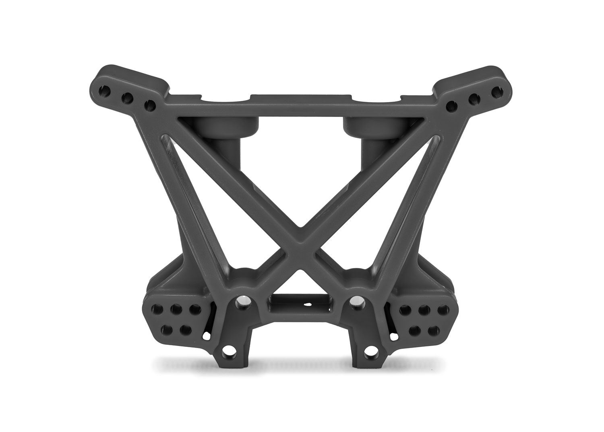
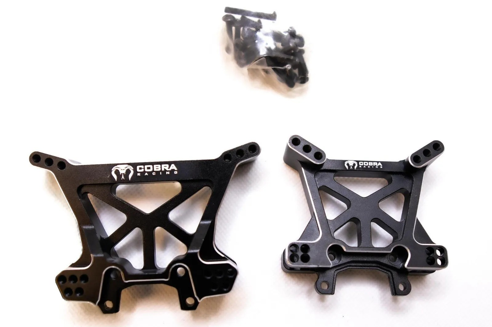

# Shock Tower Material Research

Cross-car research on shock tower material choices: stock composite, carbon fiber, aluminum. Applies broadly — Slash 4x4, Jato 4x4, ARRMA platforms, etc.

---

## Decision for FastAzJato4x4 (racing): Stock Plastic

Even for the racing build, **stock plastic wins on every axis**:

1. **Same weight** — glass-filled nylon and CFRP have nearly identical density (~1.5 g/cm³). At equal thickness (~4mm), the aftermarket CF tower isn't meaningfully lighter.
2. **Cheaper** — stock front and rear towers are ~$6 each from Traxxas. CF set is $33+.
3. **Sacrificial** — Traxxas tuned the tower to break before the chassis or trans case. CF and aluminum shift failure to more expensive parts.

| Traxxas Stock Front Tower (#9033) | Traxxas Stock Rear Tower (#9034) |
|-------------------|------------------|
|  |  |

---

## TL;DR (cross-car)

| Use case | Pick |
|----------|------|
| Bashing — want chassis/arms to survive | **Stock composite** |
| Racing on a Jato 4x4 | **Stock composite** (cheap, sacrificial, same weight as CF) |
| Racing on a Slash 4x4 (weak stock towers) | **Carbon fiber** |
| Speed run / cosmetics only | Aluminum (don't use for bashing) |

---

## Material Properties

### Density (g/cm³)

| Material | Density |
|----------|---------|
| Pure nylon 6/6 | 1.14 |
| 30% glass-filled nylon | ~1.36 |
| 50% glass-filled nylon (typical RC "composite") | ~1.50–1.57 |
| CFRP (carbon fiber + epoxy, finished part) | ~1.50–1.60 |
| 7075-T6 aluminum | 2.81 |

**Key insight:** glass-filled nylon and CFRP are nearly identical in density. At the same thickness and shape, the weight is roughly the same. CF is **not** magically lighter than the plastic Traxxas uses.

### Where CF Saves Weight

CF wins on **stiffness per gram**. A 3mm CF plate can match a 4mm composite tower in rigidity, so a thinner CF tower can be 20–30% lighter at equal stiffness. But most off-the-shelf aftermarket CF towers (G-Maxx, Exotek, JConcepts) are the same 3–4mm as the stock tower, so real-world weight savings are minimal (~5–10g total).

### Aluminum

7075-T6 at typical 3–4mm thickness is roughly **80% heavier per unit volume** than either composite or CFRP. Aluminum towers are always a weight penalty.

---

## Failure Modes

| Material | Behavior under impact | When it fails |
|----------|----------------------|---------------|
| Composite (glass-filled nylon) | Flexes, then cracks gradually. Cold makes it brittle. | Cracks at stress concentrations (shock mount holes, edges). Often still drivable cracked. |
| Carbon fiber | Stays rigid through the impact, then snaps cleanly | Catastrophic — no warning, no partial damage. Delaminates under repeated abuse. |
| 7075-T6 aluminum | Bends before breaking. Stays mostly intact. | Permanently deforms. Bent towers throw off geometry forever. |

### What Actually Breaks

- **Stock plastic**: tower cracks first. Chassis, A-arms, hinge pins usually survive.
- **CF**: tower survives most crashes but fails catastrophically when it does. Chassis and arms more exposed.
- **Aluminum**: tower itself rarely breaks — instead the **mounting points** crack. Known Jato issue: aluminum shock tower transfers impact to the transmission case, which then breaks. Traxxas literally engineered the plastic tower as a sacrificial part.

---

## Per-Car Recommendations

### Slash 4x4 — CF towers worth it

- Stock plastic towers are a known weak point — flex enough that aggressive shock setups don't translate to wheels properly
- Common failure: cracks at shock mount holes after heavy bashing
- CF towers are stiffer, more crash-resistant than stock, and only marginally heavier
- **Verdict:** CF worth it on a Slash 4x4 you actually drive hard

**Options:**
- Exotek (ETK2213/2214) — 4mm quasi-weave, well-reviewed
- JConcepts MT 4.0 — designed for monster truck duty
- Xtreme Racing — budget

### Jato 4x4 (BL-2S / VXL-4S) — stay stock

- Traxxas already redesigned the Jato 4x4 towers as "Extreme HD" with double-shear link mounts and extra material — much less break-prone than the original nitro Jato
- CF doesn't save meaningful weight at typical 4mm thickness
- Aluminum transfers force to trans case (well-known issue)
- Stock towers run ~$6 each — cheapest option as well as sacrificial
- **Verdict:** stock composite is the smart pick, even for racing

**Aftermarket options (if you want them anyway):**

| Option | Price | Notes |
|--------|-------|-------|
| **Traxxas stock composite (#9033 front, #9034 rear)** | **~$6 each** | Cheapest; sacrificial; same weight as CF at 4mm |
| G-Maxx / MonsterKingz CF (front + rear) | [$33.29](https://www.ebay.com/itm/236159423243) | Lightest aftermarket option; presumed 4mm. Sold by MonsterKingz on eBay |
| Powerhobby aluminum set | $39.99 | Heavier than stock |
| Cobra Racing 7075-T6 aluminum set | $49.95 | Beefiest aluminum option |
| GPM 7075-T6 aluminum (per tower) | ~$28 ea | Color options |

| G-Maxx Carbon Fiber | Cobra Racing Aluminum |
|---------------------|-----------------------|
|  |  |

### ARRMA Typhon 6S — chassis weight savings minimal

(Not towers, but related research while in the rabbit hole.) Stock V5 plastic chassis is ~300g. CF chassis options (Scorched Parts CF Hybrid at 258g, M2C lightweight at 279g) save only 20–40g — roughly 1% of total vehicle weight, with a stiffness penalty that hurts bash compliance. Not worth it for most users.

---

## Sources

- [Powerhobby Carbon Fiber Chassis for Arrma 6S](https://www.powerhobby.com/products/powerhobby-carbon-fiber-chassis-for-arrma-6s-outcast-typhon-senton-notorious)
- [Scorched Parts CF Hybrid Chassis](https://scorchedparts.co.uk/products/copy-of-carbon-fibre-hybrid-chassis-arrma-kraton-6s-v1-v4)
- [Cobra Racing Jato 4x4 aluminum tower set](https://cobraracing.net/product/cr-traxxas-jato-bl-2s-vxl-4s-4x4-black-aluminum-shock-towers-complete-set/)
- [G-Maxx / MonsterKingz CF towers for Jato 4x4 — eBay $33.29](https://www.ebay.com/itm/236159423243)
- [Exotek Slash 4x4 CF shock tower](https://www.exotekracing.com/slash-4x4-carbon-fiber-shock-tower-front-4wd-slash-rally)
- [JConcepts MT 4.0mm CF rear shock tower](https://jconcepts.net/traxxas-slash-4x4-stampede-4x4-mt-40mm-carbon-fiber-rear-shock-tower)
- [Jato shock tower breakage discussion — RCU Forums](https://www.rcuniverse.com/forum/rc-nitro-stadium-trucks-243/3460827-any-one-break-jato-shock-tower-trans-here-cure.html)
