# Shock Tower Selection — FastAzJato4x4

> **Chosen: stock Traxxas composite #9033 front, G-Maxx carbon fibre rear.** Not the full CF set. This car is tail heavy, so the front keeps the tougher, simpler plastic tower and the rear sheds what it can. Stock plastic at both ends is the same layout for about $12.

  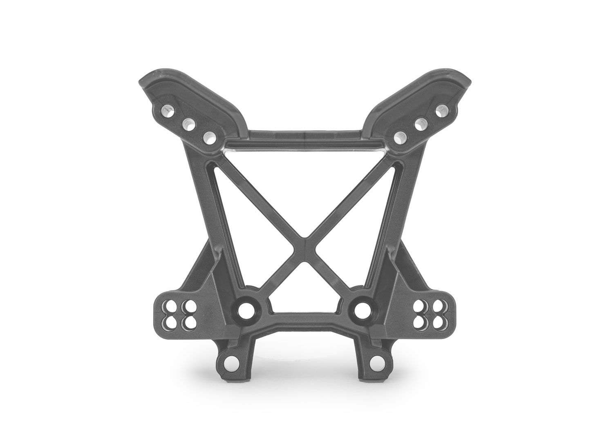&nbsp;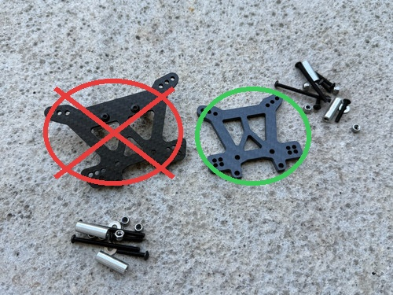&nbsp;&nbsp;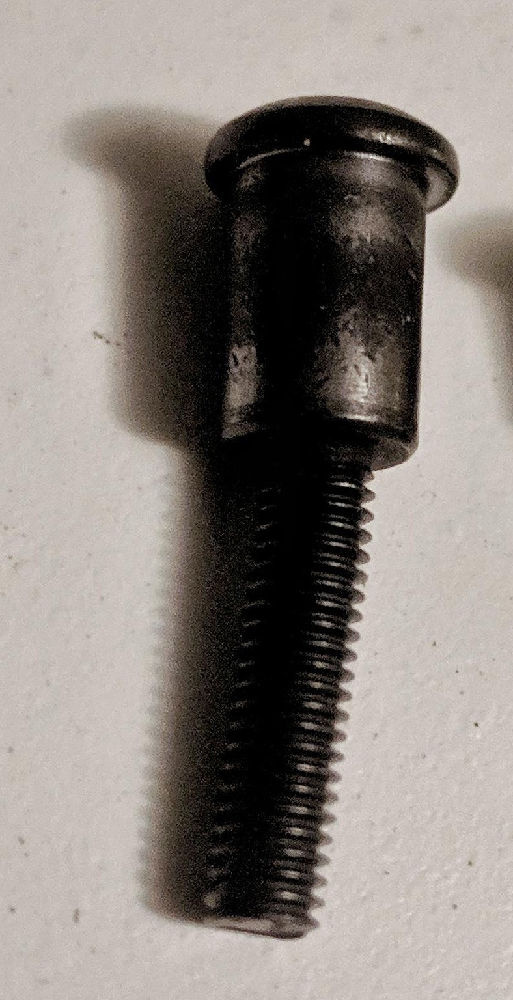 
  <em>stock #9033 front · G-Maxx carbon, rear only · HB / HPI 67410 standoffs, not the kit's aluminium ones · the wheelie bar shoulder screw</em>

---

## Table of Contents

- [Key Requirements](#key-requirements) — Must / May criteria for the tower pick
- [Shock Tower Comparison](#shock-tower-comparison) — every tower option with specs and status
- [Going lower: shorter front tower](#going-lower-the-shorter-slash-4x4-front-tower) — TRA6839 / 9038, and the shock work it needs
- [Front Shock Mounting](#front-shock-mounting-wheelie-bar-shoulder-screws) — the wheelie bar screw, and which bar to buy
- [Material Properties (Reference)](#material-properties-reference) — density, failure mode, aluminum nuance
- [Detailed Notes](#detailed-notes) — bullet specs per option
- [Related: Tower Bracing (Optional)](#related-tower-bracing-optional) — Traxxas TRA9061 brace analysis
- [Sources](#sources)

---

## Why this combination

**Front, stock plastic (#9033, $6)**

- Carbon needs long standoffs and long screws to reach the big bores. More parts, more length to bend, and it looks bad.
- Carbon leaves the shock caps exposed and wants 3D printed covers. The stock tower protects them as it comes.
- A brittle front tower grenades the front end on a direct hit, worse on a Jato than a Slash because the Jato tower is taller and has more leverage.
- Lines up on the FLM arms using the spacers those arms already ship with. No shimming.
- The few grams plastic costs over carbon are welcome at the nose on a tail heavy car.
- Shock uppers mount on wheelie bar shoulder screws. See [Front Shock Mounting](#front-shock-mounting-wheelie-bar-shoulder-screws).

**Rear, G-Maxx carbon fibre**

- Takes the D8 big bores on the HPI Vorza Flux / HB 67410 standoffs ([`shock_analysis.md`](shock_analysis.md#shock-standoffs--mounting)). The kit's own aluminium standoffs get binned.
- **Shocks mount ahead of the tower, Slash style.** The Jato hangs them off the back as standard, so this is a big move forward. The shock sits protected behind the tower and the mass comes off the very back of the car.
- A few grams under either stock plastic rear tower once the metal wing brace is off, which this car can do because the [Jato 3.3 shell](aero_analysis.md) has an integrated wing and no separate mount.

**The $12 version**

- A Slash 4x4 rear tower, **TRA9039** or **TRA6838**, is **$6** and gives the same layout. Their shock holes match; only the top body mount spacing differs.
- Carbon only sells as a **$33.29 set** whose front tower goes unused, and it arrives needing printed covers and different standoffs. Stock at both ends is about **$12** and a few grams heavier.

---

## Key Requirements

| Requirement | Type | Why |
|---|---|---|
| **Fits Jato 4x4 mounts** | Must | Direct bolt-on for #9033 front and #9034 rear positions |
| **Survives racing impacts** | Must | Has to handle hard landings and rollovers without parking the car |
| **Sacrificial failure** | Must | Tower should fail before chassis / trans case / arms, those are more expensive |
| **Weight ≤ stock** | Must | Shock towers sit **high on the car**, adding weight there raises the CG, makes the car tippy in corners, and hurts handling more than the same weight added anywhere else. Aluminum towers are ~80% heavier per unit volume and **right where you don't want extra weight** |
| **Stiff** | May | Less flex = more consistent suspension geometry under load (matters more for racing than bashing) |
| **Cheap** | May | Easy to replace after a crash without sweating the budget |
| **Locally available** | May | Shock towers are a consumable part, break, replace, repeat. Anything in stock at a local hobby store beats waiting for an online order |
| **Sold per tower** | May | If only the front breaks, you only want to buy the front. CF and most aluminum sets force you to buy front + rear together |

---

## Shock Tower Comparison

> *Spec format: Material · Thickness · Dimensions · Weight · Failure mode · Price*

| Tower | Spec | Pros / Cons | Photo / Link |
|---|---|---|---|
| ⭐ **MonsterKingz (G-Maxx) Carbon Fiber set** — *rear only chosen; in hand* | **Material:** 3K CFRP  **Thickness:** Presumed 4mm  **Dimensions:** N/A  **Weight:** **Front 12.3g · rear 24.4g measured**, front is ~5g lighter than the 17.2g stock front, but **rear is heavier than stock** (stock rear TRA9039 presumed ~17g), nets out to **not much lighter overall**, matching the real-world verdict below  **Failure mode:** Catastrophic snap (no warning)  **Price:** [$33.29 / set](https://www.ebay.com/itm/236159423243), set only, no individual towers | Pro: **Chosen. Fits the larger D8 big-bore shocks better** with the HPI Vorza Flux shock standoffs (67410 = the HB HBS67410 in hand). Stiffer than composite per gram. **3D-printed shock covers** shield the shock caps the CF doesn't. Already in hand (bought to test earlier)  Con: ⚠️ **Accepted risk.** In my experience a brittle CF **front** tower can grenade the whole Jato front end in a direct tower hit, the Jato's tall front tower has more leverage than a Slash's, and CF **snaps catastrophically, no warning**. The 3D covers protect the shock caps, not the tower itself. Not much lighter than stock. **Set-only (break one, buy two), eBay-only.** The stock #9033 / TRA9039 stays as the fallback |  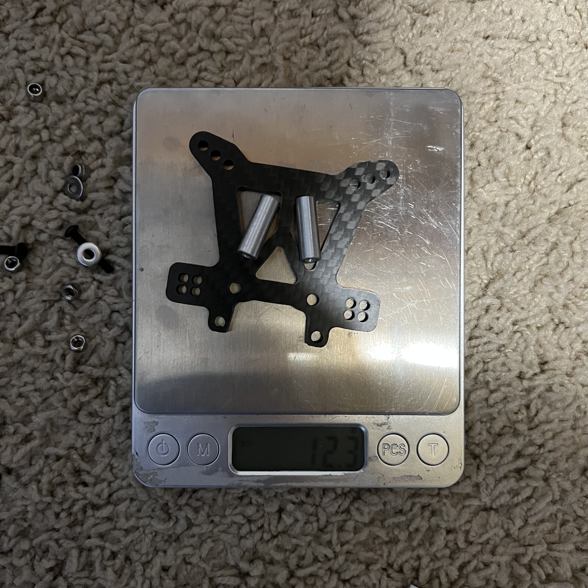 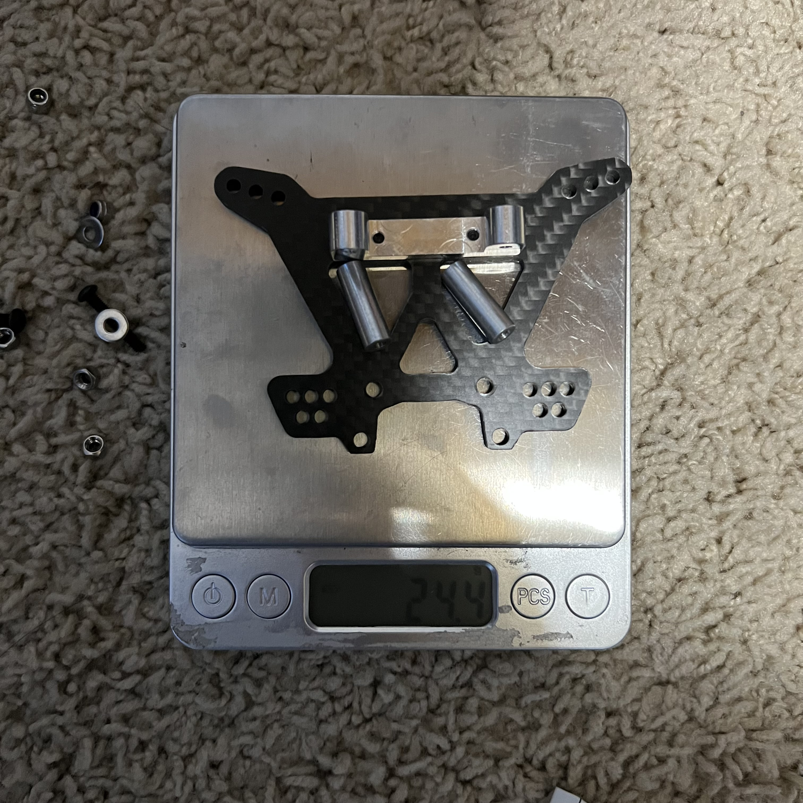 <em>front, 12.3g · rear, 24.4g</em> |
| ⭐ **Traxxas Jato 4x4 Front Tower #9033** — *chosen front; simpler than CF up front* | **Material:** Glass-filled nylon  **Thickness:** ~4mm  **Dimensions:** N/A  **Weight:** **17.2g measured (gray)**, real baseline, supersedes the old ~30-40g estimate  **Failure mode:** Flexes, cracks gradually (sacrificial)  **Price:** ~$6 | Pro: Correct height for Jato 4x4 geometry. Sacrificial, stocked at hobby stores, cheap to replace. **The mount shape protects the shock cap**, land upside down and the tower takes the hit instead of the shock cap scratching/digging into the ground. Light (17.2g) and simple, no extra parts needed, unlike the CF option which needs spacers and other extra bits to fit  Con: Less stiff than CF |  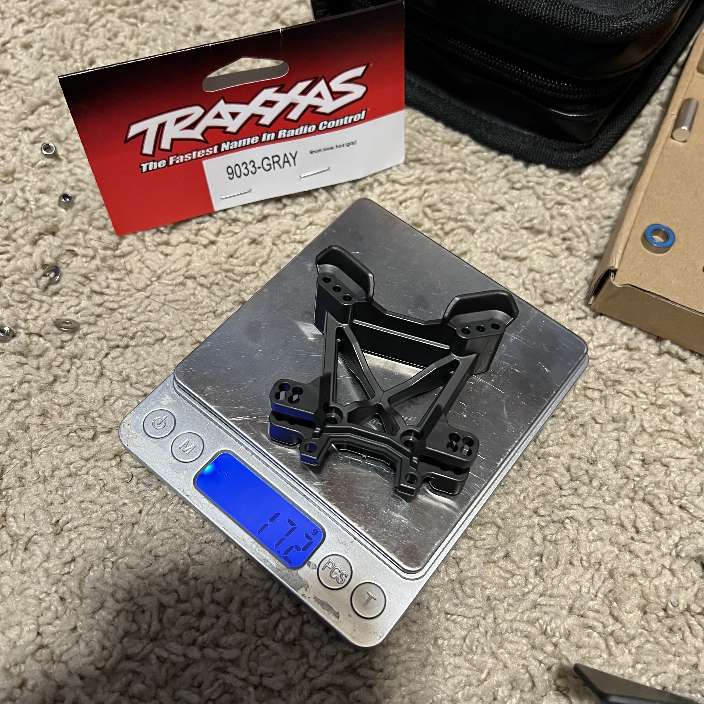 <em>17.2g on scale</em> |
| 🔵 **Traxxas Slash 4x4 Front Tower TRA6839 / 9038-GRAY** — *(shorter front, lower CG, needs shock work)* | **Material:** Composite  **Thickness:** N/A  **Dimensions:** N/A  **Weight:** N/A  **Failure mode:** Flexes, cracks gradually (sacrificial)  **Price:** **$6.00** (either part) | Pro: **Shorter than the Jato 4x4 front tower**, so it drops the front of the car and shortens the lever arm on a tower hit, the thing that makes a Jato front tower dangerous in the first place. Same $6  Con: **The big-bore shocks don't just bolt to it** — being shorter, it needs either modified shock eyelets or shorter shocks. See below. Not a drop-in | 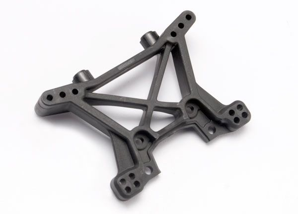 |
| 🟢 **Traxxas Slash 4x4 Extreme HD Rear Tower TRA9039** — *(the budget rear, $6)* | **Material:** Glass-filled nylon (Extreme HD)  **Thickness:** ~4mm  **Dimensions:** N/A  **Weight:** Not yet measured, presumably close to the front #9033's **17.2g measured**, TBD  **Failure mode:** Flexes, cracks gradually (sacrificial)  **Price:** $6.00 (AMain) | Pro: Slash 4x4 tower geometry, shocks centered and forward, protected from rear impacts. Meelobee aluminum plate on top accepts TRA9046 Jato 4x4 OEM wing mount. $6.00, same price as Jato stock. Available in multiple colors  Con: **Only the top body mount holes differ from the TRA6838**, and the shock holes match, so the two swap freely for mounting shocks and don't for anything that bolts up top. That top difference means **fabricating a small aluminium plate** to carry the wing mount. Traxxas lists it for the **TRA9080 HD Upgrade Kit**, so confirm the fit on a Jato chassis before ordering | 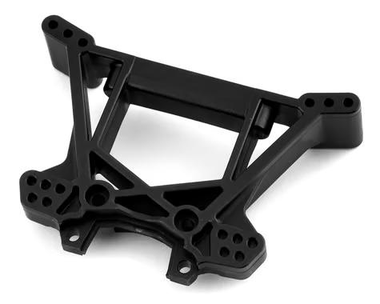 |
| 🟢 **Traxxas Slash 4x4 First Gen Rear Tower TRA6838** — *(budget rear; same shock holes as the 9039, different top body mounts)* | **Material:** Hardened plastic  **Thickness:** N/A  **Dimensions:** 87.5mm × 60.5mm  **Weight:** **19.1g measured**, a bit heavier than stock  **Failure mode:** Flexes, cracks gradually (sacrificial)  **Price:** $6.00 (RC Superstore) | Pro: First gen Slash 4x4 tower, same Slash 4x4 geometry, also $6.00. May be easier to source locally  Con: **The top body mount hole spacing differs from the TRA9039 Extreme HD** — that's the upper mounting holes, **not the shock holes**, which match. So the two are interchangeable for mounting shocks and not interchangeable for whatever bolts to the top; verify which pattern the Meelobee plate is designed for. Less robust than TRA9039. **Slightly heavier than stock (19.1g measured), and that extra weight sits up high** at the rear wing mount, right where added mass hurts most | 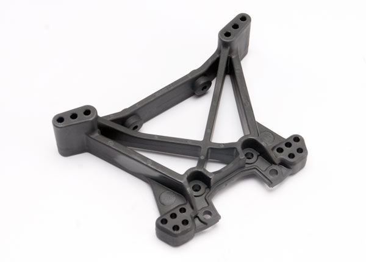 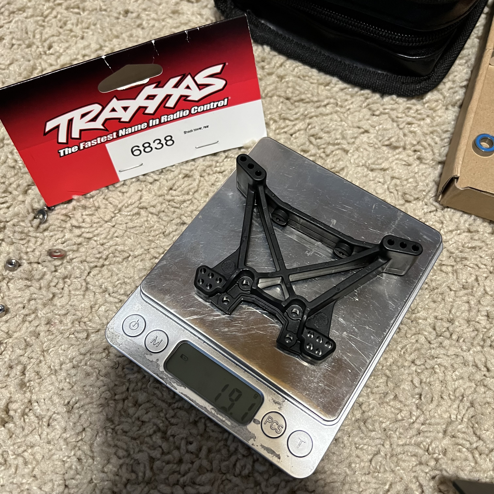 <em>19.1g on scale</em> |
| 🚫 ~~Cobra Racing 7075-T6 Aluminum (set)~~ | **Material:** 7075-T6 aluminum  **Thickness:** ~4mm  **Dimensions:** N/A  **Weight:** ~55-75 g per tower (**~3-4× heavier than the 17.2g measured stock tower**)*  **Failure mode:** Bends or transfers force to mounts  **Price:** $49.95 / set, set only, no individual towers | Pro: Tower itself rarely breaks  Con: **Fails the weight Must, ~3-4× heavier than stock.** Transfers impact straight to the trans case (known Jato killer). Permanent geometry distortion when bent. Set-only purchase; direct from Cobra Racing, no walk-in |  |
| 🚫 ~~Powerhobby Aluminum (set)~~ | **Material:** 7075-T6 aluminum  **Thickness:** ~4mm  **Dimensions:** N/A  **Weight:** ~55-75 g per tower (**~3-4× heavier than the 17.2g measured stock tower**)*  **Failure mode:** Transfers force to mounts  **Price:** $39.99 / set, set only, no individual towers | Pro: Cheaper aluminum option than Cobra  Con: **Fails the weight Must.** Same aluminum-passes-force-to-trans-case problem. Set-only purchase; Powerhobby online only | 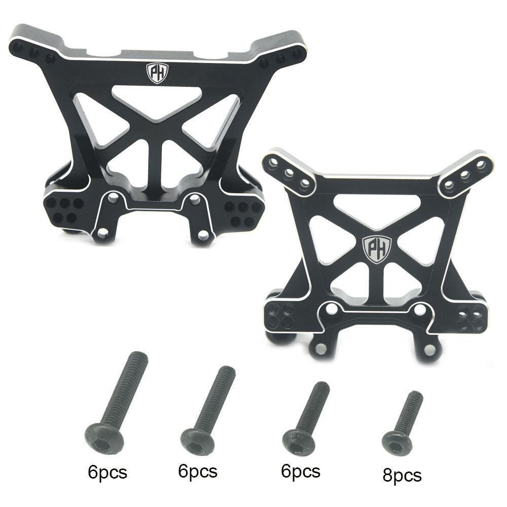 |
| 🚫 ~~GPM 7075-T6 Aluminum, Jato 4x4 fit (TJ028 / TJ030)~~ | **Material:** 7075-T6 aluminum  **Thickness:** ~4mm  **Dimensions:** N/A  **Weight:** ~55-75 g per tower (**~3-4× heavier than the 17.2g measured stock tower**)*  **Failure mode:** Transfers force to mounts  **Price:** $27.90 front (TJ028) / $28.90 rear (TJ030) | Pro: Color options, correct Jato 4x4 geometry  Con: **Fails the weight Must.** Same aluminum failure-cascade issue; sold per-tower so a full set is ~$57 | 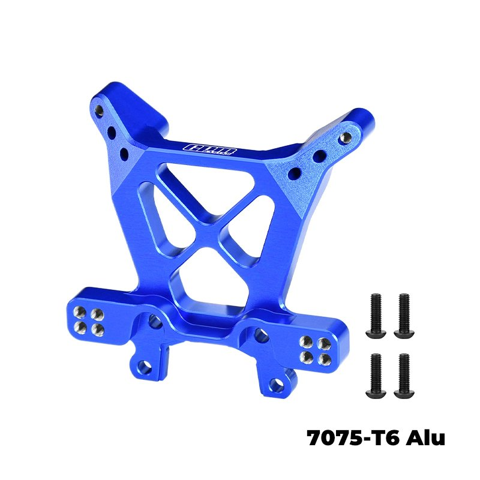 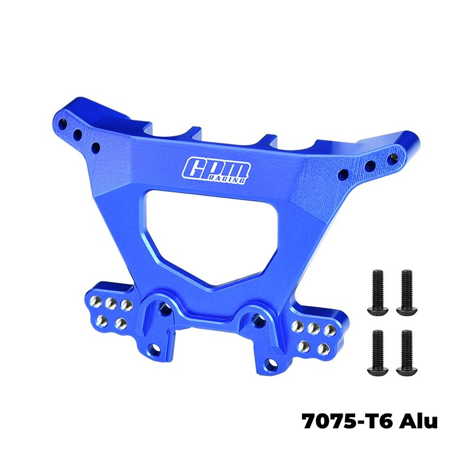 <em>TJ028 front · TJ030 rear (Jato 4x4 fit)</em> |
| 🚫 ~~GPM 7075-T6 Aluminum, Slash 4x4 (SLA028 / SLA030)~~ | **Material:** 7075-T6 aluminum  **Thickness:** ~4mm  **Dimensions:** N/A  **Weight:** ~55-75 g per tower (**~3-4× heavier than the 17.2g measured stock tower**)*  **Failure mode:** Transfers force to mounts  **Price:** ~$28 each | Pro: GPM's most common shock tower set, lots of color options  Con: **Slash 4x4 front tower bolts up to the Jato but is the wrong height**, the Jato's front tower is taller, so the SLA028 throws the suspension geometry off (incorrect shock angle and droop). Also fails the weight Must like all aluminum. Listed here so it's not mistakenly ordered for a Jato build | 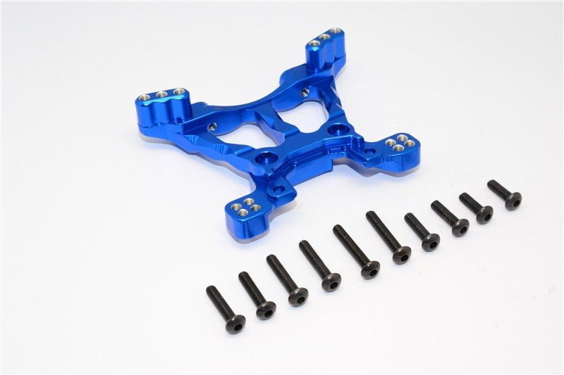 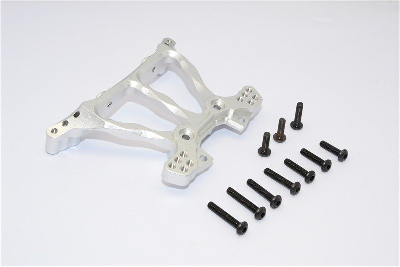 <em>SLA028 front · SLA030 rear, Slash 4x4 only</em> |

---

\* Aluminum per-tower weights are still estimated from material density × tower volume, none of the manufacturers (GPM, Cobra, Powerhobby) publish per-part weights. The stock #9033 front (17.2g) and the TRA6838 / G-Maxx CF towers are now measured, not estimated, see their Weight cells.

---

## Front Shock Mounting (wheelie bar shoulder screws)

The front shock uppers mount on **Traxxas wheelie bar shoulder screws**, which sit the shock eye dead centre in the #9033 tower hole with no spacer stack.

**It has to be the wheelie bar screw, not any shoulder screw.** The one that works has a **long smooth shoulder and a long thread**; a standard shoulder screw is stubby at both. That long unthreaded shank is the whole point — it is what the shock eye pivots on, and it is long enough to sit the eye centred in the tower hole while the thread still reaches deep enough to hold. Swap in a standard one and there is not enough smooth shank to bear on.

  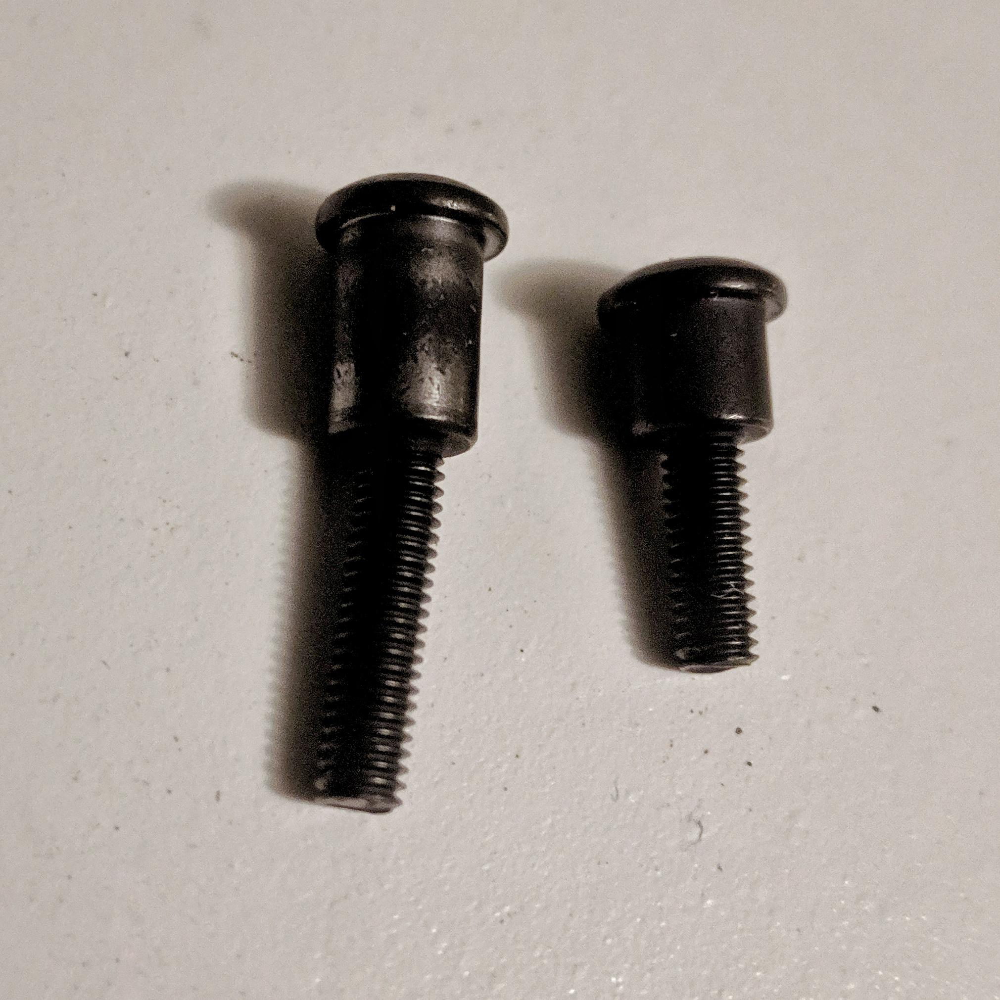&nbsp;&nbsp;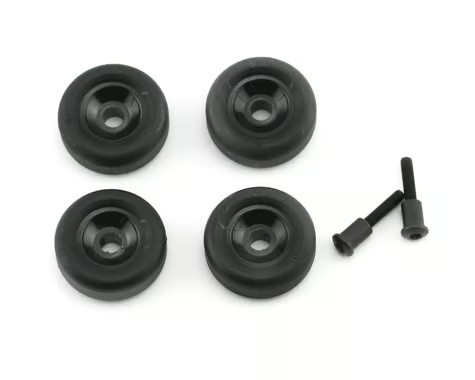 
  <em>the pair, wheelie bar screw left and a standard one right · the wheelie bar screw on its own · TRA4976 wheels and axles, $4, the cheapest source of it</em>

### Which bar to buy

**Two shoulder screws is all this needs**, one per front shock. Traxxas doesn't sell the screw on its own, but **you don't need a whole wheelie bar for it either**: the wheels and axles set, **TRA4976 at $4**, contains exactly two axles, and the axle is the screw. **One set does the job with nothing left over.**

**Every shoulder screw in a bar is the same one**, frame screws included, so a full kit yields several. The ones on this car came off **a free wheelie bar**, so nothing was bought for them.

**Two are needed for the front.** If the rear also runs OEM plastic towers (EHD **TRA9039** or the standard Slash type) it wants more.

**Buy TRA4976 unless you want the bar.** $4 covers both screws, which is cheaper outright and per screw than any complete bar. A full bar only makes sense if you want more than two, and there the Revo's 6 for $20 works out best at $2 to $3.33 each.

| Wheelie bar | Part | Fits | Screws | Price | $/screw |
|:---|:---:|:---|:---:|:---:|:---:|
| ⭐ **Wheels + axles only** *(no bar needed)* | **TRA4976** | Revo wheelie bar | 2 | **$4.00** | **$2.00** |
| **Revo / E-Revo** *(the free bar these came off)* | TRA5472 | Revo 2.5 / 3.3, E-Revo | **6** | $20.00 | $3.33 |
| **Rustler 4x4** | **TRA6776** | Rustler 4x4 VXL / Brushed | ~2 | **$10.00** | $5.00 |
| Sledge | TRA9576 | Sledge (9576X blue) | n/a | n/a | — |
| Slash 2WD / Stampede / Rustler / Bandit | TRA3678 | 2WD models | n/a | n/a | — |
| Drag Slash | 9460 | Bandit, 2WD Rustler, 2WD Slash LCG | n/a | n/a | — |

*Rustler count is from memory and unconfirmed — its product photo shows two wheel axles plus three loose fasteners, so it may be more than two. The Revo's 6 is counted.*

Fitting a bar to a Slash 4x4 or Rustler 4x4 also wants the **6777** mount off the Stampede 4x4 — irrelevant here, since only the screws are being used. **The Rustler 4x4 bar (TRA6776) is half the price of the Revo one at $10 against $20** and carries the same screws, so that's the one to buy. Remaining prices are n/a until checked.

  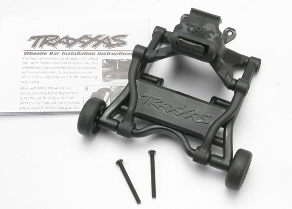&nbsp;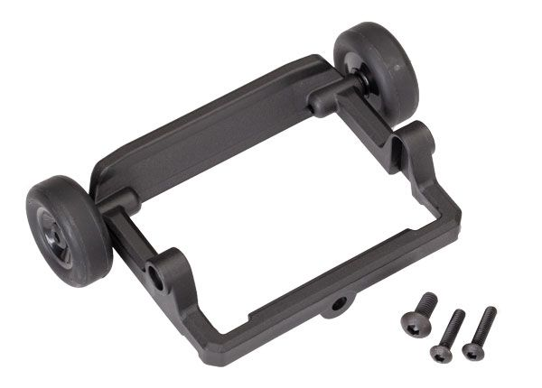 
  <em>left: TRA5472 Revo bar, $20, 6 screws (the one in hand) · right: TRA6776 Rustler 4x4 bar, $10</em>

 **The few grams plastic costs over CF don't matter up front** — this platform is tail heavy by design, the Slash layout puts the motor behind the rear axle, so weight added at the nose is working with the car rather than against it. It also **lines up properly with the FLM arms using the spacers the arms already come with** — no shimming, no packing it out, the geometry just lands where it should.

---

### Going lower: the shorter Slash 4x4 front tower

The Slash 4x4 front tower is **shorter than the Jato 4x4 one**. Two parts, same tower dimensions, both **$6**:

| Part | Design | Note |
|:---:|:---|:---|
| **TRA6839** | clipped body mounts | the plain one |
| **9038-GRAY** | **clipless** body mounts | Extreme HD; Traxxas lists it for the **9080-series EHD kit only** and says it won't fit standard suspension parts, so verify before ordering |

  &nbsp;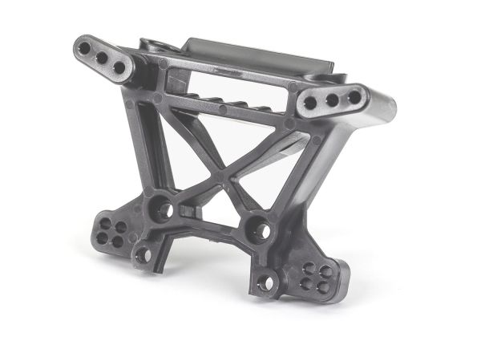 
  <em>left: TRA6839 · right: 9038-GRAY, same dimensions with the clipless body mount</em>

Either one, which lowers the front of the car and shortens the lever arm that makes a Jato front tower hit so expensive. It won't take the D8 / HPI Vorza big-bores as they are, so there are two ways to make it work and neither is free:

- **Modify the shock eyelets.** Drill the bottom eyelet down to where the pivot ball sits, trim a little off the top of the eyelet, and run the shock shaft all the way down close to the eyelet. **This keeps full stroke** — that's the point of doing it this way — at the cost of doing the work and doing it to every shock.
- **Run shorter Slash 4x4 shocks instead.** Simple, but **it loses travel and smoothness**, and it means **different shock lengths front and rear** rather than one length across the car.

**Not doing either.** It's a genuinely lower centre of gravity and it isn't worth the hassle — the stock #9033 bolts on, keeps every shock the same, and keeps full travel. Logged because the option is real and cheap if the priority ever changes.

---

## Material Properties (Reference)

### Density (g/cm³)

| Material | Density |
|----------|---------|
| Pure nylon 6/6 | 1.14 |
| 30% glass-filled nylon | ~1.36 |
| 50% glass-filled nylon (typical RC "composite") | ~1.50–1.57 |
| CFRP (carbon fiber + epoxy, finished part) | ~1.50–1.60 |
| 7075-T6 aluminum | 2.81 |

**Key insight:** glass-filled nylon and CFRP are nearly identical in density. At the same thickness and shape, the weight is roughly the same. CF is **not** magically lighter than the plastic Traxxas uses. CF wins on **stiffness per gram**, a 3mm CF tower can match a 4mm composite tower in rigidity, but most aftermarket CF towers are 4mm (same as stock), so real-world weight savings are minimal (~5–10g total). Aluminum at 7075-T6 is ~80% heavier per unit volume than either composite or CFRP.

### Failure Modes

| Material | Behavior under impact | When it fails |
|----------|----------------------|---------------|
| Composite (glass-filled nylon) | Flexes, then cracks gradually. Cold makes it brittle | Cracks at stress concentrations (shock mount holes, edges). Often still drivable cracked |
| Carbon fiber | Stays rigid through impact, then snaps cleanly | Catastrophic, no warning. Delaminates under repeated abuse |
| 7075-T6 aluminum | Bends before breaking. Stays mostly intact | Permanently deforms (geometry off forever) and **transfers force to mounts**, chassis / trans case / arms break instead |

> **Aluminum nuance:** the "bends instead of breaks" property is a real strength on **thin flat plates** where exact geometry isn't critical, a flat aluminum chassis plate or skid plate can be bent back to "close enough" after a crash and keep working. **Shock towers aren't that part for three reasons:**
> 1. Every degree of bend changes shock angle, droop, camber gain, and damping, geometry IS the part.
> 2. These aftermarket towers are CNC'd from solid 4mm 7075, good luck bending one of those back by hand. You'd need a press, and even then you're not getting it back to factory geometry.
> 3. Towers are **mounted high on the car**, so the extra ~30+ g of aluminum sits right where added mass hurts handling the most, raises CG and makes the car tippy. Of all the places to put weight, the top of the shocks is the worst.

---

## Detailed Notes

### Traxxas Stock Composite (#9033 / #9034) — Chosen front

- Glass-filled nylon, ~4mm thickness
- Front: TRA9033; Rear: TRA9034; both ~$6 each direct from Traxxas
- The Jato 4x4 "Extreme HD" redesign: double-shear link mounts, extra material, much less break-prone than the original nitro Jato towers
- Density ~1.5 g/cm³, basically identical to CFRP, so a 4mm CF tower won't be meaningfully lighter
- Engineered as a sacrificial fuse: tower cracks first, chassis and trans case survive
- Cracks gradually rather than snapping, often still drivable with a hairline crack, gets you back to the pit
- **Shock cap protection is built into the tower.** CF has to have it added back with 3D-printed covers; the OEM tower comes with it. That's the whole argument in one line — the printed covers, the long standoffs and the long screws are all complexity and weight bolted on to make carbon do what the $6 stock part already does.

### MonsterKingz (G-Maxx) Carbon Fiber Set — Chosen rear only

- **Rear only.** CF takes the **larger D8 big-bore shocks** on the **HPI Vorza Flux / HB 67410 standoffs**, and at the rear the crash risk below matters far less than it does up front.
- **Not used up front, and the shock covers are why as much as the crash risk.** CF leaves the shock caps exposed, so it needs **3D-printed covers** added back (in hand, bought to test). Stock #9033 already protects them. Adding standoffs, longer screws and printed covers to a $33 set, to end up where a $6 part starts, isn't a trade worth making.
- 3K carbon fiber, presumed 4mm (same as stock); sold by MonsterKingz on eBay. **In hand (bought to test).**
- **Bin the aluminium standoffs it ships with.** They're 1 inch long and held by tiny 3mm screws, and a screw that long and that thin **will bend**. The **HPI Vorza Flux / HB 67410** standoffs replace them and are what's actually running. Worth counting against the $33.29: the set arrives needing its own hardware thrown away.

 <em>HB / HPI Vorza Flux 67410 standoffs, used instead of the G-Maxx kit's own aluminium standoffs</em>

- **In my experience, CF towers basically explode the front end of the Jato 4x4 on a direct tower crash.**
- Why it's worse on a Jato than a Slash 4x4: the Jato's front tower is **taller**. A taller tower = longer lever arm, so a hit on the tower delivers far more force into the front bulkhead and diff than the same hit on a Slash's shorter front tower. Composite flexes through that load; brittle CF transmits all of it.
- On a Slash 4x4, CF front towers are fine because the tower is shorter, the diff and front end usually survive when the tower lets go. On a Jato 4x4, you lose the whole front end.
- **The front CF tower also doesn't protect the shock as well as the OEM plastic Jato 4x4 tower does**, another reason to prefer stock beyond just the crash failure mode.
- **Measured: front tower 12.3g, rear 24.4g.** In practice **not much lighter than stock**, so weight isn't why these are the pick, the **larger-shock fit** (with the 67410 standoffs, need **2 pairs**) is. The failure mode is the accepted downside.
- $33 set vs ~$12 for stock pair

### Cobra Racing 7075-T6 Aluminum Set — Vetoed

- High-grade 7075-T6 aluminum, CNC-machined
- 80% heavier per unit volume than composite/CF
- Aluminum doesn't break, it transfers shock load straight to the mounting points
- Known Jato pattern: aluminum tower stays intact, **trans case cracks instead**
- Looks great (anodized finishes) but trades a $6 tower for a much more expensive trans case
- $49.95 set

### Powerhobby Aluminum Set — Vetoed

- Same 7075-T6 aluminum trade-off as Cobra: tower survives, mounts don't
- Cheaper at $39.99, but cheaper doesn't help when the failure mode is wrong for a Jato
- No upside over stock for this build

### GPM 7075-T6 Aluminum (Jato 4x4 fit) — Vetoed

- Sold per tower (~$28 each, so ~$56 for front + rear)
- Multiple anodized color options
- Has correct Jato 4x4 mount geometry (unlike the SLA028 / SLA030 Slash variants below)
- Still passes the same aluminum failure cascade as Cobra / Powerhobby
- No reason to pick this over stock for a basher / racer

### GPM 7075-T6 Aluminum SLA028 / SLA030 (Slash 4x4) — Ruled Out (won't fit Jato)

- GPM's well-known Slash 4x4 shock tower set, SLA028 front, SLA030 rear
- **Wrong geometry for the Jato 4x4.** The Slash 4x4 front tower geometry (mount points, height, arm pickup spacing) does not match the Jato 4x4, these will not bolt up correctly to a Jato chassis
- Listed here on purpose so they're not mistakenly ordered for a Jato build (they show up first in a lot of GPM searches because they're Slash-line popular)
- If you want GPM on the Jato, get the Jato-specific GPM tower (see row above)

---

## Related: Tower Bracing (Optional)

Not a tower itself, a separate add-on part that ties the front tower to the chassis for extra rigidity. Tracked here because it's a tower-adjacent decision.

> *Spec format: Material · Thickness · Dimensions · Weight · Failure mode · Price* (shared tower order; brace-specific notes, application etc., moved to Pros / Cons)

| Brace | Spec | Pros / Cons | Photo / Link |
|---|---|---|---|
| ❌ ~~Traxxas TRA9061 Aluminum Front Shock Tower Brace~~ | **Material:** 6061-T6 aluminum (anodized, multiple colors)  **Thickness:** N/A  **Dimensions:** N/A  **Weight:** Adds ~15-25 g up high*  **Failure mode:** N/A  **Price:** $39.95 | Pro: Stiffens the front tower / chassis joint, reduces flex under hard landings. Application: front tower → chassis tie-in  Con: **Adds aluminum weight right at the top of the car**, same top-heavy / CG problem as aluminum towers. Stock #9033 / #9034 Jato towers rarely break in the first place, so this is bracing a part that already works. **Wildly expensive, $40 for an optional brace, vs $6 for a whole replacement stock tower** | 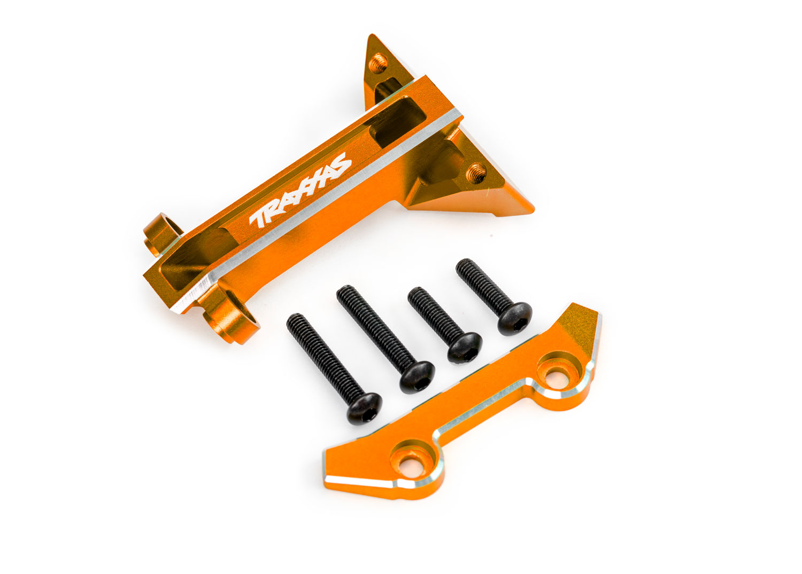 |

\* Weight estimated from material density × part volume; Traxxas does not publish per-part weights for this brace.

---

## Sources

- [Cobra Racing Jato 4x4 aluminum tower set](https://cobraracing.net/product/cr-traxxas-jato-bl-2s-vxl-4s-4x4-black-aluminum-shock-towers-complete-set/)
- [G-Maxx / MonsterKingz CF towers for Jato 4x4, eBay $33.29](https://www.ebay.com/itm/236159423243)
- [Exotek Slash 4x4 CF shock tower](https://www.exotekracing.com/slash-4x4-carbon-fiber-shock-tower-front-4wd-slash-rally)
- [JConcepts MT 4.0mm CF rear shock tower](https://jconcepts.net/traxxas-slash-4x4-stampede-4x4-mt-40mm-carbon-fiber-rear-shock-tower)
- [Jato shock tower breakage discussion, RCU Forums](https://www.rcuniverse.com/forum/rc-nitro-stadium-trucks-243/3460827-any-one-break-jato-shock-tower-trans-here-cure.html)
