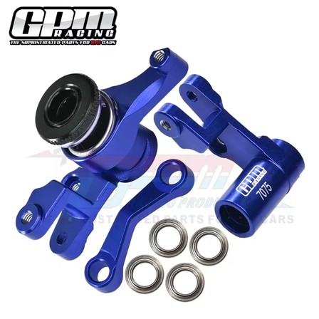
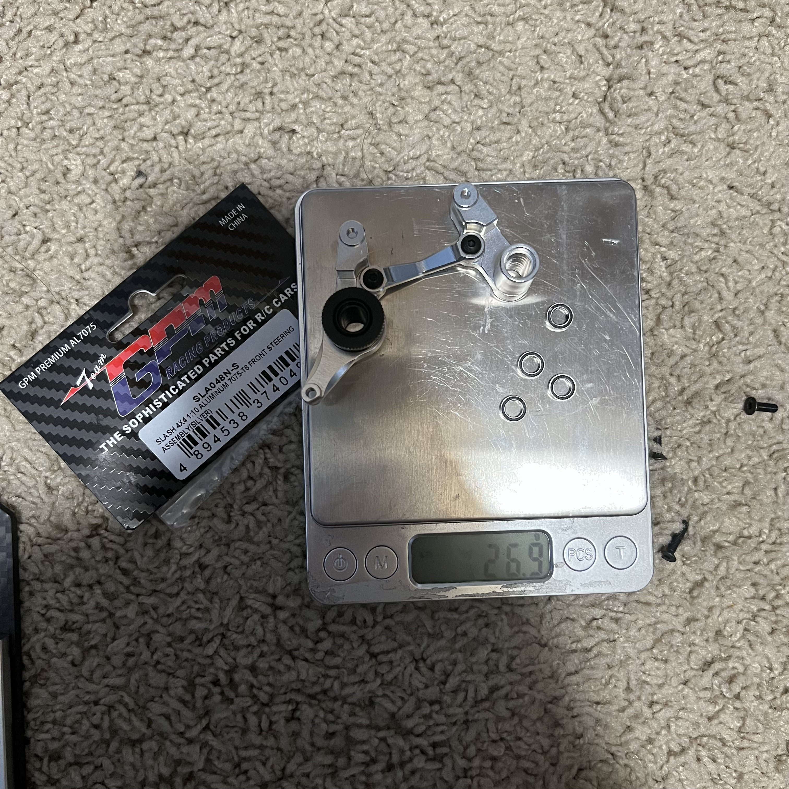
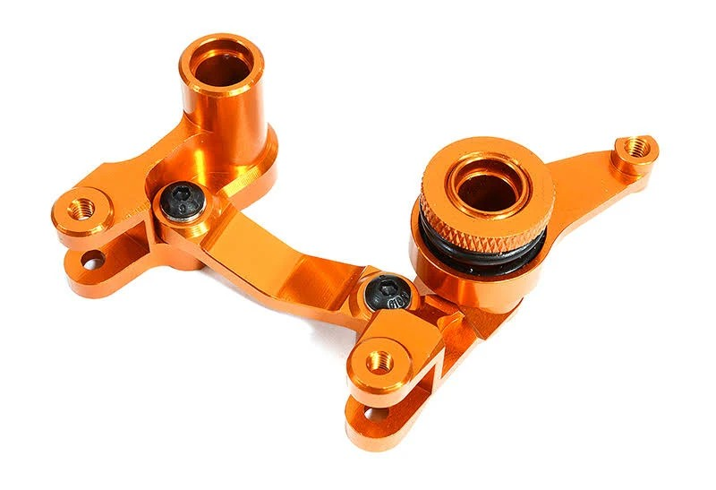
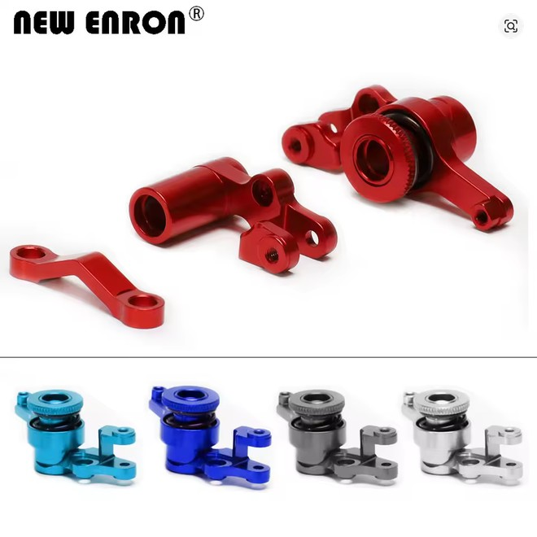
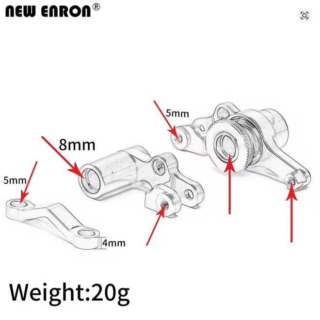
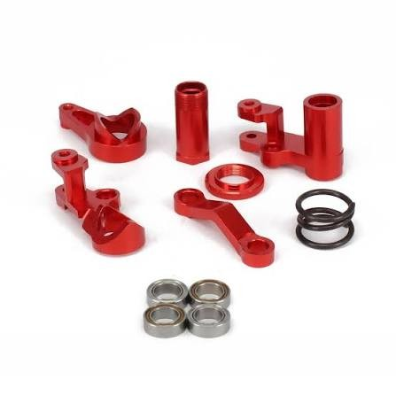
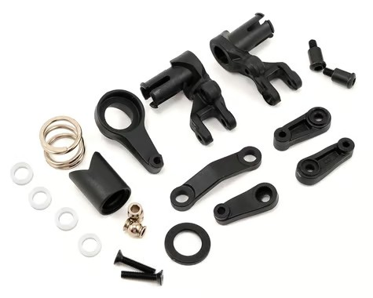

# Steering Bell Crank Selection — FastAzJato4x4

> **Chosen: GPM aluminum bell crank (6845X), $19.98 — in hand.** GPM and Integy alloy cranks come with **brass / oil-sintered bushings** at the moving pivots, so they last basically forever: the cheap bushing wears, never the aluminum, and you just drop in a fresh bushing. The bell crank is a "doesn't-have-to-be-premium" part anyway — the bigger steering wins come from the servo, not the crank.

---

## Table of Contents

- [Key Requirements](#key-requirements)
- [Bell Crank Comparison](#bell-crank-comparison)
- [Servo Horn + Servo-to-Bellcrank Link](#servo-horn--servo-to-bellcrank-link)
- [Price History](#price-history)
- [Notes](#notes)

---

## Key Requirements

| Requirement | Type | Why |
|---|---|---|
| **Fits Slash 4x4 / Jato 4x4 servo + bulkhead pattern** | Must | Has to bolt to the same mounting points as the OEM bell crank |
| **Bushing-supported at the pivots (Oilite brass, not ball bearings)** | Must | Bell cranks oscillate in a tiny arc near neutral on every steering input. Ball bearings under that motion **false-brinell** — the balls dig divots into the race because they never roll across new metal — then lock up notchy and start eating the steering post they ride on. Oil-impregnated brass bushings just slide, self-lubricate, and don't damage the post. **Traxxas TRA3775 (5×8×2.5mm)** is the right bushing |
| **Doesn't flex measurably under servo load** | Must | Stock plastic bell cranks deflect under hard steering inputs from the chosen PTK 9752TG-D high-speed metal-gear servo — costs steering precision |
| **Cheap** | May | Bell cranks rarely fail in crashes (servo saver absorbs most impacts before the crank itself sees the load); upgrade for stiffness, not for crash survival |

---

## Bell Crank Comparison

> *Spec format: Material · Pivots · Fits · Price*

| Bell Crank | Spec | Pros / Cons | Photo / Link |
|---|---|---|---|
| ⭐ **GPM aluminum bell crank (6845X)** — *chosen, in hand* | **Material:** 7075 aluminum, blue  **Part:** GPM **6845X** (alloy version of Traxxas 6845X; Rustler / Hoss / Stampede / Slash 4x4 VXL)  **Pivots:** **Comes with brass / oil-sintered bushings** — the right setup, no swap needed  **Fits:** Slash 4x4 / Jato 4x4  **Price:** **$19.98** (paid) | Pro: **In hand, comes correct.** The brass bushings are sacrificial: they wear, **never the aluminum**, so the crank lasts forever — just swap in a cheap fresh bushing when worn. Well-machined blue 7075. Cheap at $19.98  Con: None that matter |  |
| 🟢 **GPM front steering assembly (SLA048N-S)** — *alternate, in hand, modified* | **Material:** 7075-T6 aluminum, silver  **Part:** GPM **SLA048N-S** (Slash 4x4 front steering assembly)  **Pivots:** Cross-bar pivot ships with a brass/oilite bushing built in; the other 4 main bearings shipped as ball bearings — **already swapped for Traxxas TRA3775 oilite bushings** (same false-brinelling reasoning as the Key Requirements above)  **Fits:** Slash 4x4 (shared Jato 4x4 pattern, same as the other rows here)  **Weight:** **26.9g** measured  **Price:** N/A | Pro: **The cross-bar pivot comes with a brass bushing built in** — a step ahead of the Enron/AliExpress options. After swapping the other 4 pivots to TRA3775 bushings, the whole assembly is now fully bushing-supported like the chosen GPM 6845X  Con: Needed the TRA3775 swap on 4 of 5 pivots (now done); price not confirmed |  |
| 🔵 **Integy aluminum bell crank** | **Material:** 7075 aluminum, orange  **Pivots:** **Comes with brass / oil-sintered bushings** — same as the GPM, no swap needed  **Fits:** Slash 4x4 / Jato 4x4 (full Slash family)  **Price:** $25-40 | Pro: Same as GPM — **comes with the brass bushings, so the alloy never wears out.** Known brand, consistent QC, color options  Con: Pricier than the in-hand GPM for the same result |  |
| 🔵 **New Enron aluminum bell crank set** — *brand-match (Enron rockers + hubs)* | **Material:** aluminum, **20 g**; bores 8mm / 5mm / 4mm  **Pivots:** Ships with ball bearings — swap for Traxxas Oilite TRA3775 brass bushings  **Fits:** Slash 4x4 / Jato 4x4  **Colors:** red / blue / dark grey / silver  **Price:** TBD | Pro: Brand-consistent with the Enron rockers + hubs; light (20 g), color options  Con: Ships with ball bearings (do the TRA3775 bushing swap); no clear win over the in-hand GPM |   <em>product · dimensions (20 g)</em> |
| 🔵 **Generic AliExpress aluminum bell crank set** | **Material:** 7075 / 6061 aluminum  **Pivots:** Ships with ball bearings — swap for Traxxas Oilite TRA3775 brass bushings  **Fits:** Slash 4x4 / Jato 4x4 (same set the K939 runs)  **Price:** ~$10 shipped | Pro: Cheapest alloy option (~$10), same kit the K939 runs  Con: Ships with ball bearings, so it needs the TRA3775 swap to match the GPM/Integy. QC varies; no warranty |  |
| ❌ **Traxxas stock plastic bell crank set (TRA6845X)** | **Material:** glass-filled nylon  **Part:** **TRA6845X** — $12  **Includes:** bellcranks, servo saver + spring + retainer, servo horn, hardware  **Fits:** Slash 4x4 / Jato 4x4 (OEM) | Pro: Cheap ($12), complete OEM set, bulletproof in crashes  Con: **Flexes under a strong servo** — the crank moves when the wheels should, wasting servo force bending plastic. Any decent metal-gear servo over-powers it. Go alloy |  |

---

## Servo Horn + Servo-to-Bellcrank Link

> **Chosen: GPM RUS416026ST-S — in hand, running this.** Spring-steel tie rod (turnbuckle-style, adjustable) + 25T aluminum servo horn, 6pc set (silver), **8.0g measured**. This is the link between the servo horn and the bell crank, not the front steering tie rods (still TBD, see below).

 <em>GPM RUS416026ST-S — spring steel tie rod + 25T aluminum servo horn, 8.0g</em>

---

## Price History

### Traxxas TRA3775 Oilite bushings (5×8×2.5mm)

| Date | Price | Discount Path | Notes |
|------|-------|---------------|-------|
| 2025-08-24 | **$7.69** ✅ **purchased** | Listed price | Order #24-13486-84641 from eBay seller **gottshall5896**. Delivered 2025-08-30. Title: "Traxxas Oilite Bushings 5x8x2.5mm Bandit Stampede Rustler Steering Posts 3775". Pack of 12 bushings. Already in hand for the FastAzJato build |

 <em>Traxxas #3775 — Oilite bushings 5×8×2.5mm, 12 per pack</em>

---

## Notes

- **The servo matters more than the crank.** A good metal-gear servo does more for steering than any bell crank upgrade. Alloy crank + decent servo is the sweet spot.
- **Use bushings, not ball bearings, at the pivots.** The crank only swings a little back and forth, it doesn't spin. Ball bearings under that tiny motion dig pits into themselves, go notchy, and start chewing up the steering post. Brass "oilite" bushings just slide and self-oil, so they last and protect the post. **GPM and Integy come with the bushings already.** On the AliExpress or Enron, swap the bearings for **Traxxas TRA3775** bushings (5×8×2.5mm).
- **Skip the servo saver.** The stock one is weak, and the alloy crank fuses it solid over time anyway. The JX / PTK servos take crash hits fine, so run without it (see [`servo_analysis.md`](servo_analysis.md#notes)).
- **Servo-to-bellcrank link:** covered above — GPM RUS416026ST-S (spring steel tie rod + 25T aluminum servo horn), chosen and in hand.
- **Front steering tie rods:** stock plastic is fine; alloy just adds weight. Still TBD — see [`arm_analysis.md`](arm_analysis.md) (front needs a 4mm rod upgrade). Not covered here.
