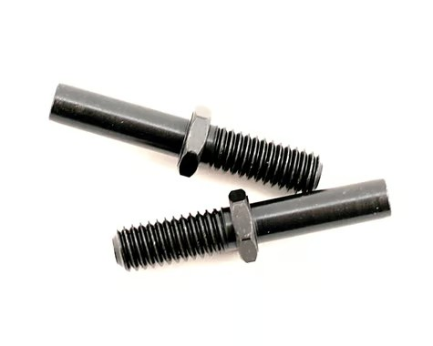
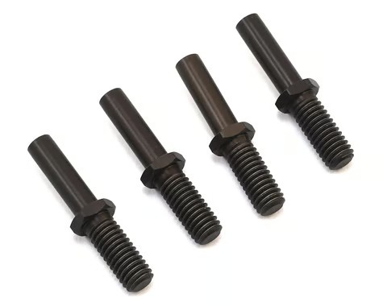
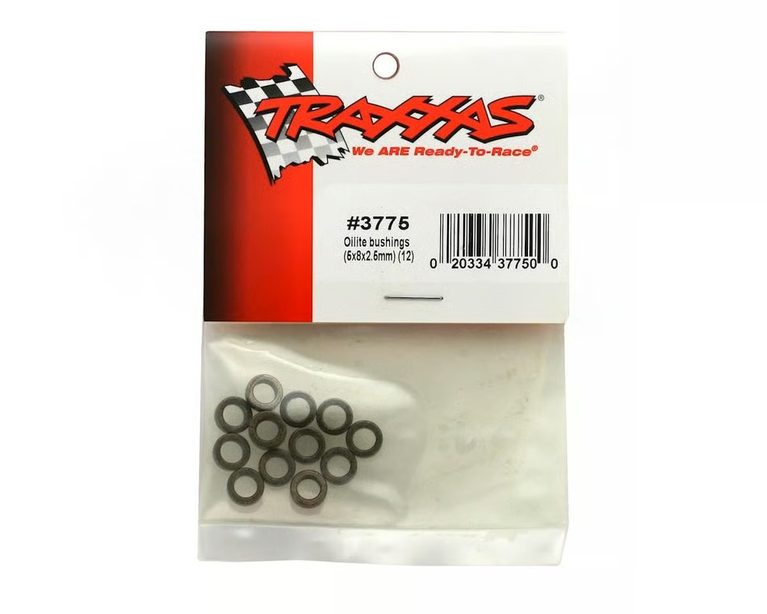

# Steering Bell Crank Selection — FastAzJato4x4

> **Leaning toward: generic AliExpress aluminum bell crank set (~$10) — but swap the included ball bearings for Traxxas Oilite brass bushings (TRA3775, 5×8×2.5mm).** Same aluminum-kit family the K939 build already runs; the bushing swap is the real durability win. The bell crank itself is mostly a "doesn't have to be premium" part; the bigger steering performance wins come from the servo, not the brand on the crank. Run **steel TRA5354 rocker posts** for the pivots — not the aluminum TRA5354X, which shears.

---

## Table of Contents

- [Key Requirements](#key-requirements)
- [Bell Crank Comparison](#bell-crank-comparison)
- [Rocker Arm Post — steel vs aluminum](#rocker-arm-post--steel-vs-aluminum)
- [Price History](#price-history)
- [Notes](#notes)

---

## Key Requirements

| Requirement | Type | Why |
|---|---|---|
| **Fits Slash 4x4 / Jato 4x4 servo + bulkhead pattern** | Must | Has to bolt to the same mounting points as the OEM bell crank |
| **Bushing-supported at the pivots (Oilite brass, not ball bearings)** | Must | Bell cranks oscillate in a tiny arc near neutral on every steering input. Ball bearings under that motion **false-brinell** — the balls dig divots into the race because they never roll across new metal — then lock up notchy and start eating the steering studs they ride on. Oil-impregnated brass bushings just slide, self-lubricate, and **give a precise fit that limits play**. Because the **bronze is softer than the steel post, the cheap bushing sacrifices itself instead of scoring the harder-to-replace post** — the post is the **TRA5354 steel rocker arm post ($3.25/pair)**, so you want the ~$7 bushing taking the wear, not it. **Traxxas TRA3775 (5×8×2.5mm)** is the right bushing |
| **Doesn't flex measurably under servo load** | Must | Stock plastic bell cranks deflect under hard steering inputs from the chosen PTK 9752TG-D high-speed metal-gear servo — costs steering precision |
| **Cheap** | May | Bell cranks rarely fail in crashes (servo saver absorbs most impacts before the crank itself sees the load); upgrade for stiffness, not for crash survival |

---

## Bell Crank Comparison

| Bell Crank | Spec | Pros / Cons | Photo / Link |
|---|---|---|---|
| ⭐ **Generic AliExpress aluminum servo bell crank set** | Material: **7075-T6 / 6061 aluminum**  Ships with ball bearings — **swap for Traxxas Oilite TRA3775** brass bushings  Price: **~$10 shipped** | Pro: Stiff aluminum body, same set the K939 already runs without issues. Doesn't flex under a strong servo  Con: QC varies seller-to-seller; no brand warranty. The included bearings are the wrong tool for bell crank duty — plan to swap them |  🚧 save as `src/steering_aliexpress_aluminum_bell_crank.jpg` |
| 🔵 **Integy aluminum bell crank** (Slash 4x4 / Jato 4x4 fit) | Material: 7075-T6 aluminum  Ships with ball bearings — same TRA3775 bushing swap recommended  Price: $25-40 | Pro: Known brand, QC consistent, anodized color options, full Slash family fit  Con: 2.5-4× the AliExpress generic for marginal real-world improvement; still ships with the wrong bearings |  🚧 save as `src/steering_integy_aluminum_bell_crank.jpg` |
| 🔵 **GPM aluminum bell crank** (Slash 4x4 / Jato 4x4) | Material: 7075-T6 aluminum  Ships with ball bearings — same TRA3775 bushing swap recommended  Price: $25-35 | Pro: Color options (orange, blue, red, black, etc.), well-machined, similar quality to Integy  Con: Same diminishing-returns story vs the AliExpress generic; same wrong-bearing issue |  🚧 save as `src/steering_gpm_aluminum_bell_crank.jpg` |
| ❌ **Traxxas stock plastic bell crank** | Material: glass-filled nylon  Price: free (stock) | Pro: Free if stock car is sourced, bulletproof in crashes  Con: **Flexes under the chosen PTK 9752TG-D servo's load** — measurable on-throttle understeer because the crank is moving when the wheels should be. Servo's force is wasted bending plastic instead of turning wheels. **Any decent modern servo wildly over-powers stock** — practically useless out of the box. There's a workaround (add a washer under the spring perch to preload the saver tighter so it slips less), but installing it is a pain. Just spend the few bucks on a generic cheap aluminum bell crank and skip the headache |  🚧 save as `src/steering_traxxas_stock_bell_crank.jpg` |

---

## Rocker Arm Post — steel vs aluminum

> **Chosen: steel TRA5354.** The post the bell crank pivots on (the Oilite TRA3775 bushing rides on it). Steel is stronger overall, and critically it **bends instead of shearing** — the aluminum version sheared clean off multiple times in real use, even on the plastic rockers. A high-stress steering post is an awful place for aluminum. The ~16g the aluminum saves isn't worth a no-warning failure.

| Post | Spec | Pros / Cons | Photo / Link |
|---|---|---|---|
| ⭐ **Steel — TRA5354** | Material: steel  Qty: **2 per pack**  Price: **$3.25** | Pro: **Stronger overall — chosen.** **Bends instead of shearing**, so it deforms gradually (no surprise failure) and a bent post is **easy to back out of the bulkhead** to replace. Cheapest option. Harder than the bronze bushing, so the bushing stays the sacrificial part  Con: ~16g heavier than the aluminum set — negligible static weight |  |
| ❌ **Aluminum — TRA5354X / Neron** | Material: aluminum  Qty: **4 per pack** (Traxxas)  Price: **$12.50** (Traxxas TRA5354X) — the Neron aluminum set I actually bought ran **$14.31 for the whole set**  Saves ~16g vs steel | Pro: -16g vs steel; Traxxas claims "without sacrificing strength"  Con: **Sheared off multiple times in real use — even on the plastic rockers.** Shears clean instead of bending, so it fails with no warning **and the broken stub snaps off flush in the bulkhead**, making it a pain to extract. A high-stress steering post is an awful spot for aluminum. Marginal weight saving not worth it, and at **$14.31/set it's ~4× the $3.25 steel** |  |

---

## Price History

### Traxxas TRA3775 Oilite bushings (5×8×2.5mm)

| Date | Price | Discount Path | Notes |
|------|-------|---------------|-------|
| 2025-08-24 | **$7.69** ✅ **purchased** | Listed price | Order #24-13486-84641 from eBay seller **gottshall5896**. Delivered 2025-08-30. Title: "Traxxas Oilite Bushings 5x8x2.5mm Bandit Stampede Rustler Steering Posts 3775". Pack of 12 bushings. Already in hand for the FastAzJato build |

 <em>Traxxas #3775 — Oilite bushings 5×8×2.5mm, 12 per pack</em>

---

## Notes

- **The servo matters more than the bell crank.** The K939 build's "aluminum bell crank + decent metal-gear servo" combo is the budget sweet spot — any further bell crank upgrade gets dominated by what servo you're driving it with.
- **Bushings beat bearings at bell crank pivots — counterintuitive but correct.** Aluminum bell cranks (AliExpress, Integy, GPM) all ship with ball bearings at the pivot posts, marketed as a "bearing upgrade" over stock bushings. **This is actually backwards for bell cranks.** Bell cranks don't rotate continuously — they swing back and forth in a small arc, mostly near center. Ball bearings under that motion suffer **false brinelling**: the balls never roll across new metal, so they dig divots into the race at the contact points. The bearings get notchy fast, lock up, and the **inner race starts eating the steering post** as the balls bite into it. **Oil-impregnated brass bushings ("Oilite" / sintered bronze) are the right tool here** — a smooth metal sleeve the post slides against across its full circumference, no point loads, self-lubricated from oil stored in the porous metal. Two real wins: the bushing **gives a precise fit that limits play**, and because the **bronze is softer than the steel stud, the bushing sacrifices itself instead of scoring the (harder-to-replace) stud**. That matters because the post is the **Traxxas TRA5354 steel rocker arm post ($3.25/pair)** — a $7 pack of bushings wearing out beats scoring the posts. Traxxas **TRA3775** (5×8×2.5mm) is the bushing the build group uses (originally for Bandit / Stampede / Rustler 2WD steering posts, but the dimensions also fit Slash 4x4 / Jato 4x4 aluminum bell crank kits). They outlast the bearings the aluminum kit ships with and protect the studs they ride on.
- **Servo saver — skip it.** The OEM Traxxas servo saver is **weak by modern standards** and doesn't actually buy you much: aluminum bell cranks eventually "weld" the saver into a fixed coupling anyway (slip surfaces fuse from heat + friction after enough cycles — desired for racing, supposedly bad for bashing). The build group's empirical answer on this is "**don't bother**" — the JX / PTK servos we run handle direct crash transmission for multi-year service lives (see [`servo_analysis.md`](servo_analysis.md#notes)), so the protection the OEM saver is supposed to provide isn't needed. Run the rig saverless.
- **Linkages / tie rods** are a separate sub-system not covered here. Stock plastic linkages are fine for the FastAzJato4x4; aluminum linkages add weight without benefit since the steering loads don't deflect plastic linkages noticeably.
