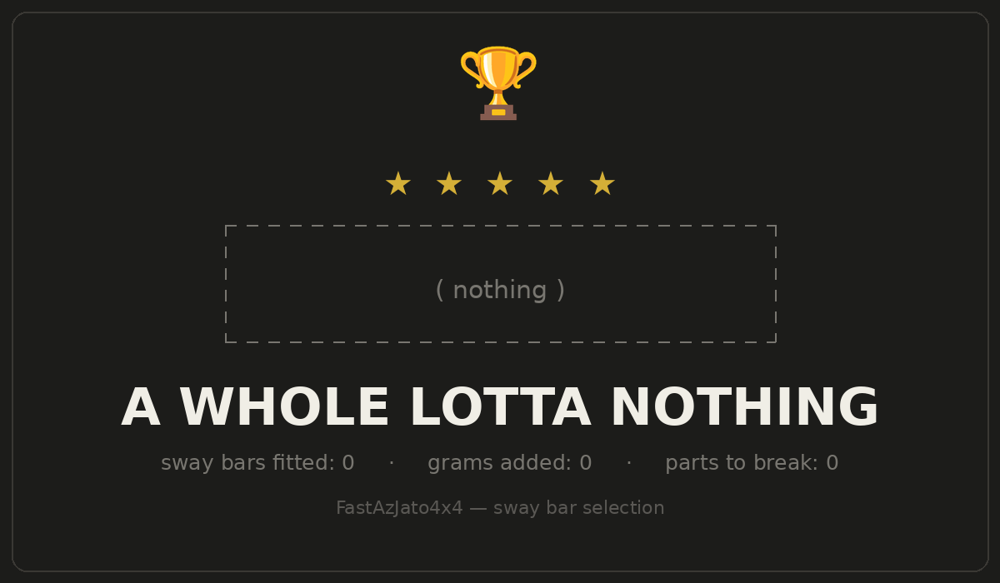
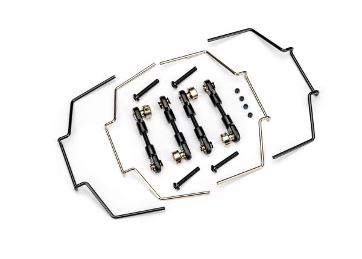
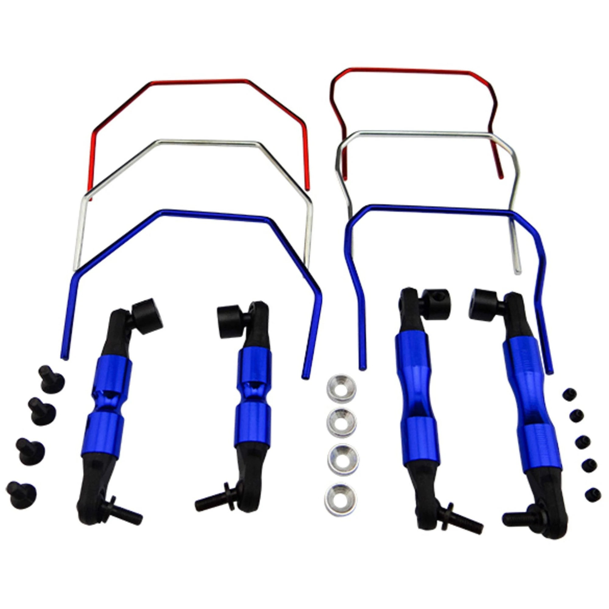
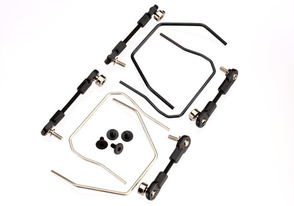

# Sway Bar Selection — FastAzJato4x4

> **Chosen: no sway bars.** This track works better without them, the loose, rough dirt surface rewards independent wheel compliance (mechanical grip + bump absorption) over the flatter cornering a bar buys you. Sway bars trade away suspension compliance for less body roll, and on this track that trade isn't worth it. Lighter and simpler with nothing extra to break. Easy to bolt on later if the track changes.

 <em>The winning setup, pictured</em>

---

## Table of Contents

- [Key Requirements](#key-requirements)
- [Sway Bar Comparison](#sway-bar-comparison)
- [Sway Bar Tuning Tips](#sway-bar-tuning-tips) — how/when to run them
- [Notes](#notes)

---

## Key Requirements

| Requirement | Type | Why |
|---|---|---|
| **Actually helps on this track** | Must | Any add to the suspension has to earn its place on our loose / rough dirt surface |
| **Doesn't kill bump compliance** | Must | A rough track rewards independent wheel travel, a stiff bar fights that |
| **Easily reversible** | May | Want to bolt on / off without drama if track conditions change |

---

## Sway Bar Comparison

> *Spec format: Part · Bars · Rates · Mounting · Includes · Price*

| Setup | Spec | Pros / Cons | Photo / Link |
|---|---|---|---|
| ⭐ **No sway bars** | **Part:** N/A  **Bars:** None installed  **Rates:** N/A  **Mounting:** N/A  **Includes:** N/A  **Price:** N/A | Pro: **Max independent wheel compliance, more mechanical grip and better bump absorption on loose / rough dirt.** Lighter, simpler, nothing extra to break. **This track works better without them**  Con: More body roll in hard corners on high-grip / smooth surfaces, not our track | — *(nothing installed)* |
| 🟢 **Traxxas Jato 4X4 Sway Bar Kit** — *the one to buy if bars go on* | **Part:** **9098**  **Bars:** Front **and** rear, two thicknesses each  **Rates:** Multiple, swappable per end  **Mounting:** Purpose built for the Jato 4X4  **Includes:** Bars, links with ball ends, all hardware  **Price:** **$24.95** | Pro: **Made for this car**, so the rear bar clears the shocks instead of fighting them and nothing has to be adapted. Front and rear in one $24.95 box with two rates per end, which is enough range to tune both ends without buying twice  Con: Still the same trade every bar makes — less compliance for less roll — so on our loose rough dirt it stays in the box. Nothing wrong with the kit, it just isn't what this track wants |  |
| 🟢 **Hot Racing Front & Rear Sway Bar** (**front only** on this car) | **Part:** HRASLF311 (Slash 4x4 / LCG / Rally)  **Bars:** Front + rear, spring steel  **Rates:** 3 thicknesses, red 1.6mm (soft) · blue 1.8mm (med) · chrome 2.0mm (hard)  **Mounting:** Needs TRA3932 to mount the wire  **Includes:** 6 bars + 4 ball-end pushrods  **Price:** $19.88 | Pro: **Widest tuning range, three bar rates per end** lets you dial roll stiffness to the track. Adjustable spring-steel wire. Cheaper than the Traxxas kit. In hand  Con: Cuts bump compliance, not wanted on our loose / rough track. Needs the TRA3932 mount. Only worth it if the surface turns high-grip |  |
| 🟢 **Traxxas Sway Bar Kit** (**front only** on this car) | **Part:** 6898  **Bars:** Front + rear in one kit  **Rates:** Multiple tuned thicknesses  **Mounting:** Installs without disassembly  **Includes:** Hardware + instructions  **Price:** $25 | Pro: Track-tested, reduces chassis roll and ups corner speed on high-grip / hardpack / pavement. Hardware + instructions included. Bolt-on/off in minutes. In hand  Con: Cuts bump compliance, not wanted on our loose / rough track. Pricier than the Hot Racing kit and fewer rate options |  |

---

## Sway Bar Tuning Tips

In hand for when the track calls for them. Read this before bolting any bar on.

### How a sway bar works
A sway bar (anti-roll bar) ties the left and right arms together with a torsion spring. When the chassis leans in a corner, one side compresses and the other droops, that twists the bar, and the bar fights back, **reducing body roll**. Crucially it only resists *opposite* (roll) movement; when both wheels move together (a straight bump) the bar does almost nothing. The trade: less roll and sharper response, but **less independent wheel compliance**, so less mechanical grip on rough/loose ground.

### The golden rule — stiffer bar = less grip on that end
- **Stiffer FRONT bar → less front grip → more understeer** (car pushes wide).
- **Stiffer REAR bar → less rear grip → more oversteer** (car rotates / gets loose).
- **Softer (or no) bar on an end → more grip on that end.**

So the bar is a **balance lever per end**: add stiffness to the end you want to *loosen*, remove it from the end you want to *plant*. Sway bars act mostly **mid-corner** (steady-state lean), entry and exit are more about shocks, diff, and throttle.

### When to run them
| Surface | Bars? |
|---|---|
| High-grip hardpack / blue-groove / pavement / astro | **Yes**, less roll, more corner speed, sharper turn-in |
| **Smooth, well maintained dirt — groomed flat, few easy jumps** | **Yes.** Nothing for the suspension to soak up, so the compliance a bar costs you isn't buying anything. Roll control is free grip here |
| Medium / drying clay | Maybe a soft bar one end to fine-tune balance |
| Loose, rough, bumpy dirt (**our track**) | **No / soft**, independent compliance puts more rubber down and soaks bumps |

**The surface decides it, not the car.** The reason this car runs bare is bumps, not sway bars being wrong. Take the bumps away and the objection goes with them: on a smooth, well prepped track the independent compliance you'd give up has nothing to do, while the body roll a bar removes is costing corner speed on every turn. A few easy jumps don't change that — the bar only matters on landings hard or uneven enough that you want each wheel working on its own. **So if this car ever runs a groomed track, bolt bars on for it and take them back off afterwards.** Start soft, front only, per the process below.

**The Slash 4x4 kits are front-only here.** Both the Hot Racing HRASLF311 and the Traxxas 6898 are Slash 4x4 parts, and on the Jato 4X4 **the rear bar fouls the shocks** — there's no room for it to swing where the shocks sit. How bad that is depends on which rear tower you're running, so it isn't universal, but plan on the rear bar not fitting unless your tower moves the shocks out of its way. The front bars are fine and the stock Slash 4x4 front bar works well. **Traxxas since made the 9098 for this car specifically**, front and rear, two rates each, $24.95 — so there's no reason to adapt Slash parts and hope the rear clears.

### Tuning process
1. **Baseline first.** Get springs, oil, and ride height right *before* adding bars, bars are a fine-tuning tool, not a fix for a bad base setup.
2. **Start with none** (or the softest red 1.6mm both ends) and drive it.
3. **Change one end, one step at a time**, then test. Never move both ends at once, you won't know which did what.
4. **Tune to neutral:** if it pushes mid-corner, soften front / stiffen rear; if it's loose, stiffen front / soften rear.
5. **Re-check after big changes** (springs, tires, surface), the right bar changes with grip level.

### Symptom → fix
| Car does this mid-corner | Try |
|---|---|
| Understeers / pushes wide | Softer front bar (or remove) **or** stiffer rear bar |
| Oversteers / loose, rotates too much | Stiffer front bar **or** softer rear bar (or remove) |
| Rolls over / feels tippy on high grip | Stiffer bars both ends (start rear) |
| Darty / nervous, won't settle on bumps | Softer bars or remove, let the suspension work |
| Good balance but slow to change direction | Slightly stiffer both ends for quicker response |

### Setup gotchas
- **No preload at rest.** With the car sitting level the bar should be *unloaded*, if it's pre-twisted, it skews handling and adds harshness. Adjust the links so both sides just kiss.
- **Free to rotate, no bind.** The bar must pivot freely in its mounts; a binding bar acts way stiffer than its wire size suggests.
- **Hot Racing wire rates:** red 1.6mm = soft, blue 1.8mm = medium, chrome 2.0mm = hard. Thicker = stiffer (stiffness scales steeply with diameter, so even 0.2mm is a real step).
- **HRASLF311 needs the TRA3932** mount to hold the wire, don't forget it.
- **Don't double up.** A very stiff bar on very soft springs is fighting itself; match the bar to the spring rate rather than stacking both extremes.

---

## Notes

- **Why none:** sway bars shine on high-grip, smooth, on-power tracks where flat cornering matters more than soaking up chatter. Our loose/rough dirt is the opposite, independent suspension compliance puts more rubber on the ground and keeps the car settled over bumps.
- **Reversible:** if the track ever turns high-grip / blue-groove, a front bar is the first thing to try (calms entry roll); a rear bar is a balance lever after that. Bolt-on, no permanent change.
- Spring / piston / oil tuning in [`shock_analysis.md`](shock_analysis.md) already covers the roll-vs-compliance balance for now without adding bars.
