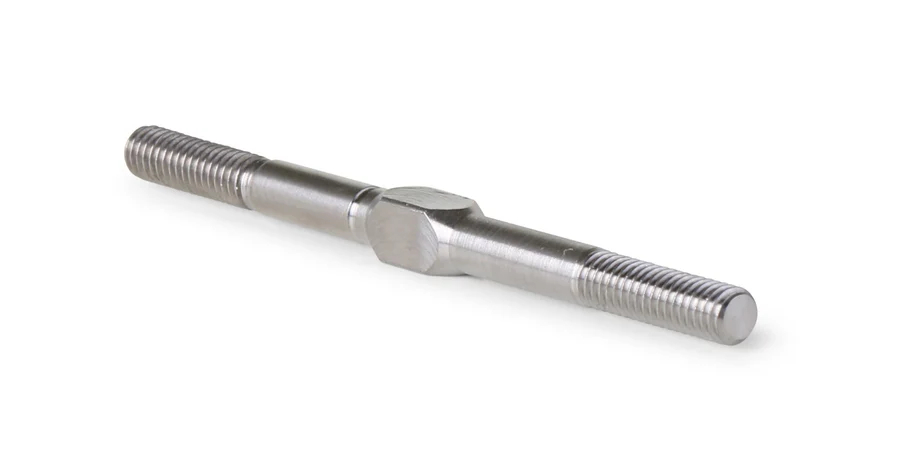

# Tie Rod & Camber Link Selection — FastAzJato4x4

> **Chosen and purchased: ACER Racing Titanium M4x60 turnbuckles, 10-pack, $59.90.** All six links on the car (2 front tie rods, 2 front camber, 2 rear camber) measure about 61mm and thread M4, so one part covers the whole car. Titanium is the upgrade over the stock steel rods: lighter, strong, and it will not rust. M4x60 (60mm) is the standard off-the-shelf turnbuckle length, and the turnbuckle threads out to cover the measured 61mm. The 10-pack gives the six links plus four spares.

 <em>ACER Racing Titanium M4x60 turnbuckle — one length (60mm standard) for all six links, M4 thread</em>

---

## Table of Contents

- [Which links this covers](#which-links-this-covers) — the 6 links, all M4, all ~61mm
- [Key Requirements](#key-requirements) — M4, ~61mm, strong and light
- [Rod comparison](#rod-comparison) — titanium bought, stock steel superseded
- [Servo-to-bellcrank link](#servo-to-bellcrank-link) — already chosen, cross-ref only
- [Length reference](#length-reference) — 61mm measured, 60mm standard buy
- [Price History](#price-history) — ACER titanium 10-pack, purchased
- [Notes](#notes)

---

## Which links this covers

Six adjustable turnbuckle links, all M4 thread, all measuring about 61mm. Now all running the ACER titanium M4x60. "Tie rod" gets used loosely, so to be clear about what each one does:

| Link | Count | What it does | Sets | Length | Thread |
|---|---|---|---|---|---|
| **Front steering tie rod (toe link)** | 2 | Bellcrank/drag link to front steering knuckle | Front toe | ~61mm | M4 |
| **Front camber link (upper link)** | 2 | Front tower/bulkhead to top of C-hub carrier | Front camber | ~61mm | M4 |
| **Rear camber link (upper link)** | 2 | Rear tower to top of rear carrier | Rear camber, a little rear toe | ~61mm | M4 |
| **Servo to bellcrank link (drag link)** | 1 | Servo horn to bellcrank | Steering centering | GPM RUS416026ST-S, in hand ([`steering_bell_crank_analysis.md`](steering_bell_crank_analysis.md#servo-horn--servo-to-bellcrank-link)) | — |

The Jato 4x4 has no separate front lower link. The lower arm is the FLM/ProTrac arm itself, covered in [`arm_analysis.md`](arm_analysis.md).

---

## Key Requirements

| Requirement | Type | Why |
|---|---|---|
| **M4 thread, ~61mm length, all six links** | Must | Measured on the car: every link, front and rear, tie rod and camber, is M4 and comes out to about 61mm. One part covers all six. M4x60 is the standard length that adjusts to reach 61mm |
| **Turnbuckle, threaded both ends** | Must | Toe and camber have to be tunable, and the 60mm standard has to thread out to the 61mm the car wants |
| **Strong and light** | Must | The front links take the hardest hits behind the aluminum FLM arm. Titanium gives the strength without the steel weight |
| **Rod ends match the alloy hubs and FLM studs** | Must | Front runs the Raptor R Ultimate EHD alloy hubs ([`hub_carrier_analysis.md`](hub_carrier_analysis.md)). The M4 rod ends have to seat in those and in the FLM arm studs |
| **Will not rust** | May | Titanium does not corrode, unlike the stock steel rods. Nice for a dirt car that gets washed |
| **Bends before it snaps** | May | Same failure philosophy as the arms. A bent rod straightens and keeps running |

---

## Rod comparison

Titanium M4x60 is bought and running. Stock steel is what it replaces.

> *Spec format: Type · Material · MPN · Fits · Adjustable · Length · Price*

| Rod | Spec | Pros / Cons | Photo / Link |
|---|---|---|---|
| ⭐ **ACER Racing Titanium M4x60 turnbuckle** — *✅ purchased, all six links* | **Type:** Threaded turnbuckle **Material:** **Titanium** **MPN:** ACER Racing "M4x60 Titanium Turnbuckle" (10-pack) **Fits:** M4 links, Jato 4x4 pattern **Adjustable:** Yes, both ends **Length:** **60mm** standard, threads out to the ~61mm the car measures **Price:** **$59.90 / 10** ($5.99 each) | Pro: **Covers all six links with one part.** Titanium: lighter than steel, strong for the front impact loads, does not rust. 60mm is the standard length and adjusts to the measured 61mm. 10-pack means six links plus four spares  Con: Pricier than stock steel, but it is the whole car plus spares in one buy. Confirm the M4 rod ends seat in the Raptor R alloy carriers at test-fit |  |
| 🥈 **Stock M4 steel turnbuckle** — *superseded, keep as backup* | **Type:** Threaded turnbuckle **Material:** Steel (Jato OEM) **MPN:** Jato 4x4 stock **Fits:** Jato 4x4, M4 **Adjustable:** Yes **Length:** ~61mm (measured) **Price:** Owned | Pro: Came with the car, correct M4 size and length, free. Fine as a backup if a titanium rod is ever unavailable  Con: Heavier than titanium and can rust. Superseded by the titanium set |  🚧 save as `src/steering_traxxas_jato_m4_stock_turnbuckle.jpg` |

---

## Servo-to-bellcrank link

Already chosen and in hand: **GPM RUS416026ST-S,** spring-steel turnbuckle plus 25T alloy servo horn, 8.0g measured. Full write-up lives in [`steering_bell_crank_analysis.md`](steering_bell_crank_analysis.md#servo-horn--servo-to-bellcrank-link). It is listed here only so the linkage picture is complete. It is not one of the six M4x60 links, so do not confuse it for one.

 <em>GPM RUS416026ST-S, the servo-to-bellcrank link, already in hand. A separate part from the six titanium links.</em>

---

## Length reference

**All six links are M4 and measure about 61mm. M4x60 titanium is what covers them.**

| Link | Position | Thread | Measured | Bought |
|---|---|---|---|---|
| Steering tie rod (x2) | Front | M4 | ~61mm | M4x60 titanium |
| Camber link (x2) | Front | M4 | ~61mm | M4x60 titanium |
| Camber link (x2) | Rear | M4 | ~61mm | M4x60 titanium |

- **Why 60mm for a 61mm measurement:** 60mm (M4x60) is a standard, stocked turnbuckle length. The rod threads out about a millimeter to reach the 61mm the car wants, so the standard 60mm part is the right buy. No custom length needed.
- **The 61mm was measured on the built car,** with the FLM front arms and Raptor R alloy hubs in place, so the wider [FLM front track](arm_analysis.md#notes) (+9.6mm/side) is already baked into that figure.
- **Fine-tune on the car.** 60mm is the buy and the baseline. Thread each turnbuckle to target toe (front) and camber (front + rear) at setup.

---

## Price History

| Date | Price | Discount Path | Notes |
|------|-------|---------------|-------|
| 2026-08-16 | **$59.90 / 10** ✅ **purchased** | Listed price, free USPS First Class | ACER Racing Titanium Turnbuckles, **M4x60**, qty 10 ($5.99 each). Covers all six links (2 front tie rods, 2 front camber, 2 rear camber) plus four spares. Stock steel M4 rods drop to backup |

---

## Notes

- **One part for the whole car.** All six links are M4 and about 61mm, so the ACER titanium M4x60 covers every one. The 10-pack is six links plus four spares.
- **Titanium over the stock steel.** Lighter, strong enough for the front impact loads behind the aluminum arm, and it does not rust. The stock steel M4 rods stay as backups.
- **60mm is a standard length that reaches 61mm.** Turnbuckles adjust, so the standard 60mm part threads out the extra millimeter. That is why the buy is M4x60, not a custom 61mm.
- **Do not count the servo link twice.** GPM RUS416026ST-S (servo to bellcrank) is already chosen and in hand, and it lives in [`steering_bell_crank_analysis.md`](steering_bell_crank_analysis.md#servo-horn--servo-to-bellcrank-link). It is a different part from the six titanium links.
- **Rod-end fit is the one thing to verify at test-fit.** The M4 rod ends have to seat in the Raptor R alloy carrier holes and the FLM arm studs. Check when installing.
