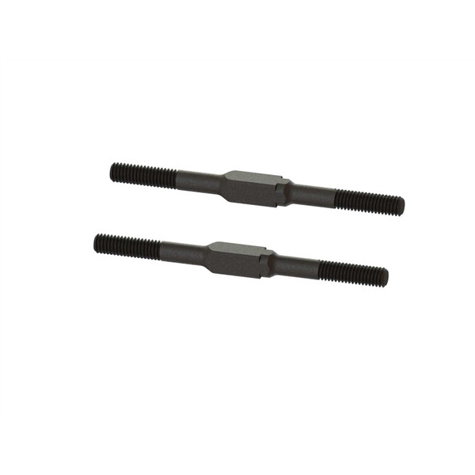
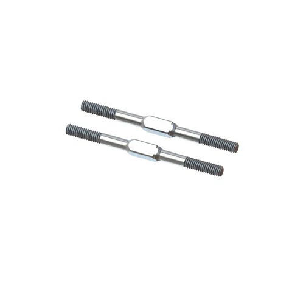
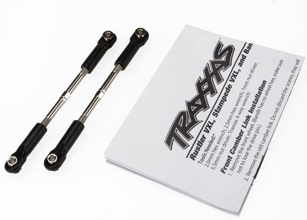
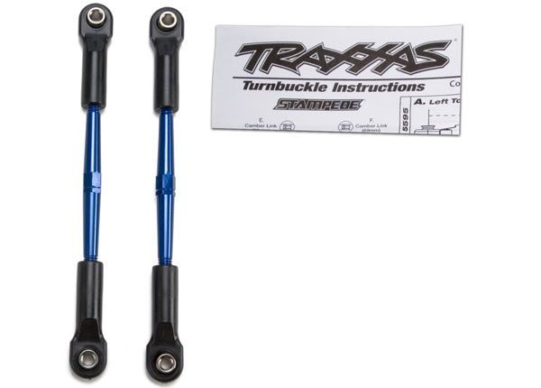
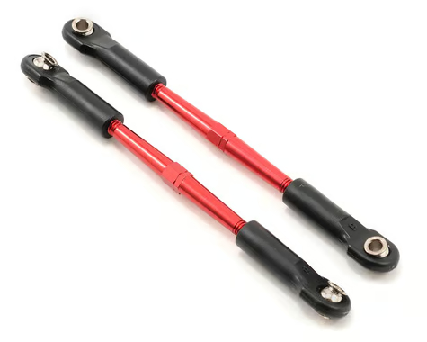

# Tie Rod & Camber Link Selection — FastAzJato4x4

> **The link that survives is an assembly of three parts: an ACER titanium M4x60 turnbuckle rod, RPM long rod ends, and Traxxas hollow pivot balls.** All six links on the car (2 front tie rods, 2 front camber, 2 rear camber) are M4 and use the same ~61mm rod (measured tip to tip of the bare rod, not hole-to-hole; ~96mm center-to-center once assembled), so one build covers the whole car. The stock Traxxas links break easily at both the metal rod and the plastic rod ends, so both get upgraded: titanium for the rod, RPM's tougher long ends for the ends. The hollow balls carry over from the stock parts.

&nbsp; <em>The link = ACER titanium M4x60 turnbuckle rod + RPM long rod ends (80512 black shown; running the cheaper white 80511) + Traxxas hollow balls</em>

---

## Table of Contents

- [The three-part link assembly](#the-three-part-link-assembly) — rod + rod ends + hollow balls
- [Which links this covers](#which-links-this-covers) — the 6 links, all M4, all ~61mm
- [Key Requirements](#key-requirements)
- [Turnbuckle rods (the metal)](#turnbuckle-rods-the-metal) — titanium bought, stock steel/alloy break
- [Rod ends (the plastic)](#rod-ends-the-plastic) — RPM long, stock 5525 breaks
- [Pivot balls](#pivot-balls) — Traxxas hollow balls, carried over
- [Servo-to-bellcrank link](#servo-to-bellcrank-link) — already chosen, cross-ref only
- [Length reference](#length-reference) — 61mm rod = 96mm center-to-center
- [Price History](#price-history)
- [Notes](#notes)

---

## The three-part link assembly

Each of the six links is built from three parts. The stock version breaks at the first two, so both get upgraded:

| Part | Stock (breaks) | Running now | Why |
|---|---|---|---|
| **Turnbuckle rod** (metal center) | Traxxas 3645 steel / 2336A aluminum, 61mm | **ACER titanium M4x60** | Titanium is lighter and stronger, will not rust |
| **Rod ends** (plastic, thread on each end) | Traxxas TRA5525 | **RPM long rod ends** (80511/80512/80515) | RPM is thicker at the ball, tougher, and the long shank helps the stretched wheelbase |
| **Pivot balls** (hollow ball inside each end) | Traxxas hollow balls | **Traxxas hollow balls** (carried over) | The balls do not break, so they carry over from the stock links / 5525 |

---

## Which links this covers

Six links, all M4, all about 61mm. "Tie rod" gets used loosely, so to be clear about what each does:

| Link | Count | What it does | Sets | Length | Thread |
|---|---|---|---|---|---|
| **Front steering tie rod (toe link)** | 2 | Bellcrank/drag link to front steering knuckle | Front toe | ~61mm | M4 |
| **Front camber link (upper link)** | 2 | Front tower/bulkhead to top of C-hub carrier | Front camber | ~61mm | M4 |
| **Rear camber link (upper link)** | 2 | Rear tower to top of rear carrier | Rear camber, a little rear toe | ~61mm | M4 |
| **Servo to bellcrank link (drag link)** | 1 | Servo horn to bellcrank | Steering centering | GPM RUS416026ST-S, in hand ([`steering_bell_crank_analysis.md`](steering_bell_crank_analysis.md#servo-horn--servo-to-bellcrank-link)) | — |

**Only 6 rods are needed.** The Jato 4x4 has no separate front lower link (the lower arm is the FLM/ProTrac arm itself, see [`arm_analysis.md`](arm_analysis.md)).

---

## Key Requirements

| Requirement | Type | Why |
|---|---|---|
| **M4 thread, ~61mm, all six links** | Must | Measured on the car: every link is M4 and about 61mm (96mm center-to-center). Traxxas confirms 61mm on the stock 3645 and 2336A toe links. One rod length covers all six |
| **Rod that will not snap or bend soft** | Must | The stock steel 3645 and aluminum 2336A/2336X both break easily behind the FLM aluminum arm. Titanium takes the hit |
| **Rod ends tougher than stock** | Must | The stock TRA5525 rod ends break easily too. RPM long rod ends are thicker around the ball and hold up |
| **Rod ends match the alloy hubs and FLM studs** | Must | Front runs the Raptor R Ultimate EHD alloy hubs ([`hub_carrier_analysis.md`](hub_carrier_analysis.md)). The rod ends + hollow balls have to seat in those and in the FLM arm studs |
| **Long rod ends help the stretched track width** | May | The FLM front arms add ~9.6mm/side. RPM long rod ends give extra reach so the turnbuckle is not maxed out to hit the wider track |
| **Will not rust** | May | Titanium does not corrode. Nice for a washed dirt car |

---

## Turnbuckle rods (the metal)

Titanium is bought and running. The two stock rods are what it replaces, and both break.

> *Spec format: Type · Material · MPN · Fits · Adjustable · Length · Price*

| Rod | Spec | Pros / Cons | Photo / Link |
|---|---|---|---|
| ⭐ **ACER Racing Titanium M4x60 turnbuckle** — *✅ purchased, all six links* | **Type:** Threaded turnbuckle **Material:** **Titanium** **MPN:** ACER Racing "M4x60 Titanium Turnbuckle" **Fits:** M4 links, Jato 4x4 pattern **Adjustable:** Yes, both ends **Length:** **60mm** rod (end-to-end); ~96mm assembled with rod ends **Price:** **$5.99 each** (bought a 10-pack, $59.90) | Pro: **Titanium: lighter than steel, far tougher than the aluminum, does not rust.** 60mm is a standard length that adjusts to the 61mm the car wants. **Only 6 needed;** the 10-pack leaves 4 spares  Con: Dearer per rod than stock steel, but it stops the breakage. Confirm the rod ends + hollow balls seat in the Raptor R alloy carriers |  |
| 🥈 **Arrma Steel Turnbuckle M4x60 (ARA330601 black / ARA340177 silver EXB)** — *budget / spare alternate* | **Type:** Threaded turnbuckle (L/R thread each end) **Material:** Steel, black standard, or **EXB heavy-duty silver** **MPN:** Arrma **ARA330601** (black) · **ARA340177** (silver EXB) **Fits:** M4x60, drops onto any M4 link (Arrma Mojave etc.) **Adjustable:** Yes, **5mm square adjuster** **Length:** **60mm** rod (end-to-end) **Price:** black **~$3/rod** ($5.99-6.99/pr) · silver EXB **$5.49/rod** ($10.99/pr) | Pro: **Exact M4x60 spec as the titanium.** Black is the cheap tough backup (~$3/rod); the EXB silver is heavier-duty comp-grade steel. 5mm adjuster and L/R threads tune on the car without removal  Con: **Steel: heavier than titanium and can rust.** The EXB is nearly the titanium's per-rod price without the weight/no-rust win. Backups, not the runner | &nbsp; <em>ARA330601 black · ARA340177 silver EXB</em> |
| ❌ ~~**Traxxas 3645 steel toe link**~~ — *stock, breaks easily* | **Type:** Threaded turnbuckle **Material:** Steel **MPN:** Traxxas 3645 **Fits:** Rustler/Stampede VXL, Jato pattern **Adjustable:** Yes **Length:** **61mm (96mm center-to-center)** **Price:** $8.50 / pair | Pro: Cheap, OEM, correct 61mm length, comes assembled with rod ends and hollow balls  Con: **Breaks easily** behind the aluminum arm. This is the baseline being replaced. Good only as a source of hollow balls |  |
| ❌ ~~**Traxxas 61mm aluminum toe link (2336A blue / 2336X red)**~~ — *stock alloy, bends/breaks* | **Type:** Threaded turnbuckle **Material:** **7075-T6 aluminum** (anodized) **MPN:** Traxxas **2336A** (blue) · **2336X** (red) **Fits:** Rustler/Stampede/Jato pattern **Adjustable:** Yes **Length:** **61mm** **Price:** $12.00 / pair | Pro: **Lightest of the three** (7075-T6, Traxxas rates it ~35% lighter than titanium), anodized colors, correct 61mm length, comes with rod ends + hollow balls  Con: **Bends and breaks easily** at the impact front. Being the lightest does not help if it folds. This is exactly why the build runs titanium instead of the lighter aluminum | &nbsp; <em>2336A blue · 2336X red</em> |

---

## Rod ends (the plastic)

RPM long rod ends are what run on the car. Stock TRA5525 breaks and is kept only for its hollow balls.

> *Spec format: Type · Material · MPN · Fits · Balls included · Qty · Price*

| Rod end | Spec | Pros / Cons | Photo / Link |
|---|---|---|---|
| 🟢 **RPM Long Rod Ends** — *running the cheapest color (white 80511); looks don't matter* | **Type:** Long rod end (extra shank reach) **Material:** RPM tough nylon blend **MPN:** **80511 white · 80512 black · 80515 blue** (dyeable) **Fits:** Traxxas 1/10 (Slash 2wd/4x4, Rustler VXL, Stampede 4x4, Jato, Revo, E-Maxx, etc.); replaces stock **#5525** **Balls included:** **No** (need Traxxas hollow balls) **Qty:** 12 per pack **Price:** ~$6.95-9.95 / 12 (**white is the cheapest**, nobody buys it) | Pro: **Much tougher than stock at the ball, and the long shank adds reach** for the FLM stretched track width. **Running white (80511): found a bunch cheap because nobody buys white, and looks don't matter here, it just has to work.** 12-pack completes the car  Con: **Sold without pivot balls**, reuse the Traxxas hollow balls. Confirm the internal thread matches the M4 titanium rod at build | &nbsp;&nbsp; <em>80511 white · 80512 black · 80515 blue</em> |
| ❌ ~~**Traxxas TRA5525 rod ends w/ hollow balls**~~ — *stock, breaks easily* | **Type:** Standard rod end **Material:** Stock nylon **MPN:** Traxxas 5525 **Fits:** Traxxas 1/10 pattern **Balls included:** **Yes** (hollow pivot balls factory-installed) **Qty:** 12 per pack **Price:** $9.00 / 12 | Pro: **Comes with the hollow balls**, the reason to keep it. Cheap, OEM  Con: **Breaks easily** at the ball. Thinner than the RPM long ends. Buy/keep it for the balls, run the RPM ends |  |

---

## Pivot balls

- **Traxxas hollow balls** are the ball that sits inside each rod end. They do not break, so they carry over.
- The RPM long rod ends ship **without** balls, so the balls come from the stock parts: the **TRA5525** rod ends (12 with balls, $9.00) or the stock **2336A / 3645** links, which come assembled with hollow balls.
- Net: keep one set of Traxxas hollow balls on hand, run them in the RPM long ends on the titanium rods.

---

## Servo-to-bellcrank link

Already chosen and in hand: **GPM RUS416026ST-S,** spring-steel turnbuckle plus 25T alloy servo horn, 8.0g measured. Full write-up lives in [`steering_bell_crank_analysis.md`](steering_bell_crank_analysis.md#servo-horn--servo-to-bellcrank-link). Listed here only so the linkage picture is complete. It is not one of the six 61mm links.

 <em>GPM RUS416026ST-S, the servo-to-bellcrank link, already in hand. A separate part from the six links.</em>

---

## Length reference

**Two different numbers, do not mix them up.** The 60/61mm is the bare metal rod measured tip to tip, *not* hole-to-hole:

| Measurement | What it is | This car |
|---|---|---|
| **Rod length (end-to-end of the bare rod)** | The threaded metal rod on its own, tip to tip. This is what "M4x60" means and what you measure on the rod itself | **~61mm** (ACER rod is **60mm**) |
| **Center-to-center (assembled, ball to ball)** | The installed link length with rod ends on, ball pivot to ball pivot. This is the geometry number that sets the link on the car | **~96mm** |

- **All six rods are ~61mm end-to-end** (measured on the car). Traxxas quotes the stock 3645 the same way: "61mm (96mm center-to-center)", the 61mm is the bare rod, the 96mm is assembled.
- **The titanium is M4x60, so a 60mm bare rod** (end-to-end), about 1mm shorter than the ~61mm stock rods. That 1mm is nothing: the rod ends thread on and set the final length.
- **Center-to-center is set by the rod ends, not the rod.** Thread the RPM rod ends in/out to hit the ~96mm and the target toe (front) / camber (front + rear). The bare rod length just has to be in the right ballpark, which 60mm is.
- **RPM long rod ends add reach** so the assembled center-to-center covers the wider FLM front track (+9.6mm/side, see [`arm_analysis.md`](arm_analysis.md#notes)) without the ends threaded out to their limit.

---

## Price History

| Date | Price | Discount Path | Notes |
|------|-------|---------------|-------|
| 2026-08-16 | **$5.99 each** ✅ **purchased** | 10-pack $59.90, free USPS First Class | ACER Racing Titanium **M4x60** turnbuckle. **Only 6 needed** (2 front tie rods, 2 front camber, 2 rear camber); the 10-pack leaves 4 spares. Rod ends = RPM long (80511/80512/80515), hollow balls carried over from stock / TRA5525 |

---

## Notes

- **The link is three parts, and the stock version breaks at two of them.** Titanium fixes the rod, RPM long ends fix the rod ends, the hollow balls carry over. See [the assembly table](#the-three-part-link-assembly).
- **Only 6 rods are needed** (the six links). Bought a 10-pack, so 4 are spares. Per-rod cost is $5.99.
- **Why titanium over aluminum or steel:** aluminum (7075-T6, 2336A blue / 2336X red) is actually the lightest, about 35% lighter than titanium, but it bends and breaks at the impact front. Steel (3645) is the heaviest and rusts. Titanium is the middle that actually holds: lighter than steel, far tougher than aluminum, and no rust. Light does not matter if the link folds.
- **M4x60 is a cross-brand standard size.** The ACER titanium and the Arrma steel turnbuckles are all exactly M4x60, so replacements are easy to source across brands. Titanium is the runner; Arrma steel is the backup in two grades: black **ARA330601** (~$3/rod, cheap and tough) or heavy-duty silver **EXB ARA340177** ($5.49/rod). Both are purpose-made steel, not the brittle stock toe link, just heavier than titanium and can rust.
- **61mm is the bare rod end-to-end, not hole-to-hole.** The assembled ball-to-ball length is ~96mm, set by the rod ends. The titanium is a 60mm bare rod (M4x60), ~1mm under the stock rod, taken up by the rod ends. See [Length reference](#length-reference).
- **Stock links are the baseline that breaks:** steel 3645 and aluminum 2336A both go easily behind the FLM arm. Keep a set only for their hollow balls.
- **RPM long rod ends need Traxxas hollow balls** (RPM ships without them). Harvest from TRA5525 or the stock links.
- **RPM long shank helps the wheelbase stretch** from the FLM front arms, so the turnbuckle is not at its adjustment limit.
- **Do not count the servo link twice.** GPM RUS416026ST-S (servo to bellcrank) is a separate part, covered in [`steering_bell_crank_analysis.md`](steering_bell_crank_analysis.md#servo-horn--servo-to-bellcrank-link).
- **Verify at build:** rod-end internal thread onto the M4 titanium rod, and the hollow balls seating in the Raptor R alloy carriers + FLM studs.
