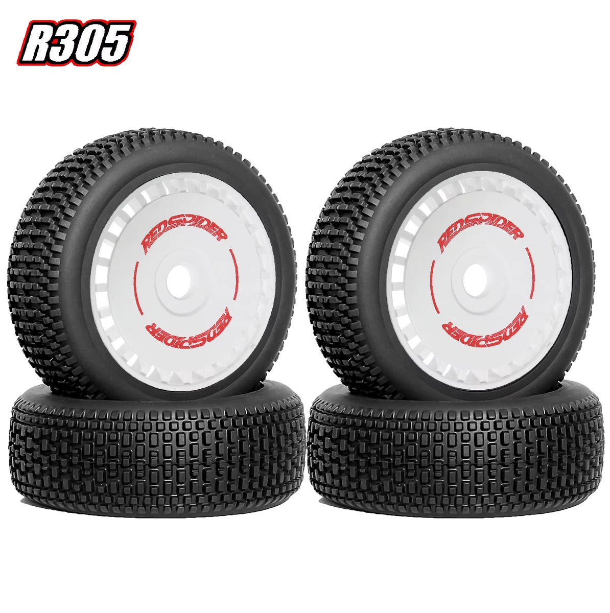
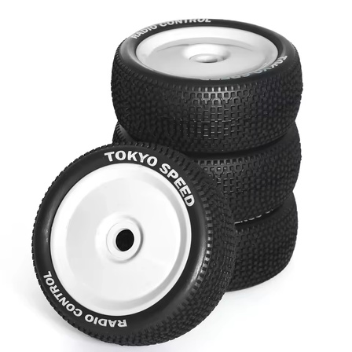
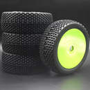
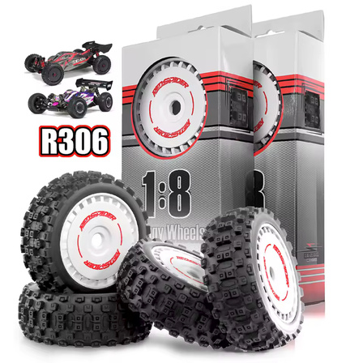
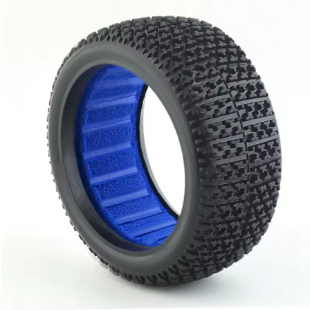
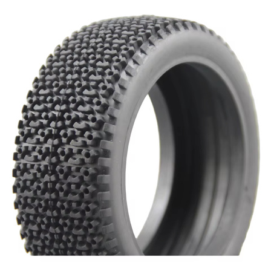
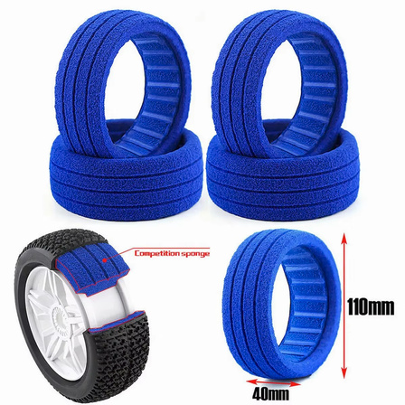

# Wheel & Tire Selection — FastAzJato4x4

> **Chosen and mounted: RED SPIDER wheels + tires (17mm hex).** The set I put on is the same RedSpider tire on a couple of different-colored rims (cosmetic only, same tire). They **take a few laps to wear in**, then **hook really well**, and the big win is longevity: they **wear slowly and keep gripping for a long time**. Same wheel/tire direction as [Mike's Jato](../Jato4x4_Mike/README.md#wheels--tires), and the same brand as the truggy set worked up in detail on the [E-Revo tire analysis](../ERevo_1.0/tire_analysis.md). **Heads up on all of these: they're soft, non-belted race tires, so mind the RPM.** An aggressive trigger rips non-belted tires (even AKA / Pro-Line / JConcepts), not just the cheap ones. The RedSpider hold up best, but ease into the throttle regardless.

  &nbsp; 
  <em>RED SPIDER R235 · R305 (white), the same tire. 1/8 buggy, 17mm hex, 118mm OD. I run the white R305 because it looks cool.</em>

---

## Key Requirements

| Requirement | Type | Why |
|---|---|---|
| **17mm hex, standard (non-star) rim** | Must | Matches the [wheel hexes](wheel_hex_analysis.md) (front non-star + rear star both take standard 17mm) |
| **ROAR-legal track width** | Must | Racing this one, so keep **standard-width rims**, no wide Traxxas-rim trick (see notes) |
| **Grips the blown-out dirt at Meldrum Bar** | Must | The [home track](README.md#track--setup-philosophy) is dry, rutted, loose over hard base |
| **Long wear life** | May | Fewer tire changes; RedSpider's slow wear is the main reason it's the pick |
| **Cheap / replaceable** | May | Budget AliExpress tire, easy to re-buy |

---

## Comparison

> *Spec format: Part · Type · Tread · Compound · Dia · Width · Rim · Hex · Weight · Foam · Pre-glued · Price*

| Wheel / Tire | Spec | Pros / Cons | Photo / Link |
|---|---|---|---|
| ⭐ **RED SPIDER R235 / R305** (mounted) — *same tire, colored rims* | **Part:** **R235 / R305** (R305 = white version) **Type:** 1/8 off-road buggy **Tread:** mini-pin / block **Compound:** soft rubber (unmarked) **Dia:** **118mm** (OD) **Width:** N/A **Rim:** RED SPIDER colored dish rims (17mm hex) **Hex:** 17mm **Weight:** N/A **Foam:** included **Pre-glued:** mounted set **Price:** **$18.61 / set** (RED SPIDER Store) | Pro: **Takes a few laps to wear in, then hooks really well.** **Wears slowly and keeps gripping for a long time**, the standout trait, and the **most durable of the sets I have**. Fits 1/8 buggies (Kyosho MP10 / Traxxas Jato / HSP / VRX). Cheap, colored rims are a free cosmetic pick  Con: **Not at full grip when fresh**, give them a few laps. Weight + paid price still to log | &nbsp; <em>R235 · R305 (white)</em> |
| 🥈 **Tokyo Speed T wheels** — *alternate full set of 4, in hand* | **Part:** 🚧 TBD (Tokyo Speed SKU / order ID) **Type:** 1/8-buggy-style off-road race **Tread:** block / mini-pin **Compound:** soft (race) **Dia:** N/A **Width:** N/A **Rim:** dish, 17mm hex (matched set of 4, interchanges with the RedSpider wheels) **Hex:** 17mm **Weight:** N/A **Foam:** included **Pre-glued:** mounted set **Price:** **$20 / set of 4** | Pro: **Complete matched set of 4**, drops onto the same 17mm hexes as the rest; **better than stock**; colors available (white / yellow / green / black); cheap  Con: **Mid all-round**, no standout trait. **Less durable than the RedSpider and can rip sometimes.** Soft race tire, mind the RPM (see notes) |  |
| 🔵 **Unbranded budget set** — *my first set, superseded* | **Part:** N/A (unbranded) **Type:** 1/8-buggy-style off-road **Tread:** block **Compound:** soft **Dia:** N/A **Width:** N/A **Rim:** yellow dish, 17mm hex (set of 4) **Hex:** 17mm **Weight:** N/A **Foam:** included **Pre-glued:** mounted set **Price:** **$13.17 / set of 4** (cheapest) | Pro: **Good grip for the price**, the first set I ran, cheapest of the lot  Con: **Weak rims** and the **tire wore down fast**, both the RedSpider and Tokyo Speed outlast it. Fine as an entry set, superseded now |  |
| 🔵 **RED SPIDER R306** — *RedSpider variant, wrong surface for this track* | **Part:** **R306** (RED SPIDER) **Type:** 1/8 off-road buggy **Tread:** aggressive knob / lug **Compound:** soft **Dia:** **118mm** (OD) **Width:** N/A **Rim:** dish, 17mm hex (set of 4) **Hex:** 17mm **Weight:** N/A **Foam:** included **Pre-glued:** mounted set **Price:** N/A | Pro: Same RedSpider brand + size (118mm, 17mm hex); **better on grass and some concrete** with the bigger knobs  Con: **Not ideal for the blown-out dirt at Meldrum Bar**, the aggressive lugs suit grass/concrete more than dry loose dirt. Stick with the **R235 / R305** mini-pin here |  |
| 🔵 **Generic 1/8 buggy tires, "Mitsubishi-logo" tread** — *tires only, in hand* | **Part:** N/A (generic AliExpress) **Type:** 1/8 off-road buggy (**tires only, no rims**) **Tread:** small block, "Mitsubishi-logo" style **Compound:** soft **Dia:** N/A **Width:** N/A **Rim:** none (mount on 17mm rims) **Hex:** N/A (tire only) **Weight:** N/A **Foam:** **included, nice closed-cell race foam** (blue) **Pre-glued:** No (tires only) **Price:** **$13 / set of 4** | Pro: **Comes with good closed-cell race foam** (holds shape better than the RedSpider's packing sponge). Cheap set of 4  Con: **Tires only, no rims**, mount them yourself. Unproven on my track vs the RedSpider |  |
| 🔵 **Generic 1/8 buggy tires, triangle tread (26013)** — *tires only, in hand* | **Part:** **26013** (Fiona Hobby) **Type:** 1/8 off-road buggy (**tires only, no rims**) **Tread:** triangle, hole in the middle **Compound:** medium / soft **Dia:** N/A **Width:** N/A **Rim:** none (mount on 17mm rims) **Hex:** N/A (tire only) **Weight:** ~310 g / set **Foam:** **none** (bought the Tire-Only variant; "With Sponge" / "With Racing" variants exist) **Pre-glued:** No **Price:** **$13.04** (list $13.73) | Pro: Cheap set of 4, grip is OK, fits standard 1/8 wheels  Con: **Very fragile and prone to ripping**, weaker than the RedSpider. No foam in this variant (pick the With-Sponge/Racing option if you want it) |  |

---

## Foam Inserts

The insert matters as much as the tire. **Closed-cell blue foams, sold on their own (4-pack, ~$9.42), are the best insert I run**, worth buying separate rather than relying on whatever sponge a cheap tire ships with.

 <em>Standalone closed-cell foam inserts (4pcs, ~$9.42, HPI-compatible 1/8)</em>

- **Reusable many times**, they don't pack out like the soft packing sponges (e.g. the RedSpider's).
- **Keeps the car planted** and cuts **rim slap** (tire collapsing onto the rim over bumps), so better overall control.
- **Adds a bit of weight**, which actually **helps air control** / stability when the car's off a jump.
- Generic 4Pcs 1/8 foam inserts (HPI-compatible), ~**$9.42 / 4**.

---

## Notes

- **Wear-in is real, don't judge them fresh.** A few laps in they come up to full grip. Mike logged roughly **7 packs to fully wear in** his RedSpider set on the [Jato](../Jato4x4_Mike/README.md#wheels--tires); same behavior here.
- **Colors are cosmetic.** The set I mounted is the same tire on different-colored rims, no performance difference.
- **Staying ROAR legal, no wide-track trick.** [Mike's Jato](../Jato4x4_Mike/README.md#wheels--tires) mounts the RedSpider tires on the **Traxxas Jato 4x4 rims**, which push the wheels out and **widen the stance by a lot**, great for a bash setup but **over ROAR width limits**. This FastAz deliberately runs **standard-width rims** to keep it race-legal.
- **Related RedSpider data:** the [E-Revo tire analysis](../ERevo_1.0/tire_analysis.md) has measured dims, foam, and pricing for the 1/8 truggy RedSpider set (different size/class, but same brand and character: strong forward grip, soft compound).
- **Soft race tires, mind the RPM, they're non-belted.** All of these (RedSpider, Tokyo Speed, and the premium AKA / Pro-Line / JConcepts sets I've run) are soft race tires with **no belt**, so **high RPM / an aggressive trigger rips them**, worst when unloaded (hard launches, wheelies, airborne throttle blips). Ease into the throttle. This is the nature of soft non-belted tires, not a defect of any one brand, the RedSpider just tolerate it best.
- **RedSpider tread variants, match to surface.** The **R235 / R305 mini-pin** is the dirt tread (what I run). The **R306** is a bigger-knob tread that's **better on grass and some concrete**, not the pick for a blown-out dirt track. Same 118mm / 17mm-hex size across them.
- **Tokyo Speed = the mid backup.** A full set of 4 (~$20) that interchanges on the 17mm hexes. Better than stock, but middling grip and less durable than the RedSpider, and it can rip. Keep it as the alternate / spare set.
- **Still to log:** width and weight for the RedSpider set (parts **R235 / R305** (R305 = white), 118mm OD, **$18.61/set**).
