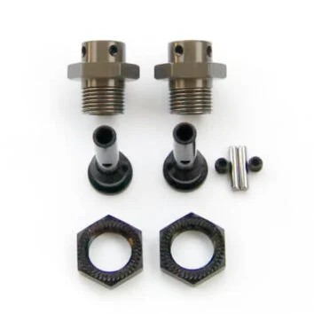
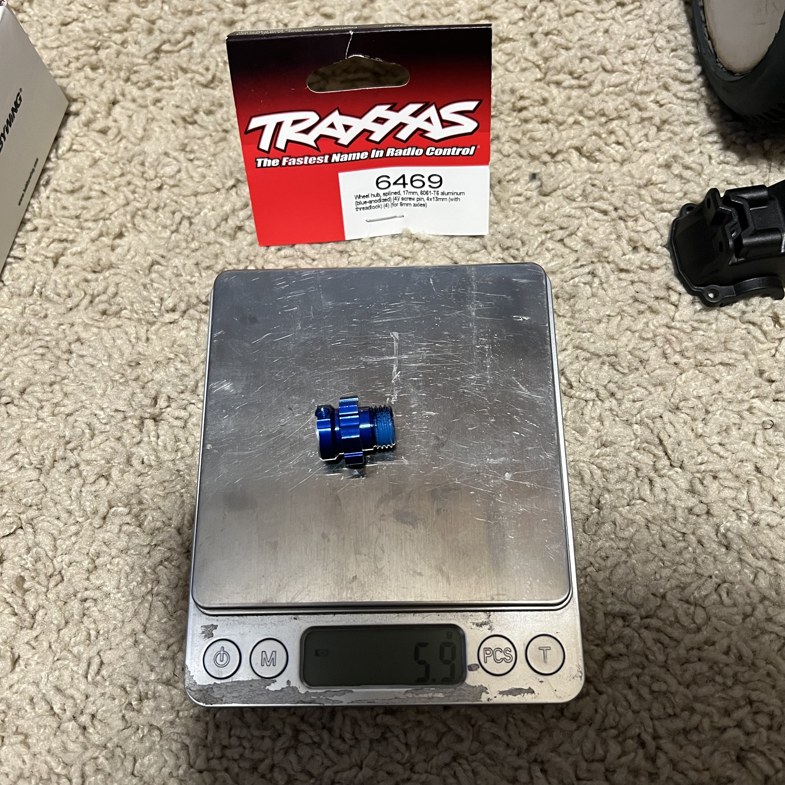
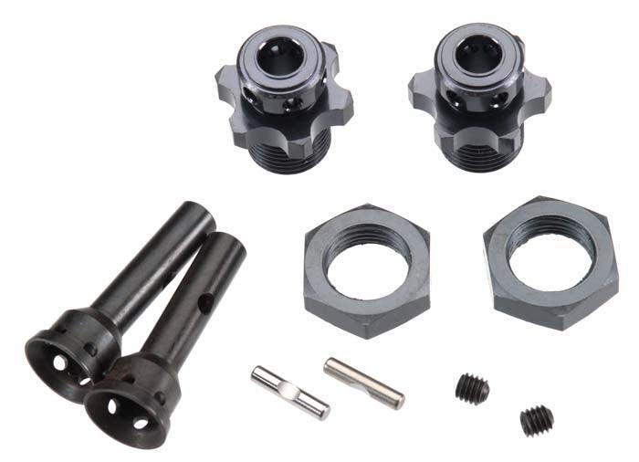

# Wheel Hexes — FastAzJato4x4

> **The 17mm hex that mounts the wheel onto the Tekno M6 stub.** This build runs 17mm wheels on the [Tekno M6 stubs](driveshaft_analysis.md#tekno-stubs-front--rear), so it needs a 17mm hex, but the M6 stub is a smaller/different profile than what these hexes are cut for, so the hex gets **lightly filed to seat**.
>
> - **Front: Tekno OEM 17mm hex** (pin-through, from the **TKR1654-17** kit). The cross-pin passes *through* the hex, so the hold is more secure and it's **more forgiving if you shave it thin** to fit the M6 stub. It's **non-star**, so it takes standard 17mm rims but not Traxxas star rims.
> - **Rear: the TKR5570-17 SCT410 kit** brings its own stub + 17mm hexes; its **star-drive hex takes both standard 17mm and Traxxas star rims**. Like the front, the rear hex still needs **light filing** to seat on the M6 stub.
> - **In hand alt: Traxxas TRA6469** (17mm splined aluminum, 5.9g), works, but it's a solid screw-pin hex, so filing it thin is riskier.
> - **Star vs non-star:** the rear **TKR5570-17 star hex fits both standard 17mm and Traxxas star rims**; the front non-star hex is standard-17mm-only. This build runs standard 17mm wheels (RedSpider etc.), so both ends are fine.

&nbsp; <em>Leaning: Tekno OEM 17mm hex (pin-through, in the TKR1654-17 kit) · alt: Traxxas TRA6469 17mm splined aluminum, 5.9g</em>

---

## Table of Contents

- [Key Requirements](#key-requirements)
- [Comparison](#comparison)
- [Notes](#notes)

---

## Key Requirements

| Requirement | Type | Why |
|---|---|---|
| **17mm hex** | Must | The wheels this build runs are 17mm, the hex has to be 17mm |
| **Seats on the Tekno M6 stub** | Must | The M6 stub is a smaller/different profile, so the hex must fit it, in practice this means **light filing** of the hex bore/chamfer |
| **Forgiving when shaved thin** | May | Since the hex gets filed to fit, a **pin-through** design tolerates thin shaving better than a solid screw-pin hex |
| **Matches the wheel's inner pattern** | May | Standard 17mm wheels drop on any 17mm hex; **stock Traxxas star-pattern rims need the special star hex** or the rim cut out |

---

## Comparison

> *Spec format: Type · Part · Material · Stub fit · Wheel pattern · Retention · Weight · Price*

| Hex | Spec | Pros / Cons | Photo / Link |
|---|---|---|---|
| ⭐ **Tekno OEM 17mm hex** (pin-through), *leaning* | **Type:** 17mm hex, pin-through **Part:** included in **TKR1654-17** (front M6 adapter kit) **Material:** Aluminum **Stub fit:** Tekno M6 stub, **light filing (~0.2–0.5mm)** to seat **Wheel pattern:** Standard 17mm (non-star; won't take Traxxas star rims) **Retention:** **Cross-pin passes through the hex** (pin-through) **Weight:** N/A (not yet weighed) **Price:** Included in TKR1654-17 (**$23.15/pr**) | Pro: **The pin-through design is the reason it's the pick**, the cross-pin runs through the hex for a more secure hold, and it's **more forgiving if shaved thin** to clear the M6 stub. Already in hand with the front adapter kit, so **no extra buy** for the front (the rear uses the TKR5570-17 kit)  Con: Not yet photographed/weighed. Still needs the light filing like any 17mm hex on an M6 stub |  |
| 🔵 **Traxxas TRA6469** — *in hand, alternative* | **Type:** 17mm splined hex **Part:** TRA6469 **Material:** 6061-T6 aluminum, blue-anodized **Stub fit:** Cut for 6mm axles, **file to the chamfer/bevel edge** to seat on the M6 stub **Wheel pattern:** Standard 17mm **Retention:** Screw pin 4×13mm w/ threadlock **Weight:** **5.9g** measured **Price:** N/A | Pro: **In hand, genuine Traxxas alloy, weighed at 5.9g.** Standard 17mm, seats after filing to the chamfer/bevel, the same shaved hub works front and rear  Con: **Solid screw-pin, not pin-through**, filing it thin is riskier than the Tekno hex, so it's the fallback, not the pick |  |
| ⭐ **Tekno SCT410 rear kit (TKR5570-17)** — *chosen for the rear; star hex fits standard + Traxxas rims* | **Type:** SCT410 rear kit: 2 stubs + 2 **17mm hexes** + nuts + cross-pins **Part:** **TKR5570-17** (UPC 815076013560) **Material:** Aluminum **Stub fit:** its own stub (the 5580); front + rear on the SCT410, the **rear** on this Jato build **Wheel pattern:** **Star-drive 17mm — fits BOTH standard 17mm rims (RedSpider etc.) AND Traxxas star-pattern rims** **Retention:** 17mm nut + cross-pin (both in the kit) **Weight:** N/A **Price:** **$25.95** (PowerHobby; free shipping if bought direct) | Pro: **One kit is the whole rear: stub + 17mm hexes + nuts + pins**, and the star hexes take **standard 17mm rims and Traxxas star rims**. More versatile than the front non-star hex (which can't take Traxxas rims)  Con: Still needs **light filing** to seat on the M6 stub, like the front. Pricier than a bare stub, but it bundles the stub, hexes, and hardware |  |

---

## Notes

- **Why the hex gets filed:** the 17mm hexes are cut for a 6mm axle / their own stub, and the **Tekno M6 stub is a smaller/different profile**, so the hex bore/chamfer needs a light shave (~0.2–0.5mm) to seat. See the [Tekno stubs section](driveshaft_analysis.md#tekno-stubs-front--rear) for the stubs these mount to.
- **Pin-through beats screw-pin when shaving thin.** The Tekno OEM hex's cross-pin runs *through* the hex, so even shaved thin it holds securely, the reason it's leaning over the solid TRA6469, which relies on a screw pin and has less meat to give up.
- **Star vs non-star hex.** Stock Traxxas wheels have a **star-shaped inner pattern**. The **star-drive TKR5570-17 (rear) takes both standard 17mm and Traxxas star rims**; the **non-star front TKR1654-17 takes standard 17mm rims only**. This build runs standard 17mm wheels (RedSpider etc.), so it's a non-issue either way.
- **Same shaved hub, front and rear.** Whichever hex is picked, the same filing works at both ends, one modification, four hexes.
- **Hubs + bearings are separate.** Hub carriers and bearing sizing (10×18×5 inner for the Raptor R + M6 front, etc.) live in [`hub_carrier_analysis.md`](hub_carrier_analysis.md), not here.
