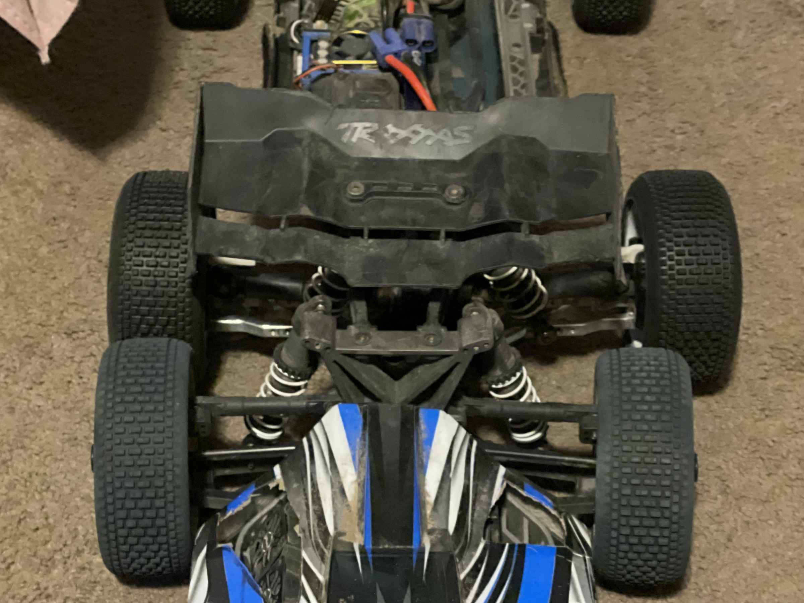
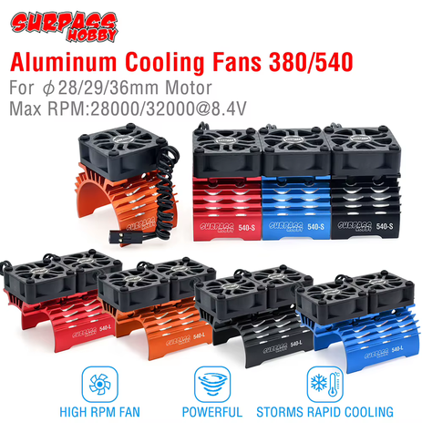
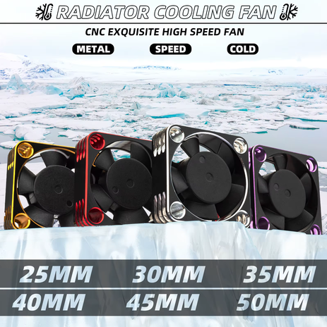
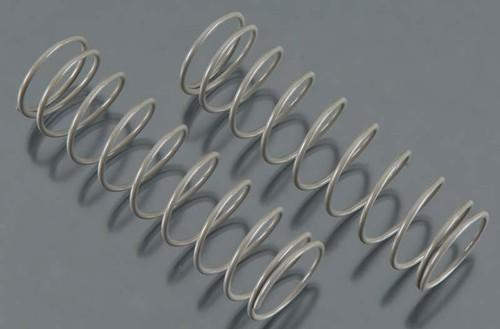
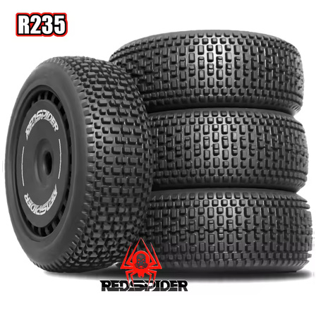
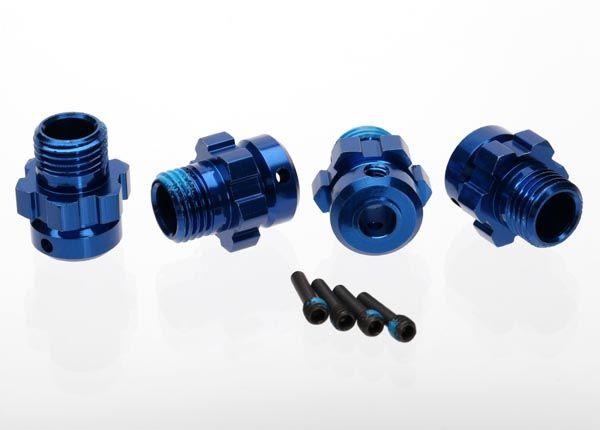
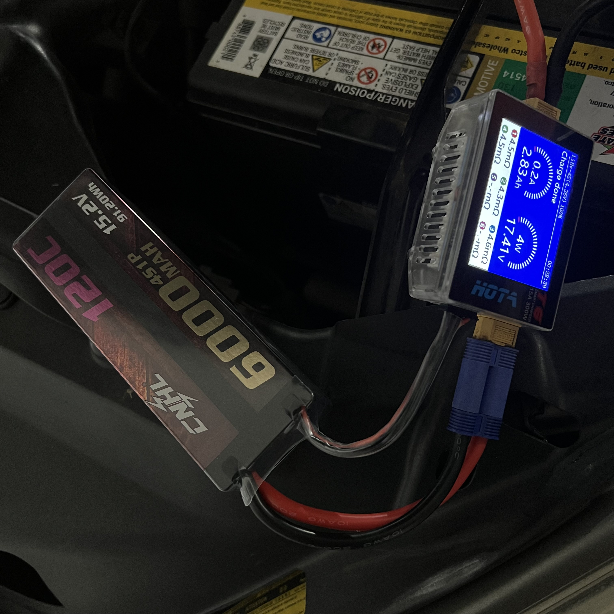
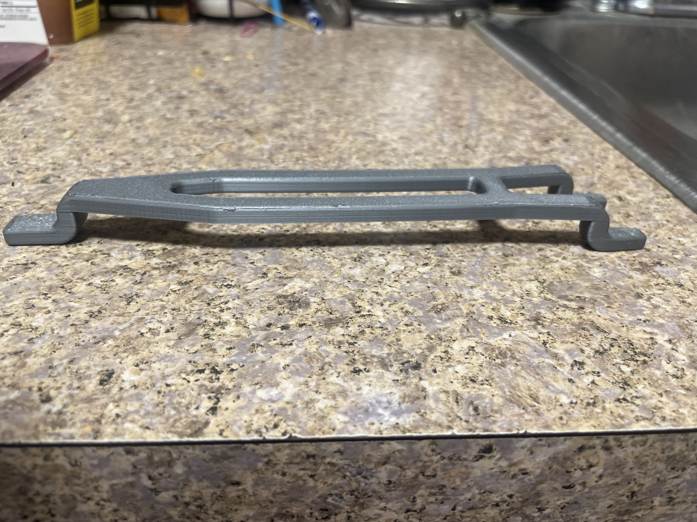

# ▌ R C   C A R   N E W S ▐

**RACING · TUNING · TECH · COMMUNITY** &nbsp;&nbsp;·&nbsp;&nbsp; REAL CARS. REAL PEOPLE. REAL RC.

`VOL. 1 . . . No. 1 . . . SEPTEMBER 2026 . . . BEAVERTON, OR . . . PRICE 25¢`

---

# Super Jato 4EP: Tuning for More Speed, More Control, More Fun

### *Simple changes. Big difference. Here is how a $100 clapped out Slash became this.*

<b>WORDS, PHOTOS &amp; RECEIPTS:</b> THE GARAGE DESK &nbsp;·&nbsp; <b>OWNER:</b> MICHEAL RITCHIE &nbsp;·&nbsp; <b>HOME TRACK:</b> MELDRUM BAR PARK

**The Jato 4EP is not a car you can buy.** It started as a **totally clapped out Traxxas Slash 4x4, bought off Facebook for $100** sometime before 2018, and it has been rebuilt part by part into a 4S Jato 4x4. Nearly every setting on it was worked out here first and then handed to its faster sibling, the [Jato 4SS](../Jato4SS/README.md). **This is the original and that one is the copy.** What follows is what is fitted, what it cost, and the handful of changes that actually mattered.

 <em><strong>This car on top, a basically stock Jato underneath.</strong> Close to a whole wheel width per side, which is the single best change made to it</em>

---

<h3>▌ THE BASICS ▐</h3>

## Car Overview

| | |
|:---|:---|
| **Platform** | Traxxas Jato 4x4, built from a Slash 4x4 donor |
| **Donor** | **$100**, clapped out, off Facebook, before 2018 |
| **Motor** | Castle **1412-3200KV**, 4 pole, 12 slot, sensored |
| **ESC** | Castle **Mamba X SCT**, combo **010-0155-13** |
| **Battery** | **4S**, LiPo or LiHV, 3.5V per cell cutoff |
| **Gearing** | **11T 32P** pinion, **54T** spur |
| **Chassis** | Traxxas **7422 LCG** plastic, alloy front bulkhead |
| **Scale** | 1/10 platform on 1/8 power |
| **Type** | Bash and race, dirt and beach |

> **What makes it a Jato rather than a Slash: the towers, the shocks and the wing.** The two are the same platform, so a Slash donor carries straight over and those three parts are the conversion. Anyone pricing this build should start there.
>
> ⚠️ **The donor was pre-EHD and LCG.** The LCG tub saved nothing, but pre-EHD cost real money: **every EHD suspension part on this car was bought**, because none of it fits a pre-EHD chassis. Full accounting in [`BOM.md`](BOM.md).

 🚧 save as <code>src/overview_jato4ep_full_hero.jpg</code>. Most shots here are of parts, not the car

---

<h3>▌ TOP TUNING UPGRADES ▐</h3>

### 1. GEARING

**The finding that overturned the plan.** Going in, the assumption was that higher RPM means better air control, so the smallest pinion looked obvious. Wrong. **Torque matters as much as RPM.** Gearing for the power band sweet spot made mid air corrections feel just as sharp *and* kept the motor cooler, because it is neither lugging nor screaming. Reached at **12T**, now running **11T**.

 🚧 save as <code>src/drivetrain_pinion_11t_32p.jpg</code>

### 2. MOTOR COOLING

**The 1412 runs hot on 4S, so it wears a fan.** Surpass Hobby **36mm dual fan heatsink** in blue, with the plastic fans it ships with swapped for **two 30mm metal ones**. Metal costs about the same and lasts longer, though every fan dies eventually. **$22.62 for the whole rig.**

&nbsp; <em>The Surpass range, the <strong>36mm dual</strong> is the one fitted · the CNC metal fans that replace the plastic pair</em>

### 3. SHOCK TUNING

**HPI Apache C1 big bores, 16mm bore, 97mm.** The same shock the 4SS runs internally, but on plastic bodies rather than metal. **37.5wt front, 50wt rear**, because the motor sits at the back and the car is tail heavy for a 1/8.

&nbsp; <em>HPI Apache C1 <strong>107365</strong> · the <strong>HB67453 grey 52gf</strong> rear springs, 76mm</em>

### 4. WHEELS &amp; TIRES

**The wide track trick, and the best change on the car.** RedSpider tires mounted on the wider **Traxxas Jato 4x4 rims** instead of standard ones. Each wheel sits further out and the stance grows a lot. More stability, more corner grip. ⚠️ **Outside ROAR width**, which is fine on a bash car.

&nbsp; <em>RedSpider, the shared tire · <strong>Traxxas 6469</strong> 17mm hexes, shaved to clear the big bearing</em>

---

<h3>▌ PERFORMANCE PARTS ▐</h3>

&nbsp;&nbsp;

<b>FLM26800 extended arms</b>, front and rear, $51.46 &nbsp;·&nbsp; <b>MonsterKingz 7075 alloy</b> front knuckles, $50.00 &nbsp;·&nbsp; <b>Tekno 5580</b> rear stubs, $16.90 the pair

 

&nbsp;&nbsp;

<b>GPM alloy bell crank</b>, $20.00 &nbsp;·&nbsp; <b>ACER titanium M4x60</b>, six links, $35.94 &nbsp;·&nbsp; <b>Steel VG-style brace</b>, $18.99, LCG only

---

<h3>▌ DRIVETRAIN ▐</h3>

## Drivetrain

| Position | Part |
|:---|:---|
| **Pinion** | **11T 32P** |
| **Spur** | **54T**, came with the donor |
| **Axles** | Knock-off Slash / Jato 4x4 HD steel CV on **TRA6752 long output shafts**, all four corners |
| **Stubs** | Tekno **TKR1654-17** front, Tekno **5580** rear |
| **Centre shaft** | Traxxas **6855-BLUE**, alloy, 214mm, came with the car |
| **Hexes** | Traxxas **6469**, shaved to clear the bare 10×18×5 |

> **The axles are basically the Jato 4x4 part**, so they bolt straight in with **no cutting, welding or joining**. Shared with the 4SS, full assembly and costs in [`driveshaft_analysis.md`](driveshaft_analysis.md).
>
> **Bearings are where the two cars split.** This one runs a **bare 10×18×5** in the hub and shaves the hexes to suit. The 4SS sleeves down to a 10×15×4 instead. See [`bearings_reference.md`](bearings_reference.md).

### Diff Oil

| Diff | Fill | Why |
|:---|:---|:---|
| **Front** | **30k**, Traxxas TRA5136 | Calms torque steer on a heavy 4S car |
| **Centre** | **100k**, Traxxas TRA5130 | Holds drive stability |
| **Rear** | ⚙️ **Blue grease, no oil**, Dynamite DYNE4201 | Drive off the corner. **Light coat, never packed** |

 <em>The rear runs <strong>grease instead of oil</strong>, which is this car's own divergence from the 4SS</em>

---

<h3>▌ SUSPENSION ▐</h3>

## Suspension

### Shock Oil

| Position | Weight |
|:---|:---|
| **Front** | **37.5wt**, Losi TLR74030, 468 cSt |
| **Rear** | **50wt**, Associated 5480 FT, 650 cSt |

> 🔧 **If the rear packs, drop to 47.5wt** (Associated FT, 613 cSt), one small step down. This car's rear piston is the more restrictive **6 × 1.2**, so it packs sooner than the 4SS. See [`shock_analysis.md`](shock_analysis.md#if-the-rear-packs).

| Position | Piston | Spring |
|:---|:---|:---|
| **Front** | ⚙️ **6 hole × 1.4**, two holes opened to 1.5 | White 59gf |
| **Rear** | 6 hole × 1.2 | Grey 52gf, **HB67453** |

**Arms are FLM26800 at both ends**, 6061 aluminium, +9.6mm per arm, **$51.46** for the two pairs. Full write up in [`arm_analysis.md`](arm_analysis.md).

---

<h3>▌ STEERING ▐</h3>

## Steering

<i>"IT DIDN'T FAIL STOCK" · Filed hinge pocket blamed in C-hub failure</i>

| Component | Part |
|:---|:---|
| **Front knuckle** | **MonsterKingz 7075 alloy**, bought off the 4SS for $50.00 |
| **Front C-hub** | **Stock plastic EHD (TRA9032)**, the sacrificial half |
| **Rear carriers** | **Stock plastic EHD (TRA9050)**, $6.00 the pair |
| **Bell crank** | **GPM aluminium**, $20.00 |
| **Links** | **ACER titanium M4x60 ×6**, RPM long rod ends in white (80511) |
| **Servo** | **PTK 9752TG-D**, $19.65 |
| ~~Lighthouse alloy front~~ | **Broke, retired.** 25.5 g C-hub · 22.4 g knuckle, bare |

> **Why the front is half plastic.** The alloy C-hub that was here **broke**, so the front runs an alloy knuckle on a plastic C-hub. Metal where the knuckle needs it, sacrificial and cheap everywhere else.
>
> ⚠️ **The Lighthouse set did not fail on its own merits.** The hinge pocket had been **filed out for droop**, which removes material exactly where the C-hub carries load, and **too much droop turned out to be bad anyway**. Two lessons, one broken hub. Full write up in [`hub_analysis.md`](hub_analysis.md).

---

<h3>▌ CHASSIS ▐</h3>

## Chassis

| Component | Part | Notes |
|:---|:---|:---|
| **Chassis** | **Traxxas 7422 LCG plastic**, $20.00 | **The big divergence from the [Jato 4SS](../Jato4SS/chassis_analysis.md)**, which went carbon fibre. Plastic flexes rather than cracking. ⚠️ **LCG, so only LCG parts fit** |
| **Front bulkhead** | **Powerhobby aluminium**, $36.99 | The front is where bulkheads get loaded and where the plastic one gives up |
| **Centre brace** | **Steel, VG-style**, $18.99 | **The Slash came with no brace at all**, so this was added, not replaced. ⚠️ **LCG only** |

> **The honest cheap route:** a plastic chassis plus one alloy front bulkhead covers the part that actually fails, without the carbon kit. It is also the pairing that makes [metal arms risky](../Jato4SS/arm_analysis.md), since FLM arms strip a *plastic* bulkhead.

---

<h3>▌ WHEELS &amp; TIRES ▐</h3>

## Wheels & Tires

| Item | Spec |
|:---|:---|
| **Rims** | **Traxxas 9070-WHT**, Jato 4x4 VXL 3.0" dished, white, 17mm hex |
| **Foams** | **Blue closed cell race foams** |
| **Tires** | **RedSpider**, the same tire the 4SS runs |

> **Wear in matters, do not judge them fresh.** These take about **7 battery packs** to come up to full grip. A fresh set feels worse than a worn one.

---

<h3>▌ BODY SHOP ▐</h3>

## Aero & Body

| Component | Part |
|:---|:---|
| **Body** | **Traxxas 9060-BLUE**, pre-painted, the red and blue scheme |
| **Wing** | **Traxxas 9517X** blue, ships with hardware |
| **Wing mounts** | **Traxxas 9046**, left and right |

&nbsp;&nbsp; <em><strong>9060-BLUE</strong> body · <strong>9517X</strong> blue wing · <strong>9046</strong> mounts</em>

> **The body is the wrong colour, and that turned out fine.** A **green** one was ordered and **Jenny's RC shipped the blue instead**. It was kept, the mistake went in his favour since the blue lists around **$43** against the **$36.00** paid, and **honestly the wrong body looks better than the one ordered**.

---

<h3>▌ ELECTRONICS ▐</h3>

## Electronics

| Component | Part |
|:---|:---|
| **Motor** | Castle Creations **1412 3200KV** |
| **ESC** | Castle **Mamba X SCT**, combo **010-0155-13**, $198.71 |
| **Radio** | **FlySky Noble NB4** with the FGr4S V2 receiver, $140.91 |
| **Connector** | **EC5**, the main battery connection |
| **Cooling** | Surpass 36mm dual fan, two 30mm metal fans |

&nbsp; <em>Mamba X SCT and the 1412, sold as one part · the <strong>S605ZZ 5×14×5 ABEC-9</strong> motor bearing</em>

> ⚠️ **4S is the ceiling and this car sits on it.** The Mamba X alone is a 6S controller, but the bundled 1412 caps the combo at 4S, which is exactly why the 11T pinion counts as conservative gearing.

---

<h3>▌ BATTERIES ▐</h3>

## Batteries

⚠️ **Low voltage cutoff: 3.5V per cell.** HV packs stay punchy right to the end, so nothing warns you they are nearly done.

**Max pack 152 × 48 × 44mm**, full length 4S, soft or hard case. **Four packs run here**, the Gens Ace Redline 6300 and three CNHL, and **the HV ones are the better packs**. Likely moving to hardcase so grit stops chafing the soft ones.

&nbsp; <em>CNHL Ultra-Thin 6000 120C · the <strong>printed battery bar</strong> that actually holds the pack down</em>

---

<h3>▌ TUNING TIPS ▐</h3>

- **Keep it cool.** The motor lasts effectively forever, the bearings do not, and **when one lets go it takes the rotor with it**. That turns a $1.71 part into a whole motor. **A service is two bearings, the same size at both ends, $3.42.**
- **Count packs, not months.** Bearings went in **2026-09-06**, first run **2026-09-12**, **4 packs** on them since. Logged in [`maintenance/README.md`](../../maintenance/README.md).
- **Grease the rear diff, do not fill it.** A **light coat** of Dynamite blue, never packed. Packing it defeats the point.
- **Do not over-tighten.** Let the suspension move freely and avoid binding.
- **Shave the hex, not the carrier.** Running the bare 10×18×5 leaves no room for a full thickness hex, so **the hexes give up the 1mm**.
- **Use a good pack, and respect the cutoff.** HV buys top speed, but nothing tells you when an HV pack is done.

---

<h3>▌ GEARING GUIDE (QUICK REFERENCE) ▐</h3>

| Pinion (T) | Spur (T) | Result |
|:---|:---|:---|
| **11** | 54 | ⭐ **Running now.** Conservative, which the 4S ceiling wants |
| **12** | 54 | **Where the finding was reached.** Power band sweet spot, cooler motor |
| Smaller | 54 | The original instinct, and the wrong target. More RPM, less usable thrust |

*Note: gearing varies with motor and conditions. Check mesh and temperature. Full write up in [`esc_motor_analysis.md`](esc_motor_analysis.md#the-gearing-finding).*

---

<h3>▌ FINAL THOUGHTS ▐</h3>

**A $100 clapped out Slash turned into this for $1006.74 of parts.** The donor sits outside that figure and so do the batteries, because packs move between cars. All in, counting both, it is **$1392.09**.

**The lesson worth taking is the gearing one.** Pinion sizing is not purely a top speed equation, and that conclusion was reached on this car before the 4SS ever turned a wheel. The rest is unglamorous: grease the rear, count your packs, and shave the cheap part rather than the expensive one.

### SAME PLATFORM. DIFFERENT ANSWERS.

---

<h3>▌ THE INDEX ▐</h3>

## Analysis Docs

Each one summarises **what is fitted**, with a link out to the [Jato 4SS](../Jato4SS/README.md) doc for the full comparison.

| | | | | |
|:---|:---|:---|:---|:---|
| [Shocks](shock_analysis.md) | [Diffs](differential_analysis.md) | [ESC, motor & gearing](esc_motor_analysis.md) | [Chassis](chassis_analysis.md) | [BOM](BOM.md) |
| [Shock towers](shock_tower_analysis.md) | [Driveshafts](driveshaft_analysis.md) | [17mm hexes](driveshaft_analysis.md#17mm-wheel-hexes) | [Body & aero](aero_analysis.md) | [Bumpers](bumper_analysis.md) |
| [Arms](arm_analysis.md) | [Gearbox housings](gearbox_housing_analysis.md) | [Battery packs](battery_analysis.md) | [Wheels](wheel_analysis.md) | [Connectors](connector_reference.md) |
| [Hubs](hub_analysis.md) | [Bearings](bearings_reference.md) | [Battery mounting](battery_mount_analysis.md) | [Bell crank](steering_bell_crank_analysis.md) | [Charger](charger_analysis.md) |
| [Radio](radio_analysis.md) | [Tie rods](tie_rod_analysis.md) | [Servo](servo_analysis.md) | | |

---

<h3>▌ COMING NEXT ISSUE ▐</h3>

## TODO / Notes

- [x] Chassis confirmed: **Traxxas 7422 LCG + Powerhobby alloy front bulkhead + steel centre brace**
- [x] Electronics and drivetrain recorded: Mamba X SCT + 1412 combo, 11T/54T, TRA6855 centre shaft
- [x] Arm setup confirmed against the 4SS: **FLM26800**, and the Slash vs Jato shock mount costs ~5mm of wheelbase
- [ ] **Weigh the car.** No all up figure recorded yet, which also leaves Castle's 6.5 lb rating unchecked
- [ ] **A proper hero photo of the car itself.** Most shots here are of parts
- [ ] Price the **TRA9032 front C-hubs**, the last unpriced row on the [BOM](BOM.md)

---

<b>RC CAR NEWS</b> · Published irregularly from the bench · All prices as paid, all weights as measured 
Sister publication: <a href="../Jato4SS/README.md">Jato 4SS, the Super Jato</a> · Accounts settled in the <a href="../../LEDGER.md">LEDGER</a>

