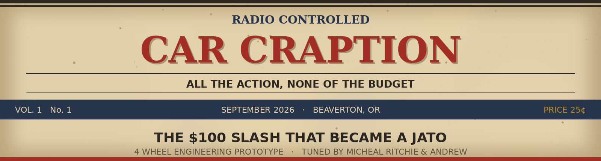
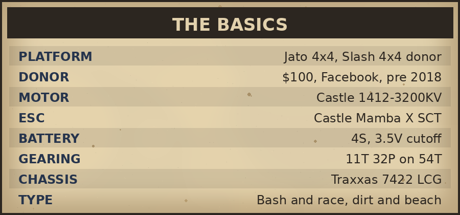
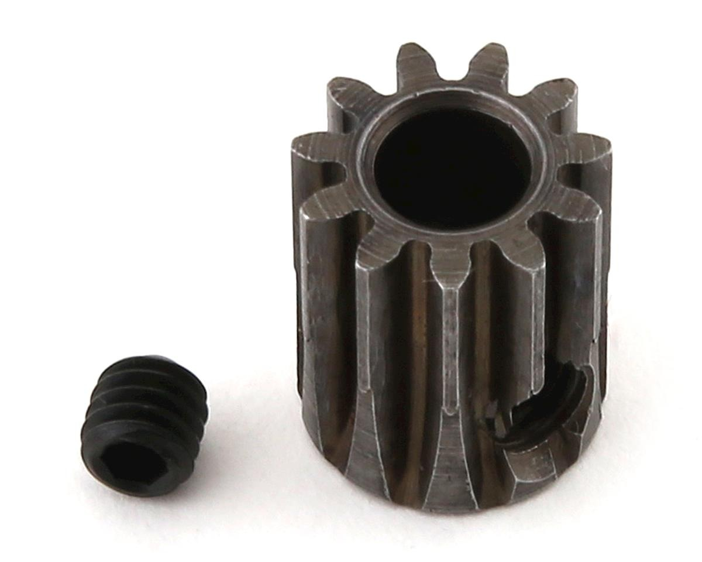

# Super Jato 4EP: Tuning for More Speed, More Control, More Fun

### *Simple changes. Big difference. Here is how a hundred dollar Slash became this.*

<b>TEAM CHEAPAZTUNINGRC</b> &nbsp;·&nbsp; <b>TUNED BY</b> MICHEAL RITCHIE &amp; ANDREW &nbsp;·&nbsp; <b>HOME TRACK</b> MELDRUM BAR PARK

$\textcolor{B02E26}{\textsf{THE BASICS}}$

## Car Overview

<table>
<tr>
<td width="50%" valign="top">
<b>The Jato 4EP is not a car you can buy.</b> It started as a <b>Traxxas Slash 4x4, bought off Facebook for &#36;100</b> sometime before 2018, and it has been rebuilt part by part into a 4S Jato 4x4.
 
<b>4EP is the 4 Wheel Engineering Prototype</b>, and the name is the job: nearly every setting was worked out here first, then handed on. <b>The <a href="../Jato4SS/README.md">Jato 4SS</a> is its successor</b>, a faster car built on answers this one found.
 
<i>What makes it a Jato rather than a Slash: the towers, the shocks and the wing.</i>
 
&#9888;&#65039; <b>The donor was pre-EHD and LCG.</b> The LCG tub saved nothing, but pre-EHD cost real money: <b>every EHD suspension part was bought</b>, since none of it fits a pre-EHD chassis. Full accounting in <a href="BOM.md">BOM.md</a>.
</td>
<td width="50%" valign="top">
 <b>This car on top, a stock Jato underneath.</b> Close to a whole wheel width per side

</td>
</tr>
</table>

$\textcolor{B02E26}{\textsf{TOP TUNING UPGRADES}}$

<table>
<tr>
<td width="25%" valign="top"><b>1. GEARING</b>  The finding that overturned the plan. Higher RPM was assumed to mean better air control, so the smallest pinion looked obvious. <b>Torque matters as much as RPM.</b> Gearing for the power band made mid air corrections just as sharp and kept the motor cooler. Reached at <b>12T</b>, now <b>11T</b>, a <b>Robinson Racing 8611</b>.
 RR 8611, extra hard steel, &#36;10.99
</td>
<td width="25%" valign="top"><b>2. MOTOR COOLING</b>  The 1412 runs hot on 4S, so it wears a fan. Surpass <b>36mm dual fan heatsink</b> in blue, with the plastic fans swapped for <b>two 30mm metal ones</b>. Metal costs about the same and lasts longer, though every fan dies eventually.
 the 36mm dual is fitted, &#36;22.62 the rig
</td>
<td width="25%" valign="top"><b>3. SHOCK TUNING</b>  <b>HPI Apache C1</b> big bores, 16mm bore, 97mm shaft, target <b>100mm eye to eye</b>. <b>37.5wt front, 50wt rear</b>, because the motor sits at the back and the car is tail heavy for a 1/8.
 Apache C1 107365
</td>
<td width="25%" valign="top"><b>4. WHEELS &amp; TIRES</b>  The wide track trick, and the best change on the car. RedSpider tires on the wider <b>Traxxas Jato 4x4 rims</b>. Each wheel sits further out and the stance grows a lot. <b>Outside ROAR width</b>, fine on a bash car.
 RedSpider, the shared tire
</td>
</tr>
</table>

<table>
<tr>
<td width="56%" valign="top">
$\textcolor{2B3A55}{\textsf{PERFORMANCE PARTS}}$
<table><tr><td align="center"> <b>FLM26800</b> arms, &#36;51.46</td><td align="center"> <b>MonsterKingz</b> knuckles, &#36;50.00</td><td align="center"> <b>Tekno 5580</b> stubs, &#36;16.90</td></tr><tr><td align="center"> <b>GPM</b> bell crank, &#36;20.00</td><td align="center"> <b>ACER</b> titanium x6, &#36;35.94</td><td align="center"> <b>VG</b> steel brace, &#36;18.99</td></tr></table></td>
<td width="44%" valign="top">
$\textcolor{2B3A55}{\textsf{TUNING TIPS}}$
<ul><li><b>Keep it cool.</b> The motor lasts effectively forever, the bearings do not, and when one lets go it takes the rotor with it. <b>A service is two bearings, the same size at both ends, &#36;3.42.</b></li><li><b>Count packs, not months.</b> Bearings went in 2026-09-06, <b>4 packs</b> on them since. Logged in <a href="../../maintenance/README.md">maintenance/README.md</a>.</li><li><b>Grease the rear diff, do not fill it.</b> A light coat, never packed.</li><li><b>Do not over-tighten.</b> Let the suspension move freely.</li><li><b>Shave the hex, not the carrier.</b> The bare 10&#215;18&#215;5 leaves no room for a full thickness hex.</li><li><b>Respect the cutoff.</b> HV buys top speed, but nothing tells you when an HV pack is done.</li></ul></td>
</tr>
</table>

$\textcolor{2B3A55}{\textsf{DRIVETRAIN}}$

## Drivetrain

| Position | Part |
|:---|:---|
| **Pinion** | **Robinson Racing 8611**, 32P 11T, extra hard blackened steel, \$10.99 |
| **Spur** | **54T steel**, integrated into the centre diff |
| **Centre diff** | Metal, aluminium housing, \$18.80 |
| **Axles** | Knock-off Slash / Jato 4x4 HD steel CV on **TRA6752 long output shafts**, all four corners |
| **Stubs** | Tekno **TKR1654-17** front, Tekno **5580** rear |
| **Centre shaft** | Traxxas **6855-BLUE**, alloy, 214mm, came with the car |
| **Hexes** | Traxxas **6469**, shaved to clear the bare 10×18×5 |

> **The axles are basically the Jato 4x4 part**, so they bolt straight in with no cutting, welding or joining. Full assembly in [`driveshaft_analysis.md`](driveshaft_analysis.md).
>
> **Bearings are where the two cars split.** This one runs a **bare 10×18×5** in the hub and shaves the hexes. The 4SS sleeves down to a 10×15×4. See [`bearings_reference.md`](bearings_reference.md).

### Diff Oil

| Diff | Fill | Why |
|:---|:---|:---|
| **Front** | **30k**, Traxxas TRA5136 | Calms torque steer on a heavy 4S car |
| **Centre** | **100k**, Traxxas TRA5130 | Holds drive stability |
| **Rear** | ⚙️ **Blue grease, no oil**, Dynamite DYNE4201 | Drive off the corner. **Light coat, never packed** |

&nbsp;&nbsp; <b>30k</b> front · <b>100k</b> centre · <b>DYNE4201</b> rear

$\textcolor{2B3A55}{\textsf{SUSPENSION}}$

## Suspension

### Shock Oil

| Position | Weight |
|:---|:---|
| **Front** | **37.5wt**, Losi TLR74030, 468 cSt |
| **Rear** | **50wt**, Associated 5480 FT, 650 cSt |

> 🔧 **If the rear packs, drop to 47.5wt** (Associated FT, 613 cSt). The rear piston is the more restrictive **6 × 1.2**, so it packs sooner than the 4SS. See [`shock_analysis.md`](shock_analysis.md#if-the-rear-packs).

| Position | Piston | Spring |
|:---|:---|:---|
| **Front** | ⚙️ **6 hole × 1.4**, two holes opened to 1.5 | **Stock white 59gf** |
| **Rear** | 6 hole × 1.2 | Grey 52gf, **HB67453** |

**Shocks** are HPI Apache C1 **107365**, 97mm shaft, target **100mm eye to eye**. **Arms** are FLM26800 at both ends, +9.6mm per arm, **\$51.46** the two pairs. See [`arm_analysis.md`](arm_analysis.md).

&nbsp;&nbsp; Apache C1 · HB67453 grey rears · FLM26800

$\textcolor{2B3A55}{\textsf{STEERING}}$

## Steering

| Component | Part |
|:---|:---|
| **Front knuckle** | **MonsterKingz 7075 alloy**, \$50.00 |
| **Front C-hub** | **Stock plastic EHD (TRA9032)**, the sacrificial half |
| **Rear carriers** | **Stock plastic EHD (TRA9050)**, \$6.00 the pair |
| **Bell crank** | **GPM aluminium**, \$20.00, pivots on TRA5114 bearings until they fail, then TRA3775 Oilite |
| **Links** | **ACER titanium M4x60 ×6**, RPM long rod ends in white (80511) |
| **Servo** | **PTK 9752TG-D**, 22 kg·cm at 7.4V, \$19.65 |
| ~~Lighthouse alloy front~~ | **Broke, retired.** 25.5 g C-hub · 22.4 g knuckle |

> **Why the front is half plastic.** The alloy C-hub that was here broke, so the front runs an alloy knuckle on a plastic C-hub.
>
> ⚠️ **The Lighthouse set did not fail on its own merits.** The hinge pocket had been filed out for droop, and too much droop turned out to be bad anyway. See [`hub_analysis.md`](hub_analysis.md).

$\textcolor{2B3A55}{\textsf{CHASSIS}}$

## Chassis

| Component | Part | Notes |
|:---|:---|:---|
| **Chassis** | **Traxxas 7422 LCG plastic**, \$20.00 | The big divergence from the [Jato 4SS](../Jato4SS/chassis_analysis.md), which went carbon. ⚠️ **LCG only parts fit** |
| **Front bulkhead** | **Powerhobby aluminium**, \$36.99 | The front is where the plastic one gives up |
| **Centre brace** | **Steel, VG-style**, \$18.99 | The Slash came with no brace, so this was added. ⚠️ **LCG only** |

> **The honest cheap route:** a plastic chassis plus one alloy front bulkhead covers the part that actually fails. It is also why [metal arms](../Jato4SS/arm_analysis.md) need the alloy front, since FLM arms strip a plastic bulkhead.

$\textcolor{2B3A55}{\textsf{WHEELS AND TIRES}}$

## Wheels & Tires

| Item | Spec |
|:---|:---|
| **Rims** | **Traxxas 9070-WHT**, Jato 4x4 VXL 3.0" dished, white, 17mm hex, \$8.00 the pair |
| **Foams** | **Blue closed cell race foams** |
| **Tires** | **RedSpider**, the same tire the 4SS runs |

> **Wear in matters.** These take about **7 battery packs** to reach full grip. A fresh set feels worse than a worn one.

$\textcolor{2B3A55}{\textsf{BODY SHOP}}$

## Aero & Body

| Component | Part |
|:---|:---|
| **Body** | **Traxxas 9060-BLUE**, the red and blue scheme |
| **Wing** | **Traxxas 9517X** blue |
| **Wing mounts** | **Traxxas 9046** |

&nbsp;&nbsp; 9060-BLUE · 9517X wing · 9046 mounts

> **The body is the wrong colour, and that turned out fine.** A green one was ordered and Jenny's RC shipped the blue. It was kept, the blue lists around **\$43** against the **\$36.00** paid, and the wrong body looks better than the one ordered.

$\textcolor{2B3A55}{\textsf{ELECTRONICS}}$

## Electronics

| Component | Part |
|:---|:---|
| **Motor** | Castle Creations **1412 3200KV** |
| **ESC** | Castle **Mamba X SCT**, combo **010-0155-13**, \$198.71 |
| **Radio** | **FlySky Noble NB4** with the FGr4S V2, \$140.91 |
| **Connector** | **EC5**, the main battery connection |
| **Cooling** | Surpass 36mm dual fan, two 30mm metal fans |
| **Motor bearings** | **S605ZZ 5×14×5 ABEC-9**, two per service, same size both ends |

> ⚠️ **4S is the ceiling and this car sits on it.** The Mamba X alone is 6S, but the bundled 1412 caps the combo at 4S.

&nbsp; Mamba X SCT + 1412 · S605ZZ motor bearing

$\textcolor{2B3A55}{\textsf{BATTERIES}}$

## Batteries

⚠️ **Low voltage cutoff: 3.5V per cell.** HV packs stay punchy right to the end, so nothing warns you they are nearly done.

**Max pack 152 × 48 × 44mm**, full length 4S. **Four packs run here**, the Gens Ace Redline 6300 and three CNHL, and **the HV ones are the better packs**. Details in [`battery_analysis.md`](battery_analysis.md).

&nbsp; CNHL Ultra-Thin 6000 · the printed battery bar

<table>
<tr>
<td width="50%" valign="top">
$\textcolor{B02E26}{\textsf{GEARING GUIDE}}$
<table><tr><th align="left">Pinion</th><th align="left">Spur</th><th align="left">Result</th></tr><tr><td><b>11T</b></td><td>54T</td><td>&#11088; <b>Running now.</b> Conservative, which the 4S ceiling wants</td></tr><tr><td><b>12T</b></td><td>54T</td><td><b>Where the finding was reached.</b> Power band sweet spot</td></tr><tr><td>Smaller</td><td>54T</td><td>The original instinct, and the wrong target</td></tr></table>Full write up in <a href="esc_motor_analysis.md#the-gearing-finding">esc_motor_analysis.md</a>.</td>
<td width="50%" valign="top">
$\textcolor{B02E26}{\textsf{FINAL THOUGHTS}}$

<b>A &#36;100 Slash turned into this for &#36;1015.30 of parts.</b> The donor sits outside that figure and so do the batteries, because packs move between cars. All in, counting both, it is <b>&#36;1400.65</b>.

<b>The lesson worth taking is the gearing one.</b> Pinion sizing is not purely a top speed equation, and that conclusion was reached here before the 4SS turned a wheel. The rest is unglamorous: grease the rear, count your packs, and shave the cheap part rather than the expensive one.
<h3 align="center">SAME PLATFORM. DIFFERENT ANSWERS.</h3></td>
</tr>
</table>

$\textcolor{B02E26}{\textsf{THE INDEX}}$

## Analysis Docs

| | | | | |
|:---|:---|:---|:---|:---|
| [Shocks](shock_analysis.md) | [Diffs](differential_analysis.md) | [ESC, motor & gearing](esc_motor_analysis.md) | [Chassis](chassis_analysis.md) | [BOM](BOM.md) |
| [Shock towers](shock_tower_analysis.md) | [Driveshafts](driveshaft_analysis.md) | [17mm hexes](driveshaft_analysis.md#17mm-wheel-hexes) | [Body & aero](aero_analysis.md) | [Bumpers](bumper_analysis.md) |
| [Arms](arm_analysis.md) | [Gearbox housings](gearbox_housing_analysis.md) | [Battery packs](battery_analysis.md) | [Wheels](wheel_analysis.md) | [Connectors](connector_reference.md) |
| [Hubs](hub_analysis.md) | [Bearings](bearings_reference.md) | [Battery mounting](battery_mount_analysis.md) | [Bell crank](steering_bell_crank_analysis.md) | [Charger](charger_analysis.md) |
| [Radio](radio_analysis.md) | [Tie rods](tie_rod_analysis.md) | [Servo](servo_analysis.md) | | |

$\textcolor{B02E26}{\textsf{COMING NEXT ISSUE}}$

## TODO / Notes

- [x] Chassis confirmed: **Traxxas 7422 LCG + Powerhobby alloy front bulkhead + steel centre brace**
- [x] Electronics and drivetrain recorded: Mamba X SCT + 1412 combo, 11T/54T, TRA6855 centre shaft
- [x] Arm setup confirmed against the 4SS: **FLM26800**
- [ ] **Weigh the car.** No all up figure yet, which leaves Castle's 6.5 lb rating unchecked
- [ ] **A proper hero photo of the car itself.** Most shots here are of parts
- [ ] Price the **TRA9032 front C-hubs**, the last unpriced row on the [BOM](BOM.md)

<b>RADIO CONTROLLED CAR CRAPTION</b> · Team CheapAzTuningRC · All prices as paid, all weights as measured Sister publication: <a href="../Jato4SS/README.md">Jato 4SS, the Super Jato</a> · Accounts settled in the <a href="../../LEDGER.md">LEDGER</a>

