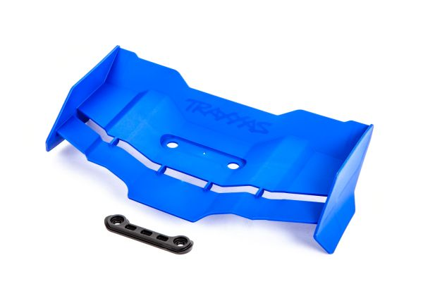
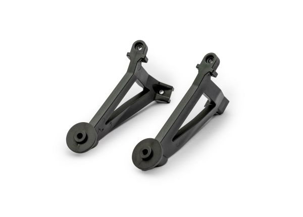
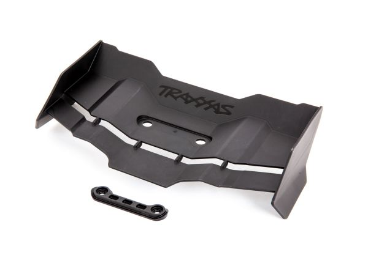
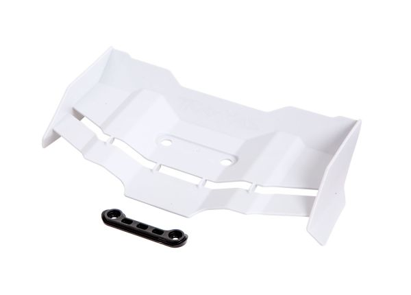
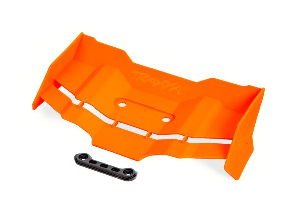
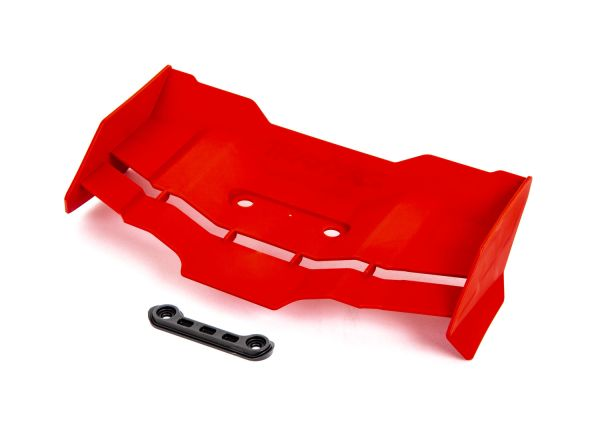
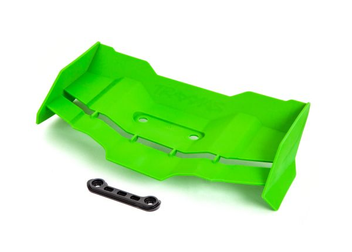

# Aero (Wing, Mount + Body) Selection — Jato 4EP

> **Running: the Traxxas 9060-BLUE body with the 9517X blue rear wing on 9046 wing mounts.** The wing and mounts are **two of the three parts that turn a Slash 4x4 into a Jato**, along with the [rear tower](shock_tower_analysis.md).
>
> **The body is not the colour that was ordered.** [LEDGER](../../LEDGER.md) #90 is a **green** Jato 4x4 body at **$36.00** (2026-08-22), but **Jenny's RC shipped the 9060-BLUE instead**. It was kept, so the receipt and the part are the same purchase. **The mistake went in their favour**, since the blue lists around **$43**.
>
> **Full comparison of bodies, wings and mounts:** [Jato 4SS aero analysis](../Jato4SS/aero_analysis.md).

&nbsp;&nbsp; <em>What's fitted: <strong>9060-BLUE</strong> body · <strong>9517X</strong> blue rear wing · <strong>9046</strong> Jato 4x4 wing mounts</em>

---

## What's fitted

| Item | Part | Price |
|---|---|---|
| **Body** | **Traxxas 9060-BLUE**, pre-painted polycarbonate, the red and blue scheme | **$36.00 paid**, lists ~$43 |
| **Wing** | **Traxxas 9517X**, blue rear wing **with hardware** | **$16.00 paid**, full price at Tammies Hobbies |
| **Wing mounts** | **Traxxas 9046**, Jato 4x4 wing mounts, left and right | **$7.00 paid**, full price at Tammies Hobbies |

> **Two shops, and that is the whole price difference.** Mike bought **the wing and the mounts together from Tammies Hobbies, both at full price**, so **$16.00 + $7.00 = $23.00** for the aero. The **body came from Jenny's RC**, where a **$43** blue arrived against a **$36** green order, which was a shipping mistake rather than a discount.
>
> ⚠️ **The same two parts cost $13.79 at Jenny's RC.** That is what the [4SS](../Jato4SS/aero_analysis.md) paid for the **9517 wing and 9046 mount as one combo**, against **$23.00** here. Like for like, **Jenny's was $9.21 cheaper on the pair**, about **40% off what Tammies charged**, which is worth knowing before reordering.

---

## Wing colours

All six are the same wing at **$16.00 list**, and every one **ships with hardware**. Mike runs the **9517X blue**.

&nbsp;&nbsp;&nbsp;&nbsp;&nbsp; <em><strong>9517X blue, fitted</strong> · 9517 black · 9517A white · 9517T orange · 9517R red · 9517G green</em>

| Part | Colour | Price |
|---|---|---|
| ⭐ **9517X** | **Blue**, fitted here | $16.00 |
| **9517** | Black | $16.00 |
| **9517A** | White | $16.00 |
| **9517T** | Orange | $16.00 |
| **9517R** | Red | $16.00 |
| **9517G** | Green | $16.00 |

> ⚠️ **Plain `9517` is the black one, not a generic part number.** Ordering "9517" gets you black, so the colour suffix matters. The 4SS doc also files a 9517 image as a **Sledge** wing, which is the same number described a different way.

---

## Body colours

The **9060 series is pre-painted and ready to mount**, no trimming. Mike's is the blue.

&nbsp;&nbsp;&nbsp; <em><strong>9060-BLUE, fitted</strong> · 9060-GRN · 9060-ORNG · 9060-PINK</em>

**The other OEM route is the 9018 series**, same shell in a different graphics scheme, plus **9018X / 9060X ProGraphix** if you want to spray your own colour. Those are compared in the [4SS body table](../Jato4SS/aero_analysis.md#body-comparison).

---

## Notes

- **This is the stock Jato aero, and that is the point.** The wing and mounts are part of what makes the car a Jato rather than a Slash, so there was nothing to choose: the conversion needs them.
- **The mounts bolt straight to the Jato rear tower.** Running a separate wing on a *Slash* tower instead needs the Meelobee plate technique, which the [4SS doc](../Jato4SS/aero_analysis.md) documents. Not relevant here, since this car runs the [Jato 9034 rear tower](shock_tower_analysis.md).
- **The clipless body issue does not apply here.** The 4SS warns its CF chassis cannot use the clipless latch the 9018 / 9060 bodies rely on. This car keeps the **stock plastic tub**, so the OEM body mounts as intended.
- **The wing ships with its hardware**, so the list price is the whole job apart from the mounts.
- **Both aero parts came from Tammies at full price**, $16.00 for the wing and $7.00 for the mounts, **$23.00 the pair**. The [4SS](../Jato4SS/aero_analysis.md) paid **$13.79 for that same pair as a Jenny's RC combo**, so buying the combo would have **saved $9.21**.
