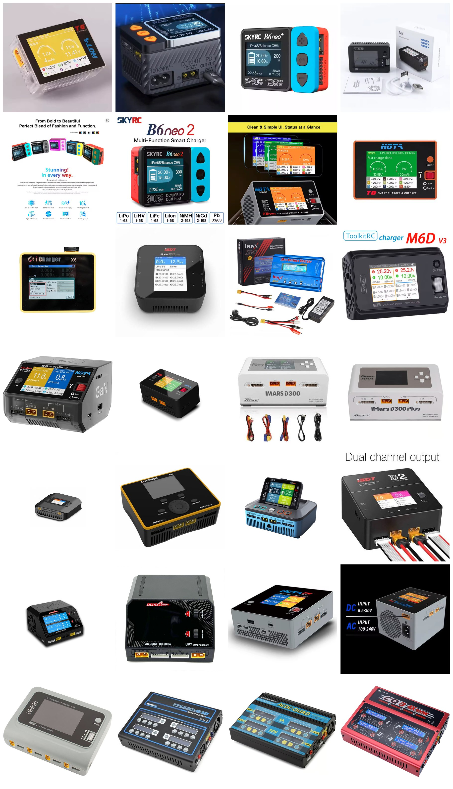

# Charger Selection — Jato 4EP

> **Using a HOTA T6.** It is what the [pack IR checks](battery_analysis.md) were measured on, and what reads the CNHL packs as LiHV.
>
> **Full comparison, plus power supplies and the series-charging method:** [Jato 4SS charger analysis](../Jato4SS/charger_analysis.md).

 <em>The <strong>HOTA T6</strong>, what this car charges on and what the per-cell IR figures were read from</em>

| Item | Spec |
|---|---|
| **Charger** | **HOTA T6** |
| **Used for** | Charging, and the per-cell IR checks in [`battery_analysis.md`](battery_analysis.md) |
| **Must handle** | **LiHV**, since the packs here charge to 4.35V a cell |

 <em>The field the T6 came out of: all <strong>28 chargers</strong> weighed up in the <a href="../Jato4SS/charger_analysis.md">4SS charger analysis</a>, roughly in table order with the picks up front</em>

🚧 **Price, purchase date and the power supply behind it are not recorded.**
