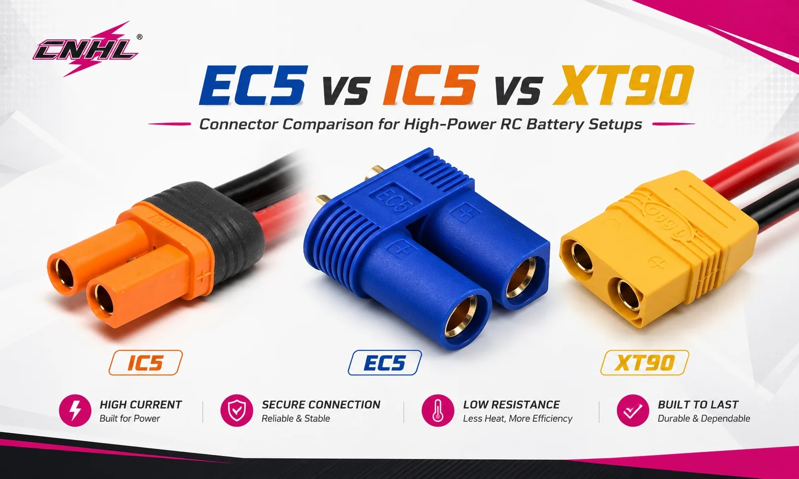

# Connectors Reference — Jato 4EP

> **EC5 is the main connection.** The [4SS](../Jato4SS/connector_reference.md) runs **5mm bullets** instead, so the two cars do not share a plug and moving a pack between them needs an adapter. Neither is the better choice, an EC5 is a pair of 5mm bullets in a housing. Three connector types are on this car in total, which is one more than ideal. A list of what is fitted.
>
> **The standing rules on which connectors are worth running:** [Jato 4SS connectors reference](../Jato4SS/connector_reference.md).

 <em>CNHL's own comparison graphic. <strong>EC5 is the one this car runs</strong>, shown in the middle. IC5 and XT90 are here because the graphic includes them, and neither is on the car</em>

| Where | Connector | Note |
|:---|:---|:---|
| **CNHL packs** | **EC5**, 10AWG | The three CNHL packs all use it |
| **Gens Ace 6300** | **5.0mm bullet** | The odd one out, needs adapting to match the rest |
| **ESC to motor** | **4.0mm Castle bullets** | Factory fitted on the [combo](esc_motor_analysis.md), nothing to choose |
| **ESC to battery** | **EC5**, the main connection | Matches the CNHL packs, so most of the fleet plugs straight in. Castle ship the Mamba X bare and recommend **70A+**, and EC5 is good for roughly **120A** |

