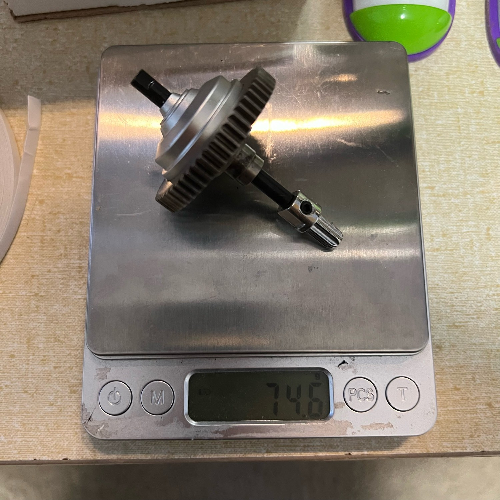
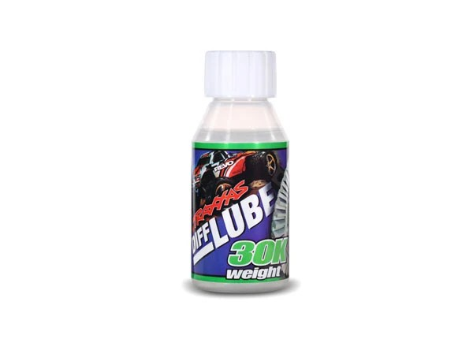
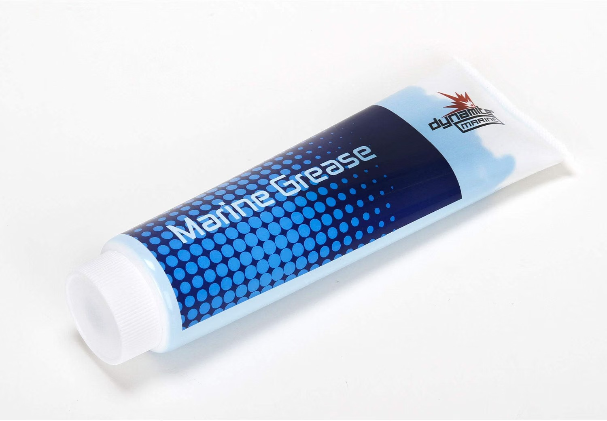
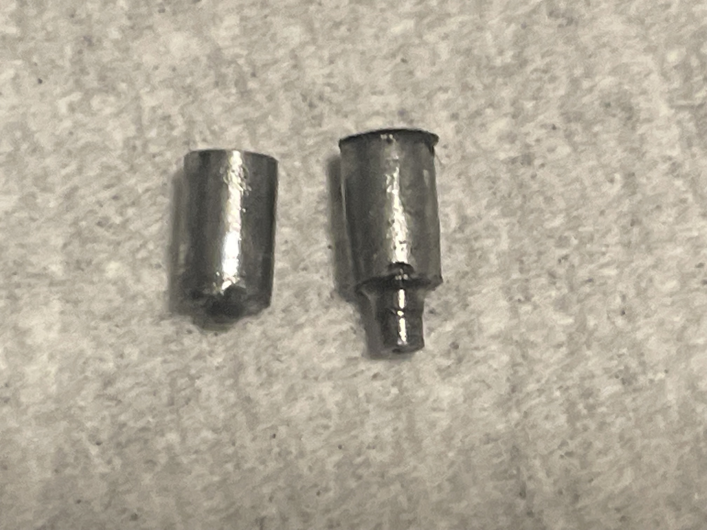

# Differential Selection — Jato 4EP

> **Running: a metal centre diff, 30k front oil, and both the centre and rear greased instead of oiled.** The front oil weight was tuned on this car first and the [Jato 4SS](../Jato4SS/differential_analysis.md) inherited it, so this is the origin rather than the copy. **The centre is where the two cars part company**: this one gets its near-locked feel from a light coat of **Dynamite DYNE4201 blue marine grease** (same can as the rear), while the 4SS runs literal **100k Traxxas TRA5130 oil** instead, since it's a different diff.
>
> ⚙️ **The spider-pin fix came from this car.** Mike **broke the metal centre diff first and modded his own fix**: the stock pin is **stepped down** and shears at the step, so he replaced it with a **plain full-length 2.8mm × 7mm pin**. It is written up in the 4SS teardown, but it originated here.
>
> **Full comparison, including the centre diff teardown:** [Jato 4SS differential analysis](../Jato4SS/differential_analysis.md#center-diff-teardown).

&nbsp;&nbsp; <em>Everything that goes in: the <strong>metal centre diff</strong> · <strong>30k TRA5136</strong> in the front · <strong>Dynamite DYNE4201 grease</strong> in both the centre and rear</em>

| Position | Spec | Price |
|---|---|---|
| **Centre diff** | **Metal**, Traxxas 6780-style, alloy housing with an **integrated steel 54T spur** | **$18.80** |
| **Front oil** | **30k**, Traxxas TRA5136 | $7.50 / bottle |
| **Centre** | ⚙️ **Dynamite DYNE4201 blue marine grease**, no oil | shares the rear's can |
| **Rear** | **Dynamite DYNE4201 blue marine grease**, no oil | **$12.00 / can** |

---

## The centre diff

**Metal, Traxxas 6780-style, $18.80 from AliExpress.** **The housing is aluminium and the 54T spur is steel**, integrated into the diff. **There is no separate spur gear on this car**, so a worn spur means replacing the diff unit. It is the same unit the [4SS teardown](../Jato4SS/differential_analysis.md#center-diff-teardown) pulls apart, and **this is the car that broke one first**.

&nbsp; <em>The metal centre diff · <strong>the failure and the fix</strong>, the sheared stock pin beside the plain full-length replacement</em>

⚙️ **The stock pin is stepped down, and it shears at the step.** Mike replaced it with a **plain 2.8mm × 7mm pin, full length, no step**, and that is now what both cars run. **7mm is the right length**, where the stock **6.85mm** sits just slightly short.

**The alloy housing holds up well here.** The bearings either side carry the load, so the metal lasts well and holds fluid better than expected. The parts that actually fail are the pin, and the rear output shaft, which [needs shaving](../Jato4SS/differential_analysis.md#center-diff-teardown) to fit.

---

## The centre and rear run grease, not oil

 <em><strong>Dynamite Marine Grease DYNE4201</strong>, 5 oz. Lithium complex with anti-sling additive, <strong>$12.00</strong>, in both the centre and rear here</em>

⚠️ **Grease and oil get filled completely differently, and carrying the oil habit over to grease is how a diff gets wrecked.**

| Fill | How much | Why |
|---|---|---|
| **Oil**, front only | **Half full, no more** | A brim-full plastic housing bursts once the oil heats and expands |
| **Grease**, centre + rear here | **A light coating, never packed** | Packing it solid binds the gears together, so the diff drags and heats instead of differentiating |

**Why grease works here.** It is a lithium complex with **anti-sling technology**, so it stays on the gear faces rather than being flung off, and it **resists water contamination**. A light film on the centre diff's gears gets close to the near-locked feel heavy oil would give, without actually running oil. On the rear, that same film gives steady drive off the corner instead of free rotation, and it won't weep past a tired seal.

---

## Notes

- **Lightly, not packed.** This is the one thing to get right. A thin film on the gear faces is the whole job, and more is actively worse.
- **The half-full rule only applies to the front now**, still oil filled at 30k. Centre and rear both run a light coat of grease instead.
- **Both cars run a greased rear now.** The [4SS](../Jato4SS/differential_analysis.md#front--rear-diff-oil) does the same thing, grease in place of oil, so the rears match. 🚧 **Which grease that car uses is not recorded**, only that it is greased, so do not assume it is this same DYNE4201. **The centres differ though**: this car gets its near-100k feel from grease, the 4SS runs literal 100k Traxxas TRA5130 oil.
- **It is sold as a boat product.** Marine grease for prop and flex shafts, which is exactly why it shrugs off water and does not sling off the gears.
