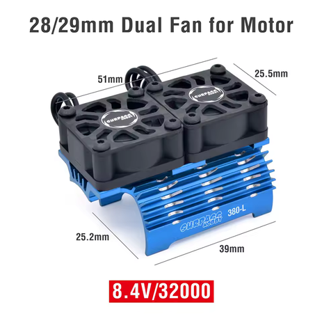

# ESC, Motor & Gearing — Jato 4EP

> **Running: the Castle Mamba X SCT + 1412-3200KV 5mm combo, part 010-0155-13**, bought **2025-03-19 for $198.71**. **ESC and motor are one part**, which is why they share a doc: the sensor harness, the bullets and the KV are all factory paired, so there was never anything to match up.
>
> ⚠️ **The ESC is 2S to 6S, but this combo is 4S maximum**, because the bundled **1412-3200KV motor is rated 2-4S**. Castle's own wording: *"4s maximum with included 1412-3200kv motor"*, and 4S only **"with very conservative gearing and keep a close eye on temperatures."** **This car runs 4S**, so it sits at the ceiling, and the **11T pinion is that conservative gearing**. **4S is also the right cell count for this car**, see [Why 4S](battery_analysis.md#why-4s).
>
> ⚙️ **The gearing finding came from this car**, and it overturned the assumption the build started with. See [The gearing finding](#the-gearing-finding).
>
> **The full comparisons are not repeated here.** The ESC options live in the [FastAzJato4x4 ESC analysis](../FastAzJato4x4/esc_analysis.md#esc-comparison), and the motor theory in its [motor analysis](../FastAzJato4x4/motor_analysis.md#castle-creations-1412-3200kv--in-hand).

 <em>Mamba X SCT ESC and 1412-3200KV 5mm sensored motor, sold as one part, combo <strong>010-0155-13</strong></em>

---

## What's running

| Item | Spec |
|---|---|
| **Part** | **010-0155-13**, Mamba X SCT + 1412-3200KV 5mm combo |
| **ESC** | Castle **Mamba X**, 2S-6S (25.2V), sensored / sensorless / SmartSense |
| **Motor** | Castle **1412-3200KV**, 5mm shaft, 4-pole 12-slot sensored |
| **Pinion** | **11T 32P** (was 12T, see [The gearing finding](#the-gearing-finding)) |
| **Spur** | **54T** |
| **Cells run** | **4S**, the combo's ceiling |
| **Cutoff** | **3.5V per cell**, see [`battery_analysis.md`](battery_analysis.md) |
| **Cooling** | N/A 🚧 not recorded |

---

## The gearing finding

**The original intuition was wrong.** Going in, the assumption was that **higher RPM equals better air control**, so chasing the smallest pinion was the obvious move.

**What actually happened: torque matters as much as RPM.** Gearing for the **power-band sweet spot** (12T here, not the tiniest pinion available) made mid-air corrections feel just as responsive as the high-RPM theory promised, **and** kept the motor cooler because it is neither lugging nor screaming.

| Observation | Result |
|---|---|
| **Motor temperature** | **Noticeably cooler** than the previous taller gearing |
| **Power band** | **Lands where it is useful**, more usable thrust across the whole throttle rather than only at the top |
| **Sound** | Higher than ever before, the motor is getting into its happy RPM range |
| **Overall feel** | Car feels lighter and faster, less effort everywhere, sharper throttle response |

> **The write-up above was recorded at 12T, and the car has since moved to 11T.** The finding stands as reached; the gearing simply came down one tooth after it.

> **Why this matters beyond this car.** It is the empirical data point that **pinion sizing is not purely a top-speed equation**. Gearing for the power-band sweet spot beat gearing for theoretical max RPM, on the same motor. The FastAz cites this when picking its own pinion. Tooth options in the [FastAz pinion reference](../FastAzJato4x4/motor_analysis.md#pinion-reference-32p).

---

## Specs worth having to hand

> *Spec format: Cells · Current (A) · BEC · Sensored · Waterproof · Weight · Price*

| Part | Spec | Pros / Cons | Photo / Link |
|:---|:---|:---|:---|
| ⭐ **Castle Mamba X SCT + 1412-3200KV combo (010-0155-13)** — *running* | **Cells:** ESC **2S-6S (25.2V)**, but **4S max with this motor** **Current (A):** not published by Castle; community reports **100+ A peaks** **BEC:** **8A peak, adjustable** 5.5 / 6.0 / 7.5 / 8.0V, default 5.5V **Sensored:** yes, **SmartSense**, plus sensorless and sensored-only modes **Waterproof:** yes, CNC aluminum case potted in epoxy. ⚠️ **the 30mm fan is not waterproof and must come off for wet running** **Weight:** **101g** ESC with wires, **265.4g** motor **Price:** **$198.71** paid (list $360.90, currently $221.21 at 26% off) | Pro: **One part, factory matched**, so no sensor adapter and no KV guesswork. **ROAR and RECON G6 certified**, data logging, aux-wire on-the-fly adjustment, transmitter programming for cutoff and drag brake. Rugged potted case that also sheds heat  Con: ⚠️ **4S is the ceiling and this car runs 4S**, so gearing and temperatures matter. **Castle publishes no continuous amp rating.** Castle Link USB or B-LINK is a separate purchase to program it |  |

**ESC dimensions:** 54.4 × 35.2 × 30.0mm, **4.0mm female bullets** to the motor. Battery connector is not included; Castle recommend a 70A+ connector, and this car runs **EC5**, see [`connector_reference.md`](connector_reference.md).

**Motor:** 62.5mm long × 36mm diameter, **75,000 max RPM**, 21mm × 5mm shaft, **M3 at 25mm** mounting, 4mm male bullets.

---

## Motor bearing service

**Bearings replaced ~2026-09-06, first run on them 2026-09-12.** The car has run **4 battery packs** on them since.

**Running the S605ZZ 5×14×5 ABEC-9** rather than the stock Castle bearings. **The stock ones work, they just burn up quickly**, and these last longer in the same motor. Full spec, price and the sourcing caveat in [`bearings_reference.md`](bearings_reference.md#the-motor-bearing-s605zz).

🚧 **How many packs a set lasts is still unknown.** The count is logged in [`maintenance/README.md`](../../maintenance/README.md) and keeps climbing until a set wears out, which is what turns this into a real replacement interval instead of a guess.

---

## Motor cooling

**Running: the Surpass Hobby 36mm dual-fan heatsink in blue, with the plastic fans it ships with swapped out for two 30mm metal ones.** The 1412 runs hot on 4S, which is the whole reason the cooling is on there.

⚠️ **This is a divergence from the [FastAzJato4x4](../FastAzJato4x4/motor_analysis.md#related-motor-cooling-optional)**, which looked at this exact part and passed on it. That car's motor shortlist runs cool enough on 4S to need no cooling at all, so the 63g was not worth paying. This car already has the 1412, so the fan is the cheaper answer than a new motor.

&nbsp; <em>The Surpass range, where <strong>the 36mm dual is the one fitted here</strong>, in blue · the CNC metal fans that replace the plastic pair, <strong>30mm</strong> for this heatsink</em>

| Item | Spec |
|:---|:---|
| **Heatsink** | **Surpass Hobby 36mm dual-fan**, blue, T6 aluminium frame with a graphite fan cover |
| **Fans** | **2 × 30mm metal**, bought separately, replacing the plastic pair in the box |
| **Suits** | 36mm can 540 / 550 motors, which is what the **Castle 1412** is |
| **Footprint** | 60.2 × 47 × 34.3mm |
| **Fan max RPM** | 28,000 at 8.4V |
| **Cable** | 263mm extension, included |
| **Weight** | **~63 g** all in, 37g of heatsink and cable plus 26.3g of metal fans |
| **Price** | **$12.00 / pair** of fans at $6.00 each, AliExpress. 🚧 what Mike paid for the heatsink is not recorded |

> ⚠️ **Order the 36mm, not the 28/29mm.** The small one is built for 380/390 motors and will not clamp a 36mm can. Surpass stamp the sizes on the fin block, **540** for the 36mm and **380** for the 28/29mm, which is the quickest way to tell them apart in a listing photo. The blue below is the **28/29mm** dual, so it is the right colour and the wrong size.
>
> **Metal fans cost about the same as plastic and last longer.** That is the whole argument for them. **Every fan dies eventually**, so they are a wear part, not a fix.

 <em>The <strong>28/29mm</strong> dual in blue, stamped <strong>380-L</strong>. Same colour as the fitted part, one size down, so do not order this one for a 1412</em>

---

## Price History

| Date | Price | Discount Path | Notes |
|:---|:---|:---|:---|
| 2025-03-19 | **$198.71** ✅ **purchased** | Educational discount (EDUDISC) | Combo **010-0155-13**. $12.78 shipping, **$211.49** the order. Castle order STD0000000137021, invoice STDINV000165036. Paid by Mike directly |
| 🚧 date not recorded | **$94.00** | Non-warranty RMA | Replacement 1412 3200KV motor ([LEDGER](../../LEDGER.md) #83). Replaced the combo's motor rather than adding one, so it is not counted in the [BOM](BOM.md#electronics) |
| current listing | $221.21 | 26% off | List $360.90. For reference only, not paid |

**The motor has no separate receipt.** It arrived in the combo, so the purchase and the RMA replacement above cover both halves.

---

## Notes

- ⚠️ **The 4S limit is the thing to remember.** The Mamba X on its own is a 6S controller, which is how the [FastAz doc](../FastAzJato4x4/esc_analysis.md#esc-comparison) lists it, but **the bundled 1412 caps the combo at 4S**. Both statements are correct and cover different scopes.
- **This is the origin of the pinion reasoning on both cars.** Mike's Jato came first, so the power-band conclusion was reached here and the FastAz inherited it.
- **Castle rate the combo to 6.5 lb vehicle weight.** 🚧 **This car has never been weighed**, so whether it is inside that is unknown. Worth knowing given it also runs at the 4S ceiling.
- **Remove the cooling fan before running wet.** The ESC is potted and waterproof, the fan is not.
- **Programming needs extra hardware.** Six common settings, cutoff voltage included, can be set from the transmitter, but full access needs the Castle Link USB kit or the B-LINK Bluetooth adapter, both sold separately.
- **The combo was bought outright.** The alternatives, and why the FastAz went a different way on both the ESC and the motor, are in [that car's ESC analysis](../FastAzJato4x4/esc_analysis.md) and [motor analysis](../FastAzJato4x4/motor_analysis.md).
- **🚧 No temperatures were logged.** "Noticeably cooler" is subjective. A logged temp before and after would turn the best finding on this car into a hard number.
