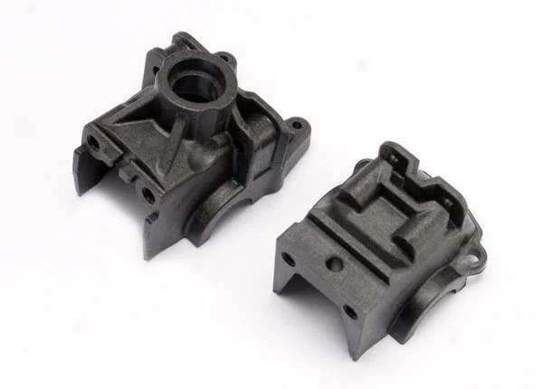
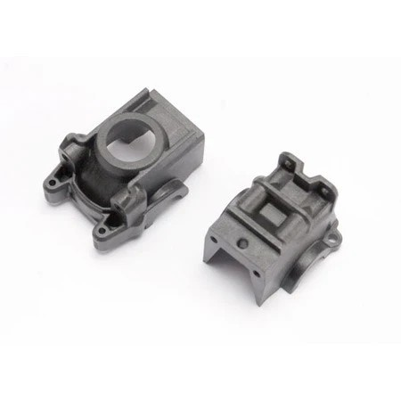
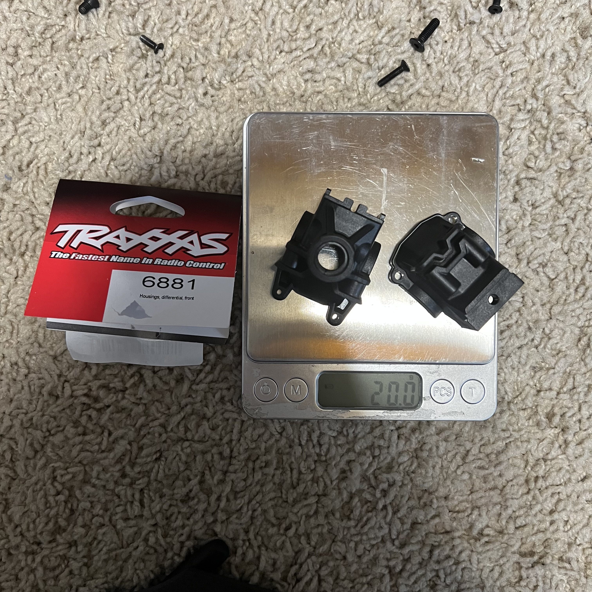
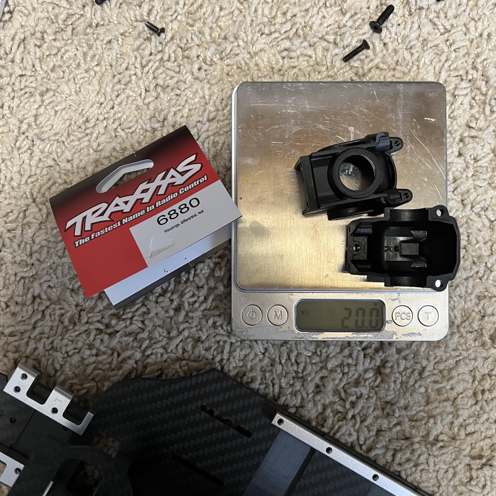

# Gearbox Housing Selection — Jato 4EP

> **Running: the stock Traxxas plastic housings, front and rear.** Nothing was changed here, which is the same conclusion the [Jato 4SS](../Jato4SS/gearbox_housing_analysis.md) reached.
>
> **Full comparison, including why aluminium is not worth it:** [Jato 4SS gearbox housing analysis](../Jato4SS/gearbox_housing_analysis.md#why-aluminum-isnt-worth-it-on-this-build).

&nbsp; <em>What is fitted, both stock and both glass filled nylon: <strong>TRA6881</strong> front · <strong>TRA6880</strong> rear</em>

| Item | Spec |
|---|---|
| **Front** | **Traxxas TRA6881**, glass-filled nylon, two halves, **20.0g** |
| **Rear** | **Traxxas TRA6880**, glass-filled nylon, two halves, **20.0g** |
| **Price** | **$4.00 / set** |
| **Holds** | The [metal centre diff](differential_analysis.md) and the stock front and rear diffs |

&nbsp; <em>On the scale, <strong>20.0g each</strong>. Front and rear weigh the same, which is why the aluminium upgrade buys nothing here</em>

