# Hub Selection — Jato 4EP

> **Running: stock plastic EHD C-hubs with MonsterKingz 7075 alloy steering blocks up front, stock plastic EHD carriers at the rear.** The front is a deliberate split, alloy where the knuckle needs it and cheap plastic for the C-hub, because the alloy C-hub that was here **broke**. The **Lighthouse alloy front** is retired, but **it did not fail on its own merits**, so it is written up below rather than dismissed. Next job is **shaving the MonsterKingz rear carrier down** for the slim Raptor R look at a fraction of Raptor R money.
>
> This car runs **EHD geometry**, same as the [Jato 4SS](../Jato4SS/hub_analysis.md), but solves the hub-bearing problem the opposite way: a **bare 10×18×5 with the 17mm hexes shaved**, not a sleeve. See [`bearings_reference.md`](bearings_reference.md).

&nbsp;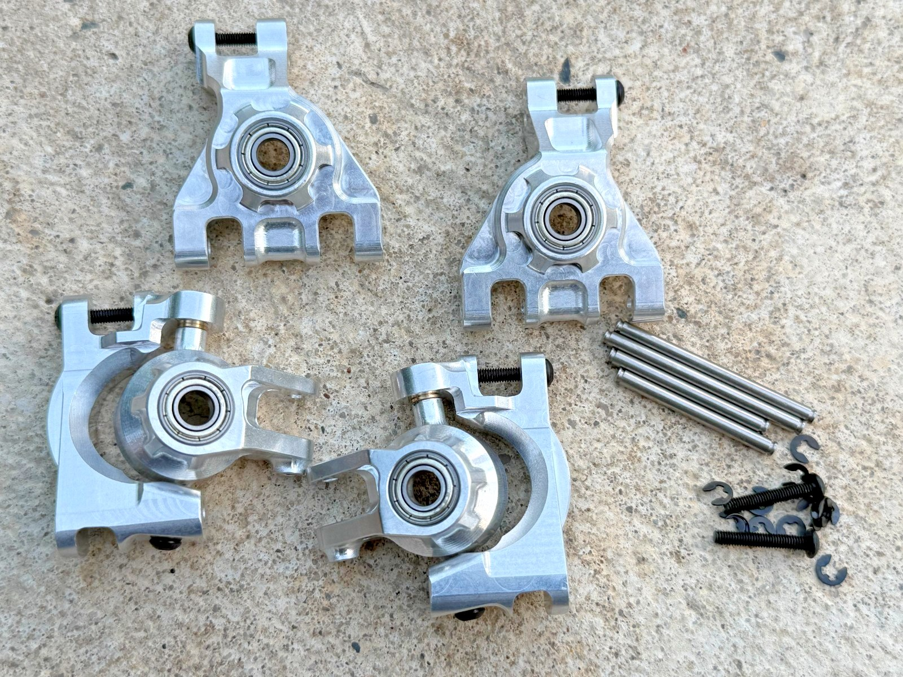 <em>What actually runs: <strong>stock plastic EHD</strong>, the C-hub up front and the rear carriers (shown as the full set, both ends) · <strong>MonsterKingz 7075 alloy</strong>, whose steering blocks run up front and whose rear carrier is the one to shave</em>

---

## Table of Contents

- [Key Requirements](#key-requirements) — what the front has to survive
- [Comparison](#comparison) — what runs, what is planned, what broke
- [Weighed-in photos](#weighed-in-photos) — the Lighthouse measurements
- [Price History](#price-history)
- [Notes](#notes)

---

## Key Requirements

| Requirement | Type | Why |
|---|---|---|
| **Metal front steering block** | Must | The front knuckle takes the hits and plastic gives up there first |
| **EHD geometry** | Must | The car is EHD throughout, and the three carrier generations do not interchange |
| **Takes the 10×18×5 hub bearing** | Must | This car runs the bare big bearing, so the pocket has to accept it (see [`bearings_reference.md`](bearings_reference.md)) |
| **Rear can stay plastic** | May | The rear sees almost no load, so alloy back there is mostly wasted weight |
| **Cheap** | May | This is the budget car of the pair. A part that costs more than it saves is the wrong part |

---

## Comparison

> *Spec format: Type · Material · Bearing sizes · Hex · Fits · Pivot/Hardware · Brand · Colors · Toe · Warranty · Includes · Weight · Price*

| Part | Spec | Pros / Cons | Photo / Link |
|:---|:---|:---|:---|
| ⭐ **Front steering block, MonsterKingz / G-Maxx 7075 alloy** — *running up front* | **Type:** Front steering block (knuckle), from the 4-piece EHD set **Material:** 7075 aluminum **Bearing sizes:** EHD, 12×18×4 inner / 6×12×4 outer (this car runs **10×18×5** in the hub instead) **Hex:** N/A **Fits:** EHD geometry **Pivot/Hardware:** brass bushings included **Brand:** G-Maxx (eBay seller MonsterKingz) **Colors:** black / red / green / blue / silver / purple **Toe:** N/A **Warranty:** N/A **Includes:** bearings + brass bushings **Weight:** N/A 🚧 not weighed on this car **Price:** **$50.00** bought off the [Jato 4SS](../Jato4SS/hub_analysis.md) (2026-09-07) | Pro: **Alloy where it matters**, and it came with brass bushings, which outlast a shoulder screw and sacrifice themselves instead of the knuckle. **Widens the track 1-2mm per side**, which suits this car since it is already set up wide and is not chasing ROAR legality  Con: **Too fat and heavy**, which is exactly why the 4SS demoted it. The **rear pocket is so oversized it locks you into the original E-Revo axles**, so it removes axle options later |  |
| ⭐ **Front C-hub, stock plastic EHD (TRA9032)** — *running up front* | **Type:** Front caster block (C-hub) **Material:** glass-filled nylon (EHD) **Bearing sizes:** N/A (C-hub carries no bearing) **Hex:** N/A **Fits:** EHD geometry, native **Pivot/Hardware:** TRA3642X shoulder screw **Brand:** Traxxas **Colors:** grey **Toe:** N/A **Warranty:** N/A **Includes:** N/A **Weight:** N/A **Price:** N/A (already on the car) | Pro: **Free, it was already here**, and it is the sacrificial half of the front. Pairing plastic C-hub with an alloy knuckle puts the metal where the knuckle needs it without paying for a full alloy front  Con: Plastic in a high-stress position, so expect to break some. It is the fallback because **the alloy C-hub that was here broke**, not because plastic is preferred | 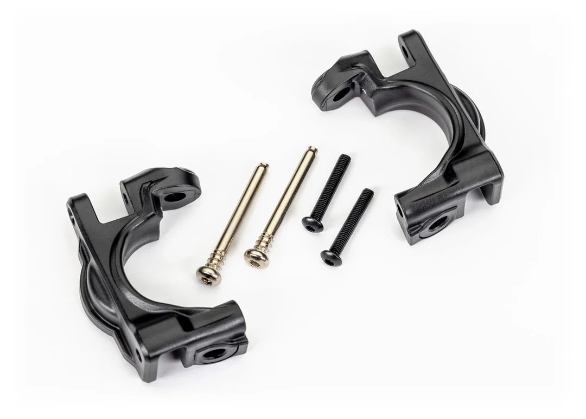 <em>TRA9032 front caster blocks, the pair, with hinge pins and screws</em> |
| ⭐ **Rear carriers, stock plastic EHD (TRA9050)** — *running at the rear* | **Type:** Rear stub axle carriers **Material:** glass-filled nylon (EHD) **Bearing sizes:** EHD, 12×18×4 / 6×12×4 (this car runs **10×18×5** in the hub) **Hex:** N/A **Fits:** EHD geometry, native **Pivot/Hardware:** **3×41mm hinge pins (2) + 3×20mm screws (2)**, included **Brand:** Traxxas **Colors:** **black 9050 · gray 9050-GRAY · orange 9050T · green 9050G · red 9050R · blue 9050X**, all the same price **Toe:** none built in **Warranty:** N/A **Includes:** L + R carriers + hinge pins + screws **Weight:** N/A 🚧 not weighed **Price:** **$6.00 / pair** (came on the donor, so nothing was spent here) | Pro: **The rear barely sees load**, so plastic is genuinely the right call here, not a compromise. Lightest option and already fitted  Con: No camber-link tuning holes and no built-in toe. Does not have the slim alloy look the front now has. ⚠️ **Traxxas state these fit the 9080-series upgrade kit only and do not fit standard suspension parts**, so they are not a general Slash/Jato spare | 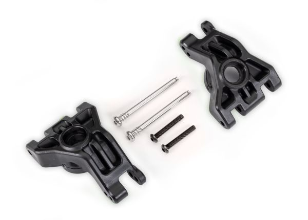&nbsp;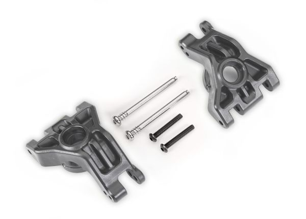&nbsp;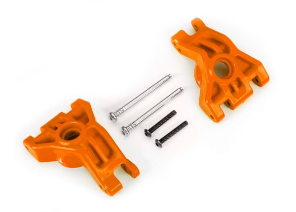&nbsp;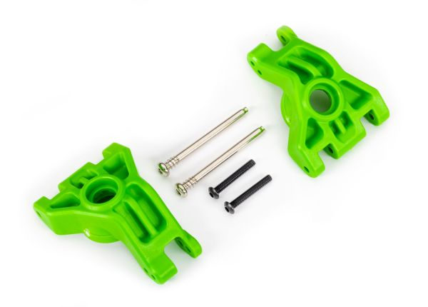&nbsp;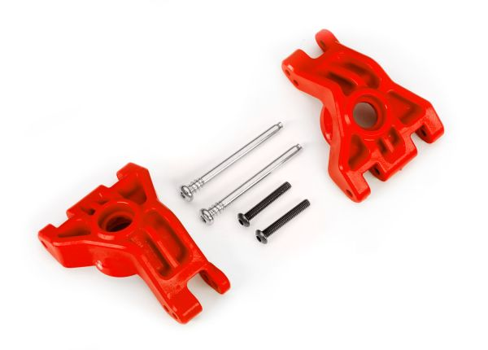&nbsp;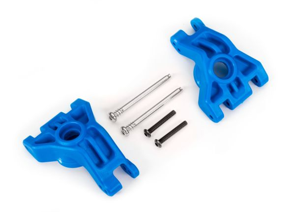 <em>black 9050 · gray · orange 9050T · green 9050G · red 9050R · blue 9050X</em> |
| 🔵 **Rear carrier, MonsterKingz alloy, shaved** — *planned* | **Type:** Rear stub axle carrier from the same 4-piece set **Material:** 7075 aluminum **Bearing sizes:** EHD, 12×18×4 / 6×12×4 **Hex:** N/A **Fits:** EHD geometry **Pivot/Hardware:** brass bushings included **Brand:** G-Maxx (MonsterKingz) **Colors:** as the set **Toe:** N/A **Warranty:** N/A **Includes:** in the set already bought **Weight:** N/A 🚧 weigh before and after shaving **Price:** $0, already in the set | Pro: **Already owned, so the Raptor R look costs only time.** EHD rears are over-built with the axle supported both sides, so there is real material to remove without weakening anything that matters  Con: **Permanent**, and the set is the heavy one to begin with. Worth weighing before and after, since the point is the slim look and the weight saving, and neither is proven yet |  |
| ❌ ~~**Front C-hub + steering block, Lighthouse alloy**~~ — *broke, retired* | **Type:** Front C-hub + steering block, EHD style, front only **Material:** aluminum, grey/black **Bearing sizes:** EHD, 6×12×4 + 12×18×4 **Hex:** N/A **Fits:** listed for Traxxas Jato 1/8 4x4 BL-2S **Pivot/Hardware:** brass bushings included **Brand:** Lighthouse **Colors:** black **Toe:** N/A **Warranty:** free returns within 90 days **Includes:** EHD bearings + brass bushings **Weight:** **C-hubs 25.5 g bare / 36.4 g with hardware · knuckles 22.4 g bare / 34.9 g with hardware**, so **47.9 g for a bare front set** (measured, see [below](#weighed-in-photos)) **Price:** **$29.71** the pair of items, **$24.67 paid** | Pro: **Buys exactly the front and nothing else**, which is the cheapest way into an alloy front at about $25. Came with brass bushings. **The only hub set on either car with real measured weights**  Con: **It broke.** ⚠️ **But not on its own merits:** the hinge pocket at the bottom had been **filed out for more droop**, which removes material exactly where the C-hub carries load. **Too much droop turned out to be bad anyway**, so the modification cost the part and gained nothing. Unmodified it is **untested, not disproven** | 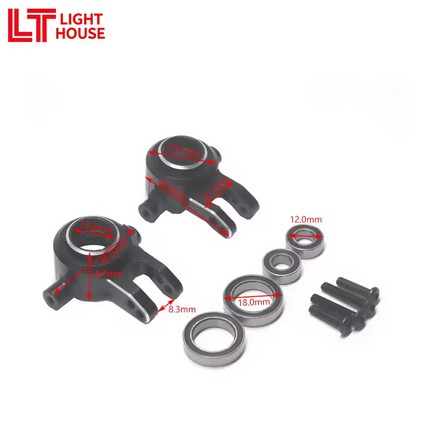&nbsp; <em>steering block · C-hub (with brass bushings)</em> |

---

## Weighed-in photos

The Lighthouse front set is the only alloy front on either car with measured weights, which is why they are kept here after the part was retired. **47.9 g for a bare front set**, or **71.3 g** once the hardware kits are counted.

&nbsp;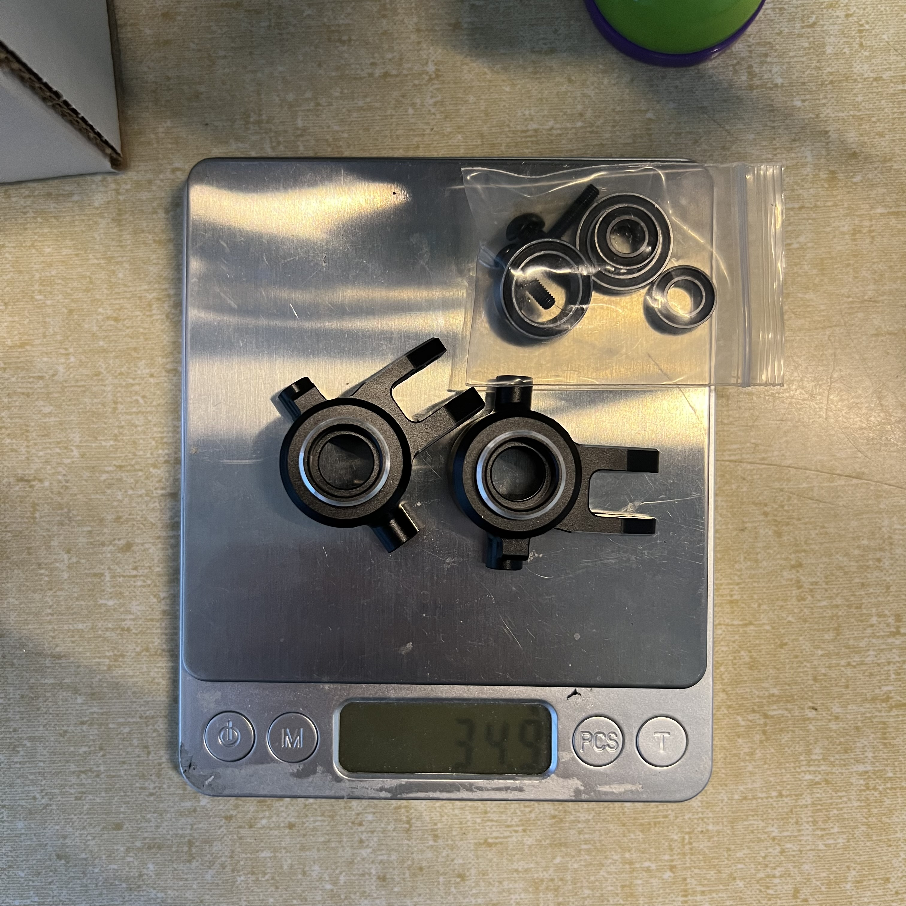 <em>Knuckles bare: 22.4 g · knuckles + hardware kit: 34.9 g</em>

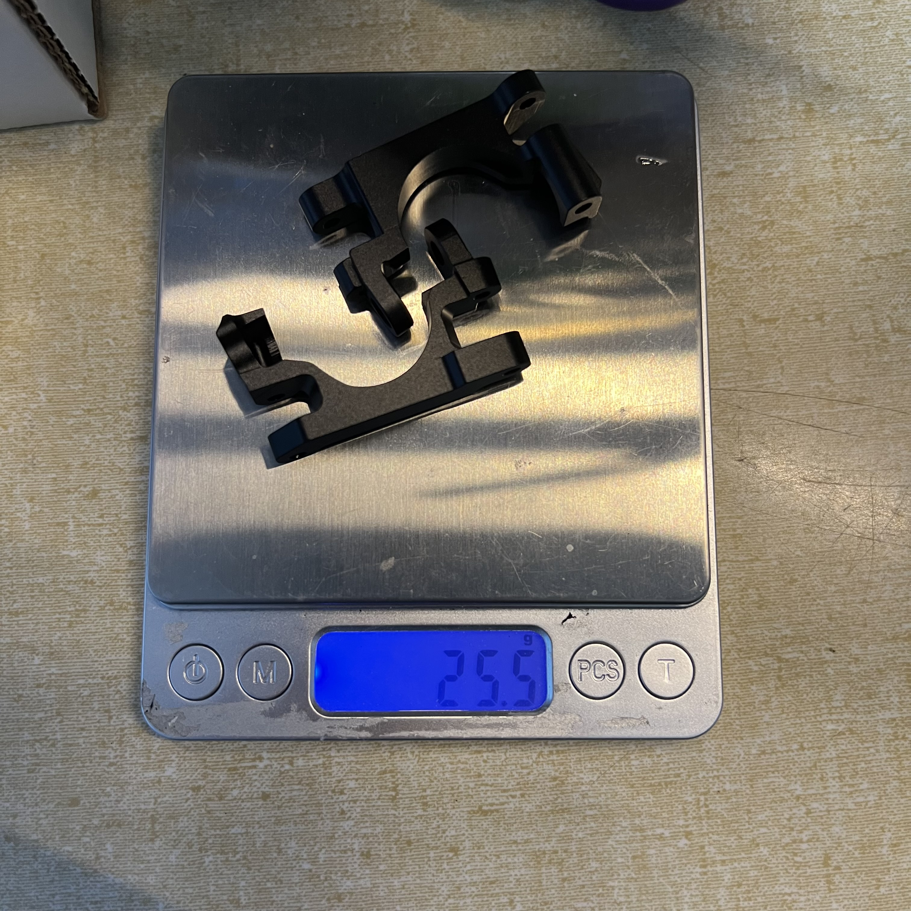&nbsp; <em>C-hubs bare: 25.5 g · C-hubs + hardware kit: 36.4 g</em>

> For context, the 4SS measured its **Integy C26402PURPLE C-hubs at 27.7 g the pair**, only **2.2 g** over these. **Weight is not what separates front alloy hubs**, so pick on price, fit and what survives.

## Price History

| Date | Price | Discount Path | Notes |
|:---|:---|:---|:---|
| 2026-09-07 | **$50.00** ✅ **purchased** | Internal sale | MonsterKingz / G-Maxx 7075 alloy hub set (front + rear), bought off the [Jato 4SS](../Jato4SS/hub_analysis.md) where it cost $46.80. See [`LEDGER.md`](../../LEDGER.md) |
| 2026-05-19 | **$24.67** ✅ purchased | $5.04 off a $29.71 subtotal | Lighthouse alloy front C-hub ($15.29) + front knuckle ($14.42), one order **#8210896333264866**, AliExpress LIGHT HOUSE 188527 Store. Free returns within 90 days. **Since broken** |

---

## Notes

- **Why the front is half plastic.** The alloy C-hub broke, so the front runs an **alloy knuckle on a plastic C-hub**. That puts the metal where the knuckle needs it, with the C-hub left sacrificial and cheap to replace.
- **The Lighthouse failure is a modification lesson, not a part review.** Filing the hinge pocket for droop removed material exactly where the C-hub is loaded, and **too much droop was bad anyway**. Both lessons cost one hub. Do not read it as "Lighthouse is weak".
- **Track width is already wide here.** The MonsterKingz set adds **1-2mm per side** on a car that also runs the [wide-rim tire trick](README.md#wheels--tires). This car is outside ROAR width and does not care, which is the opposite of the 4SS.
- **The rear shave is the next job, and it should be weighed.** The whole point is the slim Raptor R look for none of the money, but until the carrier is weighed before and after, the weight claim is unproven.
- **This car and the 4SS diverge at the hub bearing, not the hub.** Both are EHD. This one opens the hub up to a bare **10×18×5** and shaves the hexes; the 4SS sleeves the pocket down to a **10×15×4**. Full comparison of all four routes in [`bearings_reference.md`](bearings_reference.md).
