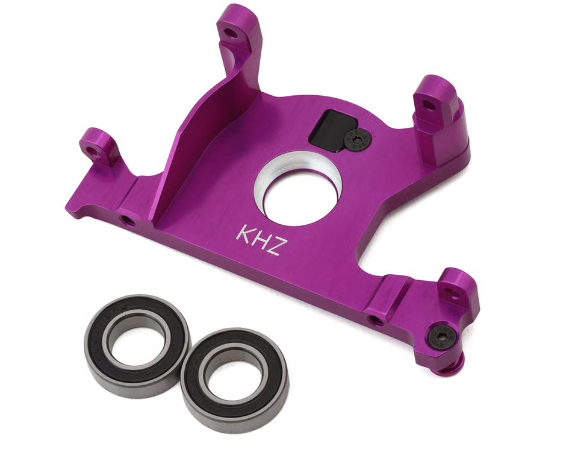

# Motor Mount Selection — Jato 4EP

> **Chosen: King Headz Aluminum Motor Mount w/Bearing (HDZ-TRX-7460-PUR), for Traxxas Slash 4x4 LCG/Rally.** Direct bolt-in for the stock plastic TRA7460 this car already runs, no other part changes needed. The real upgrade is the bearing: **10×19×5** instead of the stock **10×15×4**, a straight step up in size. 🚧 Not yet bought, price and order ID TBD.

 <em>King Headz HDZ-TRX-7460-PUR, 7075 aluminum, with its two 10×19×5 bearings. Pictured in purple, also sold in black, blue and silver</em>

---

## Key Requirements

| Requirement | Type | Why |
|---|---|---|
| **Bolts to the Slash 4x4 LCG / Rally pattern** | Must | This car's [chassis](chassis_analysis.md) is a Traxxas 7422 LCG tub off a Slash 4x4 donor, so the mount has to match that pattern, not the HCG one |
| **Works with a centre diff, not a slipper-only design** | Must | This car runs a [metal centre diff](differential_analysis.md#the-centre-diff), no slipper clutch, so a slipper-only mount would be the wrong part |
| **Bigger bearing than the stock 10×15×4** | May | Bearing size is the real difference between this and the stock mount, bigger means more load margin, not a fix for a failure that's actually happened |
| **Keeps the motor on its stock mounting pattern** | Must | The [Castle 1412](esc_motor_analysis.md#specs-worth-having-to-hand) bolts up at M3×25mm; a mount that moved that would force a new spur/pinion mesh too |

---

> *Spec format: Type · Material · Bearing · Fits · Includes · Weight · Price*

## Comparison

| Motor Mount | Spec | Pros / Cons | Photo / Link |
|---|---|---|---|
| ⭐ **King Headz Aluminum Motor Mount w/Bearing** — *HDZ-TRX-7460-PUR, not yet bought* | **Type:** direct-fit motor mount, bolts to the diff/slipper housing like the stock part **Material:** 7075 aircraft billet aluminum, anodized (pictured purple; also black / blue / silver) **Bearing:** **10×19×5** (upgraded) **Fits:** Traxxas Slash 4x4 LCG / Rally, same as this car's [Jato 4x4 LCG chassis](chassis_analysis.md) **Includes:** 1× mount + 2× 10×19×5 bearings **Weight:** **27.09g** **Price:** 🚧 **TBD** (archived listing $41.99, discontinued in purple; still sold in black / blue / silver) | Pro: **Direct replacement for the stock TRA7460**, no other part changes needed. **Bigger 10×19×5 bearing** than the stock 10×15×4, and aluminum won't crack the way plastic can. Built to work with **either the slipper or the centre diff**, so it doesn't care which this car runs  Con: **The exact listing is discontinued**, so whatever gets bought will be a different color than the purple pictured. Weight is the listing's own number, not independently checked |  |
| 🟢 **Traxxas TRA7460, stock plastic** — *running now* | **Type:** direct-fit motor mount, bolts to the diff/slipper housing **Material:** composite plastic **Bearing:** **10×15×4** (stock) **Fits:** Slash 4x4 / Jato 4x4 LCG & Rally **Includes:** mount + bearing, as fitted **Weight:** 🚧 N/A, not weighed **Price:** 🚧 N/A, came with the [Slash 4x4 donor](README.md#car-overview) | Pro: **Already on the car and working**, with no documented failure of this specific part. Free, it came with the donor  Con: **Smaller 10×15×4 bearing**, and plastic where the alloy option is metal. No upgrade path if it does crack, since it's the last stock part in this corner of the drivetrain |  🚧 save as `src/drivetrain_traxxas_motor_mount_tra7460.jpg` |

---

## Notes

- **This car started as a running Slash 4x4** on an LCG chassis (see [chassis_analysis.md](chassis_analysis.md)), so anything sold "for Slash 4x4 LCG/Rally" bolts straight on, the same reasoning that already applies to the chassis tub and the centre brace.
- **No stated failure of the current plastic mount.** This is a pre-emptive bearing upgrade, not a fix for a known problem, unlike the [motor bearing story](esc_motor_analysis.md#motor-bearing-service) where actual neglect cost a motor.
- **Once bought:** log the price and order ID in a Price History section here, flip the stock row's status, and add it to [`BOM.md`](BOM.md) per the purchased-part workflow.
