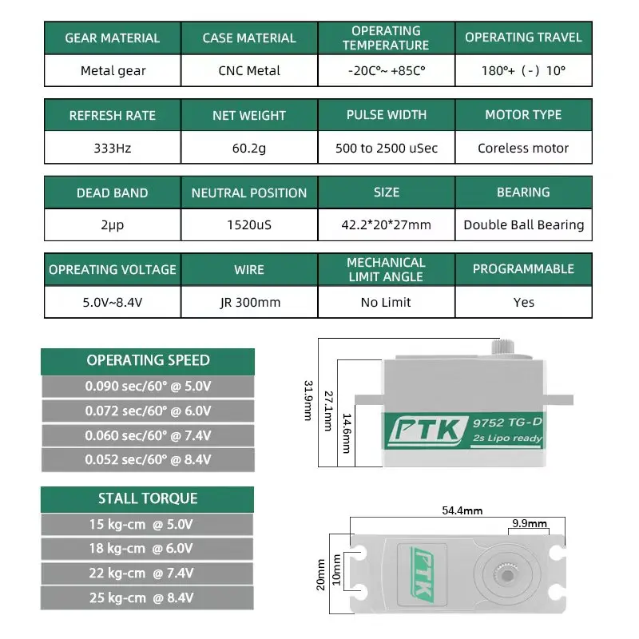
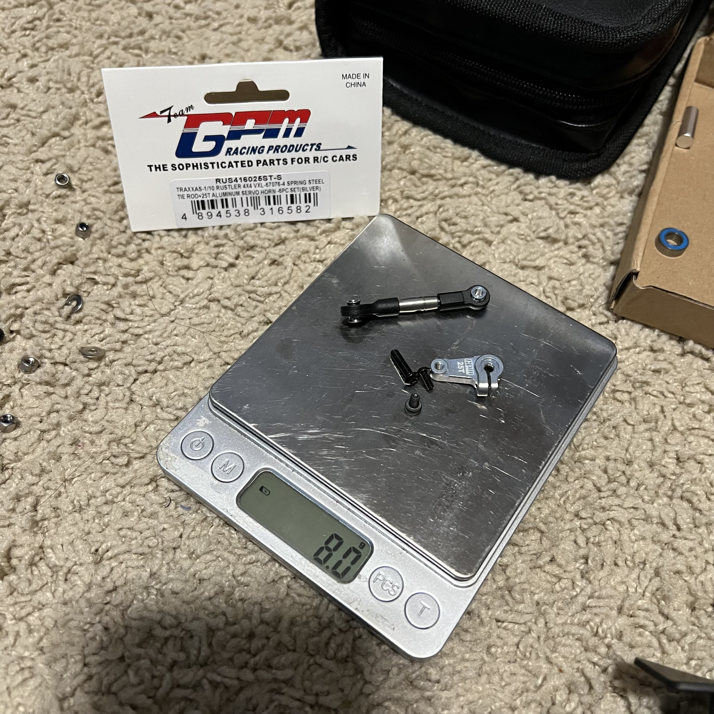

# Servo Selection — Jato 4EP

> **Running: the PTK 9752TG-D**, about **$19.65** as part of a bulk 8-pack. Same servo the [Jato 4SS](../Jato4SS/servo_analysis.md) runs. It replaced a **JX CLS6322HV (EcoBoost branding)** that **started losing its centre**.
>
>
> **The numbers that matter on this car.** It runs **2S**, so read the 7.4V column: **22 kg·cm at 0.060 sec/60°**. Digital coreless with **metal gears**, a **CNC metal case** and **double ball bearings**, **42.2 × 20 × 27mm** low profile, **60.2g** measured. **333 Hz** refresh, **500 to 2500 µs** pulse, **2 µs** dead band, **180°** travel, and it is **programmable**. Full range is **15 kg·cm at 5.0V** up to **25 kg·cm at 8.4V**, on **5.0V to 8.4V**.
>
> **The reason it is here is value.** The cross-brand work in [`servos/README.md`](../../servos/README.md) found this **$19.65** servo matches the **$129.99 ProTek 160TBL** on torque and speed at 7.4V. 🚧 **Stall current is not published**, which is the figure that would tell you whether it browns out a BEC.
>
> **Full comparison and the cross-brand table:** [Jato 4SS servo analysis](../Jato4SS/servo_analysis.md#servo-comparison).

&nbsp;&nbsp; <em>What's fitted: the <strong>PTK 9752TG-D</strong>, its dimensions and spec sheet · the <strong>GPM servo horn</strong> it drives</em>

| Item | Spec |
|---|---|
| **Servo** | **PTK 9752TG-D**, digital coreless metal gear, low profile, 2S LiPo ready |
| **Horn** | **GPM servo horn** |
| **Servo tie rod** | **Spring steel**, same as the 4SS |
| **Price** | **~$19.65**, bulk 8-pack rate |
| **Replaced** | **JX CLS6322HV**, EcoBoost branding, retired for centring drift |
| **Bell crank** | GPM aluminum, see [`steering_bell_crank_analysis.md`](steering_bell_crank_analysis.md) |
| **Servo saver** | None. The alloy bell crank effectively welds the OEM saver into a fixed coupling anyway |

## Why it was swapped

**The JX did not break, it drifted.** Its failure mode is **electrical, not mechanical**: the pot and centring circuit wander, so the servo **quivers at centre under no load** and cannot settle at neutral. On this car it reached the point of **having a hard time centring**, which is what triggered the switch.

**The gears never stripped.** That is the awkward part of this failure: a stripped gear lets you limp home, while a drifting centre leaves the car undrivable with everything apparently intact.

 <em>The retired <strong>JX CLS6322HV</strong>, EcoBoost branding. It came off for centring drift with its gears still perfectly good</em>

> **This car is where that failure was observed.** The JX centring write-up in the [4SS servo doc](../Jato4SS/servo_analysis.md#notes) is describing what happened here, not on that car.

🚧 **Purchase date is not recorded**, and the ledger's PTK entries (a 9110 MG-D at $42.84 and a "big servo" at $27.00) are **different servos**, not this one.
