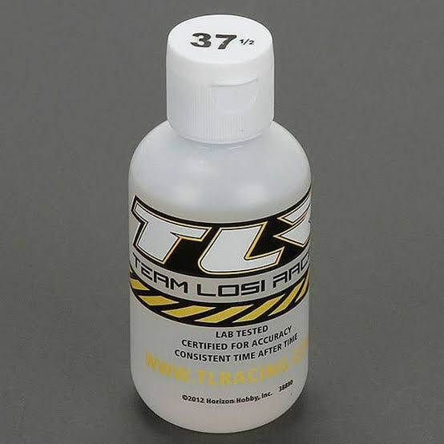
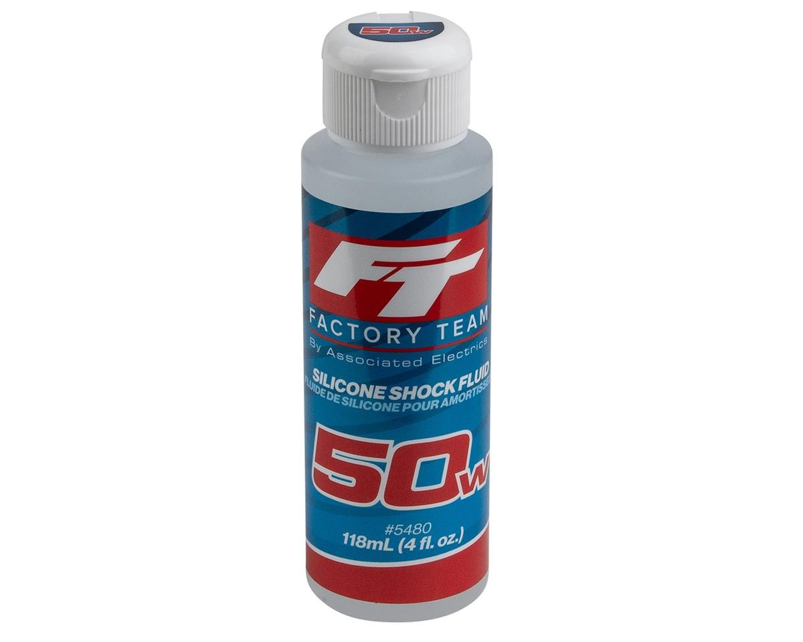

# Shock Selection — Jato 4EP

> **Running: HPI Apache C1 big bores, 16mm bore, 97mm.** Same shock the [Jato 4SS](../Jato4SS/shock_analysis.md) runs **internally**, but that car uses the **metal Hot Bodies D8** bodies while this one is on the **plastic C1**. Shaft, piston interface, internal volume and external dimensions are identical, so **every part interchanges** and only the body material differs.
>
> **Same springs and the same oil as the 4SS.** The one real difference is the piston.
>
> **Full comparison, spring charts and the plastic vs metal argument:** [Jato 4SS shock analysis](../Jato4SS/shock_analysis.md#plastic-vs-metal-body-trade-off).

&nbsp;&nbsp; <em>What's fitted: <strong>HPI Apache C1</strong> 16mm big bores · <strong>Losi TLR74030 37.5wt</strong> in the front · <strong>Associated 5480 FT 50wt</strong> in the rear</em>

| Position | Oil | Spring | Piston |
|---|---|---|---|
| **Front** | **37.5wt**, Losi TLR74030 (468 cSt) | White 59gf (HB #67454, 76mm), stock C1 / D8 spec | ⚙️ **6 hole × 1.4, with two holes opened to 1.5** |
| **Rear** | **50wt**, Associated 5480 FT (650 cSt) | Grey 52gf, **HB67453**, 76mm, stock C1 / D8 spec | 6 hole × 1.2 |

> ⚙️ **The drilled piston is this car's own tweak.** Four holes stay at **1.4mm**, two are opened to **1.5mm**, so the front piston flows slightly more than a stock 1.4 without going to a full 1.5. 🚧 Which end it was tuned against, and why two rather than three, is not recorded.

---

## If the rear packs

**Packing is the shock failing to recover between hits.** Through a rough section the rear rides progressively lower, because the oil cannot get back through the piston fast enough before the next hit lands, so the car squats and gives up drive. The cure is to let oil move faster, either through bigger piston holes or thinner oil, and **thinner oil is the easier one to try**.

| Rear oil | cSt | When |
|---|---|---|
| **50wt**, Associated 5480 FT | **640** | ✅ **Running now** |
| **47.5wt**, Associated FT | **613** | 🔧 **Go here if it packs**, one step down, roughly 4% thinner |

⚠️ **Stay in Associated for this step.** **TLR does not make a 47.5wt at all**, and the two brands split badly at this end of the range: Associated 50wt is **640 cSt** against TLR 50wt at **710 cSt**, nearly a full step apart. If only TLR is on the shelf, **TLR 45wt (610 cSt) is the near equivalent** of Associated 47.5wt (613 cSt). Full chart in the [shock oil supertable](../ERevo_1.0/shock_analysis.md#shock-oil-supertable--wt--cst-across-brands-up-to-5000-cst).

> **Why this car and not the other.** The rear piston here is **6 hole × 1.2mm**, where the [4SS](../Jato4SS/shock_analysis.md#setup-spec-springs--pistons--oil) runs **6 × 1.4mm**. Smaller holes restrict flow more, which is exactly what makes a shock pack, so **the same 50wt oil is doing a harder job in this car's rear** than in that one's.

🚧 The Associated 47.5wt part number is not recorded.

---

| Item | Spec |
|---|---|
| **Shocks** | **HPI Apache C1**, part **107365**, 16mm bore, 97mm shaft, plastic body |
| **Price** | **$48.70**, two sets at **$24.35 / set of 2** |
| **Spares** | Bodies, seals and caps interchange with the Hot Bodies D8, see the [4SS spares table](../Jato4SS/shock_analysis.md#replacement-parts-shock-bodies) |

## Price History

| Date | Price | Discount Path | Notes |
|:---|:---|:---|:---|
| 2025-06-02 | **$97.41** ✅ **purchased** | Listed price | **4 sets** of HPI **107365**, eBay **whiterosehobbies**, order **19-13141-49737**, delivered 2025-06-07. **Two sets are this car** ($48.70), the other two went on the [E-Revo 1.0](../ERevo_1.0/shock_analysis.md). Return window closed 2025-07-07 |
| 2026-05-19 | **$23.49** ✅ **purchased** | Listed price | **2 packs** of Hot Bodies **67453** grey 52gf 76mm (Vorza D8S), order **14-14653-12511**, delivered 2026-05-22. **One pack is this car's rear** ($11.75), the second is a spare. 🚧 a photo of these exists but is not filed yet |

---

**Rear tower matters here:** the shocks mount at the **back** of the car, not mid-chassis, because this car runs the Jato 4x4 rear tower. See [`shock_tower_analysis.md`](shock_tower_analysis.md).
