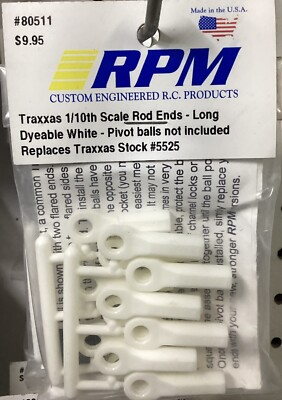
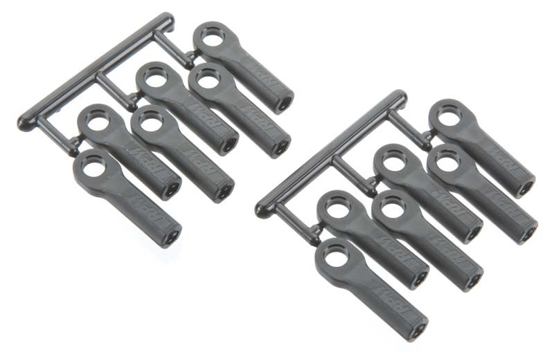
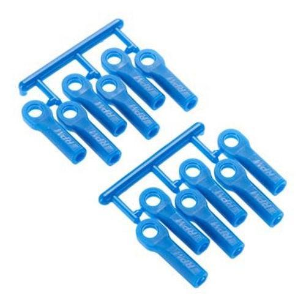

# Tie Rod & Camber Link Selection — Jato 4EP

> **Running: ACER Racing M4 × 60mm titanium turnbuckles**, **six of them at $5.99 each, $35.94 the set**. They are sold individually, not in pairs, and the 4SS runs the same six.
>
> **Full comparison:** [Jato 4SS tie rod analysis](../Jato4SS/tie_rod_analysis.md).

&nbsp; <em>What the link is made of: <strong>ACER Racing M4 × 60mm titanium turnbuckle</strong> · <strong>RPM long rod ends in white (80511)</strong></em>

&nbsp;&nbsp; <em><strong>white 80511, fitted</strong> · black 80512 · blue 80515. The same part in three colours, so pick on looks</em>

| Item | Spec |
|---|---|
| **Turnbuckles** | **ACER Racing M4 × 60mm titanium**, ×6 |
| **Price** | **$5.99 each**, **$35.94** for all six (ACER order #581093) |
| **Rod ends** | **RPM long rod ends, white (80511).** Colour is cosmetic, the black **80512** and blue **80515** are the same part |

