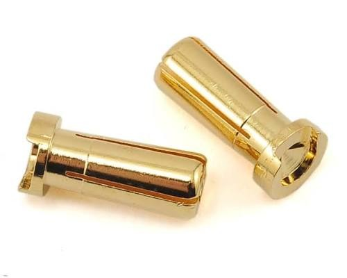
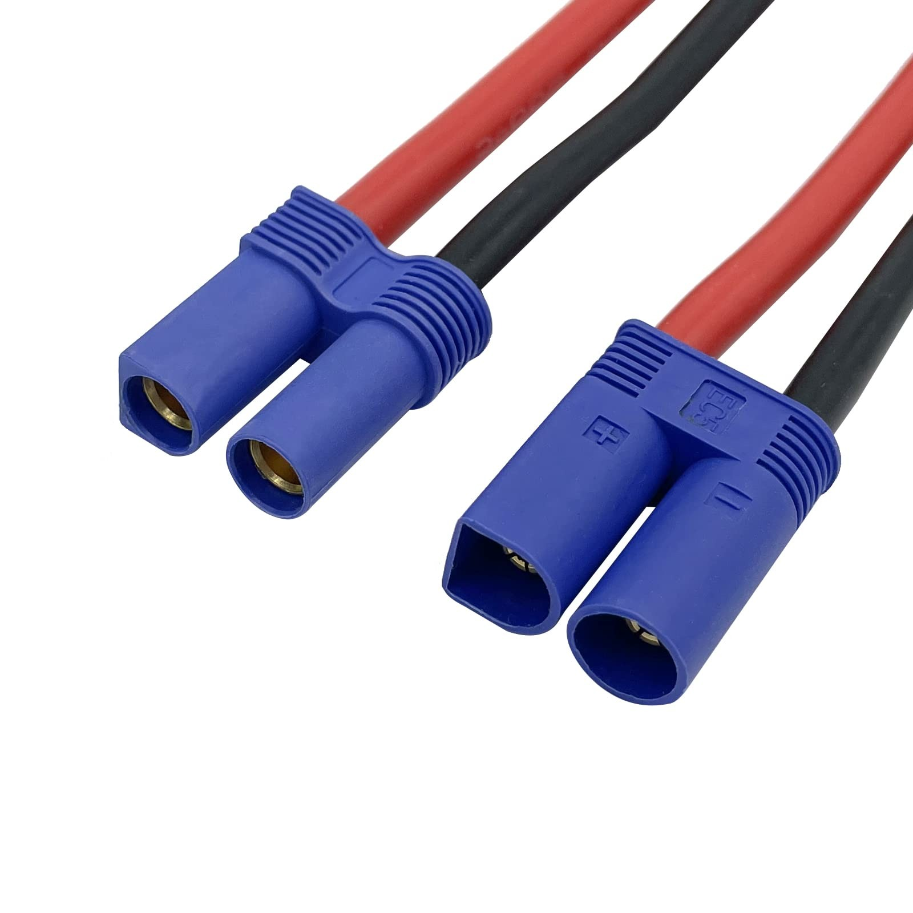
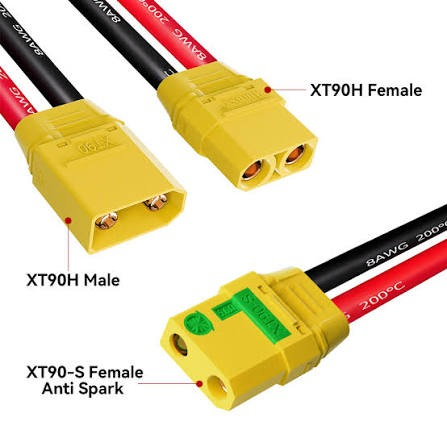
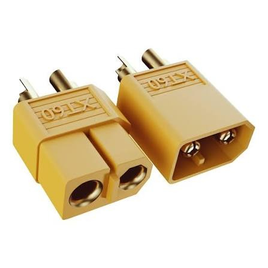
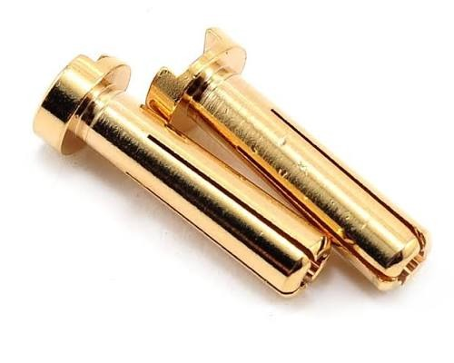
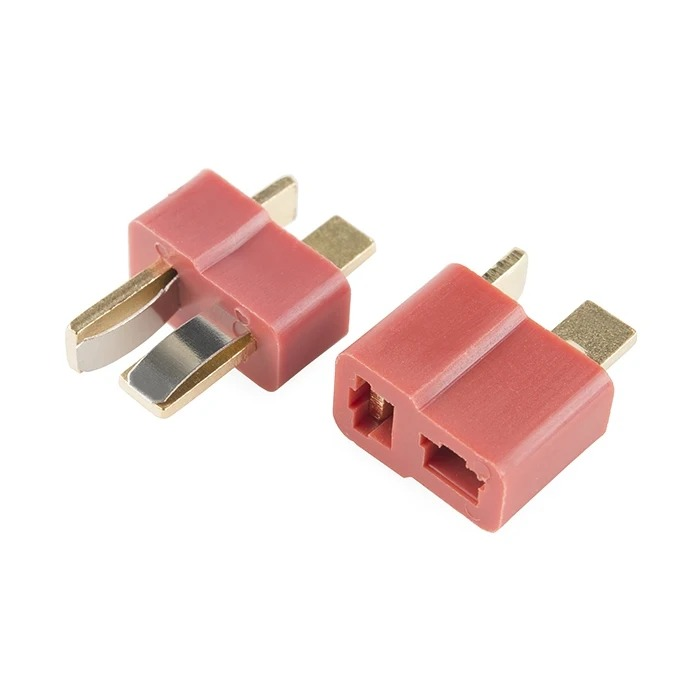
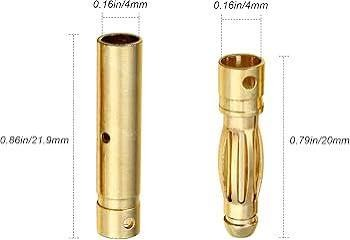

# Connectors Reference — Jato 4SS

Which battery/ESC connectors are worth running, and which to avoid. Not a tuning call, just a standing rule so the [mixed battery fleet](battery_analysis.md) all ends up on good plugs.

> **This car runs 5mm bullets.** The [HobbyWing EZRun MAX10 G2](esc_analysis.md) came stock with **XT60** on it, which is a perfectly good plug, so the change was a preference rather than a fix.
>
> **The good options are 5mm bullets, EC5, XT60 and XT90, and picking between them is preference, not performance.** Any of the four carries what a 4S car pulls, so run whatever your gear already wears. **Avoid Deans (T-plug) and Tamiya.** Nothing else is worth bothering with.

---

| Connector | Rating (RC use) | Verdict | Notes | Photo |
|---|---|---|---|---|
| **5mm bullets** | high current | ⭐ **running** | What this car is on. Bare pins, so insulate/heatshrink them yourself. **Less common** than EC5/XT, which is the only real cost |  |
| **EC5** | high (~120A), 5mm-bullet based | 🟢 good | A 5mm bullet inside a self-insulating housing, so it is the same contact with the shell done for you. What [Mike's Jato](../Jato4EP/connector_reference.md) runs |  |
| **XT90** | high (~90A+) | 🟢 good | Big, plenty for the 140A ESC. **XT90-S** anti-spark version kills the plug-in spark on 4S |  |
| **XT60** | ~60A+ (plenty for a car) | 🟢 good | **What the HobbyWing MAX10 G2 shipped with.** Compact, handles the bursty car current; anti-spark XT60E exists |  |
| **3mm bullets** | high current | 🔵 fine (smaller) | Same idea as the 5mm, less contact area. Fine, but there is no reason to go down a size here |  |
| **4mm bullets** | high current | 🔵 fine (smaller) | **What Castle fit ESC to motor** on [Mike's 4EP](../Jato4EP/connector_reference.md). Solid walled with slits, which is the construction that lasts |  |
| ~~**Deans (T-plug)**~~ | — | ❌ **avoid** | **Burn up, corrode (black gunk), and melt.** Often go intermittent, doesn't conduct even when plugged in |  |
| ~~**Tamiya**~~ | — | ❌ **avoid** | High resistance, same failure mode as Deans, the worst of the lot |  |

---

## Notes

- **Preference, not performance.** Between the four good ones there is nothing in it on a 4S car. All of them carry more current than this build asks for, so pick by what your packs and ESC already wear and save yourself the soldering.
- **The 5mm bullet and EC5 are the same contact.** EC5 is a pair of 5mm bullets in a housing, which is why swapping between them is a housing change rather than a step up or down in capability.
- **The ESC did not need rewiring.** The MAX10 G2 came on XT60 and would have been fine left that way. Worth saying plainly, so nobody reads the bullets as a fix for a problem XT60 had.
- **Deans / Tamiya are out** for good reason, they overheat, corrode, and fail intermittently under the current a 4S car pulls.
- **Adapters:** the [battery fleet](battery_analysis.md) is a mix (Zeee EC5 + Deans, SMC HCL SC5, Gens Ace 5mm bullet), so keep a few adapters on hand, or re-terminate the good packs to match the car.
- 🚧 **Photos of the connectors are still to be filed.** Save them to `src/` as `electronics_<brand>_connector_<type>.jpg` and link them here.

---

## ⚠️ Avoid birdcage bullets

 <em>A <strong>4mm birdcage</strong> pair. Bore <strong>4mm</strong>, female <strong>21.9mm</strong> long, male <strong>20mm</strong></em>

**Never use the birdcage type. These melted.** That is firsthand, not a theory. The male pin is a ring of thin split fingers rather than a solid wall, so the cage spreads and loses contact pressure with heat and repeated plugging. Less contact means more resistance, more resistance means more heat, and the heat spreads the cage further. It runs away with itself until the plug melts.

**Tell them apart by the male pin.** A birdcage is an open cage of separate fingers. **The good bullets are solid walled with narrow slits cut into them**, which lets them flex a little without losing their shape. Compare the 4mm and 5mm rows above against the photo here.
