# Differential Selection — Jato 4SS

> **Chosen:**
> - **Front & rear diffs: AliExpress knock-off Slash 4x4 steel diffs (5mm), ~$15.26 for the pair.** Strong steel, come assembled with the I-bar brace, and 5mm matches the **Slash 4x4-pattern CVDs on Tekno M6 stubs** (see [`driveshaft_analysis.md`](driveshaft_analysis.md)). The stock Jato 4x4 diff is the native-fit fallback; the 6mm E-Revo 1.0 diffs (owned) are spares.
> - **Center diff: AliExpress metal center diff ($19.06, E-star RC Car Store), running Traxxas 100k oil (TRA5130, $8).** Fully assembled, its **integrated steel 54T spur is the build's spur** (no separate spur to fit), and it **ships with 16T / 17T / 18T (5mm-bore) pinions** to tune the final drive. The lighter TRA6814 plastic is the alternative.
> - **Spur gear: the integrated steel 54T spur on the AliExpress center diff.**

&nbsp;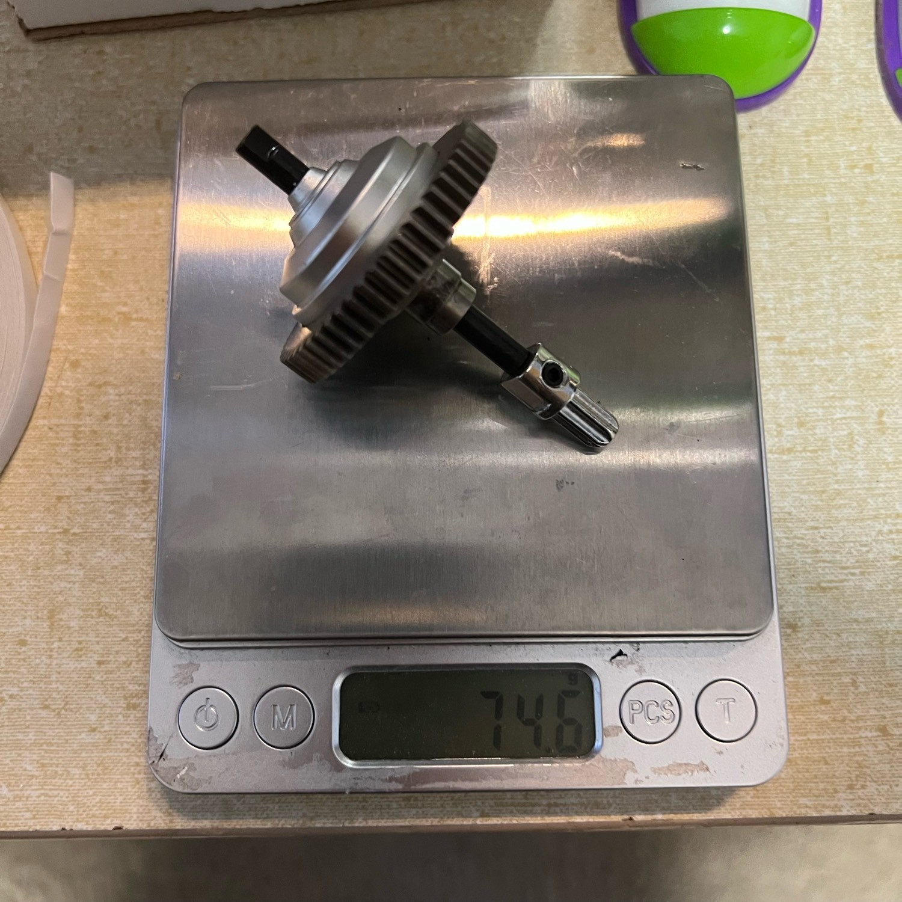 <em>The chosen drivetrain: AliExpress knock-off Slash 4x4 steel front/rear diff (5mm, I-bar) · AliExpress metal center diff (integrated steel 54T spur)</em>

---

## Table of Contents

- [Key Requirements](#key-requirements)
- [Front & Rear Diff Comparison](#front--rear-diff-comparison)
- [Alternative Upgrade Parts](#alternative-upgrade-parts)
- [Center Diff](#center-diff)
- [Center Diff Teardown](#center-diff-teardown) — inside the $19 winner: 3 spider gears, bearings both sides, and the one pin that breaks
- [Center Diff Oil](#center-diff-oil)
- [Front & Rear Diff Oil](#front--rear-diff-oil)
- [Spur Gear](#spur-gear)
- [Price History](#price-history)
- [Sources](#sources)

---

## Key Requirements

| Requirement | Type | Why |
|---|---|---|
| **5mm outdrives (stock Jato 4x4 / Slash 4x4)** | Must | Must match the **Slash 4x4-pattern CVDs / Tekno M6 stub axle build** we're actually running (see [`driveshaft_analysis.md`](driveshaft_analysis.md)), not the E-Revo 6mm cups |
| **Fits Jato 4x4 gearbox housing** | Must | Has to physically bolt up to the chassis mounts |
| **Sealed for oil** | Must | Tunable damping via diff oil viscosity |
| **Field-rebuildable** | May | Diff service is routine; being able to rebuild it myself beats throw-and-replace |
| **Reasonably available / cheap** | May | Diffs are wear items; replacements should be easy to source |

---

## Front & Rear Diff Comparison

> *Spec format: Outdrive · Housing · Internals · Part · Fits · Price*

| Diff | Spec | Pros / Cons | Photo / Link |
|---|---|---|---|
| ⭐ **AliExpress knock-off Slash 4x4 steel diff (RS RC Store)** — *chosen, front + rear* | **Outdrive:** **5mm** (Slash 4x4 pattern) **Housing:** Steel **Internals:** typically **comes built with the I-bar** spider-gear brace (not guaranteed every batch, but not a dealbreaker if absent) **Part:** N/A (generic; rebuild gear set 6882/5379, ~$7.68) **Fits:** Slash 4x4 VXL / Stampede / Rustler / Remo HQ727 (5mm) **Price:** **$15.26 / 2** (2-pack coupon; $9.22 for 1). ✅ purchased | Pro: **Strong steel, dirt cheap, 5mm matches the axle build, and it comes assembled with the I-bar.** Two (front + rear) for ~$15, cheaper than the stock Jato diff and stronger  Con: Generic AliExpress QC / availability (sale ends). No warranty. Confirm the I-bar is there on arrival |  |
| 🟢 **Traxxas E-Revo 1.0 diffs** — *in hand, now spares* | **Outdrive:** **6mm** **Housing:** Plastic **Internals:** I-bar spider gear braces stock **Part:** Assembled TRA5380; ring gear TRA5379X; carrier rebuild TRA3978; gear set rebuild TRA5382X **Fits:** Jato 4x4 gearbox (minor fitting) **Price:** **~$14.97 / diff** assembled (Jenny's RC, cheapest complete diff); already owned, $0 sunk | Pro: Cheap, easy to maintain, I-bar spider gear braces stock. **Plastic housing outlasts aluminum.** Front and rear are identical parts. GPM ER1200TS is the aftermarket ring-gear replacement  Con: **Wrong outdrive for the current axle plan**, the build moved to 5mm Slash 4x4-pattern CVDs, so these drop to spares/fallback unless the axle plan moves back to 6mm E-Revo CVDs. Heavier than stock Jato diffs; requires minor fitting to the Jato gearbox housing. **Must fill half full only**, overfilling plastic diff housings causes them to explode under pressure | 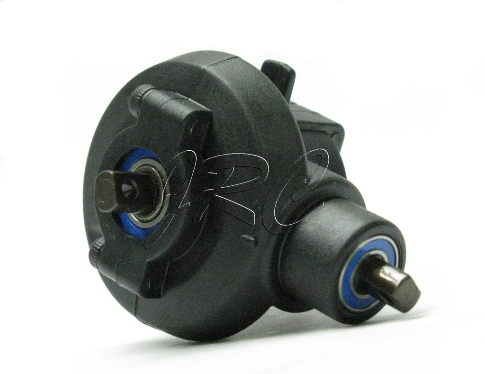 &nbsp;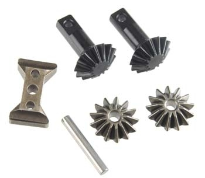 <em>assembled · TRA3978 carrier housing · TRA5382X gear set</em> |
| 🥈 **Traxxas Jato 4x4 stock diffs** — *native-fit fallback* | **Outdrive:** **5mm** **Housing:** Plastic **Internals:** TRA6882 gear set (same as XO-1); ring gear TRA6879 **Part:** assembled Jato 4x4 diff (part # TBD 🚧); rebuild = TRA6882 gear set + TRA6879 ring gear **Fits:** Native Jato 4x4 / Slash 4x4 **Price:** ~$12.97 / diff assembled (Jato 4x4, Jenny's RC) | Pro: **Native 5mm fit, no gearbox-housing fitting.** Same TRA6882 gear set as XO-1. The safe fallback if the AliExpress steel diff has QC problems  Con: Plastic, and pricier than the AliExpress steel 2-pack. Same TRA6882 internals as XO-1, no real upgrade |  |
| 🚫 ~~**Wltoys K939 diffs (E-Revo knock-off)**~~ | **Outdrive:** **6mm** (E-Revo compatible) **Housing:** Plastic **Internals:** I-bar spider gear braces included **Part:** TBD, K939 specific (K939 spare parts listings) **Fits:** E-Revo / Jato 4x4 drivetrain **Price:** N/A | Pro: E-Revo diff knock-off, 6mm outdrives, same I-bar internals as the E-Revo. Surprisingly includes the I-bar for a budget knock-off  Con: **Wrong outdrive now.** Was the budget option for the 6mm E-Revo CVD plan; the axle plan moved to 5mm, so this no longer applies here |  |
| 🚫 ~~**Traxxas XO-1 diffs**~~ | **Outdrive:** **5mm** **Housing:** TRA3978 carrier ($4.25, same heavy-duty housing shared with E-Revo) **Internals:** TRA6882 I-bar spider gear set; ring gear TRA6879 / TRA5379X **Part:** TRA3978 carrier + TRA6882 gear set **Fits:** XO-1 pattern **Price:** ~$29.99 assembled (Jenny's RC) | Pro: 5mm outdrive now matches the axle plan. Uses same TRA3978 carrier as E-Revo. I-bar gear set (TRA6882) is strong  Con: $29.99 vs the native Jato 4x4 stock diff at $12.97, with the same TRA6882 gear set. No reason to source XO-1 parts when the Jato diff is cheaper and already available | 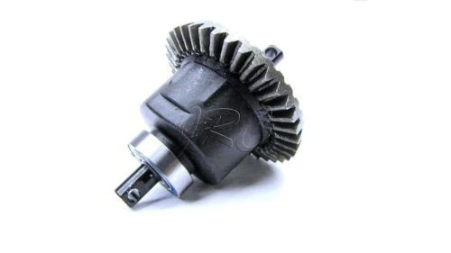   <em>Jenny's RC listing · diff housing TRA3978 · spider gear set w/ I-bar</em> |
| 🚫 ~~**GPM SLA1337FR, Slash 4x4 / Jato 4x4 front + rear diff set**~~ | **Outdrive:** TBD, likely 5mm **Housing:** 7075-T6 aluminum alloy **Internals:** 4140 carbon steel gears **Part:** SLA1337FR **Fits:** Slash 4x4, Jato 4x4, Rustler 4x4, XO-1, and more **Price:** **$75.90** | Pro: 4140 steel gears for durability. Complete matched front+rear set. Wide Traxxas 4x4 compatibility. If 5mm, now outdrive-compatible with the axle plan  Con: **$75.90 for aluminum housing** that augers out faster than plastic, holds fluid worse, and costs 5× the native Jato 4x4 stock diff | 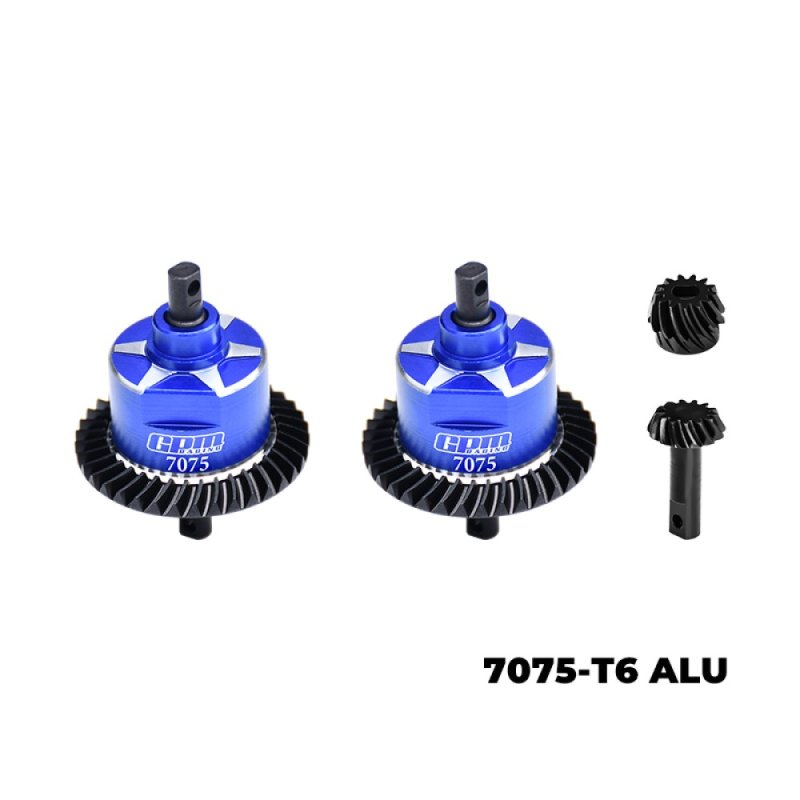 |
| 🚫 ~~**Integy C31463, Slash 4x4 / Stampede 4x4 / Rustler 4x4 diff**~~ | **Outdrive:** TBD, likely 5mm **Housing:** TBD (likely aluminum) **Internals:** N/A **Part:** C31463 **Fits:** Slash 4x4 pattern **Price:** **$18.49** (sale from $24.99) | Pro: Cheapest aftermarket option here. If 5mm, now outdrive-compatible with the axle plan  Con: Material TBD, if aluminum housing, augers out faster, holds fluid worse than plastic. At $18.49 it's still more expensive than the native Jato 4x4 stock diff ($12.97) |  |

### Alternative Upgrade Parts

Optional ring gear / pinion upgrades for the E-Revo diff. All vetoed, marginal gains over stock that don't justify the cost.

> *Spec format: Part · Material · Gears · Price*

| Part | Spec | Pros / Cons | Photo / Link |
|---|---|---|---|
| ❌ ~~**GPM ER1200TS, Carbon Steel Bevel Gear Set (29T/11T)**~~ | **Part:** ER1200TS **Material:** Carbon steel, nitride hardened, helical spiral cut **Gears:** 29T ring bevel + 11T pinion, 1.0 module (6pc inc. screws) **Price:** **$43.90** | Pro: Nitride hardened, helical spiral cut, carbon steel. Replaces TRA5379X  Con: Marginal gains, stock TRA5379X in the assembled diff is fine. $43.90 |  |
| ❌ ~~**GPM ER1337TS, Hard Steel Spiral Gears (13T/37T)**~~ | **Part:** ER1337TS **Material:** Hard steel, spiral cut **Gears:** 13T + 37T matched pair **Price:** **$36.90** | Pro: Hard steel, spiral cut geometry  Con: Marginal gains, unlikely to outperform stock. $36.90 not worth it | 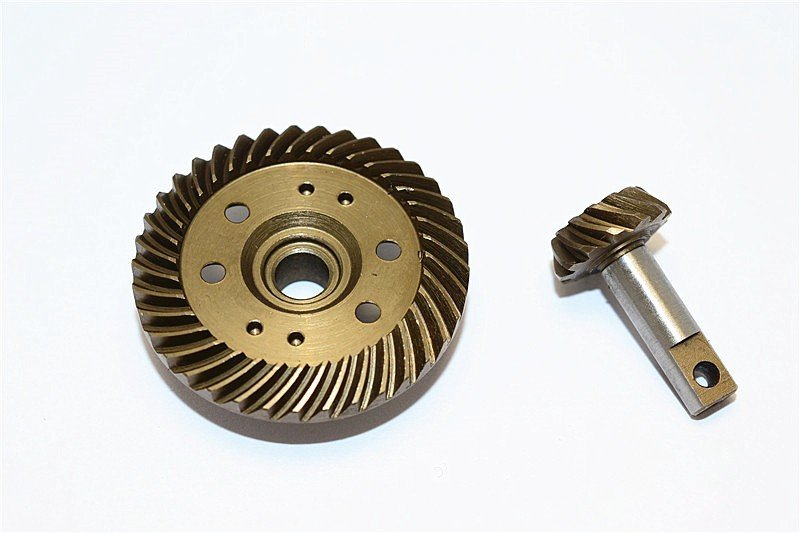 |
| ❌ ~~**Traxxas TRA5379R, Spiral Cut Ring Gear + Pinion**~~ | **Part:** TRA5379R **Material:** Spiral cut ring gear + pinion **Gears:** Ring gear + pinion **Price:** **$39.95** | Pro: Spiral cut geometry theoretically smoother  Con: Marginal gains at best, stock already covers this fine. $39.95 not worth it | 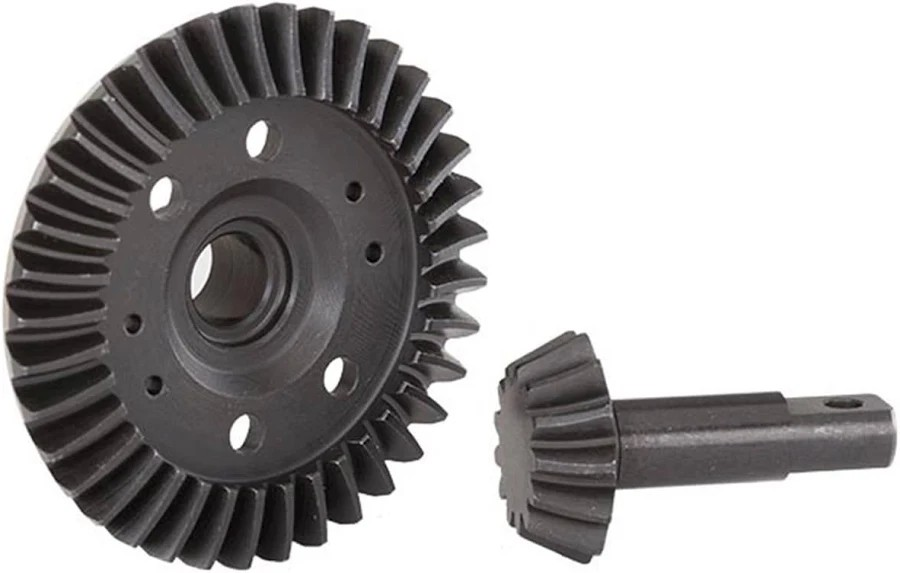 |

### Why 5mm (stock) wins now

The axle plan changed, the build now runs the **Slash 4x4-pattern CVDs on the Tekno M6 stub build**, not the E-Revo 1.0 CVDs:
- **Slash 4x4-pattern CVDs (knock-off TRA6851R/6852R style)**, 5mm cups, feeding the **Tekno M6 17mm stubs** front + rear (see [`driveshaft_analysis.md`](driveshaft_analysis.md))
- **Diffs must be 5mm to mate that axle**

That makes the **native Jato 4x4 stock diff** the correct pick again, cheapest, no gearbox-housing fitting required. The in-hand E-Revo 1.0 diffs (already owned, $0 sunk) drop to spares/fallback unless the axle plan ever moves back to 6mm E-Revo CVDs.

---

## Center Diff

> **Chosen: AliExpress metal center diff (alum body + integrated steel 54T spur), $19.06, running Traxxas 100k oil.** One cheap fully-assembled unit that includes the spur and the oil, so there is nothing separate to buy or fit. It trades the lighter TRA6814 plastic (and the plastic-fuse failure mode) for a cheap all-in-one metal diff, a tradeoff taken knowingly. The TRA6814 OEM plastic is the lighter alternative if you would rather keep the separate plastic spur fuse.

 <em>AliExpress metal center diff (alum body + integrated steel 54T spur), $19.06, 74.6 g</em>

> *Spec format: Part · Housing · Spur · Oil · Weight · Fits · Price*

| Center Diff | Spec | Pros / Cons | Photo / Link |
|---|---|---|---|
| ⭐ **AliExpress Heavy Duty Centre Diff (alum body + steel 54T spur)** — *chosen* | **Part:** Tolex (generic) **Housing:** aluminum **Spur:** **steel 54T, integrated** (this is the build's spur, so the separate plastic TRA3956R is now a spare) **Pinions:** **ships with 16T / 17T / 18T, 5mm bore** (matched to the spur; see [pinion reference](motor_analysis.md#pinion-reference-32p)) **Oil:** **comes pre-filled** with the correct wt (fully assembled) **Weight:** **74.6 g** (measured, incl. steel 54T spur + assembled output shaft) **Fits:** Slash 4x4 / Hoss 4x4 VXL **Price:** **$19.06** (paid, AliExpress E-star RC Car Store, order 8213147729824866) | Pro: **Chosen: one cheap (~$20) fully-assembled metal unit with the integrated steel 54T spur, no separate spur to buy or fit.** A knock-off of the $69.95 TRA6780. Complete drop-in. **Bearings on both sides of the output shafts**, so the alloy bores don't auger out and it holds oil better than the plastic diffs (see [teardown](#center-diff-teardown))  Con: **Heavier (74.6 g) than the TRA6814 plastic**, and the **integrated steel spur removes the plastic-fuse failure mode** (see [spur gear](#spur-gear)). **Rear output shaft needs 4.75mm shaved** to seat (see [teardown](#center-diff-teardown)), and the stepped spider pins should be swapped for solid 2.8mm × 7mm ones. Weight + fuse tradeoff taken knowingly for the cheap all-in-one metal diff |  |
| 🔵 **TRA6814, Traxxas Pre-Built Center Diff Kit** — *lighter plastic alternative* | **Part:** TRA6814 (rebuild: TRA6884 housing + TRA6883 gear set) **Housing:** Plastic **Spur:** N/A (separate spur) **Oil:** Tunable via silicone oil (sealed, pre-filled) **Weight:** N/A **Fits:** Slash 4x4, Jato 4x4 **Price:** **$39.95** complete (~$20 built from TRA6884 + TRA6883) | Pro: **Lighter than the metal AliExpress unit** and keeps the plastic-fuse failure mode (needs the separate plastic spur). Pre-built, sealed, tunable. **Cheaper to build from components**, TRA6884 ($5) + TRA6883 ($15) = ~$20 vs $39.95. $5 housing rebuild when worn  Con: Not the pick here (went with the cheap all-in-one metal unit). $39.95 for the complete kit if not building from parts |  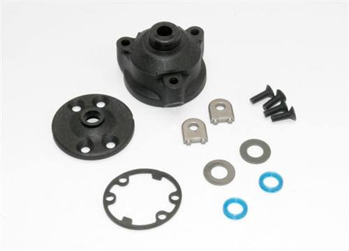&nbsp; <em>TRA6814 complete · TRA6884 housing · TRA6883 gear set</em> |
| 🔵 **TRA6780A, Pro-Built Center Diff** | **Part:** TRA6780A **Housing:** plastic (black) **Spur:** steel 54T 32-pitch (integrated) **Oil:** 500k (pre-filled, nearly locked) **Weight:** N/A **Fits:** Hoss / Slash / Stampede / Rustler 4x4 **Price:** $60.00 | Pro: Plastic housing, stays round, holds fluid, outlasts aluminum. Pre-built, sealed, $60  Con: Integrated steel spur kills the plastic-fuse failure mode. 500k oil = nearly locked center, too stiff for offroad dirt use. Outdrive size TBD, verify 6mm | 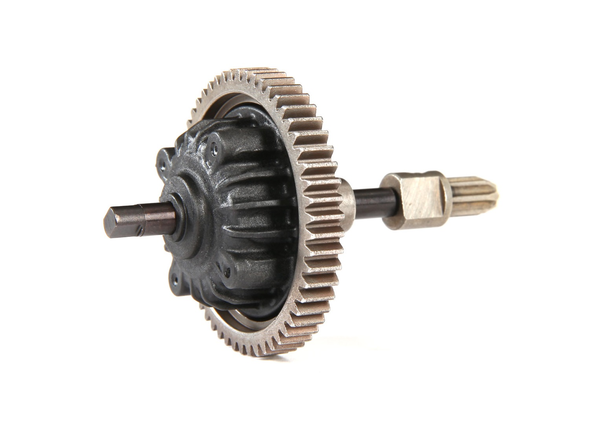 |
| 🔵 **TRA6780R, Pro-Built Center Diff** | **Part:** TRA6780R **Housing:** plastic (black) **Spur:** steel 50T 32-pitch (integrated) **Oil:** 20m (pre-filled) **Weight:** N/A **Fits:** Hoss / Slash / Stampede / Rustler 4x4 **Price:** $60.00 | Pro: Plastic housing. Pre-built, sealed, $60. 50T spur  Con: Integrated steel spur kills the plastic-fuse failure mode. Outdrive size TBD, verify 6mm | 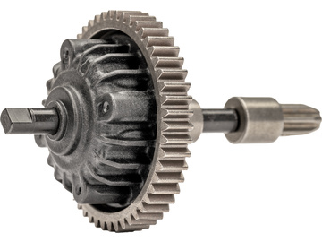 |
| ❌ ~~**TRA6780, Complete Center 4X4 Diff Kit (alum housing + steel 54T spur)**~~ | **Part:** TRA6780 (Autramodel.cz) **Housing:** aluminum **Spur:** steel 54T (integrated) **Oil:** N/A **Weight:** **137g** (0.137 kg) measured **Fits:** Hoss / Slash / Stampede / Rustler 4x4 **Price:** $69.95 | Pro: Complete bolt-in unit, alum housing + steel spur is durable on paper  Con: **Tons of unneeded rotational weight**, heavy alum housing + steel spur add spinning mass right in the driveline. **Aluminum housing augers out** (wears oblong) faster than plastic and holds fluid worse. Steel spur kills the plastic-fuse failure mode. **$69.95**, same alum+steel design as the ~$20 AliExpress unit, just 3.5× the price | 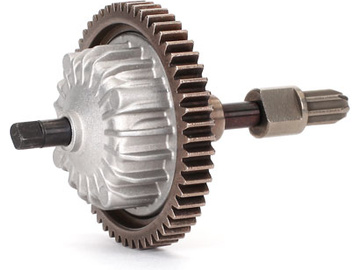 |

### Slipper Clutch (alternative to center diff, vetoed)

A slipper clutch replaces the center diff entirely. Vetoed here because it doesn't suit this build's surface.

> *Spec format: Part · Type · Price*

| Part | Spec | Pros / Cons | Photo / Link |
|---|---|---|---|
| ❌ ~~**TRA6878A, Complete Slipper Clutch**~~ | **Part:** TRA6878A **Type:** complete slipper clutch assembly (replaces center diff) **Price:** **$20.00** | Pro: Works well on high-grip surfaces  Con: **Doesn't handle well on dirt/low-grip tracks**, this build is set up for dirt offroad, not high-grip. Center diff (TRA6814) is the correct setup |  |

---

## Center Diff Teardown

> **Opened the $19.06 AliExpress unit up, and it is over-designed for the money.** Three spider gears instead of the usual two, ball bearings on **both** sides of the output shafts, and Traxxas-size gears throughout so it rebuilds off the shelf. There is one real weak point (a stepped spider pin) and one fitment chore (shave the rear output shaft), both covered below. For ~$20 this is a great find.

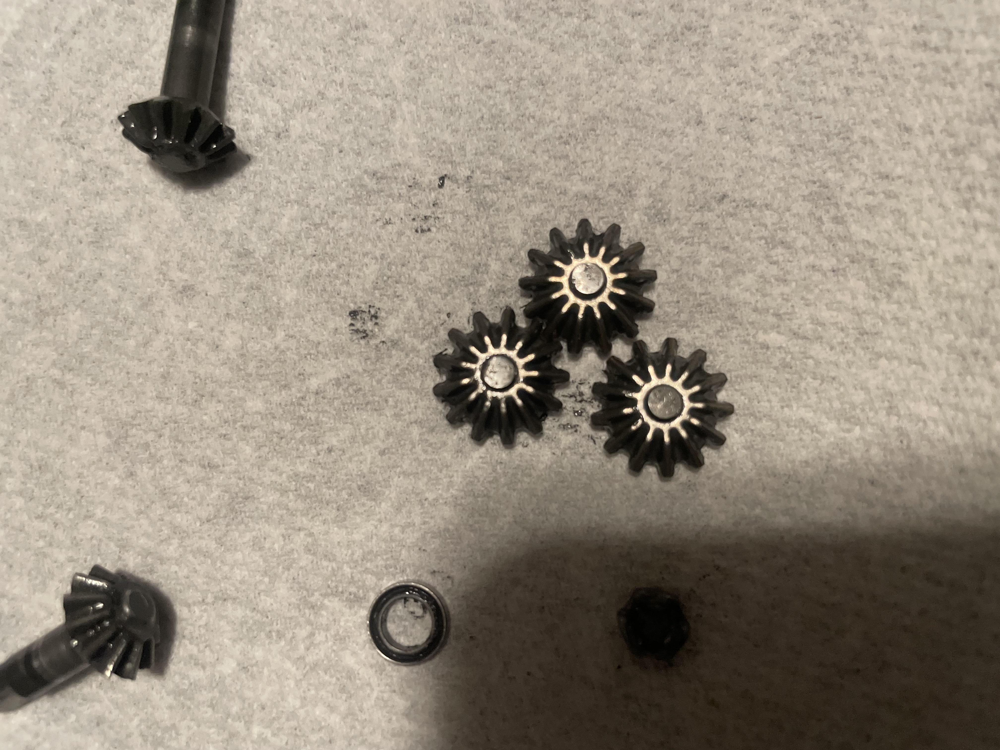 <em>Everything inside: three spider gears, both output shafts with their bevels, and one of the shaft bearings</em>

### What's inside

| Item | What it is | Why it matters |
|---|---|---|
| **Spider gears** | **Three**, not the usual two | More teeth in mesh spreads the load, so each gear sees less of it |
| **Pin carrier block** | Center block sitting between the spider gears, holds the pins | This is what the spider pins seat into, so it is what decides whether a plain solid pin will drop in |
| **Output shaft bearings** | **Ball bearings on both sides of the shafts** | Basically unheard of at this price. Most cheap diffs run the shafts straight in the housing bore, which wallows out |
| **Bevel gears** | **Same size as Traxxas diff gears** | Rebuildable from Traxxas spares (TRA6882-class gear sets) until the housing itself fails |
| **Spur** | Steel 54T, integrated | This is the build's spur, see [Spur Gear](#spur-gear) |
| **Housing** | Aluminum, 3-bolt end caps | **The usual aluminum objection does not apply here.** The shafts ride in the bearings, not in the housing bores, so the wear path that augers out a normal alloy diff never starts. It also holds oil better than the plastic housings, which is backwards from what you would expect, but that is how it has behaved |

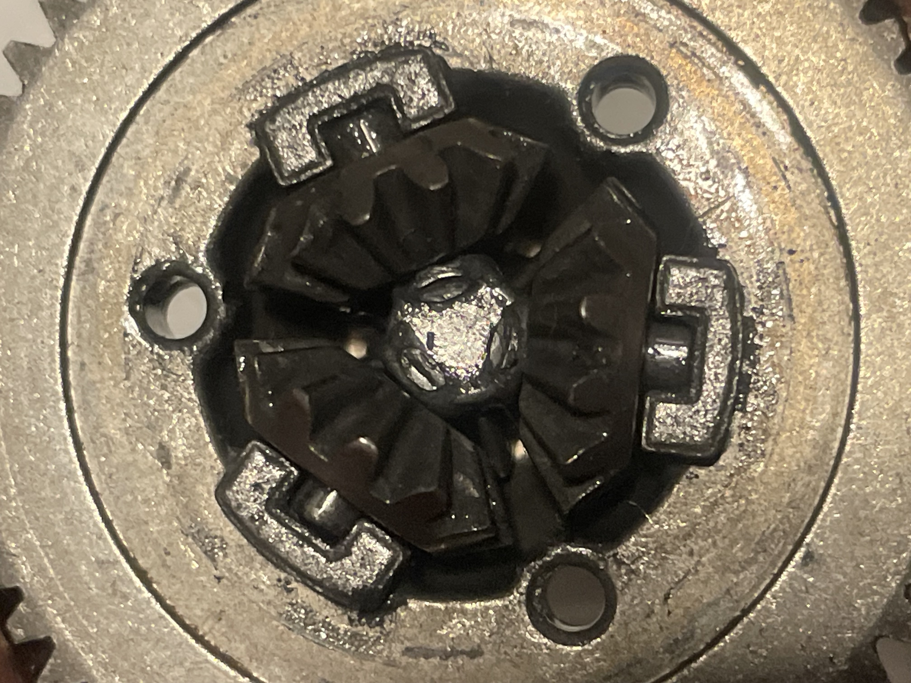&nbsp;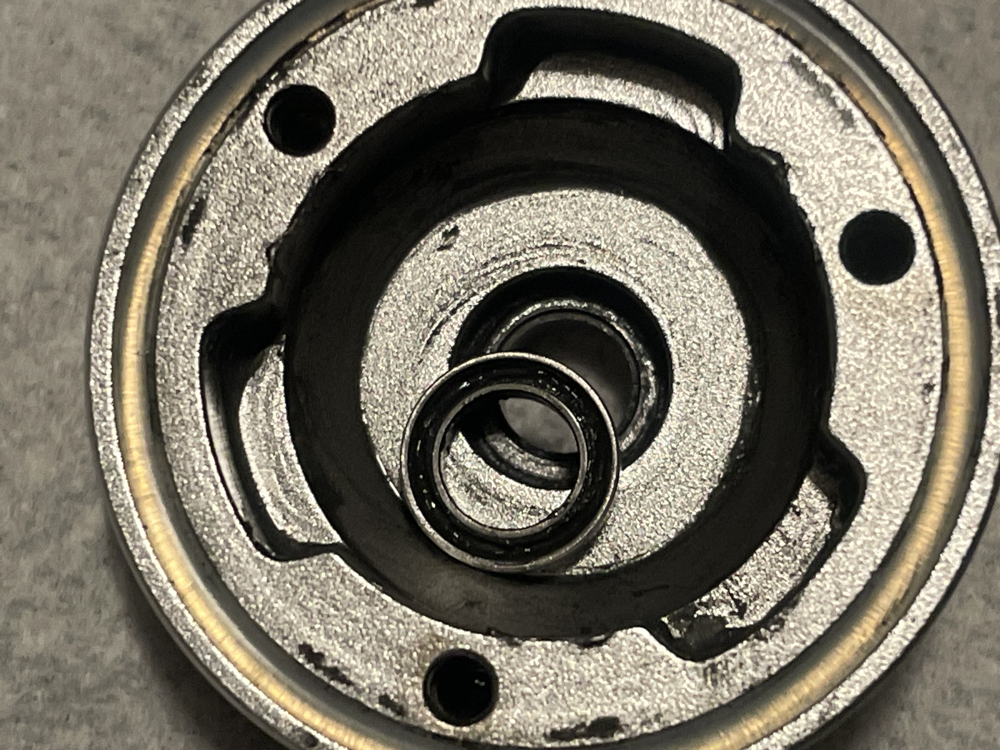 <em>Three spider gears packed in black grease · bearing seated in the housing end cap, both sides get one</em>

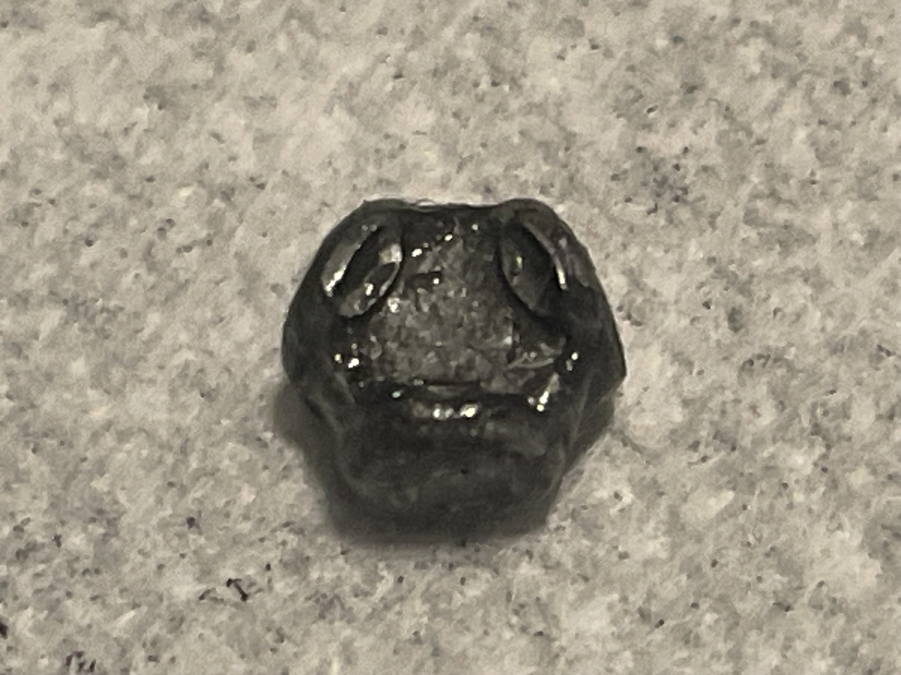&nbsp;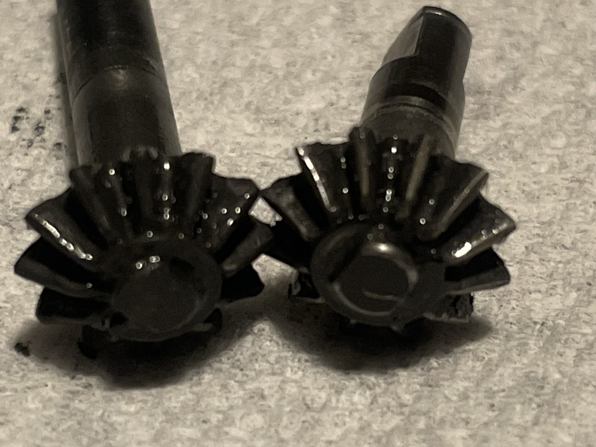 <em>The center block that sits between the spider gears and carries the pins · the two output bevels, Traxxas-size</em>

### The spider pin, the only real weak point

The spider pins are **stepped down** partway along their length, and that step is exactly where they shear. My guess is the step is there to flex slightly and fake an LSD-style progressive response, but for a part you have to repair in the field it is a bad trade.

**The fix came from [Mike's car](../Jato4EP/differential_analysis.md), which broke one first: a solid 2.8mm × 7mm pin, full length, no step-down.** 7mm is the right length for these pins. The stock stepped pin measures **6.85mm**, which is ever so slightly too short on top of being weaker. A plain solid pin is stronger, cheaper, and easier to source than the original.

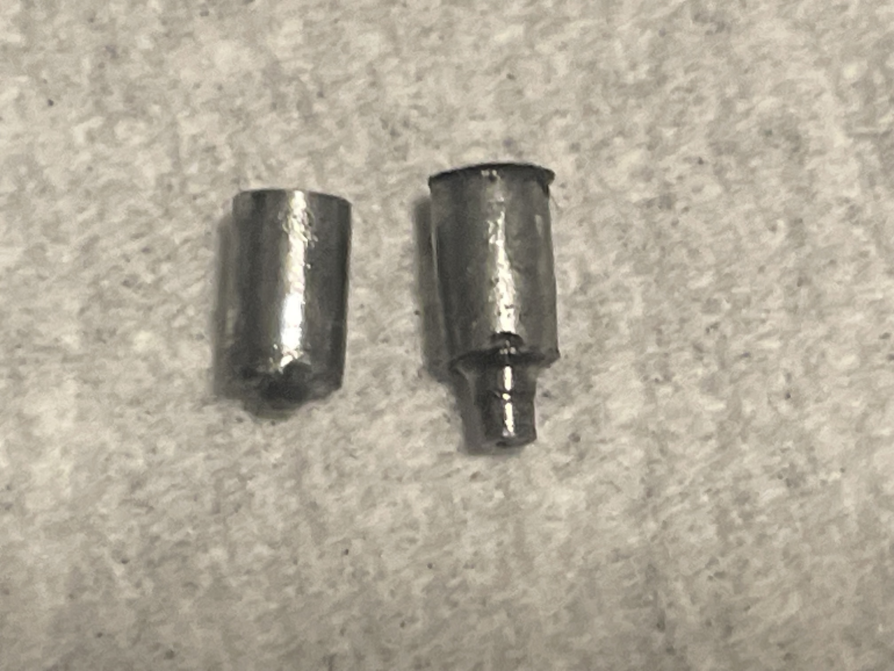&nbsp;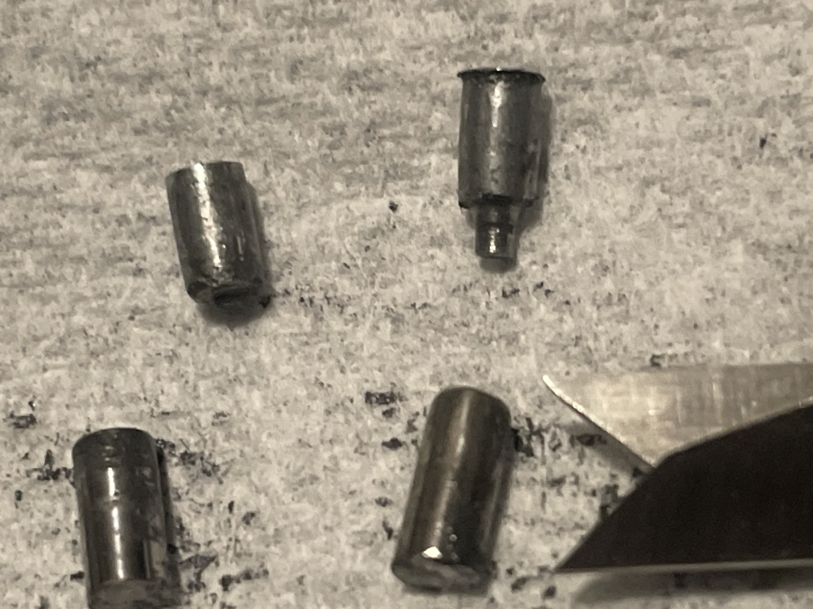 <em>One sheared pin next to a good one · the step-down that causes it, clearly visible on the upper pin</em>

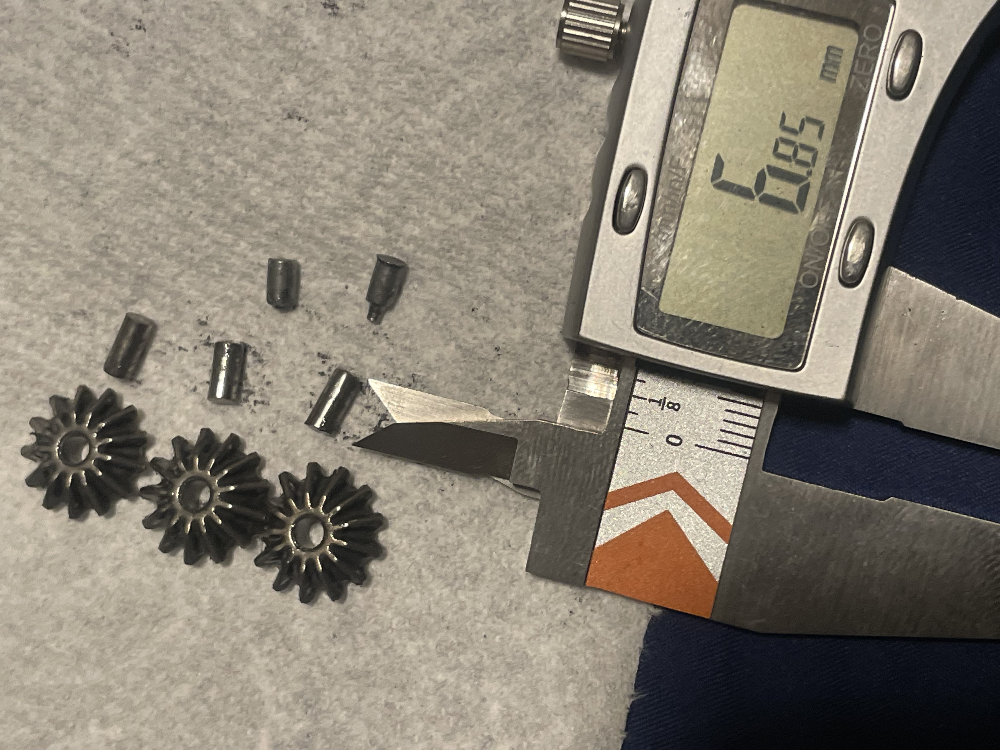 <em>Spider gears and the full pin set. Caliper on a stock pin reads <strong>6.85 mm</strong> long, a hair under the <strong>7mm</strong> that seats properly</em>

### Fitment: the rear output shaft needs shaving

**The one downside of the whole unit.** The **rear output shaft** sits too long to seat correctly, so the end has to come down by **4.75mm** (that is the "about 5mm" figure, measured properly). Nothing else on the diff needs fitting. A little filing goes a long way here, and it is a one-time job.

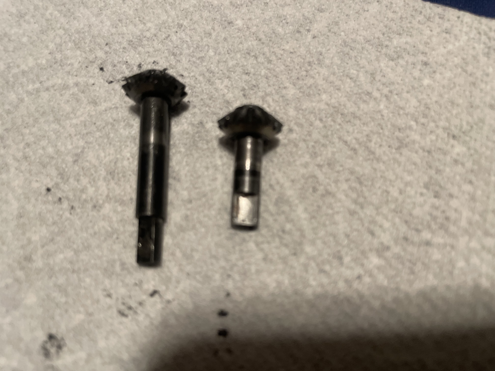&nbsp;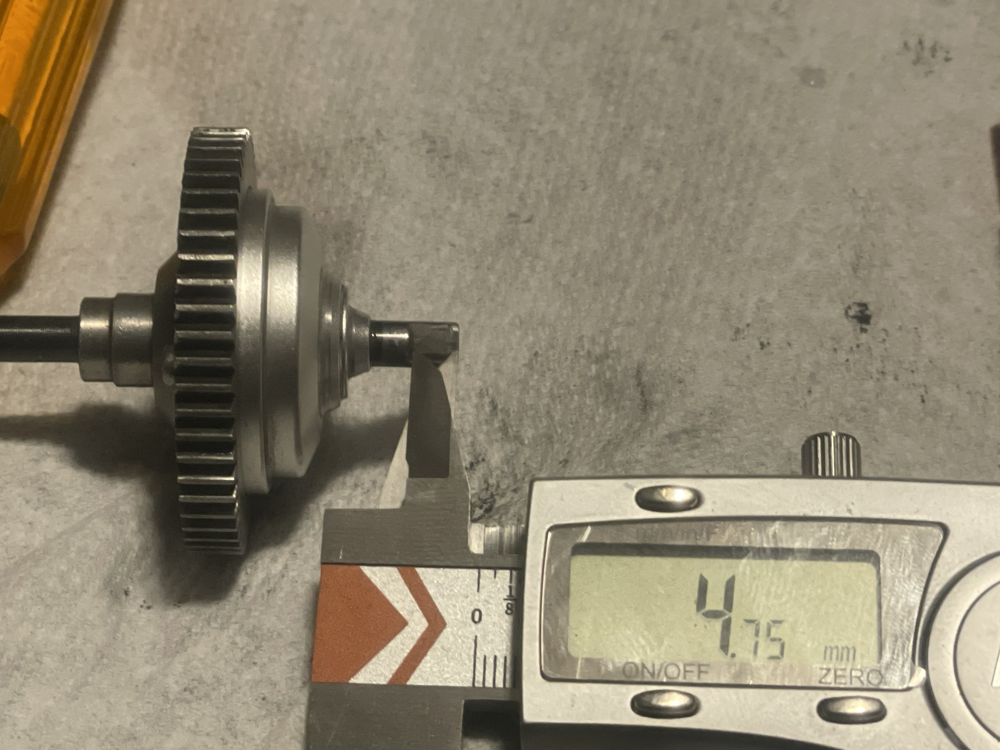 <em>The two output shafts are visibly different lengths · caliper on the rear shaft reads <strong>4.75 mm</strong>, the material that has to come off for it to seat</em>

### Rebuild notes

- **Gears are Traxxas-size**, so a standard Traxxas diff gear set rebuilds it. No proprietary spares to chase.
- **Replace the stepped pins with solid 2.8mm × 7mm pins** on the first rebuild, before one breaks rather than after. The stock pins are 6.85mm, so going to 7mm also picks up the bit of length they were missing.
- **The housing is not the weak point here.** Because the bearings carry the shafts, the aluminum bores never get augered out the way an unbearinged alloy diff does, and it seals oil better than plastic on top of that. The stepped pin is the part that actually fails.
- **Fill half full only**, same rule as any sealed diff. See [Center Diff Oil](#center-diff-oil) for the weight this car runs.

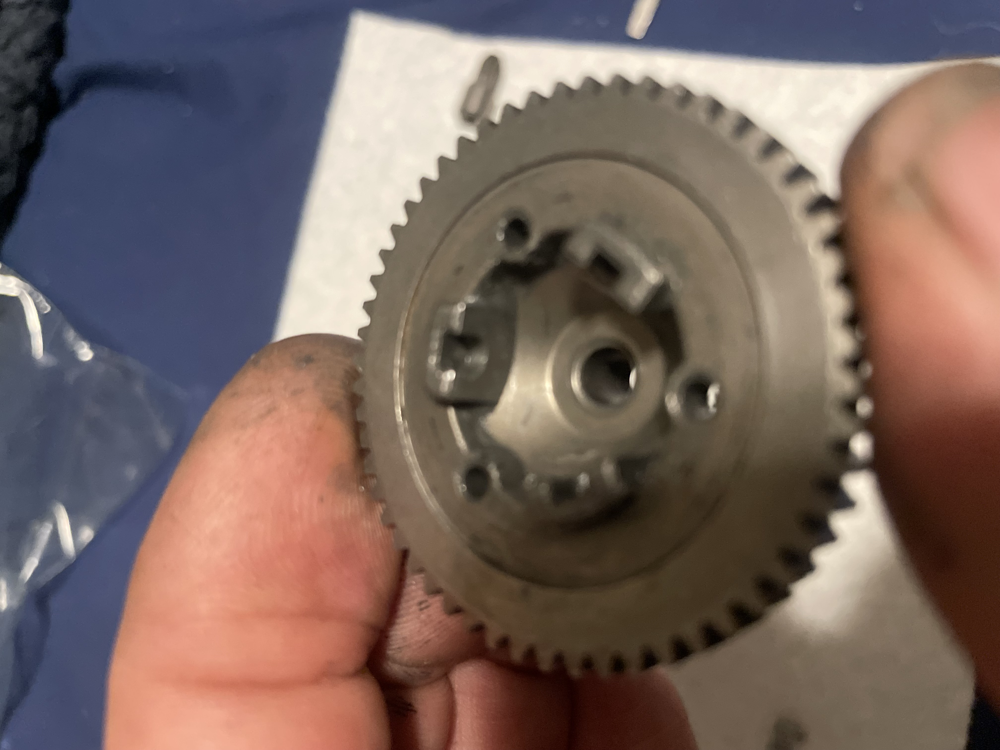&nbsp;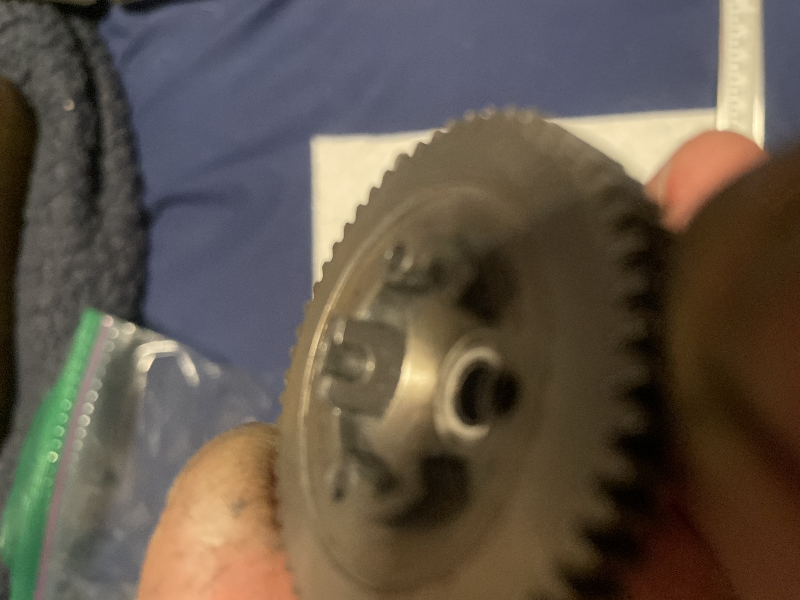 <em>Back together, steel 54T spur face · spur face and the center bore bearing</em>

---

## Center Diff Oil

**Running: 100k (Traxxas TRA5130 diff oil, $8 at Tammies Hobby).** 20k was the starting point, tested across several builds as the sweet spot between freewheeling traction handoff and progressive lockup under throttle; this car now runs 100k.

 <em>Traxxas diff oil 100k (TRA5130), in the center diff</em>

| Oil weight | Behavior | Use case |
|---|---|---|
| 5k cSt | Very fluid, lots of differentiation, freewheels in turns | Light-traction surfaces (sand, very loose) |
| 10k cSt | Quicker freewheel, less lockup under power | Tight indoor tracks |
| 20k cSt | Balanced, diffs under hard throttle, freewheels at part-throttle | Earlier baseline, general offroad / 4S dirt |
| 50k cSt | Mostly locked, all-four-wheels-pull feel | Crawling, low-grip climbs |
| **100k+ ⭐** | Effectively locked spool | Drag/speed-run with grip. **Running now (TRA5130)** |

**Fill level: half full only.** Overfilling plastic diff housings causes them to explode under pressure, this is operator error. Fill to half, no more.

**Why not just lock the center diff?** Locked center = no torque differentiation front-to-rear = chassis pushes / pivots awkwardly on uneven surfaces. That's the tradeoff 100k accepts; 20k was the way to get the locked feel under power without it.

---

## Front & Rear Diff Oil

**Running: 30k oil up front, and grease in the rear instead of oil.** The front is far heavier than the old 7k target, which calms torque steer on a 4S car, and the greased rear holds drive off the corner instead of spinning up on the blown-out dirt.

⚠️ **Grease goes in as a light film, never packed solid.** Packing a diff binds the gears together so it drags and heats instead of differentiating. The full oil versus grease fill rule is written up on [Mike's car](../Jato4EP/differential_analysis.md#the-rear-runs-grease-not-oil), which runs the same arrangement.

| Diff | Weight | Tuning |
|---|---|---|
| **Front** | **30k wt** (Traxxas **TRA5136**, $7.50) | Lighter = more turn-in on the slickest days; heavier = calmer still if it torque-steers or plows |
| **Rear** | **Grease, not oil.** 🚧 which grease is not recorded | More grease = more drive off the corner; less = more rear rotation if it pushes. **A light film, never packed** |

&nbsp;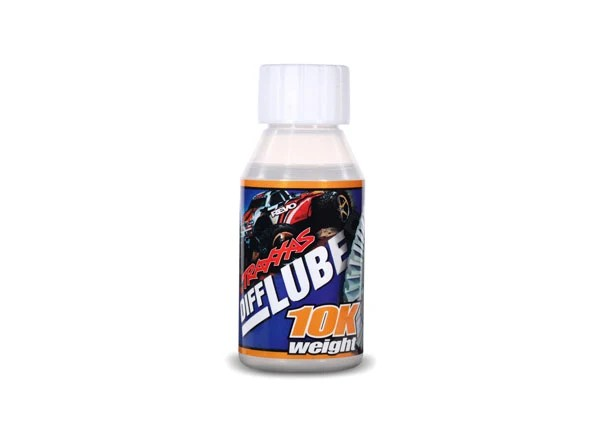 <em>Front: Traxxas 30k (TRA5136), what the front diff actually runs · Traxxas 10k (TRA5135), bought but <strong>not what is in the rear</strong>, since the rear is greased. $7.50 each at Tammies Hobbies</em>

> The [E-Revo](../ERevo_1.0/README.md) runs the same **30k** front. [Mike's Jato](../Jato4EP/README.md#diff-oil) runs **30k front, 100k centre and a greased rear**, the same approach as here, and it is the car these settings were worked out on in the first place.

---

## Spur Gear

> **Decision changed: running the integrated steel 54T spur that comes on the [AliExpress metal center diff](#center-diff).** So the build has no separate spur. The separate **TRA3956R 54T plastic spur does not fit this metal center diff** (it mounts to a plastic center diff like the TRA6814), so it is only relevant if you ever go back to that plastic-center-diff setup. The plastic-spur analysis below is kept for that reference.
>
> **Plastic-spur reference (the TRA3956R 54T, for a plastic center diff):** plastic is a sacrificial failure point, in a bad crash it strips before transferring force to the metal pinion, driveshafts, and gearbox. 54T over 50T/52T: **more teeth spread the load and wear more evenly**, and **54T lands the gearing where we want it.** Cheap to replace.

 <em>TRA3956R 54T plastic spur, the plastic-center-diff option (not used; the metal center diff has its own steel spur)</em>

### Spur Gear Requirements

| Requirement | Type | Why |
|---|---|---|
| **Plastic material** | Must | Plastic is the **intentional sacrificial failure point**, strips in a crash before the metal pinion, driveshafts, or gearbox take the hit. Metal spur gears transfer crash energy into more expensive components |
| **32P / 0.8M pitch** | Must | Slash 4x4 / Jato 4x4 platform standard, all gearbox housings and pinions use this pitch |
| **No slipper clutch** | Must | Slipper clutch works on high-grip surfaces, doesn't handle well on dirt tracks. This build is set up for dirt/low-grip offroad. Center diff (TRA6814) is the correct setup |
| **Fits Slash 4x4 / Jato 4x4 center diff gearbox** | Must | Must seat correctly in the center diff housing (TRA6814 / TRA6884) |
| **Cheap** | Must | It's a consumable part. At $3–5 it should be guilt-free to replace |
| **Correct tooth count for desired gear ratio** | May | Tooth count affects top speed vs torque, tune to motor KV and track conditions |

### Spur Gear Comparison

> *Spec format: Teeth · Pitch · Material · Fits · Price*

| Spur Gear | Spec | Pros / Cons | Photo / Link |
|---|---|---|---|
| ⭐ **TRA3956R, 54T plastic (center diff)** | **Teeth:** **54T** **Pitch:** 32P / 0.8M **Material:** black plastic **Fits:** TRA6814 center differential **Price:** **$3.00** | Pro: $3, correct plastic-fuse material, fits the TRA6814 center diff. **54T = more teeth, so load spreads and wears more evenly, slightly stronger than 50T/52T.** Lands our gearing exactly where we want it  Con:, |  |
| 🔵 **TRA6842R, 50T plastic** | **Teeth:** **50T** **Pitch:** 32P / 0.8M **Material:** black plastic **Fits:** Center diff housing **Price:** **$3.00** | Pro: $3, correct material, correct pitch. 50T gives a slightly taller ratio vs 52T  Con: Fewer teeth than the chosen 54T, load spread over less contact |  |
| 🔵 **TRA6843R, 52T plastic** | **Teeth:** **52T** **Pitch:** M0.8 / 32P **Material:** black plastic **Fits:** Center diff housing (OD 43mm / ID 22.5mm) **Price:** **$3.00** | Pro: $3, correct material. 52T sits between 50T and 54T  Con: Fewer teeth than the chosen 54T | 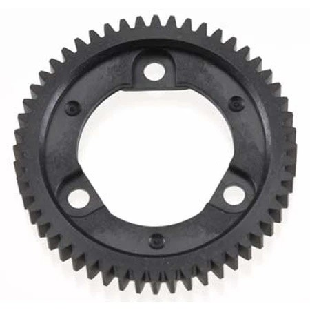 |
| ❌ ~~**Hot Racing SSLF254D, 54T steel**~~ | **Teeth:** 54T **Pitch:** 32P / 0.8M **Material:** hardened steel **Fits:** Center diff housing **Price:** ~$15 | Pro: Won't strip under abuse  Con: **Wrong design philosophy**, metal spur transfers crash energy to the pinion and drivelines instead of stripping. Defeats the purpose of having a sacrificial failure point | 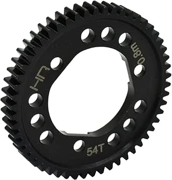 |
| ❌ ~~**GPM SSLA054T, 54T steel**~~ | **Teeth:** 54T **Pitch:** 32P / 0.8M **Material:** hardened steel **Fits:** Center diff housing **Price:** $19.90 | Pro: CNC machined, black finish  Con: Same metal spur problem, no sacrificial failure point. More expensive than plastic for a worse outcome | 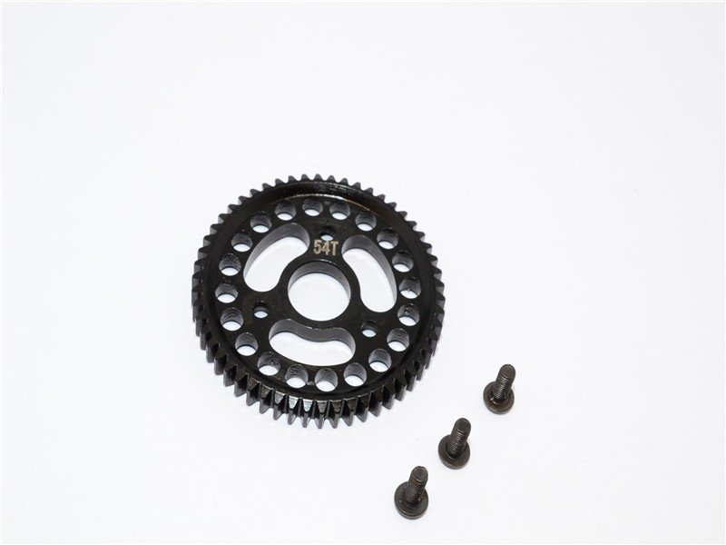 |
| ❌ ~~**Integy T8573, 50T steel**~~ | **Teeth:** 50T **Pitch:** 32P / 0.8M **Material:** billet steel **Fits:** Center diff housing **Price:** **$24.83** (sale from $26.99) | Pro: Billet steel construction  Con: Metal spur, wrong failure mode. $24.83 for a part that should cost $3 and be plastic |  |
| ❌ ~~**Robinson Racing RRP7954, 54T steel**~~ | **Teeth:** 54T **Pitch:** 32P / 0.8M **Material:** hardened black steel **Fits:** Slipper clutch eliminator (bolts direct, no slipper pads) **Price:** **$18.22** (list $19.80) | Pro: Hardened black steel, well-reviewed, takes brushless 6S abuse  Con: Same metal spur problem, no sacrificial failure point. Cheaper than I assumed, but still wrong failure mode for this build | 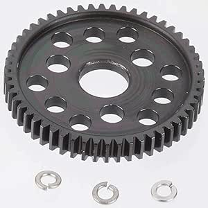 |

### Spur Gear Notes

- **Why plastic wins:** the spur gear is the least expensive, most accessible part in the drivetrain chain. In a crash, it strips first, before the pinion, CVDs, diff outdrives, or gearbox housing take the hit. A $3 spur gear saving a $30 pinion and $80 in CVD/driveline parts is exactly the right trade-off.
- **Metal spur = wrong failure mode:** a metal spur that won't strip transfers crash energy directly into the pinion and downstream drivetrain. You save the $3 plastic gear and destroy far more expensive parts.
- **Tooth count and gear ratio:** all 32P / 0.8M gears are compatible. Choose tooth count based on motor KV and desired top speed vs torque balance. 50T–54T is the standard range for 4S offroad builds.
- **Slipper vs center diff:** slipper clutch (TRA6878A) works on high-grip surfaces but doesn't handle well on dirt/low-grip tracks, this build is set up for dirt offroad. Center diff (TRA6814) is the correct setup. Use center-diff specific spur gears (TRA6842R, TRA6843R) which seat directly in the center diff housing, not slipper assembly gears.

---

## Price History

| Date | Price | Discount Path | Notes |
|---|---|---|---|
| 2026-07-19 | **$19.06** ✅ **purchased** | Listed $19.28 | Metal 6780 complete center differential kit (15T + 17T + 19T pinions listed), AliExpress E-star RC Car Store, order 8213147729824866. **The one on the car** |
| 2026-05-16 | **$18.80** ✅ purchased | Listed $20.00 | Metal center diff (Traxxas 6780-style), AliExpress TangEmpire Store, order 8211762212584866. **Resold to Mike at cost**, see [LEDGER.md](../../LEDGER.md) |

---

## Sources

- E-Revo CVD / diff compatibility, community confirmation in [RC Talk forum threads](https://www.rctalk.com/forum/threads/traxxas-jato-4x4.144356/) on Jato 4x4 builds using E-Revo drivetrain parts
- Center diff oil viscosity, Castle Creations / RPM tuning guides + my own experience
