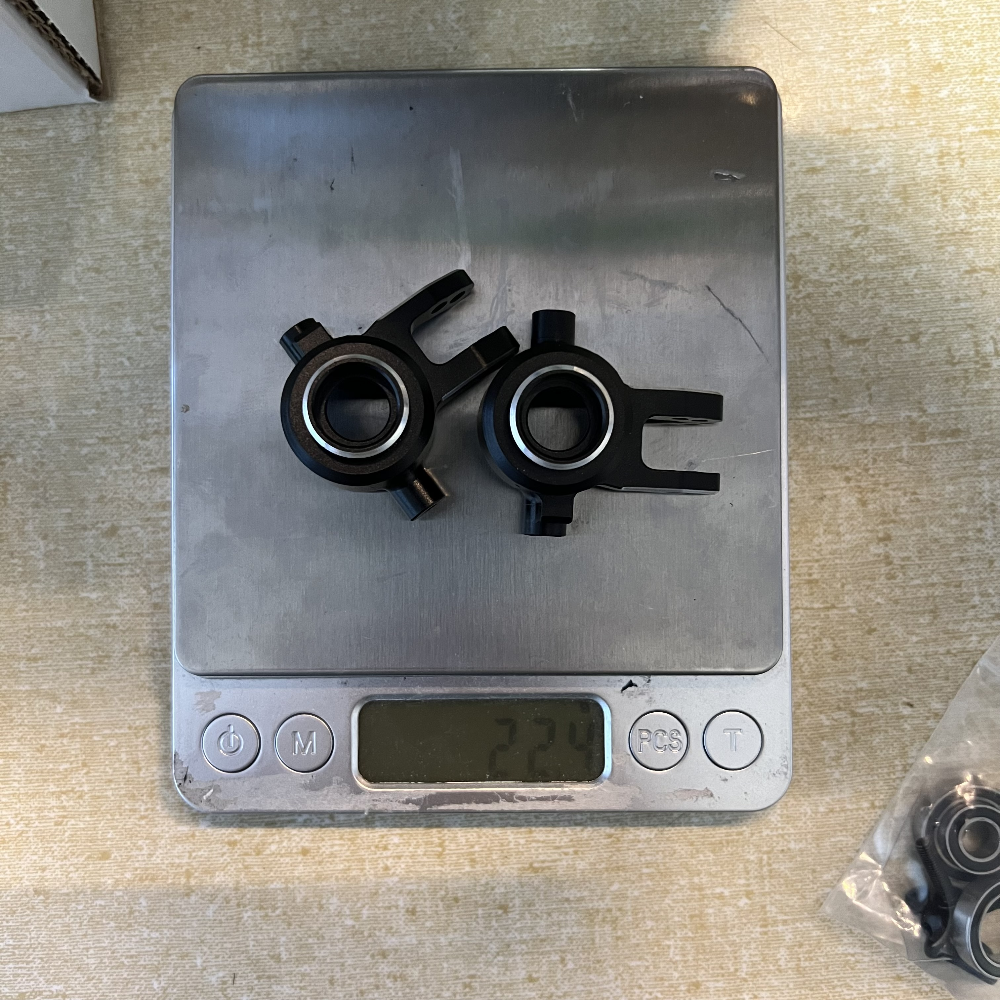
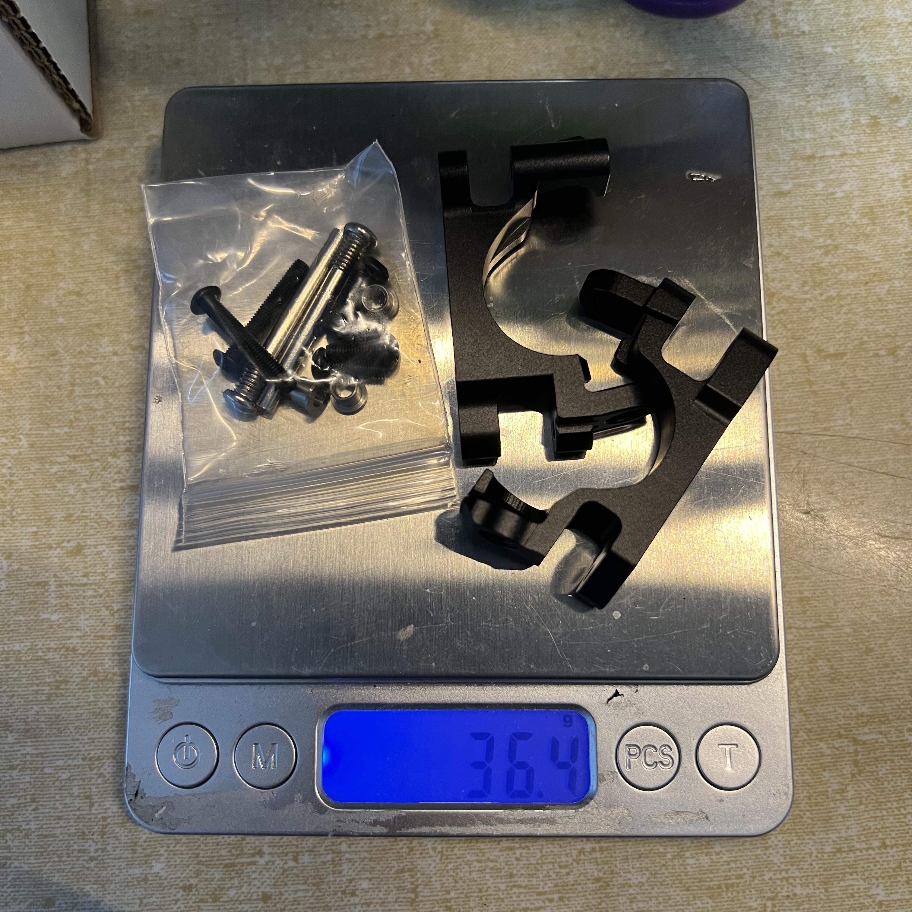

# Traxxas Jato 4x4 — Mike's

> Mike's car. Related to but not the same as the [FastAzJato4x4](../FastAzJato4x4/README.md) build (which is co-developed with Mike). Setup notes recorded here for reference and cross-build tuning.

---

## Table of Contents

- [Car Overview](#car-overview)
- [Suspension](#suspension)
- [Steering](#steering)
- [Drivetrain](#drivetrain)
- [Wheels & Tires](#wheels--tires)
- [Aero & Body](#aero--body)
- [Electronics](#electronics)
- [Tuning Notes](#tuning-notes)
- [Parts Purchased](#parts-purchased)
- [TODO / Notes](#todo--notes)

---

## Car Overview

**Base Car:** Traxxas Jato 4x4 — Mike's personal build.

> Originally noted as "Slash" — it's actually a Jato 4x4. Shares lineage / tuning notes with my FastAzJato4x4 but is its own car.

---

## Suspension

### Shock Oil

| Position | Weight |
|----------|--------|
| Front | 40wt |
| Rear | 50wt |

> Same oil as the [FastAzJato4x4](../FastAzJato4x4/shock_analysis.md#setup-spec-springs--pistons--oil) after its retest (was 45wt / 60wt on both). Rear heavier than front because the motor sits at the back and the car is tail-heavy for a 1/8.

### Pistons

| Position | Piston |
|----------|--------|
| Front | 6 hole × 1.4 |
| Rear | 6 hole × 1.2 |

---

## Steering

| Component | Part | Weight (pair) |
|-----------|------|---------------|
| Front C-Hub / Caster Block (aluminum) | **LIGHT HOUSE Aluminum Front C Hub/Knuckle Arm for Traxxas Jato 4x4 BL-2S** (black) | **25.5 g** bare · 36.4 g w/ hardware kit |
| Front Steering Block / Knuckle (aluminum) | **LIGHT HOUSE Aluminum Front Hub/Knuckle Arm for Traxxas Jato 4x4 BL-2S** (black) | **22.4 g** bare · 34.9 g w/ hardware kit |

### Weighed-in photos

  &nbsp; 
  <em>Knuckles bare: 22.4 g · Knuckles + hardware kit: 34.9 g</em>

  &nbsp; 
  <em>C-hubs bare: 25.5 g · C-hubs + hardware kit: 36.4 g</em>

---

## Drivetrain

| Position | Part |
|----------|------|
| Pinion | **12T 32P** |
| Spur | **54T** |

### Custom Axles (shared with FastAzJato4x4)

> **Bearings:** this car runs a **bare 10×18×5 in the hub**, which needed the **17mm hex adapters shaved down** to fit, not the hub carriers. The FastAz solves the same problem with a sleeve instead. Three-way comparison against stock BL-2S is in [`FastAzJato4x4/bearings_reference.md`](../FastAzJato4x4/bearings_reference.md#three-builds-side-by-side).

Both Jatos run **custom axles built from chopped E-Revo 1.0 CVDs**. Length is dialed on an **adjustable threaded prototype** first, then the **final axles are welded** to that length (simpler, tools on hand, a fresh set is cheap to remake). **Shorter axle = front.** Full build write-up and the rejected join methods are in [`FastAzJato4x4/driveshaft_analysis.md`](../FastAzJato4x4/driveshaft_analysis.md#shortening--joining-e-revo-cvds-custom-axles-wip).

### Diff Oil

| Diff | Weight | Note |
|---|---|---|
| **Front** | **~7k wt** (recommended starting point) | Loose / low-grip dirt: ~7k keeps steering with the heavy 4S car. Go **lighter (5k)** for more turn-in on the slickest days, **heavier (10k+)** if it torque-steers or plows. Dial in on track, then match it on the FastAzJato. |
| **Center** | **20k wt** | Same as the [FastAzJato4x4](../FastAzJato4x4/differential_analysis.md#center-diff-oil) — balanced (diffs under hard throttle, freewheels at part-throttle) for 4S dirt. |
| **Rear** | TBD | Set after front/center are dialed. |

---

## Batteries

Runs **full length 4S packs**, which is where this car and the [FastAzJato4x4](../FastAzJato4x4/battery_analysis.md) split. That car went **shorty hardcase only**, so the two no longer buy to one shared spec.

**Sharing still works one way:** shorties fit this car as well, so anything bought to the FastAz spec can run here, while the full length packs stay on this one. The three CNHL packs bought 2026-08-26 (Racing 5200, Lightning 5500, Ultra-Thin 6000) land here for that reason.

Height is not a limit here: the stock battery bar tops out around **35mm**, but this car runs a **3D printed battery bar** that clears taller packs, so even the **47mm Gens Ace Redline shorty** fits.

---

## Wheels & Tires

| Item | Spec |
|---|---|
| **Rims** | **Traxxas Jato 4x4 VXL 3.0" dished wheels — 17 mm hex** (white). Assembled tire+wheel set: **TRA9074-WHT**; wheels-only sold separately (verify exact SKU). |
| **Tires** | **RedSpider** tires **mounted on the Traxxas Jato 4x4 rims** to widen the track |

> **Wide-track trick:** we took the RedSpider tires and mounted them on the **Traxxas Jato 4x4 rims**, which push the wheels out and **widen the track (stance) by a lot**. It worked great here, more stability and corner grip. Note this puts it **outside ROAR width limits**, fine for a bash/fun setup like Mike's.
>
> **Wear-in:** these RedSpider tires take **~7 battery packs of running to fully wear in** before they reach maximum grip / performance — don't judge them when fresh.
>
> The **[FastAzJato4x4](../FastAzJato4x4/README.md) runs the same RedSpider tires but on standard-width rims** (not the wide Traxxas-rim trick) to **stay ROAR legal**.

---

## Aero & Body

| Component | Part | Notes |
|-----------|------|-------|
| Body / shell | Traxxas Jato 4x4 body, green (exact SKU TBD) | $36.00, paid for by me — tracked in [`/LEDGER.md`](../../LEDGER.md), not here |

---

## Electronics

| Component | Part |
|-----------|------|
| Motor | **Castle Creations 1412 3200KV** |

---

## Tuning Notes

**12T 32P pinion on a 54T spur + Castle 1412 3200KV is the keeper combo.**

Original intuition was that **higher RPM** = better air control, so chasing the smallest pinion was the obvious move. Real-world finding: **torque matters as much as RPM** — gearing for the **power-band sweet spot** (12T here, not the tiniest pinion) makes mid-air corrections feel just as responsive as the high-RPM theory promised, *and* keeps the motor cooler because it's neither lugging nor screaming.

Subjective on-track:
- **Motor runs noticeably cooler** vs the previous taller gearing
- **Power band lands where it's useful** — more usable thrust through the whole throttle, not just at the top
- **"WOOOOO" sound is higher than ever before** — the motor is actually getting up into its happy RPM range
- **Car feels lighter and faster overall** — less effort everywhere, throttle response sharper

Cross-reference for the FastAzJato4x4 pinion decision (currently TBD): the 12T 32P / 3200KV combo on this Jato is the empirical data point that pinion sizing is **not** purely a top-speed equation — gearing for the power-band sweet spot beats gearing for theoretical max RPM.

---

## Parts Purchased

| Date | Part | Qty | Total | Source |
|------|------|-----|-------|--------|
| 2026-05-19 | LIGHT HOUSE Aluminum Front C Hub/Knuckle Arm for Traxxas Jato 4x4 BL-2S (black) | 1 | $15.29 | AliExpress — LIGHT HOUSE 188527 Store |
| 2026-05-19 | LIGHT HOUSE Aluminum Front Hub/Knuckle Arm for Traxxas Jato 4x4 BL-2S (black) | 1 | $14.42 | AliExpress — LIGHT HOUSE 188527 Store |

> Both items shipped on the same order **#8210896333264866** — subtotal $29.71, paid **$24.67** ($5.04 off). Free returns within 90 days.

> Money Mike owes for parts (FLM arms, E-Revo CVD axle set) is tracked in [`/LEDGER.md`](../../LEDGER.md), not here.

---

## TODO / Notes

- [ ] Confirm chassis / hub / arm setup vs FastAzJato4x4
- [ ] Add electronics + drivetrain details
- [ ] Add photos
