# Battery Selection — Jato4x4_Mike

> **Running: a 3D printed hold-down bar on the stock Traxxas retainers, over full length 4S packs.** The stock bars stop at **44mm**; the printed one flexes, which is the only reason a **47mm** shorty goes in.
>
> **Four packs run here and all four fit well:** the Gens Ace Redline 6300 and three CNHL packs. **The HV ones are the better packs.**
>
> None of the mounting half carries over to the [FastAzJato4x4](../FastAzJato4x4/battery_analysis.md), which runs a CF chassis with an aluminium holder and straps and has no bar at all.

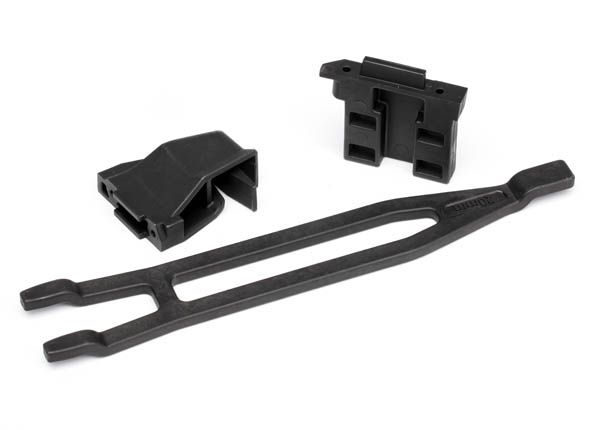&nbsp;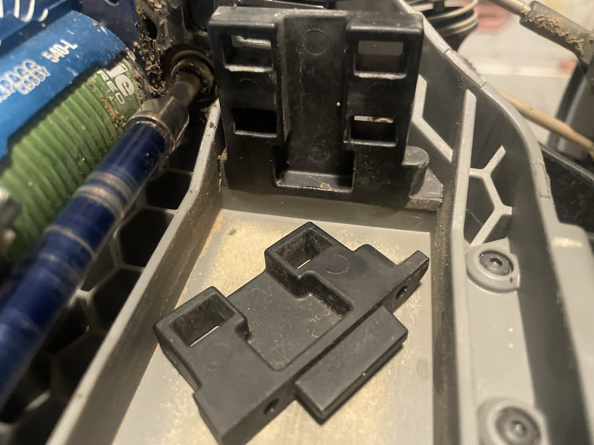&nbsp; <em>Holding it down: a stock kit, bar plus <strong>both retainers</strong> · the retainers fitted, showing the two hole heights · the 3D printed bar this car runs</em>  &nbsp;&nbsp;&nbsp; <em>The four packs that run here: Gens Ace Redline 6300 · CNHL Racing 5200 · CNHL Lightning 5500 · CNHL Ultra-Thin 6000</em>

---

## Table of Contents

- [Key Requirements](#key-requirements) — what a bar has to do on this car
- [The holder](#the-holder) — post geometry, the 22mm and 37mm hole positions
- [Holding the pack down](#holding-the-pack-down) — bars and straps in one table
- [Max battery size](#max-battery-size) — 152 × 48 × 44mm
- [The packs](#the-packs) — the four that run here, and why HV wins
- [Mike's notesheet](#mikes-notesheet) — the source for every number on this page
- [Notes](#notes)

---

## Key Requirements

| Requirement | Type | Why |
|---|---|---|
| **Pack fits inside 152 × 48 × 44mm** | Must | **The buying number**, and **height is the one that bites**. See [Max battery size](#max-battery-size) for where each figure comes from |
| **Holds the pack down over rough ground** | Must | A pack that shifts under braking moves the CG and can pull on the leads |
| **Has front and rear retainers** | Must | The retainers are what the bar lands on, and **they come with the hold-down kit** (7426 / 7426X), they are not moulded into the chassis. Each has two hole positions |
| **HV cells** | May | **The HV packs are the better ones here**, more top speed and less sag. Not a hard requirement, the standard packs still run |
| **Adjustable without buying anything** | May | Flipping the bar or moving it to the other hole is free, so most height changes should need no new part |

---

## The holder

**The retainers come with the hold-down kit, not with the chassis.** Both **7426** and **7426X** are sold as a bar **plus front and rear retainers**, so buying a bar buys the mounts too. Each retainer has **two hole positions**, and that choice matters more than which bar you own.

| Hole | Height to chassis floor | Note |
|---|---|---|
| **Lower** | **22mm** | The low mount, as supplied on the BL2S cars |
| **Upper** | **37mm** | **15mm above the lower hole**, the tall mount used on the 4S cars |

**Every bar here is 5mm thick**, the printed one included, and the inner span is **152mm**, which is what caps battery length.

> ⚠️ **LCG only.** Traxxas state both hold-downs are for the **low-CG 4X4 chassis** and **do not fit the standard chassis**. That suits this car's [7422 LCG tub](chassis_analysis.md); the full conversion kit is **7421**.

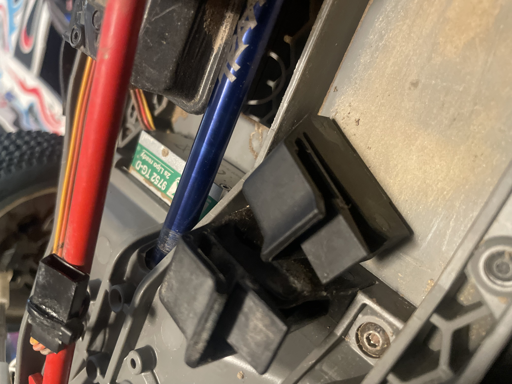&nbsp; <em>A retainer mounted in the chassis · the 3D printed bar that actually runs on this car</em>

---

## Holding the pack down

Two ways to do it, a **bar across the stock posts** or a **strap**. They are alternatives to each other, so they sit in one table.

> **Pick whatever you like, it genuinely does not matter.** This car runs the printed bar because **Mike prefers the plastic**. Of the strap kits the **Hot Racing LCF126X06** is the best one. None of it changes a lap time.

> *Spec format: Part · Type · Clearance · Material · Fits · Colors · Includes · Weight · Price*
>
> Bar clearances are **±1.5mm**, per the notesheet. Each stock bar is **embossed with two numbers, one per flip orientation**, so with the two post holes each bar gives four clearances.

| Retention | Spec | Pros / Cons | Photo / Link |
|---|---|---|---|
| ⭐ **3D printed bar** — *running* | **Part:** N/A (printed in house) **Type:** rigid bar **Clearance:** 🚧 not measured, but it flexes past the 44mm stock ceiling **Material:** printed plastic, **5mm thick** like the stock bars **Fits:** the stock retainers **Colors:** whatever is on the spool **Includes:** bar only, it reuses the retainers from a stock kit **Weight:** N/A 🚧 not weighed **Price:** filament only | Pro: **Flexes enough that a 47mm shorty goes in**, which no stock bar manages, and a shorty sits mid-tray where there is most room rather than out at the tight sides. Free to reprint, and the height changes by editing the model instead of buying a part  Con: **Never measured**, so its actual clearance is unrecorded. Plastic flex is doing the work, which is both why it fits and why it is the least positive clamp here |  |
| 🟢 **Traxxas 7426** — *in hand* | **Part:** **7426** **Type:** rigid bar **Clearance:** embossed **23 / 25mm**. **23 or 25mm** in the lower hole, **36 or 40mm** in the upper **Material:** plastic, 5mm thick **Fits:** ⚠️ **low-CG 4X4 chassis only, not the standard chassis**. 152mm span **Colors:** black, plus slate gray as **7426-SLGRY** **Includes:** **bar + front and rear retainers** **Weight:** N/A 🚧 **Price:** **$6.50 / kit** | Pro: The **finer pair of steps**, 23/25 low and 36/40 high, so it dials a pack in more precisely than the 7426X. Four usable heights from one part  Con: **Tops out at 40mm**, so it cannot hold anything near a 47mm shorty. The 2mm spread between its two low settings makes the flip barely worth doing down there | 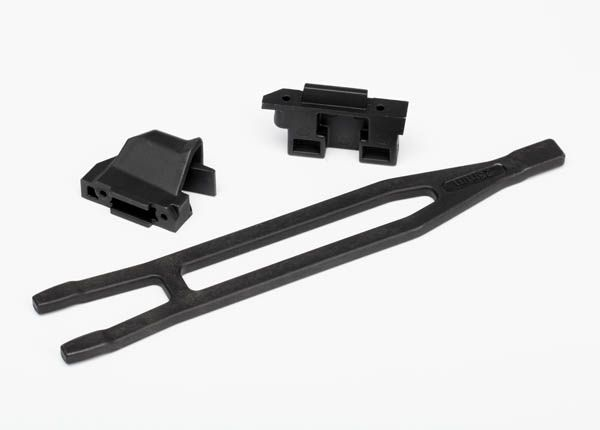&nbsp;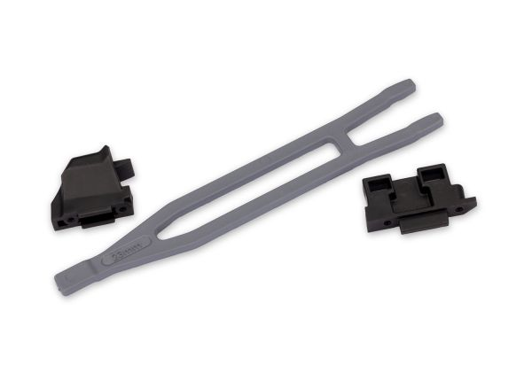 <em>the 7426 kit, bar plus both retainers · the same in slate gray, <strong>7426-SLGRY</strong></em> 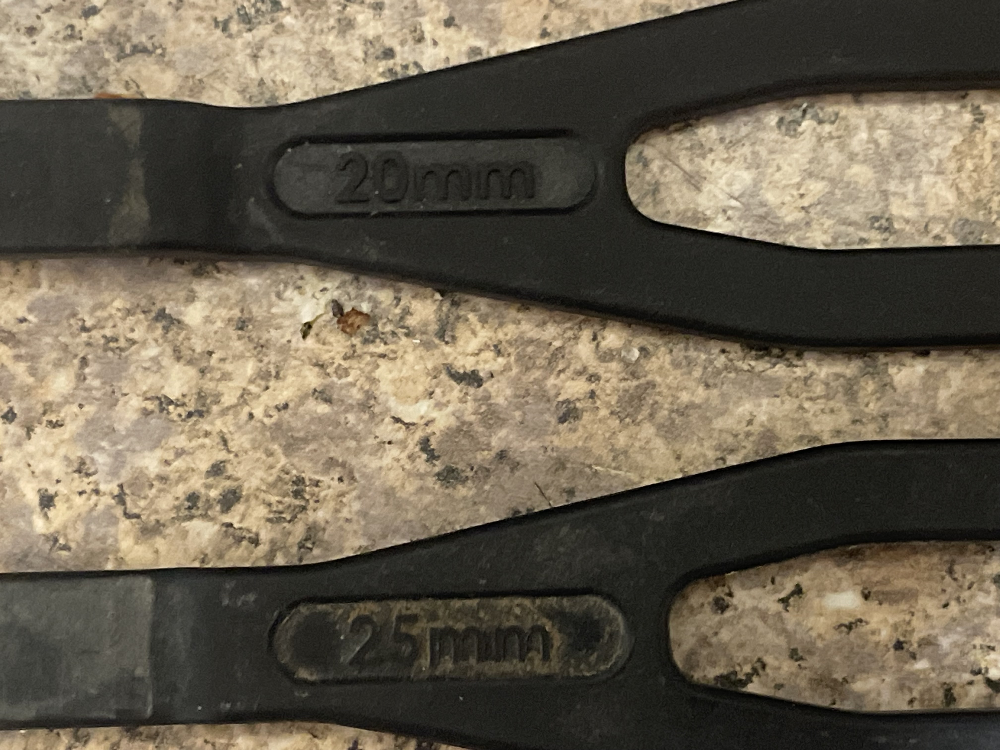&nbsp;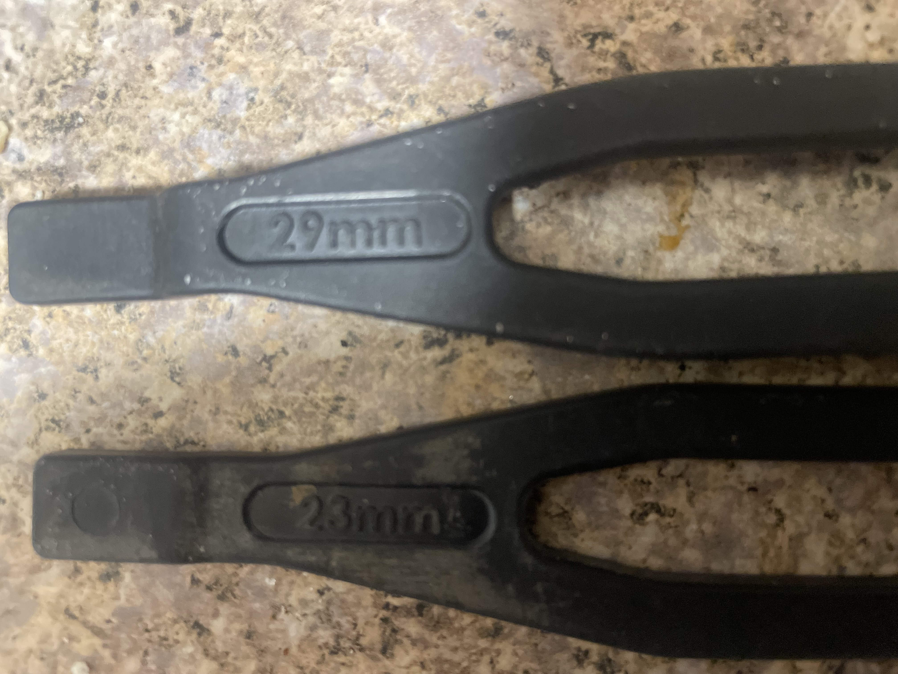 <em>25mm face · 23mm face (shown beside the 7426X in both shots)</em> |
| 🟢 **Traxxas 7426X** — *in hand, the extended one* | **Part:** **7426X**, "Low-CG **Extended** Battery Hold-Down w/ Retainers" **Type:** rigid bar, extended for taller packs **Clearance:** embossed **20 / 29mm**. **20 or 29mm** in the lower hole, **35 or 44mm** in the upper **Material:** plastic, 5mm thick **Fits:** ⚠️ **low-CG 4X4 chassis only, not the standard chassis**. 152mm span **Colors:** black **Includes:** **bar + front and rear retainers** **Weight:** N/A 🚧 **Price:** **$6.50 / kit** | Pro: **The widest range of the two, 20mm to 44mm**, covering both the lowest setting available and the stock ceiling. **44mm is the tallest any stock bar reaches here**  Con: **Coarser steps**, a 9mm jump between its two low settings, so less precise than the 7426. Even at its highest it is **3mm short of a 47mm shorty** |  <em>the 7426X kit: the extended bar plus the two retainers, which are different shapes and not interchangeable</em> 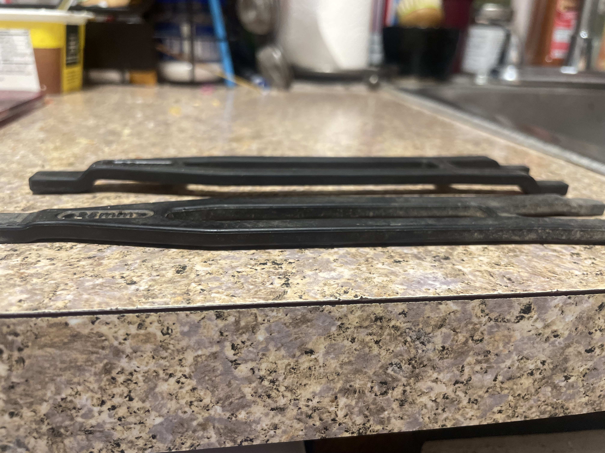&nbsp;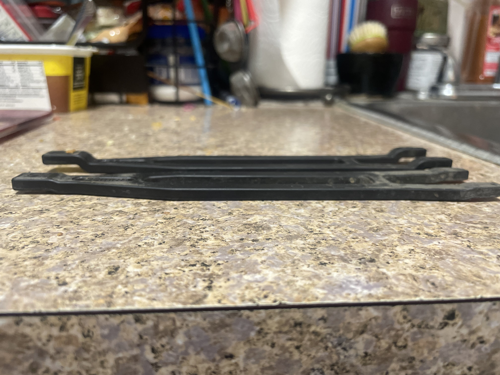 <em>Both bars edge on, showing the profile difference that produces the two heights</em> |
| 🔵 **Hot Racing LCF126X06** — *best of the strap kits, not fitted* | **Part:** **LCF126X06** (listed HRALCF126X06, UPC 083745540055) **Type:** low alloy base plates + long buckled velcro strap **Clearance:** any, the strap takes whatever height the pack is **Material:** blue anodised aluminum plates, woven strap **Fits:** Traxxas **Slash 4x4 LCG**, so it suits the [7422 LCG chassis](chassis_analysis.md) **Colors:** blue **Includes:** **2 base plates (front and rear differ)**, 4 countersunk screws, 1 strap with buckle **Weight:** N/A 🚧 not weighed **Price:** **$28.88** free shipping (also listed $30.23, eBay RCBoyz, item 375749960312) | Pro: **Beats the GPM on every count that matters.** **Less metal and much flatter**, so it sits lower and carries less mass, and the **longer buckled strap wraps the pack** rather than just pinning it. Velcro also sidesteps the 44mm ceiling entirely  Con: ⚠️ **`TE126X06` is the 2WD Slash version**, one character away, so order carefully. **Powerhobby sell an equivalent for this chassis at $24.74** free shipping (or $19.99 + $4.99), 🚧 part number not captured. Blue only, front and rear plates are not interchangeable, and 🚧 **"lighter" is read off the photo, not a scale** | 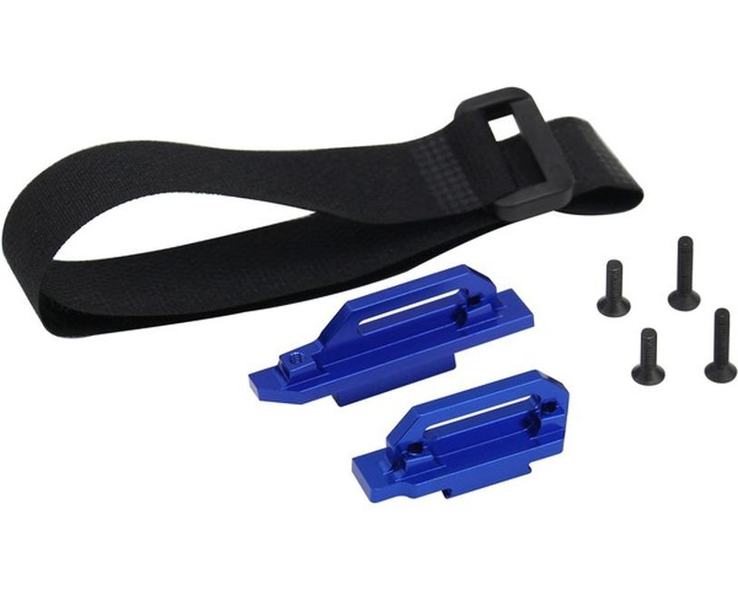 <em>the kit: 2 plates, 4 screws, strap</em> 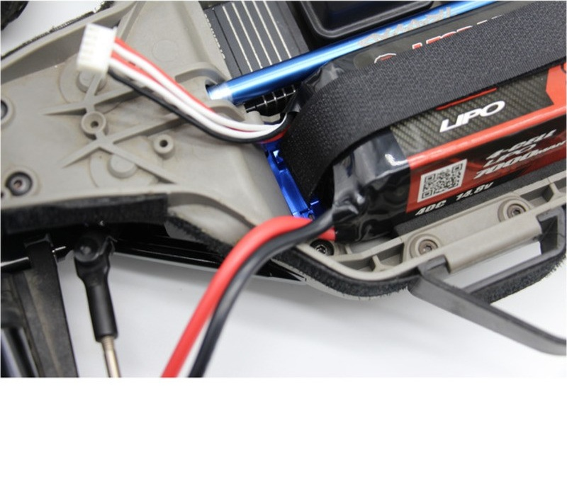&nbsp;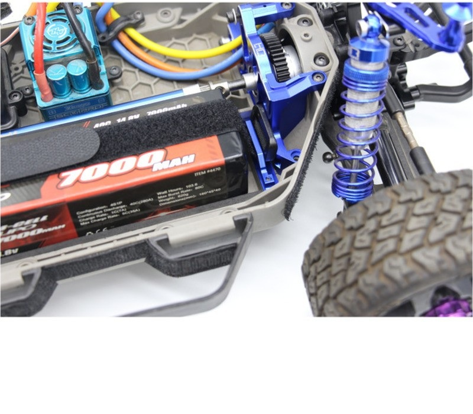 <em>front · rear, fitted. Listing photos, not this car, and the pack shown is 160 × 45 × 49mm, over this car's limit</em> |
| 🔵 **GPM TJ0126** — *taller and heavier than the Hot Racing* | **Part:** **TJ0126** **Type:** **two upright 7075-T6 alloy strap anchors plus a velcro strap**, not a rigid bar. The alloy parts are what the strap threads through **Clearance:** any, velcro **Material:** 7075-T6 aluminum anchors, woven strap **Fits:** Traxxas Jato / Slash **LOW-CG** (Ford Fiesta ST) **Colors:** black, silver, blue, red, orange, green **Includes:** 2 anchors, 4 countersunk screws, 1 strap **Weight:** N/A 🚧 not weighed **Price:** **$23.14** shipped (was $25.71, eBay HanHobby, item 820021371237); other sellers **$17.01 + $7.00**, much the same | Pro: **Six colours** against blue only for the Hot Racing, and machined 7075 anchors. Velcro takes any pack height, so the [44mm ceiling](#max-battery-size) stops mattering  Con: **Tall upright blocks, so more metal and a higher CG than the Hot Racing**, and its **shorter strap wraps the pack less well**, for about the same money. Ships from Shenzhen, 14 day returns | 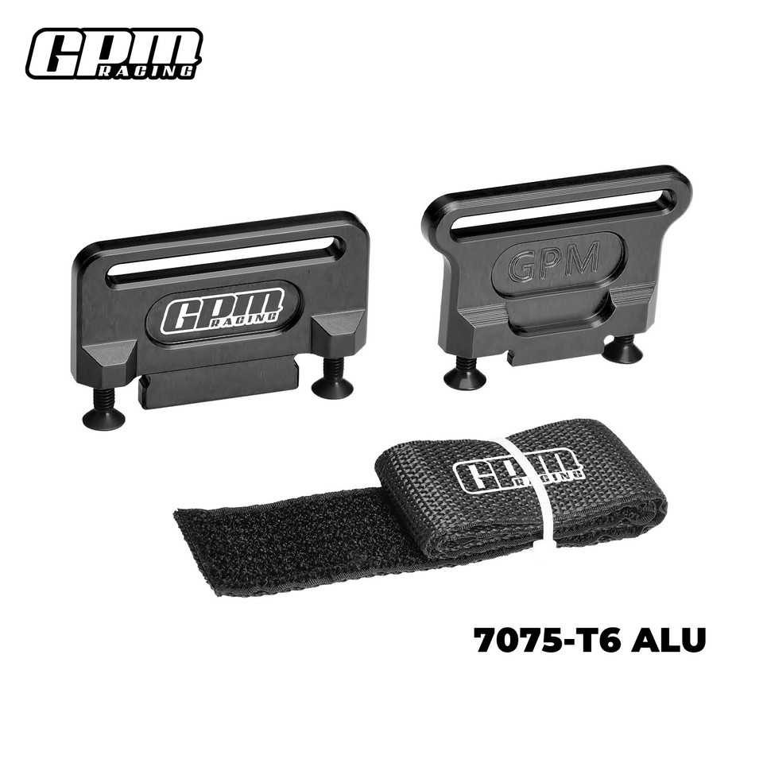&nbsp;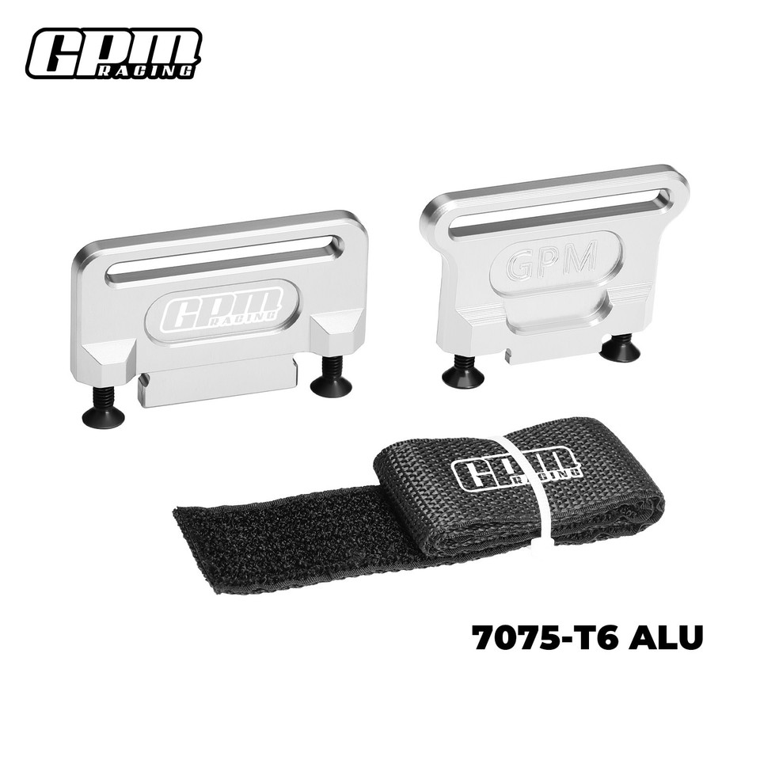&nbsp;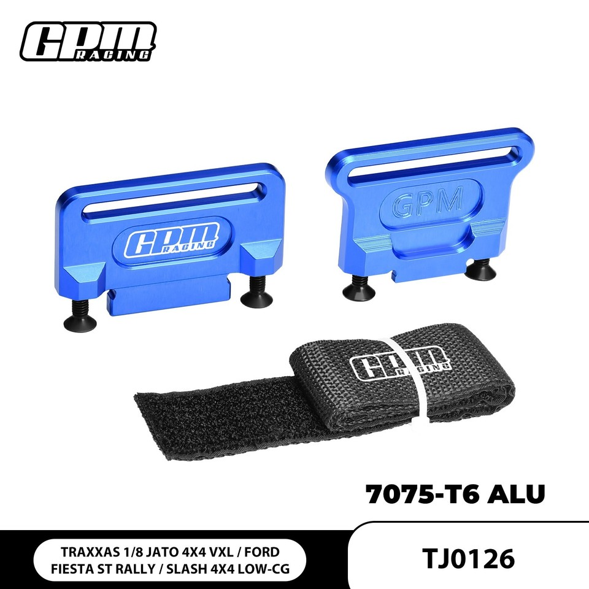&nbsp;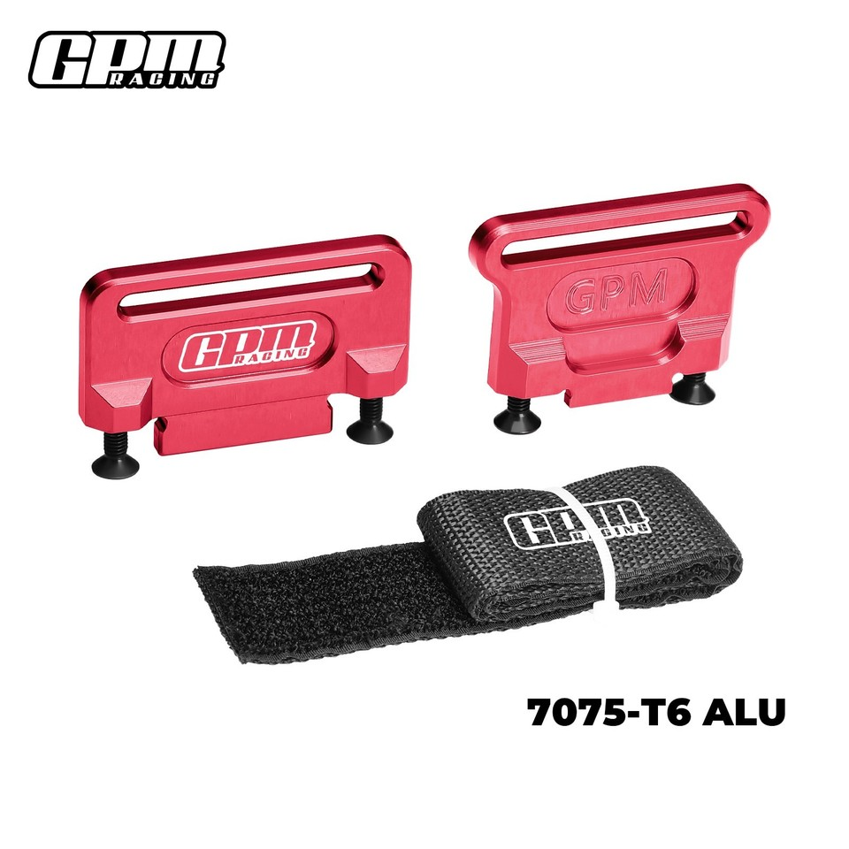&nbsp;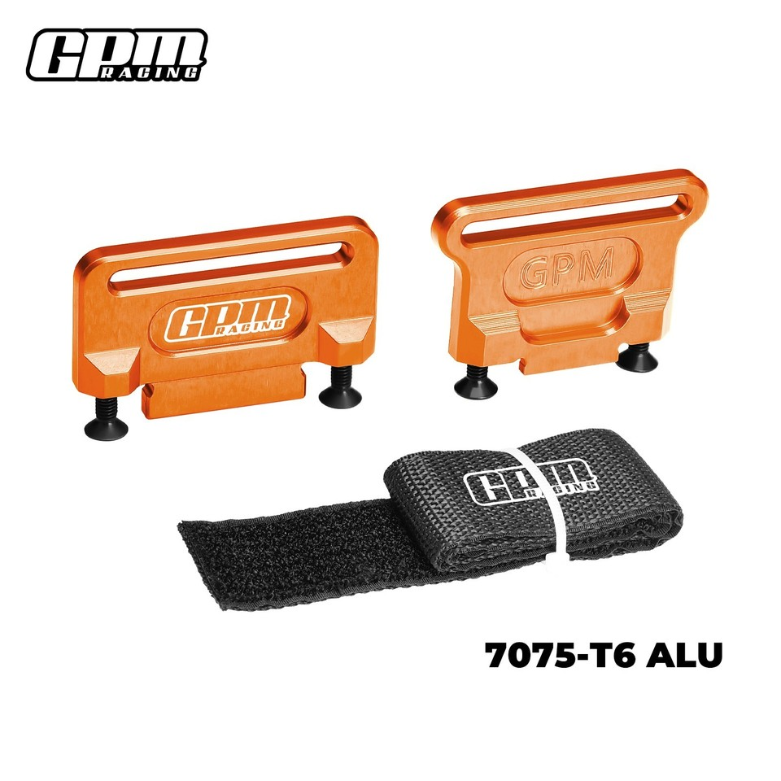&nbsp;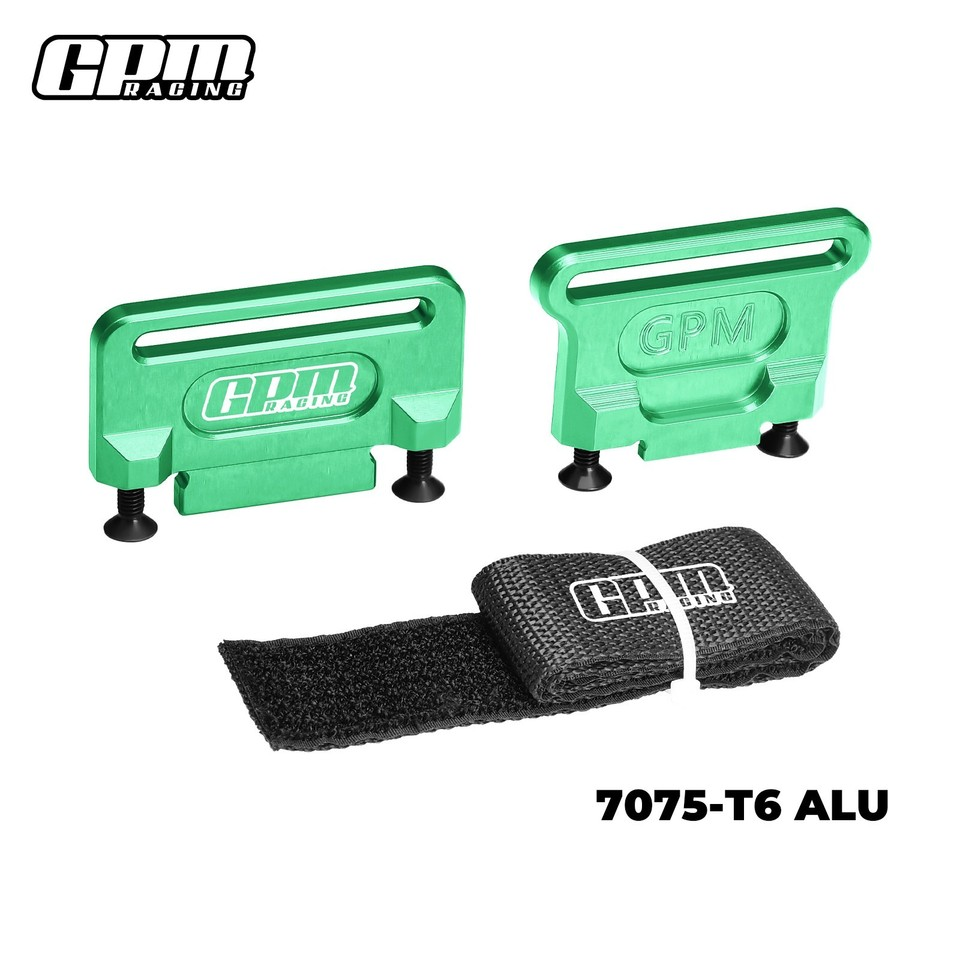 <em>black · silver · blue · red · orange · green</em> |
| 🔵 **Plain strap, generic** — *cheapest* | **Part:** N/A (generic) **Type:** strap only **Clearance:** any, velcro **Material:** woven strap with velcro **Fits:** anything with strap slots **Colors:** various **Includes:** strap only **Weight:** negligible **Price:** **$2.38 to $4.29** ([LEDGER](../../LEDGER.md) #39, #40) | Pro: **A few dollars and it holds a pack.** Takes any pack height, same as the others. Nothing to machine or print  Con: **No alloy anchors**, so it relies on whatever slots the chassis gives it. ⚠️ Note there is **no separate "Traxxas OE strap" to buy**, the OE arrangement is the plastic bar on the moulded posts, listed above | (no photo, generic webbing) |

---

## Max battery size

**L 152mm × W 48mm × H 44mm.** Each number comes from a different constraint:

| Dimension | Limit | Set by |
|---|---|---|
| **Length** | **152mm** | The bar's inner span |
| **Width** | **48mm** | Tray width |
| **Height** | **44mm** | The 7426X in the upper hole, high orientation, the tallest stock setting |

The notesheet also sketches the tray opening itself at **165 × 50mm**, which is the raw space before a bar goes on. The 152 × 48 × 44 figure is the one to buy against.

---

## The packs

**Soft case or hard case, either runs here**, unlike the FastAz which went hardcase-only because of the sand at Meldrum. That car is shorty-only too, so the two no longer buy to one shared spec.

> **The finding: the HV packs are the better ones.** Higher voltage (15.2V, 4.35V/cell) means more motor RPM and so more top speed than a standard 14.8V pack, and these are low internal resistance packs that sag less under a hard pull.

> *Spec format: Cells · Config · ROAR · Capacity · C-rating · Weight · Connector · Size · Price*

| Pack | Spec | Pros / Cons | Photo / Link |
|---|---|---|---|
| ⭐ **Gens Ace Redline 2.0 4S HV 15.2V 6300mAh 140C** — *on loan from the FastAz* | **Cells:** 4S HV / **15.2V** (4.35V/cell) **Config:** **4S1P** (confirmed on the listing) **ROAR:** ✅ brand on the list **Capacity:** 6300mAh (**95.76Wh**) **C-rating:** 140C (marketing) **Weight:** **452g** **Connector:** 5.0mm bullet **Size:** **139 × 47 × 37mm** full length hardcase **Price:** **$107.38** (2025-10-22) | Pro: **The best pack that runs here.** HV, low IR, light for a 6300, and at **37mm tall it clears the 44mm ceiling with 7mm to spare**. Never fitted the FastAz shorty-only spec, so it found its home on this car  Con: **5.0mm bullet**, the odd one out against the CNHL fleet's EC5. Needs an HV charger. **On loan**, it may just become Mike's outright |  |
| 🟢 **CNHL Ultra-Thin Racing LiHV 4S 15.2V 6000mAh 120C** — *hardcase* | **Cells:** 4S / **15.2V LiHV** **Config:** **4S1P** (printed on the label) **ROAR:** 🚧 not stated **Capacity:** 6000mAh **C-rating:** 120C (marketing) **Weight:** N/A 🚧 **Connector:** EC5 **Size:** **138mm** full length hardcase 🚧 height not measured **Price:** **$71.00** (2026-08-26) | Pro: **Most capacity of the CNHL three**, hardcase, and HV confirmed on the charger. Fits and works well  Con: **The worst measured IR of the group at ~4.47mΩ**, which works out around **11-19C true against the 120C on the label**. Priciest CNHL here |  <em>per-cell IR at 100% charge</em> |
| 🟢 **CNHL Lightning LiHV 4S 5500mAh 120C** — *soft case* | **Cells:** 4S / **15.2V LiHV** (per the listing) **Config:** 🚧 not stated **ROAR:** 🚧 not stated **Capacity:** 5500mAh **C-rating:** 120C (marketing) **Weight:** N/A 🚧 **Connector:** EC5 **Size:** N/A 🚧 not measured **Price:** **$54.46** (2026-08-26) | Pro: Fits and works well, mid capacity of the three, and the listing sells it as LiHV, so it should be in the better group  Con: **The only pack here never put on the charger for an IR check**, so its voltage class is listing-only and its true C is unknown |  |
| 🟢 **CNHL Racing Series 4S 5200mAh 90C** — *soft case* | **Cells:** 4S, **reads LiHV-4S (4.35V) on the charger** **Config:** 🚧 not stated **ROAR:** 🚧 not stated **Capacity:** 5200mAh **C-rating:** 90C (marketing) **Weight:** N/A 🚧 **Connector:** EC5 **Size:** N/A 🚧 not measured **Price:** **$52.51** (2026-08-26) | Pro: **Much the best IR of the group at ~2.23mΩ**, roughly **26-43C true**, so it holds voltage best under load despite carrying the lowest label rating. Cheapest pack here  Con: Smallest capacity. ⚠️ **Sold as a standard LiPo but the charger reads it as LiHV**, so the listing and the pack disagree, see the note below |  <em>per-cell IR mid-charge</em> |

### IR checks

Measured on the HOTA T6, using the [E-Revo IR-to-True-C method](../ERevo_1.0/battery_analysis.md#c-ratings-and-internal-resistance) (`max A = sag ÷ IR`, `true C = max A ÷ Ah`). **Informational only**, the CNHL packs are not in the shared cycle tracker.

| Pack | Per-cell IR | Average | True C | Label |
|---|---|---|---|---|
| **CNHL Racing 5200** (mid-charge) | 2.3 / 2.2 / 2.3 / 2.1 mΩ | **~2.23mΩ** | **~26-43C** | 90C |
| **CNHL Ultra-Thin 6000** (100% charge) | 4.5 / 4.3 / 4.6 mΩ (4th didn't register) | **~4.47mΩ** | **~11-19C** | 120C |

&nbsp; <em>CNHL Racing 90C 5200mAh, IR mid-charge · CNHL Ultra-Thin 120C 6000mAh, IR at 100%</em>

> ⚠️ **Every label here overstates the C-rating by a wide margin**, the 90C pack measuring better than the 120C one. **The cheapest pack has the best IR.** Treat the printed number as marketing and the IR as the real figure.

> **The listing and the charger disagree on the Racing 5200.** It is sold as a standard LiPo, but the charger reads **LiHV-4S (4.35V)**. Both CNHL packs that have been checked read HV, so the Lightning 5500 is probably HV too, but it has never been on the charger to confirm.

---

## Mike's notesheet

Every dimension on this page is transcribed from Mike's handwritten sheet. It is kept here as the source, so the numbers can be checked against the original rather than trusted second hand.

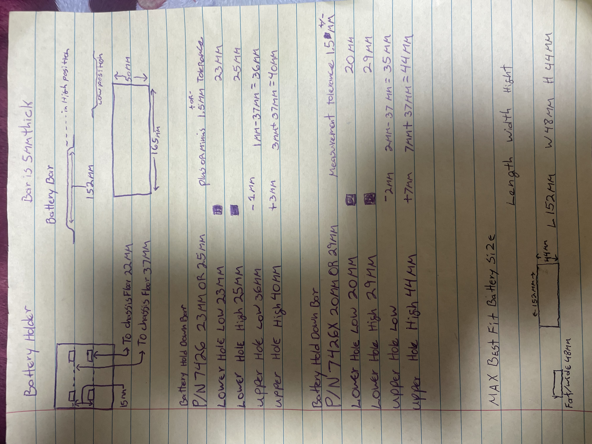 <em>Mike's battery holder and bar measurements, the source for this doc</em>

---

## Notes

- **Two parts, eight settings.** Between the two bars and the two retainer holes there are eight combinations from 20mm to 44mm. **Before buying a taller bar, try flipping the one you have or moving it to the other hole.**
- **Measure the pack, not the label.** Everything here carries **±1.5mm**, so a setting within 1.5mm of a pack's height is a maybe, not a yes.
- **Sharing works one way.** Shorties fit this car too, so anything bought to the FastAz spec runs here, while the full length packs stay on this one.
