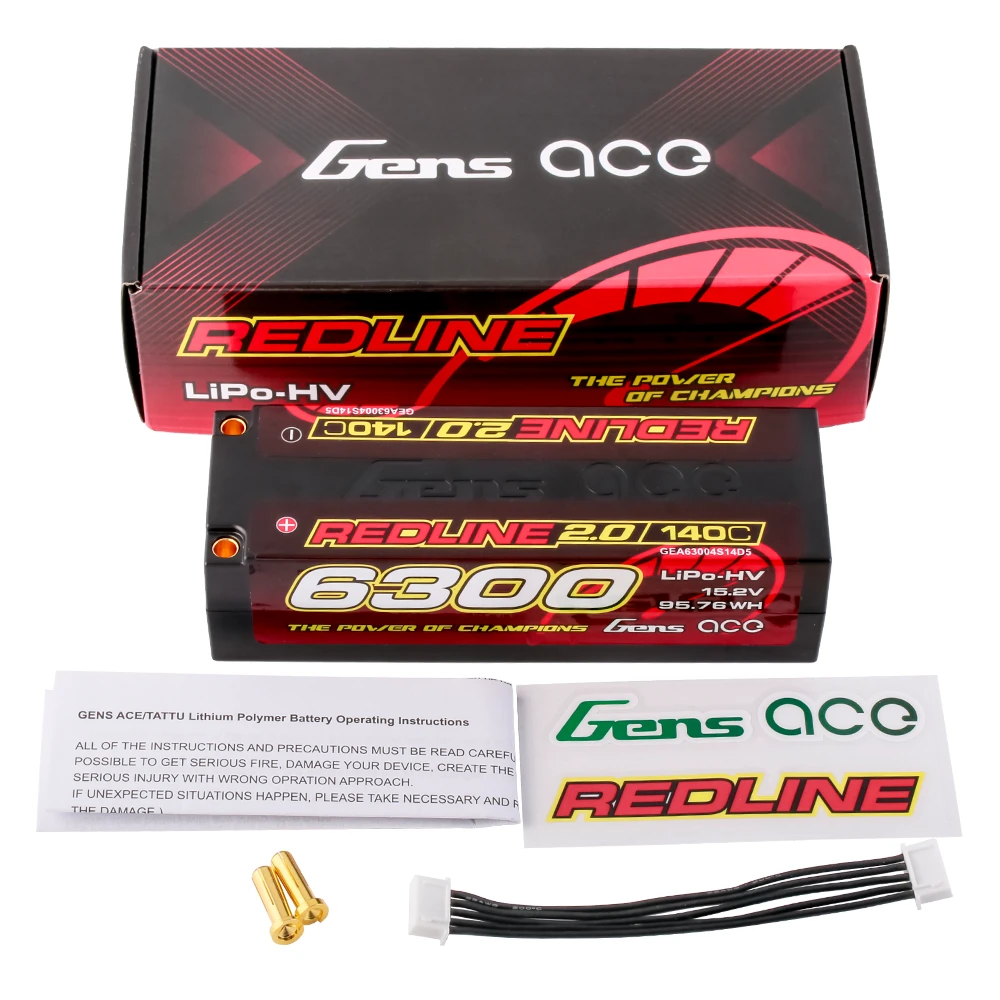
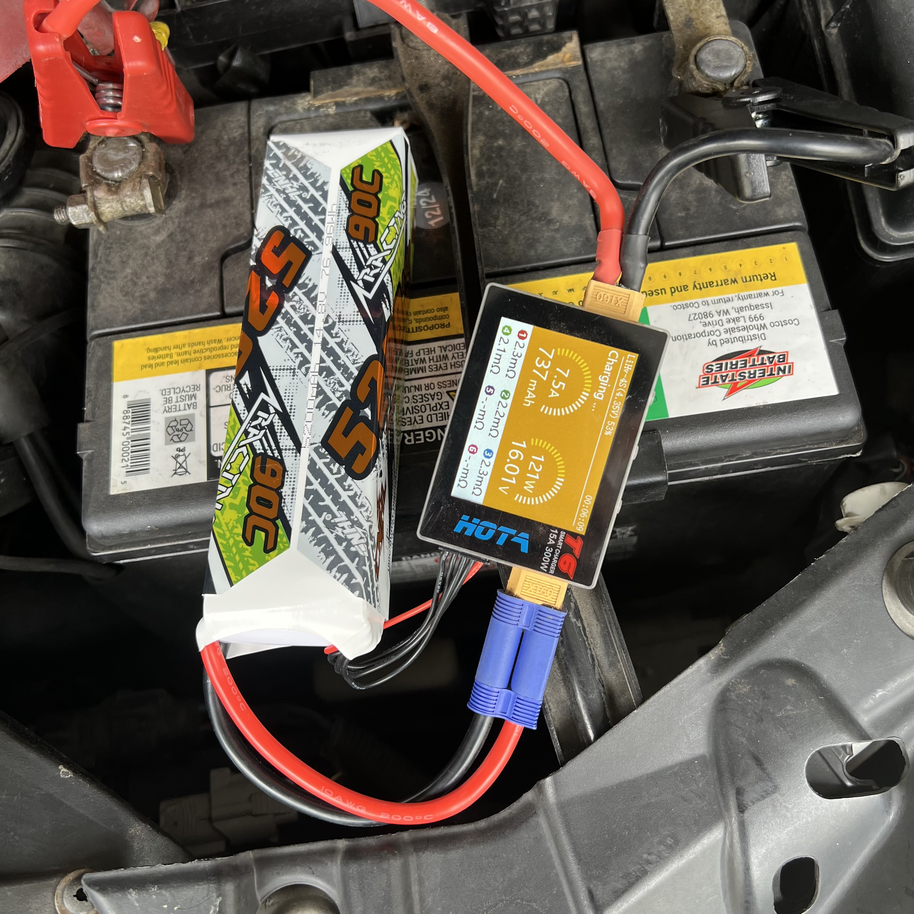

# Battery Selection — Jato4x4_Mike

> ⚠️ **Set the low-voltage cutoff to 3.5V per cell.** HV packs discharge linearly enough that they **still feel strong when nearly empty**, so nothing warns you and the cutoff is the only thing catching it. It costs almost no run time, see [Notes](#notes). (**14.0V across a 4S**, derived, since ESCs are configured per cell.)
>
> ⚠️ **4S is both the ceiling and the right call.** The [Castle 1412 in the combo](esc_motor_analysis.md) is rated **2-4S**, and Castle only allow 4S with conservative gearing and an eye on temperatures, so nothing above 4S goes in this car anyway. **But 4S is what you would pick here even without that limit**, see [Why 4S](#why-4s).
>
> **Four packs run here and all four fit. The HV ones are the better packs.** Two read oversize against the **152 × 48 × 44mm** envelope and still go in, because **length trades against height**.
>
> **How the pack is held down** is a separate question, in [`battery_mount_analysis.md`](battery_mount_analysis.md), which is also where that envelope is derived.

&nbsp;&nbsp;&nbsp; <em>The four packs that run here: Gens Ace Redline 6300 · CNHL Racing 5200 · CNHL Lightning 5500 · CNHL Ultra-Thin 6000</em>

---

## Key Requirements

| Requirement | Type | Why |
|:---|:---|:---|
| **Pack fits inside 152 × 48 × 44mm** | Must | **The buying number**, and **height is the one that bites**. See [Max battery size](battery_mount_analysis.md#max-battery-size) for where each figure comes from |
| **HV cells** | May | **The HV packs are the better ones here**, more top speed and less sag. Not a hard requirement, the standard packs still run |

---

## Why 4S

**4S is the class standard here**, and it wins against the cell counts either side of it.

| Instead of 4S | What it costs you |
|:---|:---|
| **6S** | **Less capacity and more weight** for the same pack. You pay in grams and run time for voltage this car cannot use anyway |
| **3S** | **Works, but pulls more current for the same power.** Watts are volts times amps, so dropping the volts means raising the amps, which puts more heat through the ESC, the motor and the wiring for the same result |

**The other half of it is support.** **4S is what 1/8 buggies run**, and it is the normal racing class, so **pack choice, availability and pricing are all at their best there**. Stepping either side of 4S narrows the shelf you can buy from.

**It is also about where the drivetrain gives up.** 4S is roughly as much as this drivetrain takes before the extra power starts costing parts, so it **balances performance against breaking things** instead of chasing the biggest number.

---

## The packs

**Soft case or hard case, either runs here**, unlike the FastAz which went hardcase-only because of the sand at Meldrum. That car is shorty-only too, so the two no longer buy to one shared spec.

> ⚠️ **The measured sizes do not all fit the stated envelope.** Dimensions come from the [FastAz pack comparison](../FastAzJato4x4/battery_analysis.md#pack-comparison), where these three were logged when they came off that car.
>
> | Pack | Size | Against 152 × 48 × 44mm |
> |---|---|---|
> | **Gens Ace 6300** | 139 × 47 × 37mm | ✅ clears on all three |
> | **Ultra-Thin 6000** | 138 × 47 × 37mm | ✅ clears on all three |
> | **Lightning 5500** | 149 × 51 × 31mm | ✅ fits, **51mm is 3mm over on paper but it is soft case and squeezes in** |
> | **Racing 5200** | 160 × 45 × 37mm | ✅ fits, **8mm past the flat span but it is low enough to pass under the bar's curve** |
>
> **The length limit is height dependent, which is why a straight envelope check is wrong here.** The bar curves up towards its ends, so **152mm is the span at full height**. A low pack goes under that curve and can run longer, which is exactly what the 160mm Racing 5200 does at 37mm tall. A straight bar handles it without trouble.

> **The finding: the HV packs are the better ones.** Higher voltage (15.2V, 4.35V/cell) means more motor RPM and so more top speed than a standard 14.8V pack, and these are low internal resistance packs that sag less under a hard pull.

> *Spec format: Cells · Config · ROAR · Capacity · C-rating · Weight · Connector · Size · Price*

| Pack | Spec | Pros / Cons | Photo / Link |
|:---|:---|:---|:---|
| ⭐ **Gens Ace Redline 2.0 4S HV 15.2V 6300mAh 140C** — *on loan from the FastAz* | **Cells:** 4S HV / **15.2V** (4.35V/cell) **Config:** **4S1P** **ROAR:** ✅ **Capacity:** 6300mAh (**95.76Wh**) **C-rating:** 140C (marketing) **Weight:** **452g** **Connector:** 5.0mm bullet **Size:** **139 × 47 × 37mm** full length hardcase **Price:** **$107.38** (2025-10-22) | Pro: **The best pack that runs here.** HV, low IR, light for a 6300, and at **37mm tall it clears the 44mm ceiling with 7mm to spare**. Never fitted the FastAz shorty-only spec, so it found its home on this car  Con: **5.0mm bullet**, the odd one out against the CNHL fleet's EC5. Needs an HV charger. **On loan**, it may just become Mike's outright |  |
| 🟢 **CNHL Ultra-Thin Racing LiHV 4S 15.2V 6000mAh 120C** — *hardcase* | **Cells:** 4S / **15.2V LiHV** **Config:** **4S1P** **ROAR:** ❌ **Capacity:** 6000mAh (91.20Wh) **C-rating:** 120C / 240C burst (marketing) **Weight:** **479g** **Connector:** EC5, 10AWG **Size:** **138 × 47 × 37mm** hardcase **Price:** **$71.00** (2026-08-26) | Pro: **Most capacity of the CNHL three**, hardcase, and HV confirmed on the charger. Fits and works well  Con: **The worst measured IR of the group at ~4.48mΩ**, which works out around **11-19C true against the 120C on the label**. Priciest CNHL here |  <em>the pack</em>  <em>per-cell IR at 100% charge</em> |
| 🟢 **CNHL Lightning LiHV 4S 5500mAh 120C** — *soft case* | **Cells:** 4S / **15.2V LiHV** (per the listing) **Config:** **4S1P** **ROAR:** ❌ **Capacity:** 5500mAh **C-rating:** 120C / 240C burst (marketing) **Weight:** **472g**, the lightest here **Connector:** EC5, 10AWG **Size:** **149 × 51 × 31mm** soft case **Price:** **$54.46** (2026-08-26) | Pro: Fits and works well, mid capacity of the three, and the listing sells it as LiHV, so it should be in the better group  Con: **The only pack here never put on the charger for an IR check**, so its voltage class is listing-only and its true C is unknown |  |
| 🟢 **CNHL Racing Series 4S 5200mAh 90C** — *soft case* | **Cells:** 4S, **reads LiHV-4S (4.35V) on the charger** **Config:** **4S1P** **ROAR:** ❌ **Capacity:** 5200mAh **C-rating:** 90C / 180C burst (marketing) **Weight:** **524g**, the heaviest here **Connector:** EC5, 10AWG **Size:** **160 × 45 × 37mm** soft case **Price:** **$52.51** (2026-08-26) | Pro: **Much the best IR of the group at ~2.23mΩ**, roughly **26-43C true**, so it holds voltage best under load despite carrying the lowest label rating. Cheapest pack here  Con: **Heaviest pack here at 524g**, and the longest at 160mm, though **being only 37mm tall it passes under the bar's curve and fits anyway**. ⚠️ **Sold as a standard LiPo and listed as 14.8V on the FastAz, but this car's charger reads it as LiHV**, so the sources disagree |  <em>the pack</em>  <em>per-cell IR mid-charge</em> |

### IR checks

Measured on the HOTA T6, using the [E-Revo IR-to-True-C method](../ERevo_1.0/battery_analysis.md#c-ratings-and-internal-resistance) (`max A = sag ÷ IR`, `true C = max A ÷ Ah`). **Informational only**, the CNHL packs are not in the shared cycle tracker.

| Pack | Per-cell IR | Average | True C | Label |
|---|---|---|---|---|
| **CNHL Racing 5200** (mid-charge) | 2.3 / 2.2 / 2.3 / 2.1 mΩ | **~2.23mΩ** | **~26-43C** | 90C |
| **CNHL Ultra-Thin 6000** (100% charge) | 4.5 / 4.3 / 4.6 / 4.5 mΩ | **~4.48mΩ** | **~11-19C** | 120C |

&nbsp; <em>CNHL Racing 90C 5200mAh, IR mid-charge · CNHL Ultra-Thin 120C 6000mAh, IR at 100%</em>

> ⚠️ **Every label here overstates the C-rating by a wide margin**, the 90C pack measuring better than the 120C one. **The cheapest pack has the best IR.** Treat the printed number as marketing and the IR as the real figure.

> **The listing and the charger disagree on the Racing 5200.** It is sold as a standard LiPo, but the charger reads **LiHV-4S (4.35V)**. Both CNHL packs that have been checked read HV, so the Lightning 5500 is probably HV too, but it has never been on the charger to confirm.

---

---

## Notes

- ⚠️ **The Gens Ace listing has width and height swapped.** Measured, the Redline 6300 is **47mm wide and 37mm tall**, which is what the table above records. Taking the published string at face value makes the pack look 10mm taller than it is, and on a car with a **44mm ceiling** that turns a pack that fits into one that looks over.
- **Sharing works one way.** Shorties fit this car too, so anything bought to the FastAz spec runs here, while the full length packs stay on this one.
- ⚠️ **Low-voltage cutoff: 3.5V per cell, and the HV discharge curve is the reason.** These packs run **more linearly**, so they keep enough punch to drive normally right to the end. **The pack feels strong right to the end**, which is exactly what makes over-discharging easy, and a hard cutoff is the only thing that catches it.
- **3.5V costs almost no run time.** In practice the pack is coming off at **3.6 to 3.8V** anyway, and **most of the usable run sits above 3.6V**, so the cutoff lands just under where the pack has already stopped being worth driving. Applies to the standard packs too. The HV ones charge to 4.35V a cell rather than 4.2V, so the top of the range moves but the floor does not.
- **Hardcase is the likely direction.** Two of the four packs here are soft case, and soft packs are what chafe: grit works into the tray and wears the shrink wrap. **Moving to hardcase, the CNHL hardpack being the obvious one, would remove that worry entirely.** It is the same reasoning that pushed the [FastAzJato4x4](../FastAzJato4x4/battery_analysis.md) to hardcase-only for the sand at Meldrum, so this car would be catching up.
