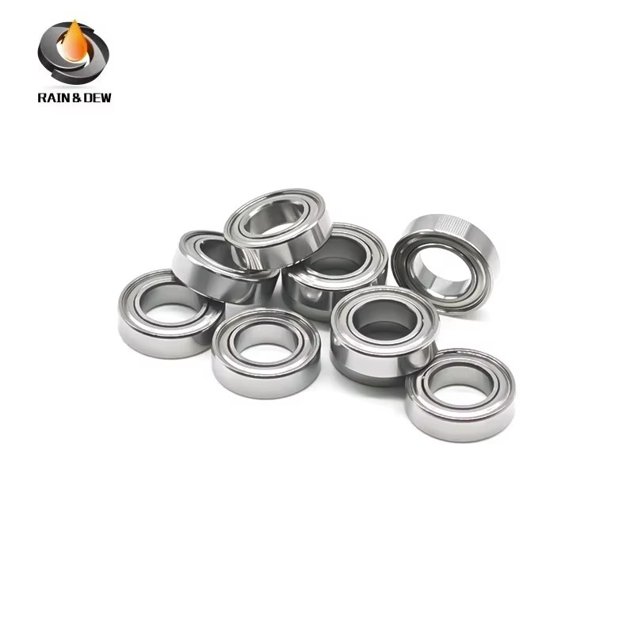
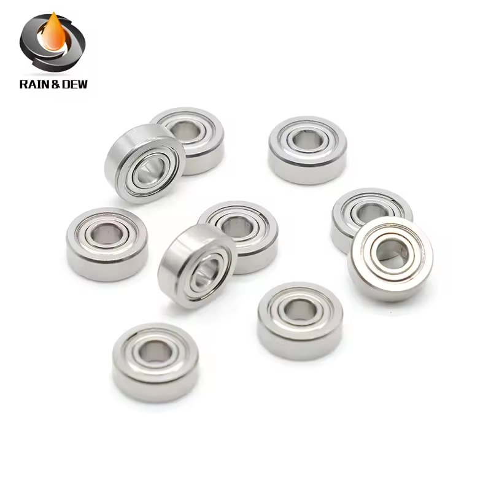

# Bearings Reference — Jato4x4_Mike

Not a tuning decision, just the list of bearings this car runs. The baseline is the **Traxxas Jato 4x4 BL-2s (90154-4)** kit, same as the [FastAzJato4x4](../FastAzJato4x4/bearings_reference.md), because both are the same 1/8-class platform. Run sealed (rubber-shielded, **2RS**) bearings throughout for offroad, **with one exception on this car**: the four hub bearings are **ZZ metal-shielded**, see [the hub bearing](#the-hub-bearing-s61810zz).

> **This car and the FastAz split at exactly one position, the hub.** Both run custom axles that need a **10mm ID** where the EHD hubs came with a **12×18×4**. This car **opens the hub up** and drops a bare **10×18×5** straight in. The FastAz **fills the pocket down** with a sleeve and runs a **10×15×4**. Same problem, two answers.

---

## This car, as built

The hub corners run a **bare 10×18×5**, which is 5mm thick against a 4mm pocket, so **1mm has to come out of something**. On this car it comes out of the **17mm hex adapters**, which get shaved down. **The hub carriers themselves stay stock.**

| Size (mm) | Qty | Where on this car |
|---|---|---|
| **10×18×5** ⚙️ | 4 | **Hub / axle corners, bare, direct into the EHD pocket. The mod** |
| **6×12×4** | 6 | Steering blocks (front), axle carriers (rear) |
| **10×15×4** | 4 | Diff outdrives |
| **12×18×4** | 1 | Transmission / centre driveline |
| **8×16×5** | 2 | Diff inputs, one front one rear |
| **5×8×2.5** | 4 | Steering bellcrank (**TRA5114**, kept as bearings on this car) |
| **5×11×4** | 1 | Centre / slipper |

**Total: 22 bearings**, across **7 distinct sizes**. **The motor carries its own bearings on top of these**, see [the motor bearing](#the-motor-bearing-s605zz).

> **Note the bellcrank difference.** The FastAz swapped its four **TRA5114** bellcrank bearings for **TRA3775 Oilite bushings**, because a bellcrank only rocks through a small arc and the balls dig into one spot instead of rolling onto fresh metal. **This car still runs the bearings there**, so it is a known future failure point rather than a solved one.

---

## Why this route

Three places the 1mm can come from, and this car picked the second:

| Route | What gets cut | Reversible | Who runs it |
|---|---|---|---|
| **Sleeve the pocket down** | Nothing, you make an 18→15mm sleeve | ✅ yes | [FastAzJato4x4](../FastAzJato4x4/bearings_reference.md) |
| ⭐ **Shave the 17mm hex adapters** | The adapters | ❌ no | **This car** |
| **Deepen the carrier pocket** | 1mm off the carrier, needs a lathe or mill | ❌ no | Nobody, tooling |

**The argument for this route is that there is nothing to make.** No sleeve to print or turn, no press fit to get square. Buy the bearing, shave the adapters, done. The cost is that **the cut is permanent** and the adapters are the part you sacrifice.

**The argument against** is that **10×18×5 is the harder bearing to source.** It is a completely standard size, it is just not one RC cars use, so it comes from a bearing supplier rather than with a hobby order. The FastAz route reuses a **10×15×4** that is already in the parts box for the diff outdrives.

> ⚠️ **Deepening the carrier pocket is technically the best answer** and is bearing-identical to this car, since both end up on the **10×18×5**. It is not used here only because keeping a 1mm cut square in an alloy carrier wants a lathe or mill, and off-axis is worse than either other route.

---

## The hub bearing (S61810ZZ)

The one part that makes this car's route work, and the one bearing here that is **not** rubber sealed.

| Field | Value |
|---|---|
| **Part** | **S61810ZZ**, 10×18×5mm |
| **Material** | Stainless steel |
| **Precision** | **ABEC-9** |
| **Seal** | ⚠️ **Double metal shield (ZZ)**, not 2RS rubber |
| **Lubrication** | Pre-greased |
| **Sold as** | 10 pcs per lot |
| **Source** | AliExpress, **Speed Bearing Store** |
| **Price paid** | **$14.45 / 10-pack** = **$1.45 each** |
| **Listed now** | **$20.55 / lot**, or **$14.88 / lot** at 3+ lots |

 <em>S61810ZZ 10×18×5, stainless, double metal shield. Listing photo, watermarked <strong>RAIN &amp; DEW</strong> though the store is Speed Bearing Store, so the store is not the brand</em>

> ⚠️ **ZZ is a metal shield, not a rubber seal.** Every other bearing on these cars is **2RS** rubber sealed, chosen specifically to keep grit and water out for offroad running. **The hub corners are the most exposed position on the car**, and they are the one place running the lesser seal. Worth watching, and worth buying the 2RS version of this size if one turns up.

### What it costs

| Size (mm) | On the car | Unit price | Line cost | Source |
|---|---|---|---|---|
| **10×18×5** (S61810ZZ, stainless) | 4 | **$1.45** | **$5.80** | $14.45 / 10-pack paid |

**The hub bearings are the expensive four on this car** at $1.45 each, against **$0.21 to $0.79** for every other size on the [FastAz list](../FastAzJato4x4/bearings_reference.md#what-the-bearings-cost). That is the real price of this route: about **$4.60 more** than the four sleeved 10×15×4 would cost, plus the permanently shaved adapters, in exchange for having nothing to fabricate.

🚧 The remaining sizes on this car have not been costed separately. They match the FastAz sizes, so the [FastAz cost table](../FastAzJato4x4/bearings_reference.md#what-the-bearings-cost) is the closest figure until this car's own orders are logged.

---

## The motor bearing (S605ZZ)

**The 22 above are chassis bearings. The motor has its own, and on this car they are the ones that actually wear out.**

 <em>S605ZZ 5×14×5, double metal shield. Same <strong>RAIN &amp; DEW</strong> brand as the hub bearing, bought from a different store</em>

| Field | Value |
|---|---|
| **Part** | **S605ZZ**, 5×14×5mm |
| **Fits** | Castle Creations **1412 3200KV**, established by fitting one |
| **Material** | ⚠️ **the listing contradicts itself**, the title and overview say **stainless SUS440**, the spec table says **bearing steel** |
| **Precision** | **ABEC-9** |
| **Seal** | **Double metal shield (ZZ)** |
| **Lubrication** | Pre-greased |
| **Sold as** | 10 pcs per lot |
| **Source** | AliExpress, **Bearing Solution Store**, brand **raindew** |
| **Price** | **$17.06 / 10-pack** = **$1.71 each**, list $17.89 |

> ⭐ **ABEC-9 over stock, and the reason is life rather than speed.** **The stock Castle bearings work, they just burn up quickly.** These last longer in the same motor. ABEC is a precision grade and not a durability rating, so the real gain is the **stainless and the flush shielding**, which leaves dirt and water much less of a way in. **Keeping the motor cool still matters**, the bearing is not a substitute for that.

⚠️ **Castle does not publish the 1412's bearing sizes.** The [FastAz motor table](../FastAzJato4x4/motor_analysis.md) records Castle's as *"NMB, size not published"*, so **5×14×5 comes from fitting one, not from a spec sheet**. For scale, the Tekin Pro4 in that same table runs **5×14×5 front with 5×11×5 rear**, so a motor of this class usually takes two different sizes. 🚧 **The 1412's rear bearing size is not recorded here**, only the 5×14×5.

⚠️ **A failed bearing does not stay a bearing problem.** The motor itself effectively lasts forever, the bearings do not, and **when one lets go it takes the rotor with it**. That turns a **$1.71** part into a **whole replacement motor**. Mike has already paid **$94.00** for a non-warranty RMA 1412 ([LEDGER](../../LEDGER.md) #83), though 🚧 the cause of that one is not recorded. **This is exactly why the packs get counted**: catching a bearing before it fails is the difference between a $1.71 job and a $94 one.

**How long they last is still an open question.** They went in **~2026-09-06**, first run **2026-09-12**, and the car has run **4 battery packs** on them since. The count is logged in [`maintenance/README.md`](../../maintenance/README.md) until a set actually wears out and turns this into a real interval. See [`motor_analysis.md`](motor_analysis.md#motor-bearing-service).

---

## Bearings by position

Since **a bearing position does not disappear when you change what sits in it**, every route totals 22. Only the hub corners differ.

| Position | Stock BL-2S | This car (Mike's) | FastAzJato4x4 |
|:---|:---:|:---:|:---:|
| **Hub / axle** | **12×18×4** ×4 | **10×18×5** ×4 **direct** | **10×15×4** ×4 in an **18 × 15 × 4mm sleeve** |
| What it costs | nothing, it's stock | **shaving the 17mm hex adapters** | printing or turning a sleeve |
| Bearing availability | common | **standard size, just not an RC one** | **already in the parts box** |
| Distinct sizes | 6 | **7** | **6** |
| **Reversible?** | n/a | ❌ no, the adapters are cut | ✅ yes, pull the sleeve |
| Steering blocks / carriers | 6×12×4 ×6 | 6×12×4 ×6 | 6×12×4 ×6 |
| Diff outdrives | 10×15×4 ×4 | 10×15×4 ×4 | 10×15×4 ×4 |
| Diff inputs | 8×16×5 ×2 | 8×16×5 ×2 | 8×16×5 ×2 |
| Transmission / centre | 12×18×4 ×5 total | 12×18×4 ×1 | 12×18×4 ×1 |
| Steering bellcrank | 5×8×2.5 ×4 (TRA5114) | 5×8×2.5 ×4 (TRA5114) | **TRA3775 Oilite bushings ×4** |
| Centre / slipper | 5×11×4 ×1 | 5×11×4 ×1 | 5×11×4 ×1 |
| **Total** | **22** | **22** | **22** (18 bearings + 4 bushings) |

&nbsp;&nbsp;&nbsp; <em>TRA5117 6×12×4 · TRA5119 10×15×4 · TRA5120A 12×18×4 · S61810ZZ 10×18×5, this car's hub bearing</em>

---

## Notes

- **The hub bearings are the one weak seal on the car.** They are **ZZ metal-shielded** where everything else is **2RS rubber**, and they sit in the most grit-exposed position. That is a consequence of picking a size RC cars do not use: you take the seal type the bearing supplier offers. If a **10×18×5 2RS** shows up, buy it.
- **Store is not the brand.** The listing photo is watermarked **RAIN & DEW** but it ships from **Speed Bearing Store**. Search the store and the part number rather than a brand name, the same rule as the [Kforce tires](../FastAzJato4x4/wheel_analysis.md).
- **The hexes are the consumable here.** Shaving them is what buys the bigger bearing, so treat a shaved 17mm hex as a wear part. See [`hub_analysis.md`](hub_analysis.md#17mm-wheel-hexes) for which hex and why the solid screw-pin design makes the cut riskier.
- **The bellcrank bearings are a known weak spot that has not been addressed.** The FastAz moved to Oilite bushings after the bearings chewed the steering post. The same failure is available on this car.
- **Sizes and quantities are inherited, not independently verified.** The FastAz list was checked against the Avid kit for the Jato 4x4 BL-2S (90154-4) and the Traxxas exploded views. This car shares the platform, so the same counts apply, but **this car's own bearings have not been physically counted**.
