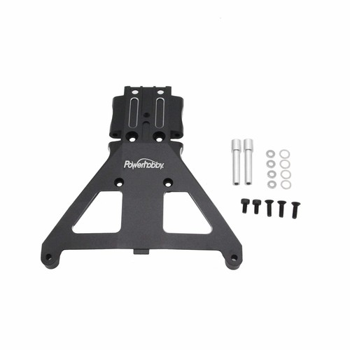

# Chassis Selection — Jato4x4_Mike

> **Running: the stock plastic chassis with a Powerhobby aluminum front bulkhead.** This is the biggest divergence from the [FastAzJato4x4](../FastAzJato4x4/chassis_analysis.md), which went carbon fiber, and it is the decision that everything else on this car follows from. Plastic **flexes rather than cracking**, it was already here so there is nothing to buy, and one alloy bulkhead covers the part that actually fails. **The honest cheap route.**
>
> ⚠️ **This choice is why several of this car's docs cannot be shared with the FastAz.** The battery bars, tray and max pack size only exist because there is a moulded plastic tub, see [`battery_analysis.md`](battery_analysis.md).

 <em>Powerhobby aluminum front bulkhead, the one bought part on an otherwise stock chassis</em>

---

## Key Requirements

| Requirement | Type | Why |
|---|---|---|
| **Survives the front bulkhead load** | Must | The front is where bulkheads get loaded and where the plastic one gives up |
| **Takes metal arms without stripping** | Must | FLM arms strip a *plastic* bulkhead, so if metal arms go on, the front has to be alloy |
| **Costs as close to nothing as possible** | Must | This is the budget half of the pair. The whole point is not buying a carbon kit |
| **Keeps the stock battery tray** | May | The tray and hold-down posts are moulded in, and this car uses them (see [`battery_analysis.md`](battery_analysis.md)) |

---

## Comparison

> *Spec format: Material · CG · Fits · Includes · Weight · Price*

| Chassis | Spec | Pros / Cons | Photo / Link |
|---|---|---|---|
| ⭐ **Stock plastic chassis** — *running* | **Material:** moulded plastic **CG:** stock height **Fits:** native Jato 4x4 **Includes:** battery tray + moulded hold-down posts **Weight:** N/A 🚧 not weighed **Price:** **$0**, already on the car | Pro: **Free, and plastic flexes instead of cracking.** Keeps the moulded battery tray and hold-down posts, which is what makes the [bar system](battery_analysis.md) work. Nothing to buy, nothing to fit  Con: Flexes more than carbon, and the **front bulkhead area is the known failure point**, which is why the alloy bulkhead goes on. Heavier than a CF deck |  🚧 save as `src/chassis_stock_plastic_jato4x4.jpg` |
| ⭐ **Powerhobby aluminum front bulkhead** — *running* | **Material:** aluminum **CG:** N/A **Fits:** Jato 4x4 / Slash 4x4 front **Includes:** bulkhead only **Weight:** N/A 🚧 not weighed **Price:** **~$36.99** standalone | Pro: **Covers the one part that actually breaks** without buying a chassis. On the FastAz this came bundled with the CF kit; here it is the standalone part. **It is what makes metal arms survivable** on a plastic chassis  Con: The only part on this car that had to be bought for the chassis. ~$36.99 is a real chunk of a budget build |  |
| 🚫 ~~**AliExpress CF LCG chassis**~~ — *the FastAz route, not taken* | **Material:** carbon fiber **CG:** low (LCG) **Fits:** Slash 4x4 pattern **Includes:** aluminium battery holder + straps, front bulkhead **Weight:** see [FastAz](../FastAzJato4x4/chassis_analysis.md#chassis-comparison) **Price:** see [FastAz](../FastAzJato4x4/chassis_analysis.md#price-history) | Pro: Lower CG, stiffer, and its aluminium holder and straps **remove the battery height limit entirely**. Bundles the front bulkhead  Con: **Costs money this build is not spending**, and carbon cracks where plastic flexes. Loses the moulded tray, so none of this car's [bar geometry](battery_analysis.md) would apply |  |

---

## Notes

- **Plastic plus one alloy bulkhead is the honest cheap route.** It covers the part that fails and skips the part that does not. Anyone pricing a Jato build should look at this before a carbon kit.
- **The bulkhead is not optional if metal arms go on.** FLM arms strip a plastic bulkhead, which is exactly why the alloy front matters here. See the [FastAz arm analysis](../FastAzJato4x4/arm_analysis.md).
- **This decision propagates.** The moulded tray and hold-down posts are chassis features, so the [battery bar geometry](battery_analysis.md) is unique to this car and does not transfer to the FastAz in either direction.
- **Nothing here is weighed yet.** Neither the stock chassis nor the bulkhead has a figure, so the weight case against carbon is currently reasoning rather than measurement.
