# Chassis Selection — Jato4x4_Mike

> **Running: the Traxxas 7422 LCG plastic chassis, a Powerhobby aluminum front bulkhead and a steel VG-style centre brace** (brace options and the recommendation are in [Chassis bracing](#chassis-bracing)). This is the biggest divergence from the [FastAzJato4x4](../FastAzJato4x4/chassis_analysis.md), which went carbon fiber, and it is the decision that everything else on this car follows from. Plastic **flexes rather than cracking**, and the spend stays tiny: **$75.98 for the whole chassis side**, with the two bought upgrades going on the two parts that actually break. **The honest cheap route.**
>
> **The chassis itself came off a running Slash 4x4.** Slash 4x4 and Jato 4x4 are the **same platform**, so the tub, bulkheads and brace all carry over. Only the **towers, shocks and wing** differ between the two.
>
> ⚠️ **This choice is why several of this car's docs cannot be shared with the FastAz.** The battery bars, tray and max pack size only exist because there is a moulded plastic tub, see [`battery_mount_analysis.md`](battery_mount_analysis.md).

&nbsp;&nbsp;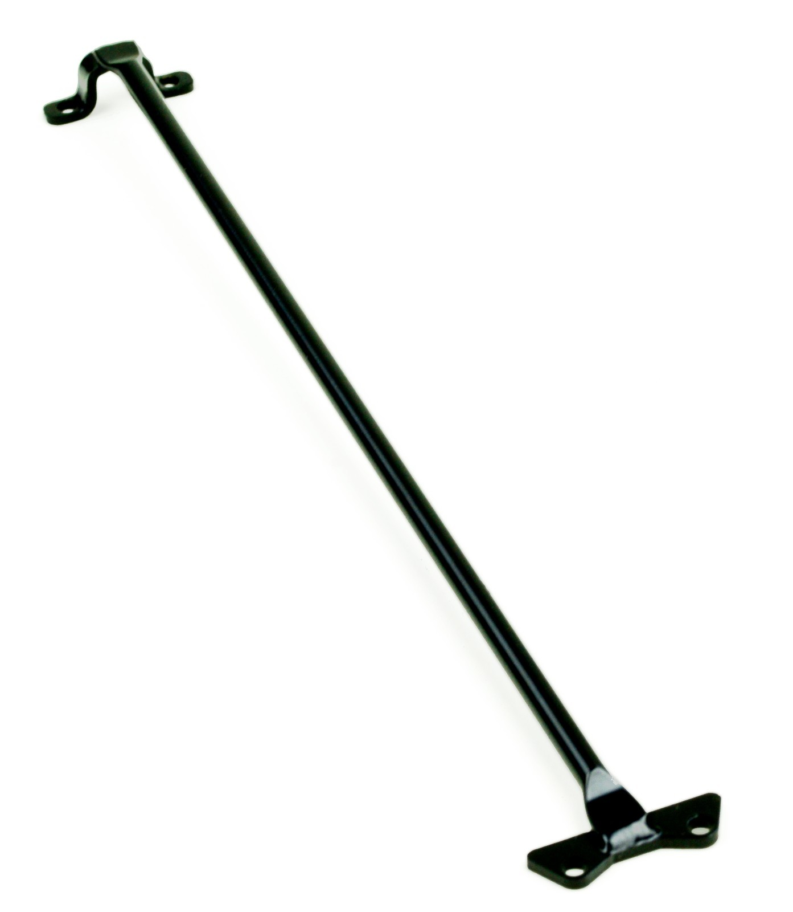 <em>The three parts that make up this chassis: Traxxas 7422 LCG tub ($20) · Powerhobby alloy front bulkhead ($36.99) · steel VG-style centre brace ($18.99)</em>

---

## Key Requirements

| Requirement | Type | Why |
|:---|:---|:---|
| **Survives the front bulkhead load** | Must | The front is where bulkheads get loaded and where the plastic one gives up |
| **Takes metal arms without stripping** | Must | FLM arms strip a *plastic* bulkhead, so if metal arms go on, the front has to be alloy |
| **A centre brace that does not snap** | Must | The **Jato** OE brace breaks often enough that replacing it is routine. The **Slash came with none at all**, so from a Slash donor it is a part you add, not replace |
| **Costs as close to nothing as possible** | Must | This is the budget half of the pair. The whole point is not buying a carbon kit |
| **Keeps the stock battery tray** | May | The tray and hold-down posts are moulded in, and this car uses them (see [`battery_mount_analysis.md`](battery_mount_analysis.md)) |

---

## Comparison

> *Spec format: Material · CG · Fits · Includes · Weight · Price*

| Chassis | Spec | Pros / Cons | Photo / Link |
|:---|:---|:---|:---|
| ⭐ **Traxxas 7422 LCG plastic chassis** — *running* | **Material:** composite nylon **CG:** **LCG** (low centre of gravity) **Fits:** Slash 4x4 / Jato 4x4 **LCG** pattern **Includes:** battery tray + moulded hold-down posts **Weight:** N/A 🚧 not weighed **Price:** **$20.00** ([LEDGER](../../LEDGER.md) #80) | Pro: **$20 and plastic flexes instead of cracking.** This is the chassis the Jato 4x4 ships with anyway. Keeps the moulded battery tray and hold-down posts, which is what makes the [bar system](battery_mount_analysis.md) work  Con: Flexes more than carbon, and the **front bulkhead area is the known failure point**, which is why the alloy bulkhead goes on. Heavier than a CF deck |  |
| ⭐ **Powerhobby aluminum front bulkhead** — *running* | **Material:** aluminum **CG:** N/A **Fits:** Jato 4x4 / Slash 4x4 front **Includes:** bulkhead only **Weight:** N/A 🚧 not weighed **Price:** **~$36.99** standalone | Pro: **Covers the one part that actually breaks** without buying a chassis. On the FastAz this came bundled with the CF kit; here it is the standalone part. **It is what makes metal arms survivable** on a plastic chassis  Con: The only part on this car that had to be bought for the chassis. ~$36.99 is a real chunk of a budget build |  |
| 🚫 ~~**AliExpress CF LCG chassis**~~ — *the FastAz route, not taken* | **Material:** carbon fiber **CG:** low (LCG) **Fits:** Slash 4x4 pattern **Includes:** aluminium battery holder + straps, front bulkhead **Weight:** see [FastAz](../FastAzJato4x4/chassis_analysis.md#chassis-comparison) **Price:** see [FastAz](../FastAzJato4x4/chassis_analysis.md#price-history) | Pro: Lower CG, stiffer, and its aluminium holder and straps **remove the battery height limit entirely**. Bundles the front bulkhead  Con: **Costs money this build is not spending**, and carbon cracks where plastic flexes. Loses the moulded tray, so none of this car's [bar geometry](battery_mount_analysis.md) would apply |  |

---

## Chassis bracing

The centre brace spans the tub and bolts to a **brace mount** at each end. Every option below is the **same functional part in a different material**, so this is a material choice, not a parts list.

> **Running here: the steel VG-style brace.** **Recommended: the $6 plastic Traxxas 9024.** Those are deliberately different answers. The plastic one is **a bit more durable in practice and, crucially, it will not break the brace mounts.** Steel wins the brace and loses the mount behind it, which is the more expensive half.

&nbsp;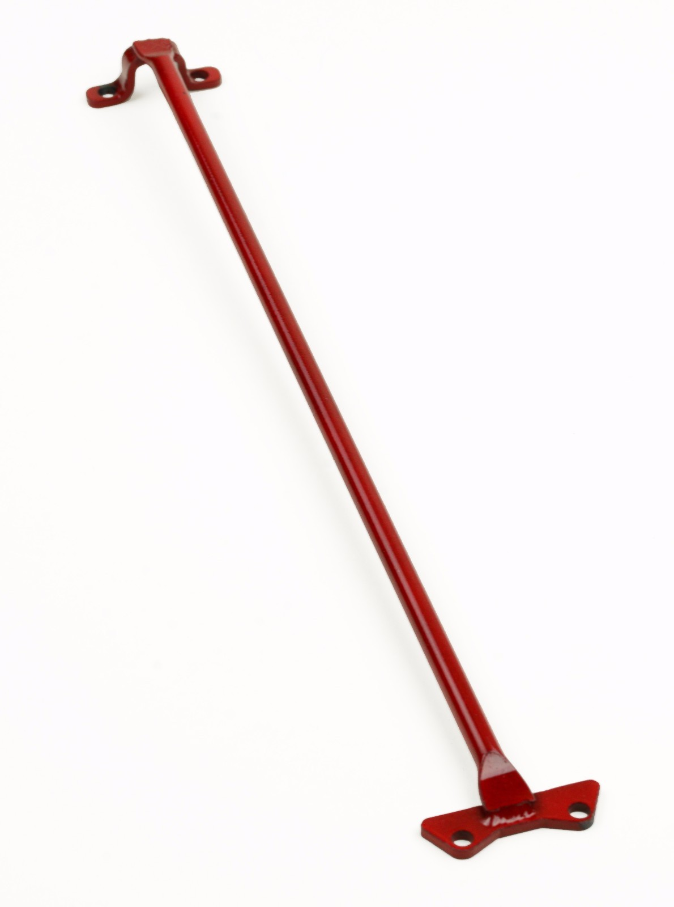&nbsp;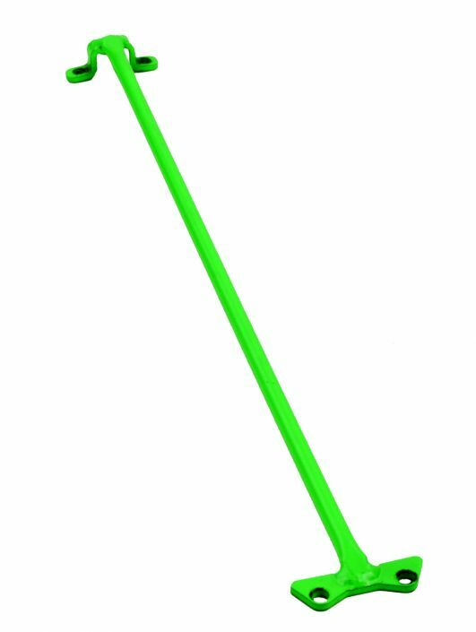&nbsp;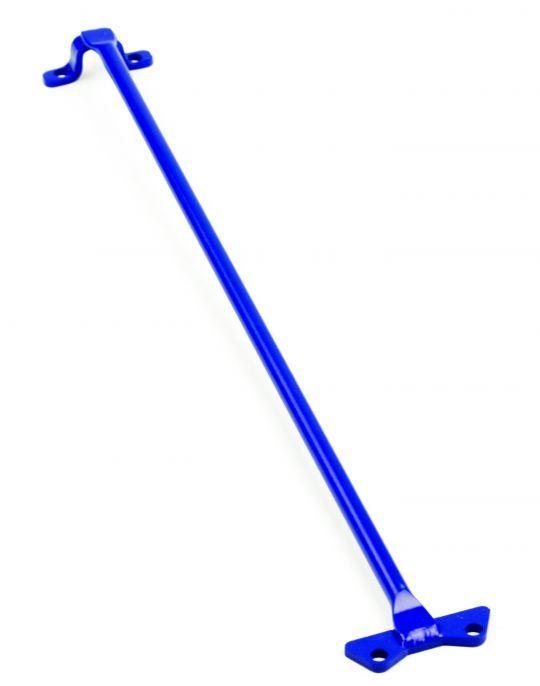 <em>The steel VG-style brace, the one running on this car, in black, red, green and blue</em>

> ⚠️ **Buy the mounts with it.** The **Jato OE brace does not include the brace mounts**, they are Traxxas **9025** at **$7.00** on top. The HCG **6730** kit is the exception, it bundles its mounts. Budget the mounts unless you already have good ones.

> ⚠️ **The Slash 4x4 came with no brace at all.** That matters here because [this car started as a running Slash](README.md#car-overview), so there was never an OE brace on it to replace, it was **added**. The brace that "breaks often" is the **Jato** OE part, not a Slash one. **If you build this from a Slash donor, treat the brace as a required purchase rather than an upgrade**, and check whether the **9025 mounts** are even on the car before assuming you only need the bar.

> *Spec format: Material · CG · Fits · Includes · Weight · Price*

| Brace | Spec | Pros / Cons | Photo / Link |
|:---|:---|:---|:---|
| ⭐ **Traxxas 9024, plastic T-bar centre stiffener** — *recommended* | **Material:** moulded plastic **CG:** low mass, sits centre **Fits:** Jato 4x4 / LCG tub **Includes:** brace only (mounts are 9025) **Weight:** N/A 🚧 not weighed **Price:** **$6.00** | Pro: **The pick, and it is the cheapest thing here.** A bit more durable in practice than the metal versions, and **it will not break the brace mounts**, so the cheap part fails before the expensive one. Adds almost no weight  Con: Looks plainer than anodised alloy. Not as stiff as steel, which is the point rather than a flaw | 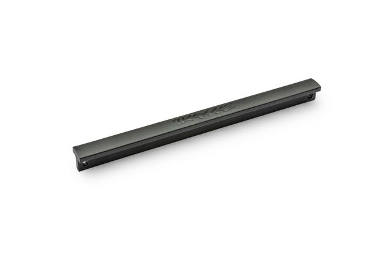 |
| 🟢 **Steel VG-style brace** — *running on this car* | **Material:** **steel**, powder coated **CG:** sits high on the chassis **Fits:** ⚠️ **LCG ONLY** (68086 Slash / Rally LCG). **Will not fit HCG** **Includes:** brace only **Weight:** N/A 🚧 not weighed **Price:** **$18.99**, free shipping (eBay seller **vgracing**, item 396188510700) | Pro: **Stops the fatal chassis crack the OEM brace fails to.** Strongest option here, made in Los Angeles, 30 day returns. **Sold under several brands, not just VG Racing**, so shop the style rather than the name  Con: ⚠️ **LCG only.** **Being stiffer, it loads the 9025 mounts instead**, which is why the plastic is recommended over it. Heavier and it sits high, the worst place for CG. **MPN "Does Not Apply"**, so it is sourced by listing, not part number | &nbsp;&nbsp; |
| 🔵 **Traxxas 9025, front and rear chassis brace mounts** — *the mounts everything bolts to* | **Material:** moulded plastic **CG:** N/A **Fits:** Jato 4x4 front and rear **Includes:** front + rear mounts **Weight:** N/A **Price:** **$7.00** | Pro: **The part the brace choice is really protecting.** Cheap on its own, which is only true if the brace gives up first  Con: **Not included with the Jato OE brace**, so it is an easy $7 to forget when ordering | 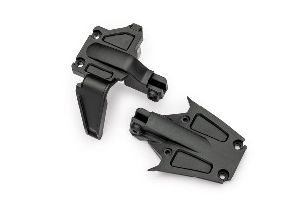 |
| 🔵 **Traxxas 9024 alloy T-bar centre stiffener** — *5 colours* | **Material:** anodised aluminum **CG:** sits centre **Fits:** Jato 4x4 / LCG tub **Includes:** brace only (mounts are 9025) **Weight:** N/A **Price:** **$19.95** (9024-GRAY / -RED / -ORNG / -BLUE / -GRN) | Pro: Anodised in five colours if the look matters, same fitment as the plastic  Con: **$19.95 against $6.00 for the plastic that is recommended over it**, and being metal it pushes the failure into the 9025 mounts | 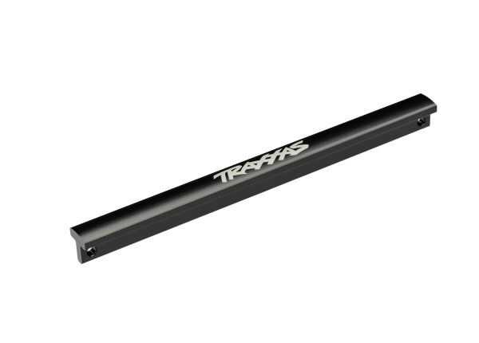&nbsp;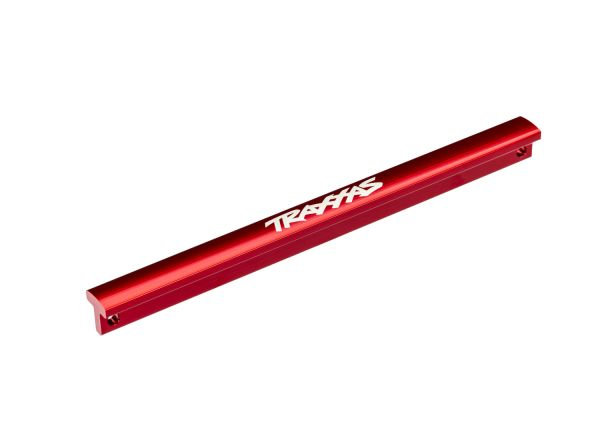&nbsp;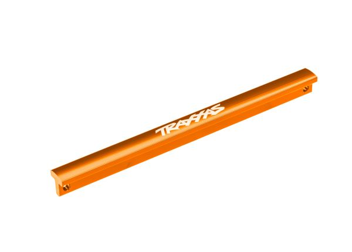&nbsp;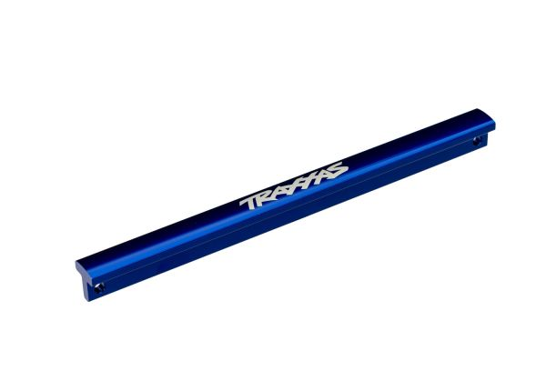&nbsp;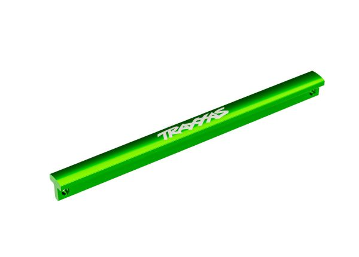 <em>gray · red · orange · blue · green</em> |
| 🚫 ~~**Traxxas 6730, aluminum chassis brace kit**~~ — *HCG, wrong chassis* | **Material:** anodised aluminum **CG:** N/A **Fits:** ⚠️ **HCG chassis**, not this car **Includes:** **brace + mounts + hardware** **Weight:** N/A **Price:** **$24.95** (6730A / 6730R / 6730X / 6730G) | Pro: **The only kit here that bundles its mounts**, unlike the Jato OE brace which needs 9025 separately. Four colours  Con: **HCG only, so it cannot go on this LCG car.** Listed so nobody orders it by mistake | 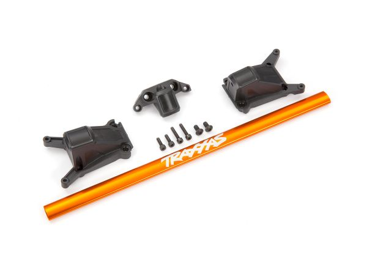&nbsp;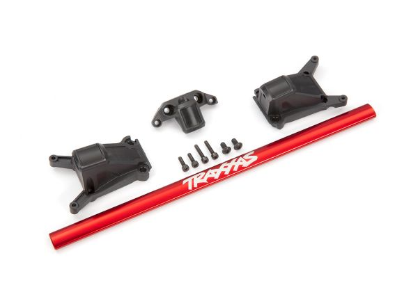&nbsp;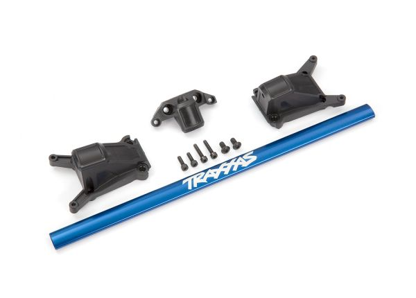&nbsp;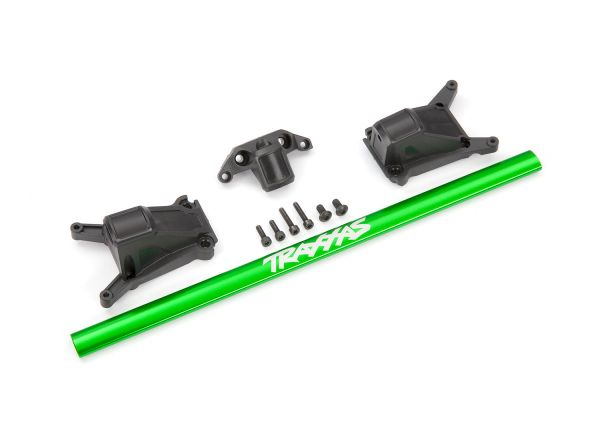 <em>6730A orange · 6730R red · 6730X blue · 6730G green</em> |
| ❌ ~~**Carbon fiber upper brace + alloy mount**~~ — *would not run it* | **Material:** carbon fiber plate + alloy mount block **CG:** sits high over the battery **Fits:** Slash 4x4 **Includes:** CF plate + one alloy mount + screws **Weight:** N/A **Price:** ~**$17.83** | Pro: Lightest of the metal-alternative braces, and it looks the part  Con: **Supports the chassis the least, because it is not tied to the bulkhead.** Both ends land on the tub and a bolt-on alloy block rather than the structure that actually takes the load, so it braces the least stiff path. **Would not run it** | 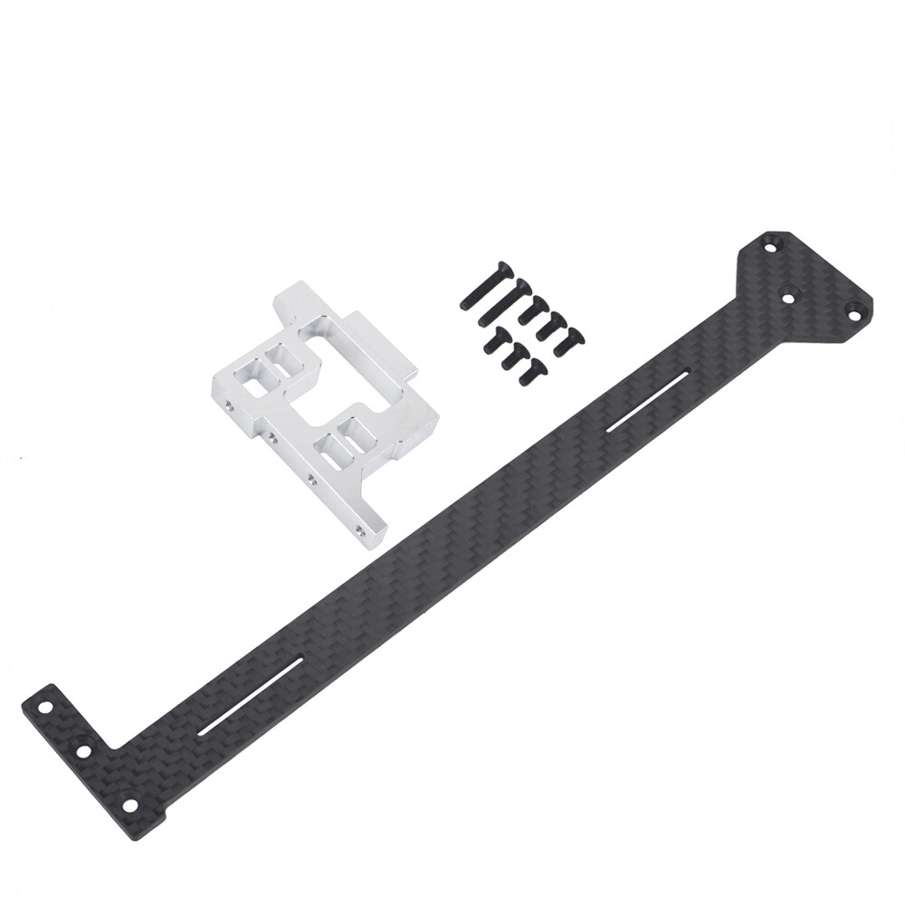&nbsp;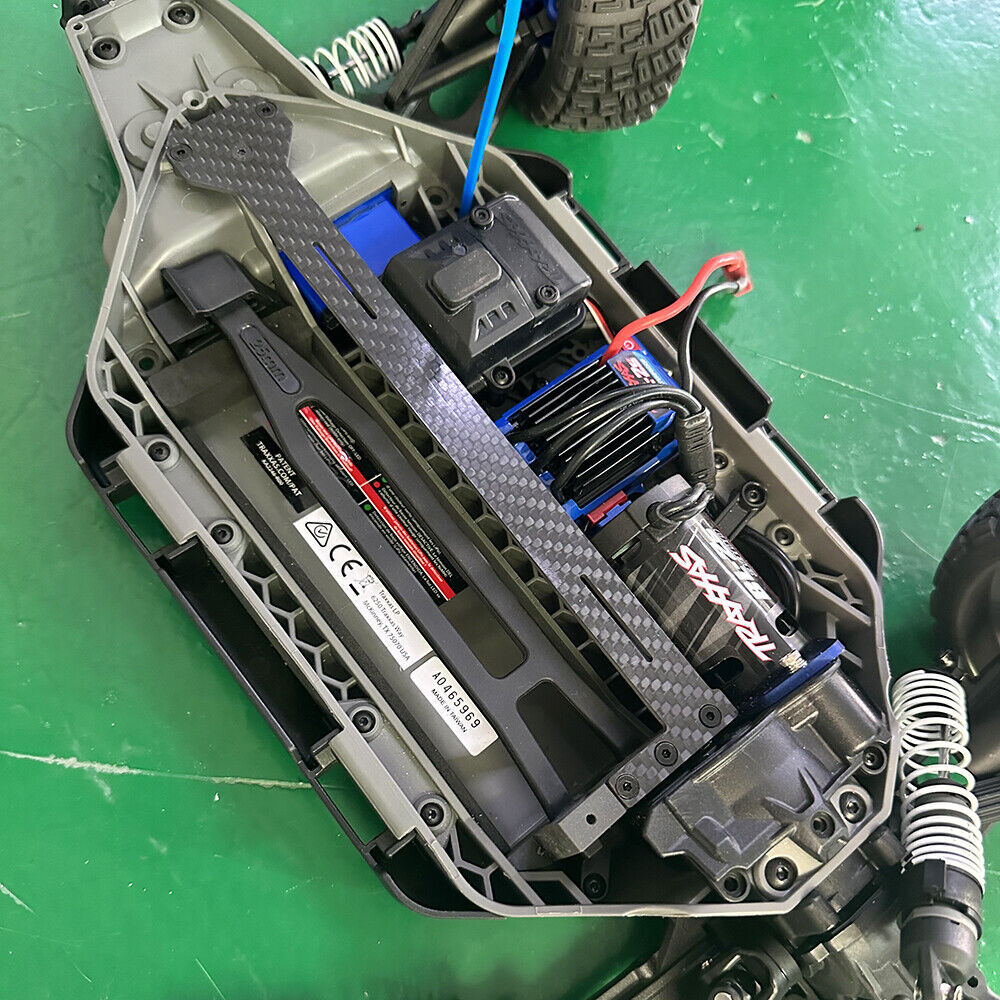 <em>the kit · installed, ends landing on the tub and block, not the bulkhead</em> |

> The **front shock tower brace (TRA9061, $39.95)** is a different part and lives in the [FastAz shock tower analysis](../FastAzJato4x4/shock_tower_analysis.md#related-tower-bracing-optional), where it is vetoed for adding aluminum weight high up on a tower that rarely breaks.

---

## Price History

| Date | Price | Discount Path | Notes |
|:---|:---|:---|:---|
| 🚧 date not recorded | **$18.99** | Free shipping | VG Racing steel LCG chassis brace, eBay seller **vgracing**, item 396188510700. ⚠️ LCG only |
| 2026-04-28 | **$36.99** | — | Powerhobby aluminum front bulkhead, see [FastAz](../FastAzJato4x4/chassis_analysis.md#bulkheads-front--rear) |
| 🚧 checkpoint 6/25 | **$20.00** | — | Traxxas 7422 LCG chassis, [LEDGER](../../LEDGER.md) #80. A 7477 LCG spur gear cover ($3.00, #79) went with it |

**Chassis side of the car: $75.98.**

---

## Notes

- ⚠️ **This car is LCG, and that constrains what fits.** The VG Racing brace is **LCG only and will not fit HCG**, and the [LCG bulkheads](../FastAzJato4x4/chassis_analysis.md#bulkheads-front--rear) are the same. Confirmed three ways: the **7422 LCG chassis** and the **7477 LCG spur cover** in the [LEDGER](../../LEDGER.md), and the brace fitting at all. **Check LCG vs HCG before ordering anything for this chassis.**
- **Plastic plus two steel/alloy parts is the honest cheap route.** The **front bulkhead** and the **upper brace** are the two things that actually break, so those are the two things bought. Everything else stays stock. Anyone pricing a Jato build should look at this before a carbon kit.
- **Start from a running Slash 4x4.** It is the same platform, so the chassis, bulkheads and brace all transfer. Only the **towers, shocks and wing** have to be bought to make it a Jato 4x4, which is the cheapest route onto this platform.
- **The brace is an addition on this car, not a replacement.** The **Slash 4x4 shipped without one**, so the donor arrived with nothing to swap out. On a Jato it is a replacement, because that OE brace breaks. Either way you buy one.
- **Fitted is not the same as recommended.** This car runs the **steel** brace; the recommendation is the **$6 plastic 9024**, because the plastic gives up before the **9025 mounts** do. Steel protects the chassis and loads the mounts instead.
- **The bulkhead is not optional if metal arms go on.** FLM arms strip a plastic bulkhead, which is exactly why the alloy front matters here. See the [FastAz arm analysis](../FastAzJato4x4/arm_analysis.md).
- **This decision propagates.** The moulded tray and hold-down posts are chassis features, so the [battery bar geometry](battery_mount_analysis.md) is unique to this car and does not transfer to the FastAz in either direction.
- **Nothing here is weighed yet.** Neither the stock chassis nor the bulkhead has a figure, so the weight case against carbon is currently reasoning rather than measurement.
