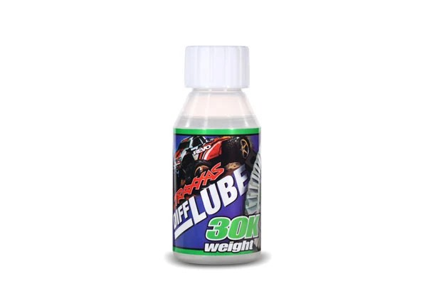
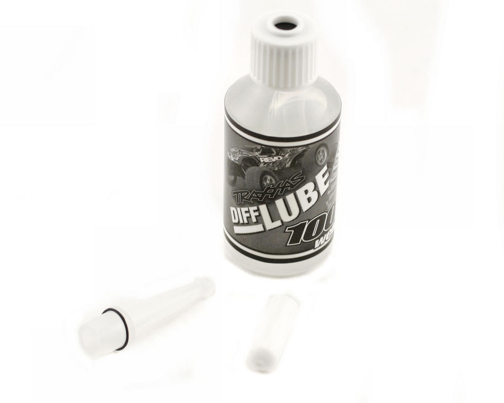
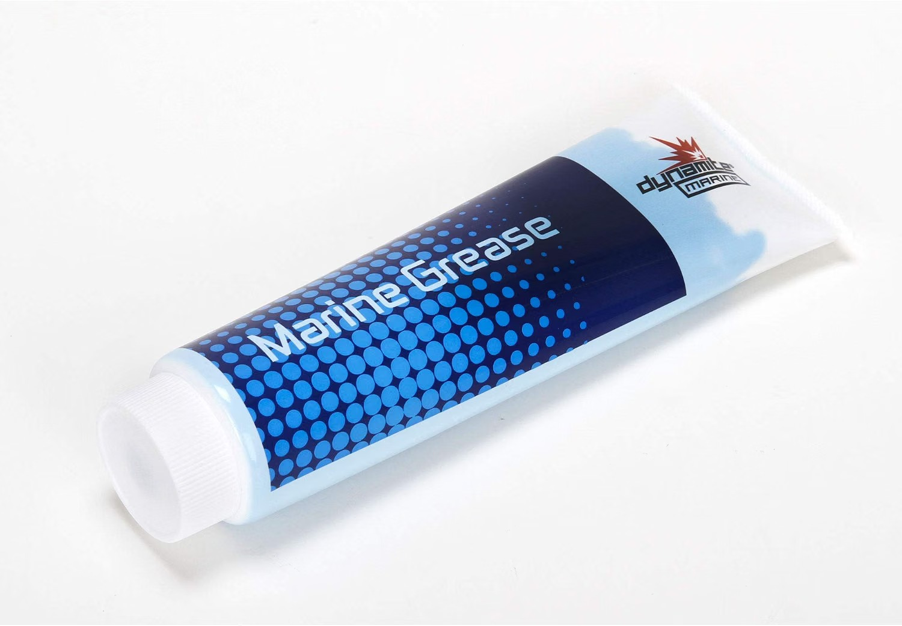

# Differential Selection — Jato4x4_Mike

> **Running: a metal centre diff, 30k front, 100k centre, and a rear that runs grease instead of oil.** The front and centre oils were tuned on this car first and the [FastAzJato4x4](../FastAzJato4x4/differential_analysis.md) inherited them, so this is the origin rather than the copy. **The rear is where the two cars part company**, since this one runs **Dynamite blue marine grease**.
>
> ⚙️ **The spider-pin fix came from this car.** Mike **broke the metal centre diff first and modded his own fix**: the stock pin is **stepped down** and shears at the step, so he replaced it with a **plain full-length 2.8mm × 7mm pin**. It is written up in the FastAz teardown, but it originated here.
>
> **Full comparison, including the $19 centre diff teardown:** [FastAzJato4x4 differential analysis](../FastAzJato4x4/differential_analysis.md#center-diff-teardown).

&nbsp;&nbsp;&nbsp; <em>Everything that goes in: the <strong>metal centre diff</strong> · <strong>30k TRA5136</strong> in the front · <strong>100k TRA5130</strong> in the centre · <strong>Dynamite DYNE4201 grease</strong> in the rear</em>

| Position | Spec | Price |
|---|---|---|
| **Centre diff** | **Metal**, Traxxas 6780-style | **$18.80** |
| **Front oil** | **30k**, Traxxas TRA5136 | $7.50 / bottle |
| **Centre oil** | **100k**, Traxxas TRA5130 | $8.00 / bottle |
| **Rear** | **Dynamite DYNE4201 blue marine grease**, no oil | **$12.00 / can** |

---

## The centre diff

**Metal, Traxxas 6780-style, $18.80 from AliExpress.** It is the same unit the [FastAz teardown](../FastAzJato4x4/differential_analysis.md#center-diff-teardown) pulls apart, and **this is the car that broke one first**.

&nbsp; <em>The metal centre diff · <strong>the failure and the fix</strong>, the sheared stock pin beside the plain full-length replacement</em>

⚙️ **The stock pin is stepped down, and it shears at the step.** Mike replaced it with a **plain 2.8mm × 7mm pin, full length, no step**, and that is now what both cars run. **7mm is the right length**, where the stock **6.85mm** sits just slightly short.

**The alloy housing is not a weak point here.** The bearings either side carry the load, so the metal lasts well and holds oil better than expected. The parts that actually fail are the pin, and the rear output shaft, which [needs shaving](../FastAzJato4x4/differential_analysis.md#center-diff-teardown) to fit.

---

## The rear runs grease, not oil

 <em><strong>Dynamite Marine Grease DYNE4201</strong>, 5 oz. Lithium complex with anti-sling additive, <strong>$12.00</strong></em>

⚠️ **Grease and oil get filled completely differently, and carrying the oil habit over to grease is how a diff gets wrecked.**

| Fill | How much | Why |
|---|---|---|
| **Oil**, front and centre | **Half full, no more** | A brim-full plastic housing bursts once the oil heats and expands |
| **Grease**, the rear here | **A light coating, never packed** | Packing it solid binds the gears together, so the diff drags and heats instead of differentiating |

**Why grease works here.** It is a lithium complex with **anti-sling technology**, so it stays on the gear faces rather than being flung off, and it **resists water contamination**. On a rear diff that wants steady drive off the corner instead of free rotation, a light film behaves like a very heavy oil that will not weep past a tired seal.

---

## Notes

- **Lightly, not packed.** This is the one thing to get right. A thin film on the gear faces is the whole job, and more is actively worse.
- **The half-full rule still applies to the front and centre**, which are still oil filled at 30k and 100k. Only the rear is greased.
- **Both cars run a greased rear now.** The [FastAz](../FastAzJato4x4/differential_analysis.md#front--rear-diff-oil) does the same thing, grease in place of oil, so the rears match. 🚧 **Which grease that car uses is not recorded**, only that it is greased, so do not assume it is this same DYNE4201.
- **It is sold as a boat product.** Marine grease for prop and flex shafts, which is exactly why it shrugs off water and does not sling off the gears.
