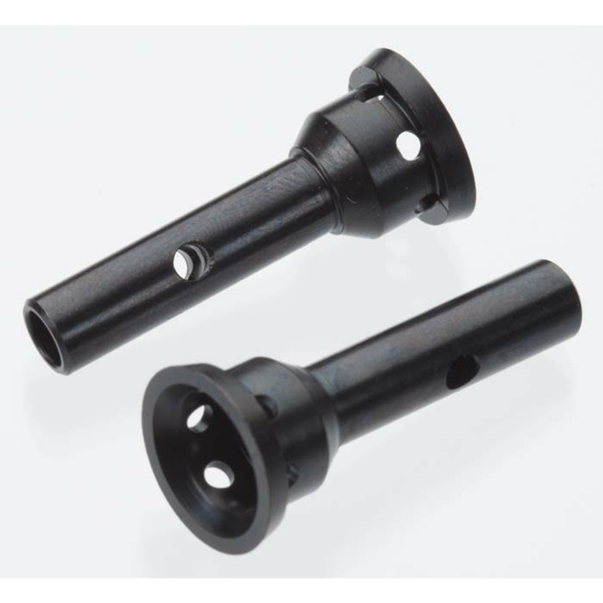
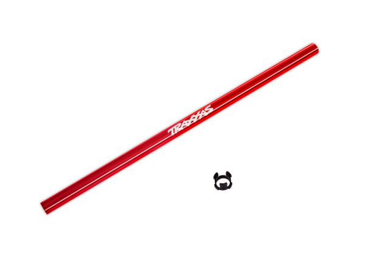
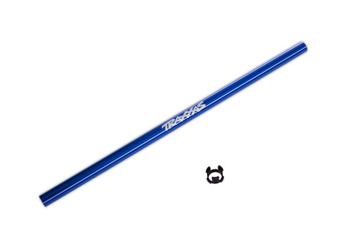
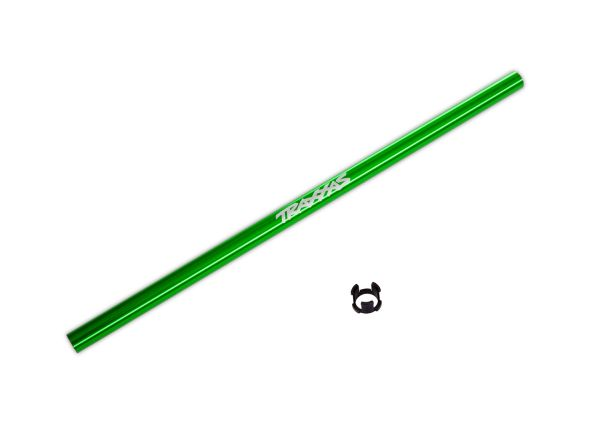
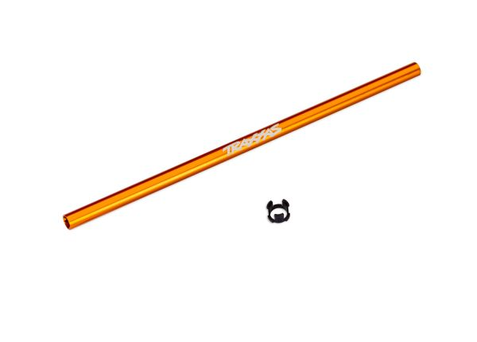

# Driveshaft Selection — Jato4x4_Mike

> **Running: knock-off Slash / Jato 4x4 HD steel CV driveshafts**, TRA6851R and TRA6852R clones, on **TRA6752 long output shafts at all four corners**. **The axles are basically the Jato 4x4 part**, so they bolt straight in: **no cutting, no welding and no joiner.** Same build as the [FastAzJato4x4](../FastAzJato4x4/driveshaft_analysis.md#2wd-long-cvds--6752-output-shafts-cheap-long-axle-build).
>
> **Same axle build as the FastAz, including the Tekno stubs and the aftermarket E-Revo 17mm hexes.** The **centre shaft is the difference**: that car runs the **Jato 4x4 BL-2S take-off shaft (7455, $2.49)**, plastic, bought cheap because it bundled a pinion and bearings. This car runs the **aluminium TRA6855** instead.
>
> ⚠️ **TRA6755 is not the same part.** That is the Rustler shaft at 189mm; the Slash / Jato one is **TRA6855 at 214mm**.
>
> **Full assembly and costs:** [FastAzJato4x4 driveshaft analysis](../FastAzJato4x4/driveshaft_analysis.md#2wd-long-cvds--6752-output-shafts-cheap-long-axle-build).

&nbsp;&nbsp;&nbsp;&nbsp; <em>What goes into an axle here: <strong>knock-off Slash / Jato 4x4 HD steel CV</strong> · <strong>TRA6752</strong> long output shafts · <strong>TRA6855</strong> alloy centre shaft · Tekno <strong>TKR1654-17</strong> front stub · Tekno <strong>5580</strong> rear stub</em>

---

## What's fitted

| Item | Spec | Price |
|---|---|---|
| **CV driveshafts** | Knock-off **Slash / Jato 4x4 HD steel CV** set, TRA6851R + TRA6852R clones | 🚧 not recorded here, the FastAz paid **$21.10 / set of 4** |
| **Output shafts** | Traxxas 6752 long | **$32.00 / set of 4** |
| **Hub bearing** | Bare **10×18×5**, hexes shaved to clear it, see [`bearings_reference.md`](bearings_reference.md) | $1.45 each |
| **Centre driveshaft** | **Traxxas 6855-BLUE**, 6061-T6 aluminium, one piece, **214mm**, with its own hardware | **$10.00**, Tammies Hobbies |
| **Stubs** | **Tekno**, front **TKR1654-17**, rear **5580**, same as the FastAz | **$19.99 + $16.90 / pair** |
| **17mm hexes** | Aftermarket **E-Revo 1.0 fit splined hubs**, shaved to clear the big bearing | **$8.36 / set of 4** |

---

## The centre driveshaft

**This is the one drivetrain part where the two cars genuinely differ.** The FastAz runs a **plastic 7455 take-off** it got for $2.49; this car runs the **alloy 6855**. One piece of **6061-T6**, **214mm**, with **internal splines that fit straight onto the front and rear drive assembly input shafts**, which is what takes the play out of the driveline. **The centre bearing bushing is included**, so there is nothing else to buy.

&nbsp;&nbsp;&nbsp; <em>6855-RED · <strong>6855-BLUE, fitted</strong> · 6855-GRN · 6855X-ORNG</em>

| Part | Colour | Price |
|---|---|---|
| ⭐ **6855-BLUE** | **Blue, fitted here** | **$10.00 paid** |
| **6855-RED** | Red | $10.00 |
| **6855-GRN** | Green | $10.00 |
| **6855X-ORNG** | Orange, ⚠️ **note the different prefix** | $10.00 |

> ⚠️ **There is no plain "6855" to order.** Every one of them carries a colour suffix, so **the bare part number will not get you a shaft**, the same trap as the [9517 wing](aero_analysis.md#wing-colours). **Orange is the odd one out again**, listed as **6855X**-ORNG rather than 6855-ORNG, so it is one character away from the others.
>
> **Mike runs the blue.** Bought from **Tammies Hobbies for $10.00**, which is list price, so there was nothing lost by not shopping around.

---

## Notes

- **The alloy shaft is the upgrade, and it is a cheap one.** $10.00 against the $2.49 plastic take-off the FastAz runs. **Internal splines onto the drive assembly inputs** are what remove driveline play, which is the actual reason to fit it rather than the anodising.
- ⚠️ **Do not order TRA6755.** It is the **Rustler** shaft at **189mm**, 25mm short of what this car needs. The Slash and Jato part is the **214mm 6855**.
- **The axles are shared with the FastAz, the centre shaft is not.** Everything from the CVD donor to the Tekno stubs and the shaved hexes is the same on both cars, so [that doc](../FastAzJato4x4/driveshaft_analysis.md) covers the build for both.
- **The hexes are the sacrificial part.** They get shaved to clear the bare 10×18×5 in the hub, which is this car's bearing route. See [`bearings_reference.md`](bearings_reference.md) and [`hub_analysis.md`](hub_analysis.md#17mm-wheel-hexes).
- 🚧 **The chopped E-Revo route was bought and abandoned.** A **knock-off E-Revo CVD 5451R set ($18.75**, Pretty GEM, [LEDGER](../../LEDGER.md) #84) and an **M6 × 30mm hex standoff joiner ($4.36**, CLOXY) were bought to cut and rejoin custom axles. **The car runs the bolt-in CV set instead**, so neither part is on it and neither is counted in the [BOM](BOM.md#drivetrain). **$23.11 spent on a route not taken.**
