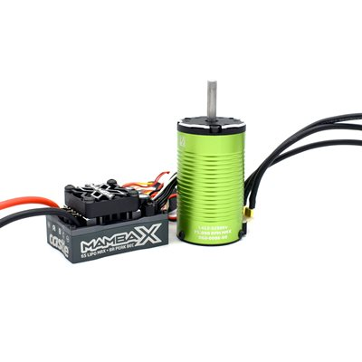

# ESC Selection — Jato4x4_Mike

> **Running: the Castle Mamba X SCT + 1412-3200KV 5mm combo, part 010-0155-13**, bought **2025-03-19 for $198.71**. ESC and motor come as one part, which is why there is nothing to match up: the sensor harness, the bullets and the KV are all factory paired.
>
> ⚠️ **The ESC is 2S to 6S, but this combo is 4S maximum**, because the bundled **1412-3200KV motor is rated 2-4S**. Castle's own wording: *"4s maximum with included 1412-3200kv motor"*, and 4S only **"with very conservative gearing and keep a close eye on temperatures."** **This car runs 4S**, so it sits at the ceiling, and the **11T pinion is that conservative gearing**.
>
> **The full ESC comparison is not repeated here.** It lives in the [FastAzJato4x4 ESC analysis](../FastAzJato4x4/esc_analysis.md#esc-comparison), which weighs the Mamba X against the MAX10 G2, Fire Phoenix, Copperhead 10 and Monster X.

 <em>Mamba X SCT ESC and 1412-3200KV 5mm sensored motor, sold as combo 010-0155-13</em>

---

## What's running

| Item | Spec |
|---|---|
| **Part** | **010-0155-13**, Mamba X SCT + 1412-3200KV 5mm combo |
| **ESC** | Castle **Mamba X**, 2S-6S (25.2V), sensored / sensorless / SmartSense |
| **Motor** | Castle **1412-3200KV**, 5mm shaft, 4-pole 12-slot sensored |
| **Pinion** | **11T 32P** (was 12T, see [`motor_analysis.md`](motor_analysis.md#the-gearing-finding)) |
| **Spur** | **54T** |
| **Cells run** | **4S**, the combo's ceiling |
| **Cutoff** | **3.5V per cell**, see [`battery_analysis.md`](battery_analysis.md) |

---

## Specs worth having to hand

> *Spec format: Cells · Current (A) · BEC · Sensored · Waterproof · Weight · Price*

| Part | Spec | Pros / Cons | Photo / Link |
|---|---|---|---|
| ⭐ **Castle Mamba X SCT + 1412-3200KV combo (010-0155-13)** — *running* | **Cells:** ESC **2S-6S (25.2V)**, but **4S max with this motor** **Current (A):** not published by Castle; community reports **100+ A peaks** **BEC:** **8A peak, adjustable** 5.5 / 6.0 / 7.5 / 8.0V, default 5.5V **Sensored:** yes, **SmartSense**, plus sensorless and sensored-only modes **Waterproof:** yes, CNC aluminum case potted in epoxy. ⚠️ **the 30mm fan is not waterproof and must come off for wet running** **Weight:** **101g** ESC with wires, **265.4g** motor **Price:** **$198.71** paid (list $360.90, currently $221.21 at 26% off) | Pro: **One part, factory matched**, so no sensor adapter and no KV guesswork. **ROAR and RECON G6 certified**, data logging, aux-wire on-the-fly adjustment, transmitter programming for cutoff and drag brake. Rugged potted case that also sheds heat  Con: ⚠️ **4S is the ceiling and this car runs 4S**, so gearing and temperatures matter. **Castle publishes no continuous amp rating.** Castle Link USB or B-LINK is a separate purchase to program it |  |

**ESC dimensions:** 54.4 × 35.2 × 30.0mm, **4.0mm female bullets** to the motor. Battery connector is not included; Castle recommend a 70A+ connector.

**Motor:** 62.5mm long × 36mm diameter, **75,000 max RPM**, 21mm × 5mm shaft, **M3 at 25mm** mounting, 4mm male bullets.

---

## Notes

- ⚠️ **The 4S limit is the thing to remember.** The Mamba X on its own is a 6S controller, which is how the [FastAz doc](../FastAzJato4x4/esc_analysis.md#esc-comparison) lists it, but **the bundled 1412 caps the combo at 4S**. Both statements are correct; they are just about different scopes.
- **Castle rate the combo to 6.5 lb vehicle weight.** 🚧 **This car has never been weighed**, so whether it is inside that is unknown. Worth knowing given it also runs at the 4S ceiling.
- **Remove the cooling fan before running wet.** The ESC is potted and waterproof, the fan is not.
- **Programming needs extra hardware.** Six common settings, cutoff voltage included, can be set from the transmitter, but full access needs the Castle Link USB kit or the B-LINK Bluetooth adapter, both sold separately.
- **Why it is not compared against anything here.** Mike's car did not run a selection process, the combo was bought outright. The alternatives, and why the FastAz went a different way, are in [that car's ESC analysis](../FastAzJato4x4/esc_analysis.md).

---

## Price History

| Date | Price | Discount Path | Notes |
|---|---|---|---|
| 2025-03-19 | **$198.71** ✅ **purchased** | Educational discount (EDUDISC) | Combo **010-0155-13**. $12.78 shipping, **$211.49** the order. Castle order STD0000000137021, invoice STDINV000165036. Paid by Mike directly |
| 🚧 date not recorded | **$94.00** | Non-warranty RMA | Replacement 1412 3200KV motor ([LEDGER](../../LEDGER.md) #83). Replaced the combo's motor rather than adding one, so it is not counted in the [BOM](BOM.md#electronics) |
| current listing | $221.21 | 26% off | List $360.90. For reference only, not paid |
