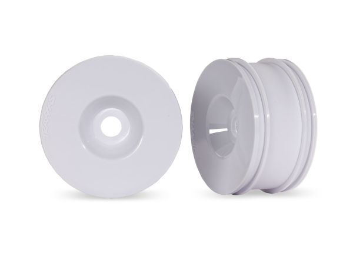

# Wheel & Tire Selection — Jato4x4_Mike

> **Running: a three-part stack, Traxxas 9070-WHT rims + blue race foams + RedSpider tires.** The tire is the same one the [FastAzJato4x4](../FastAzJato4x4/wheel_analysis.md#tires-tire-only-mount-on-your-own-rims) runs, so the tire itself is not re-analysed here. **What is unique to this car is the rim it is mounted on.** Putting RedSpider rubber on the wider Traxxas rims pushes the wheels out and **widens the track by a lot**, which is the single best handling change made to this car.
>
> ⚠️ **It puts the car outside ROAR width limits.** Fine here, this is a bash car. The FastAz runs the same tire on standard-width rims specifically to stay legal.

&nbsp;&nbsp; <em>The three-part stack, in the order it goes together: the bare <strong>Traxxas 9070-WHT</strong> Jato 4x4 VXL 3.0" dished rim · <strong>blue closed-cell race foams</strong> · the <strong>RedSpider tire</strong> over the top. <strong>The wider rim is what buys the track width</strong></em>

---

## Key Requirements

| Requirement | Type | Why |
|:---|:---|:---|
| **17mm hex** | Must | The car runs 17mm hexes (shaved, see [`hub_analysis.md`](hub_analysis.md#17mm-wheel-hexes)) |
| **Widens the track** | Must | The wide stance is the point of this setup, and it measurably improved stability and corner grip |
| **ROAR legal** | ❌ Not a requirement | Explicitly given up on this car. The FastAz carries that constraint instead |

---

## The wide-track trick

**Take the RedSpider tires and mount them on Traxxas Jato 4x4 rims instead of standard-width ones.** The Traxxas rim is wider, so each wheel sits further out and the track grows noticeably.

| | This car | [FastAzJato4x4](../FastAzJato4x4/wheel_analysis.md) |
|:---|:---|:---|
| **Tire** | RedSpider | RedSpider (same) |
| **Rim** | **Traxxas 9070-WHT**, Jato 4x4 VXL 3.0" dished | Standard-width rims |
| **Foam** | **Blue closed-cell race foams**, $8.08 / set of 4 | **The same foams**, $8.08 |
| **Track** | **Much wider** | Stock width |
| **ROAR legal** | ❌ no | ✅ yes, deliberately |

**Result: more stability and more corner grip.** It worked well enough that it is the setup this car keeps.

> **Wear-in matters, do not judge them fresh.** These RedSpider tires take about **7 battery packs of running** to fully wear in before they reach their best grip. A fresh set feels worse than a worn one.

---

## Comparison

> *Spec format: Part · Type · Tread · Compound · Dia · Width · Rim · Hex · Weight · Foam · Pre-glued · Price*
>
> *Price convention: per **set of 4**.*

| Wheel / Tire | Spec | Pros / Cons | Photo / Link |
|:---|:---|:---|:---|
| ⭐ **RedSpider tires on Traxxas Jato 4x4 rims** — *running* | **Part:** tire **RedSpider**; rim **Traxxas 9070-WHT**; **blue race foams** between them **Type:** 1/8 off-road **Tread:** RedSpider **Compound:** see [FastAz](../FastAzJato4x4/wheel_analysis.md#tires-tire-only-mount-on-your-own-rims) **Dia:** N/A **Width:** **wider than standard, this is the point** **Rim:** **Traxxas 9070-WHT**, Jato 4x4 VXL 3.0" dished, white **Hex:** 17mm **Weight:** N/A 🚧 not weighed **Foam:** **blue closed-cell race foams**, $8.08 / set of 4 **Pre-glued:** mounted in house **Price:** N/A | Pro: **The wide stance is the best handling change on this car**, more stability and more corner grip, using a rim you may already own. Costs nothing if the Traxxas rims are already in the box  Con: **Outside ROAR width**, so it is a bash-only setup. Takes **~7 packs to wear in** before it is at its best. Wider track adds scrub | &nbsp; <em>RedSpider, the shared tire</em> |

---

## Notes

- **The tire is shared, the rim is not.** For compound, sizes and the rest of the RedSpider analysis, use the [FastAz wheel doc](../FastAzJato4x4/wheel_analysis.md#tires-tire-only-mount-on-your-own-rims). Only the rim pairing and its consequences are recorded here.
- **Width is already stacked on this car.** The wide rims come on top of the **1-2mm per side** the [MonsterKingz hubs](hub_analysis.md) add. Worth counting before adding any more.
- **🚧 Nothing here is measured.** No track width figure, no tire weight, no rim weight. The wide-track claim is a felt result, not a number, which is worth fixing since it is this car's signature setup.
