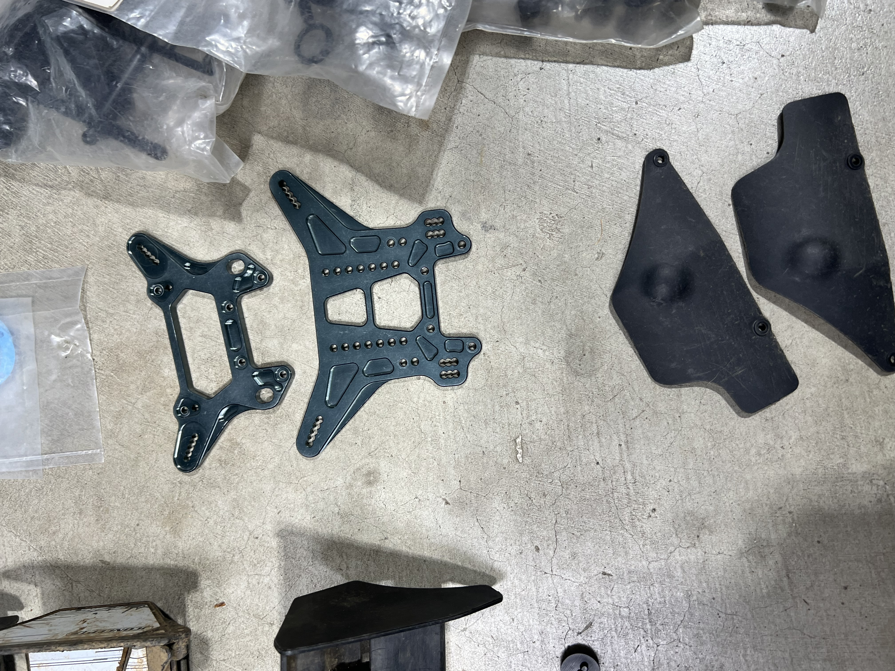

# Used-Lot Value Analysis — Mugen Seiki MBX8TR ECO

> **Verdict: worth buying — but most of the "spares hoard" is for the older MBX7/MGT generation, not your MBX8 truggy.** The car (roller + Hobbywing XR8/2300KV + two wheel sets) is the real value. The boxes of new-in-package Mugen parts look impressive and add up to a big MSRP number, but only a slice bolts straight onto an **MBX8TR Eco** — the rest is resale fodder. Pay mainly for the running car + electronics; treat the spares as a bonus you'll part out, not as MBX8 inventory.

  &nbsp; 
  <em>Alloy front/rear shock towers (aftermarket) · one of the new HT diff gear sets — note the tag reads MBX7R/E/MGT/E, <strong>not</strong> MBX8</em>

---

## Table of Contents

- [What you're buying](#what-youre-buying) — the whole lot at a glance
- [The big catch: MBX7 ≠ MBX8](#the-big-catch-mbx7--mbx8) — why most spares don't bolt on
- [Compatibility buckets](#compatibility-buckets) — usable / resale / N/A / damaged
- [Full spares inventory](#full-spares-inventory) — every tagged part, qty, MSRP
- [Value summary](#value-summary) — what to pay
- [Open items / need pics](#open-items--need-pics)

---

## What you're buying

Per your description, the lot is a complete **Mugen Seiki MBX8TR ECO** (1/8 **electric truggy**) plus a large bin of spares:

| Item | Notes |
|---|---|
| **Rolling chassis / roller** | The MBX8TR Eco itself — *photos pending* |
| **Hobbywing XR8 + 2300KV combo** | 1/8 ESC + brushless motor — *photo pending* |
| **AKA race wheels/tires** | 1 mounted set |
| **Pro-Line Badlands** | 1 mounted set (basher tires) |
| **Mugen spares bin** | ~30 distinct SKUs, mostly new-in-package — itemized below |
| **2× bodies** | 1 clear/untrimmed, 1 painted (used) — appear to be **buggy** bodies |

The spares are what this analysis digs into, because that's where the "is it worth it" question gets murky.

---

## The big catch: MBX7 ≠ MBX8

Mugen's **MBX8 (2017) was a clean-sheet redesign** over the MBX7/MBX7R/MGT generation. The diffs, gearbox/bulkheads, uprights, arm mounts, and driveshafts changed. **Mugen prints the compatible models right on every bag** — so the tag is the source of truth:

- Tag lists **MBX8** (e.g. `MBX8/7R`, `MBX8/7/MGT`, `MBX8/8T`) → **fits your truggy.** ✅
- Tag lists **only MBX7 / MBX7R / MGT / MBX6** (no "8") → **older generation, will not bolt onto the MBX8.** ❌ (resale value only)
- Generic `MBX/MGT` on **diff internals** (gaskets, o-rings, cases, gear sets) → these are the **MBX7-era diff**, which is *not* the MBX8 diff. Treat as MBX7 unless you confirm the part physically.

Two more filters specific to your car:

- **Electric, not nitro.** The `E2712 Engine Mount Washer` is a nitro-only part → useless on an Eco.
- **Truggy, not buggy.** The two body shells and the `E2015` rear universals are **buggy** parts (the E2015 bag literally says *"MBX7R Buggy"*). A buggy body won't fit the wider truggy.

The happy exception: the two **store-repackaged bags are explicitly `MBX8Te`** (MBX8 Truggy electric) — those are an *exact* match for your car.

---

## Compatibility buckets

### ✅ Usable on your MBX8TR Eco (bolts on / very likely fits)
| Part | What | Tag |
|---|---|---|
| **RC57532** | MBX8Te lower suspension arms + front/rear anti-roll sway bars | `MBX8Te` — exact match |
| **RC55509** | MBX8Te turnbuckles, ballcups, pivot balls, steering tie rod | `MBX8Te` — exact match |
| **E2146** | Front upright | `MBX8/7R` |
| **E2116** | Titanium turnbuckle set | `MBX8/7/MGT` |
| Alloy shock towers (×2, f+r) | Aftermarket alloy — *verify they're MBX8-cut, not MBX7* | no tag |
| Alloy steering bellcranks (×2, 32.0 g) | Aftermarket alloy — *verify MBX8 fit* | no tag |
| C0271 / H0867 / C0529A / H0855 / C0264 | Generic ball/link/pivot hardware — Mugen reuses across generations (*verify sizes*) | universal |

### ♻️ Wrong generation — MBX7 / MGT only (resale value, not for your truggy)
`E2301` servo saver · `E2316` servo saver spring · `E2123` kingpin ball · `E0160` front lower kingpin ball · `E2129` front upright · `E0410` front bumper (foam) · `E2101` center diff mount · `E2201`/`E2202`/`E2232` diff cases · `E2241` diff gaskets · `E2242` diff o-rings · `E2244`/`E2248` HT diff gear sets · `E2203` 42T / `E2247` 46T conical gears · `E0146` gearbox · `E2138` rear sway bar · `E2015` rear universals (buggy) · loose diff gears/internals · center-transmission assembly · MGT7/E springs · 2× bodies (buggy)

> These are the big-MSRP items (the two diff gear sets alone are ¥5,200 each). They're genuinely valuable — just **not to you on an MBX8 truggy.** Sell them to the MBX7/MGT crowd to recoup cash.

### 🚫 N/A for an electric car
| Part | Why |
|---|---|
| **E2712** Engine Mount Washer (`MBX8/8T`) | Nitro engine mount — no engine on an Eco |

### ❌ Damaged
| Part | Why |
|---|---|
| **E2152** Rear Lower Arm Mount R (`MBX8`, alloy) | Hand-labeled **"Bent"** — would otherwise be a great MBX8 part. Useful as a straightening/measurement reference or scrap; budget $0. |

---

## Full spares inventory

Quantities are **conservative** — several SKUs were photographed multiple times and may represent more than one pack (noted). Prices are the **Japanese MSRP printed on the tag** (¥); USD is a rough convert at **¥150 ≈ $1**. US retail typically runs higher; used/open value lower.

| Part # | Description | Tag compat | Fits MBX8TR Eco? | Qty | ¥ ea | ¥ subtotal |
|---|---|---|---|---|---|---|
| RC57532 | MBX8Te lower arms + sway bars (f/r) | MBX8Te | ✅ yes | 1 | ~5,200* | 5,200 |
| RC55509 | MBX8Te turnbuckles/ballcups/pivots/tie rod | MBX8Te | ✅ yes | 1 | ~3,000* | 3,000 |
| E2146 | Front upright | MBX8/7R | ✅ yes | 1 | 720 | 720 |
| E2116 | Titanium turnbuckle set | MBX8/7/MGT | ✅ yes | 1 | 1,100 | 1,100 |
| E2152 | Rear lower arm mount R (alloy) | MBX8 | ❌ **bent** | 1 | 2,710 | 0 |
| E2712 | Engine mount washer | MBX8/8T | 🚫 nitro | 1 | 290 | 290 |
| E2244 | HT F/R diff gear set 44T | MBX7R/E/MGT/E | ♻️ MBX7 | 1 (≤2?) | 5,200 | 5,200 |
| E2248 | HT F/R diff gear set 42T | MBX7R/E/MGT/E | ♻️ MBX7 | 1 | 5,200 | 5,200 |
| E2247 | Conical gear 46T (HTD) | MBX7TR/E | ♻️ MBX7 | 1 | 3,300 | 3,300 |
| E2203 | Conical gear 42T | MBX7/MGT | ♻️ MBX7 | 1 (≤3?) | 3,300 | 3,300 |
| E0146 | Gear box (plastic) | MBX/MGT | ♻️ MBX7 | 2 | 850 | 1,700 |
| E2101 | Center diff mount | MBX7/MGT | ♻️ MBX7 | 1 | 600 | 600 |
| E2202 | Diff case (HTD) | MBX/MGT | ♻️ MBX7 | 1 | 600 | 600 |
| E2201 | Diff case | MBX7 | ♻️ MBX7 | 1 | 400 | 400 |
| E2232 | Diff case/buffer (partial tag) | MBX/MGT | ♻️ MBX7 | 1 | ~400 | 400 |
| E2241 | Diff gasket (HTD) | MBX/MGT | ♻️ MBX7 | 3 (≤5?) | 560 | 1,680 |
| E2242 | S6 diff o-rings (silicone) | MBX/MGT | ♻️ MBX7 | 2 (≤3?) | 300 | 600 |
| E2138 | Rear anti-roll bar Ø2.5 | MBX7 | ♻️ MBX7 | 1 | 500 | 500 |
| E2129 | Front upright (plastic) | MBX7R/MGT | ♻️ MBX7 | 1 | 650 | 650 |
| E2123 | Kingpin ball (steel) | MBX7/MGT | ♻️ MBX7 | 1 | 1,200 | 1,200 |
| E0160 | Front lower kingpin ball | MBX7/6/6T | ♻️ MBX7 | 1 | 1,400 | 1,400 |
| E2301 | Servo saver | MBX7/MGT | ♻️ MBX7 | 2 | 400 | 800 |
| E2316 | Servo saver spring (hard) | MGT/MBX7 | ♻️ MBX7 | 1 | 280 | 280 |
| E0410 | Front bumper (foam) | MBX7/6 | ♻️ MBX7 | 3 (≤5?) | 350 | 1,050 |
| E2324 | Battery connector holder | MBX/T/MGT | ♻️ verify* | 1 | 1,100 | 1,100 |
| E2015 | Rear universal driveshafts | MBX7R **Buggy** | ♻️ MBX7 | 1 | ~3,500* | 3,500 |
| C0529A | Link ball | universal | ✅ likely | 1 | 500 | 500 |
| H0855 | Ball link Ø6 (C0111C) | universal | ✅ likely | 2 | 300 | 600 |
| H0867 | Pivot ball | universal | ✅ likely | 1 | 500 | 500 |
| C0271 | Joint pin Ø3×13.8 | universal | ✅ likely | 1 | 200 | 200 |
| C0264 | Joint shaft | MBX/MGT | ♻️ verify | 1 | 300 | 300 |
| — | MGT7/E springs | MGT7/E | ♻️ MBX7 | 2 | 200 | 400 |
| — | Diff gear set (store re-pack, loose) | — | ♻️ MBX7 | 1 | ~3,000* | 3,000 |
| — | Loose diff bevel/spider gears | — | ♻️ MBX7 | 1 lot | — | — |
| — | Loose CVD/universal joints (used) | — | ♻️ verify | 1 lot | — | — |
| — | Center-transmission assembly (used) | — | ♻️ MBX7 | 1 | — | — |
| — | Alloy shock towers (f+r) | aftermarket | ✅ verify | 1 pr | ~9,000* | 9,000 |
| — | Alloy steering bellcranks — **32.0 g** | aftermarket | ✅ verify | 1 pr | ~5,000* | 5,000 |
| — | Clear lexan body (untrimmed) | buggy | ♻️ buggy | 1 | ~4,500* | 4,500 |
| — | Painted body (used) | buggy | ♻️ buggy | 1 | — | 0 |

\* Items with no factory price tag (store bags, alloy, bodies) are estimated at typical retail and flagged `*`.

**Rough MSRP of the tagged Mugen spares only ≈ ¥37,000 (~$250).** Add the store bags, alloy parts, and bodies and the *sticker* total of the spares bin pushes **~$450–550 at full retail** — but see the reality check below.

---

## Value summary

What the lot is actually worth to **you** (USD, used-market realistic):

| Bucket | Sticker / retail | Realistic to you |
|---|---|---|
| **Running car** (MBX8TR Eco roller) | $400–550 new-ish | **$150–250 used** |
| **Hobbywing XR8 + 2300KV combo** | ~$230 new | **$120–170 used** |
| **AKA race wheels (mounted)** | ~$50 | **$25–40** |
| **Pro-Line Badlands (mounted)** | ~$60 | **$30–45** |
| **Spares — usable on MBX8 truggy** (MBX8Te arms/turnbuckles, E2146, E2116, alloy towers/cranks*, hardware) | ~$140 retail | **$70–110** |
| **Spares — MBX7/MGT resale pile** (diff sets, gears, cases, uprights, bumpers, bodies, etc.) | ~$300 retail | **$80–150 if you part it out** (≈ $0 if you don't) |
| **Spares — N/A / damaged** (E2712 nitro, E2152 bent) | — | **$0** |

> **Bottom line:** a fair all-in price is roughly **$400–650** depending on the roller's condition and how much of the MBX7 pile you'll actually flip. The headline "look at all these new Mugen parts!" is doing a lot of work in the seller's pitch — **most of it won't touch your MBX8 truggy.** If the seller is pricing the spares as if they're all MBX8 inventory, push back. The car + electronics + wheels are the parts you're really paying for; everything compatible on top is a modest bonus, and the MBX7 hoard is only worth what you can resell it for.

**Negotiation levers:** the bent E2152, the nitro-only E2712, the buggy-only bodies + E2015 driveshafts, and the entire MBX7-generation diff/gear stack are all "not for this car." That's a long list to point at.

---

## Open items / need pics

- [ ] **Roller photos** — confirm it's complete (shocks, wheels, electronics mounted) and undamaged.
- [ ] **Hobbywing XR8 + 2300KV** — confirm exact ESC model (XR8 / XR8 Plus / XR8 SCT) and motor size; confirm it runs.
- [ ] **Alloy shock towers + bellcranks** — confirm they're cut for **MBX8 truggy**, not MBX7 (no tag to go on).
- [ ] **Bodies** — confirm buggy vs truggy; a truggy body would move to the ✅ bucket.
- [ ] **Diff gear sets** — if any are physically MBX8 (E27xx) rather than the tagged MBX7 (E22xx), they jump to ✅ and the value math improves a lot.
- [ ] Quantities marked "≤N?" — count the actual packs in hand to firm up the resale total.

*All inventory photos are in [`src/`](src/), named by part number.*
