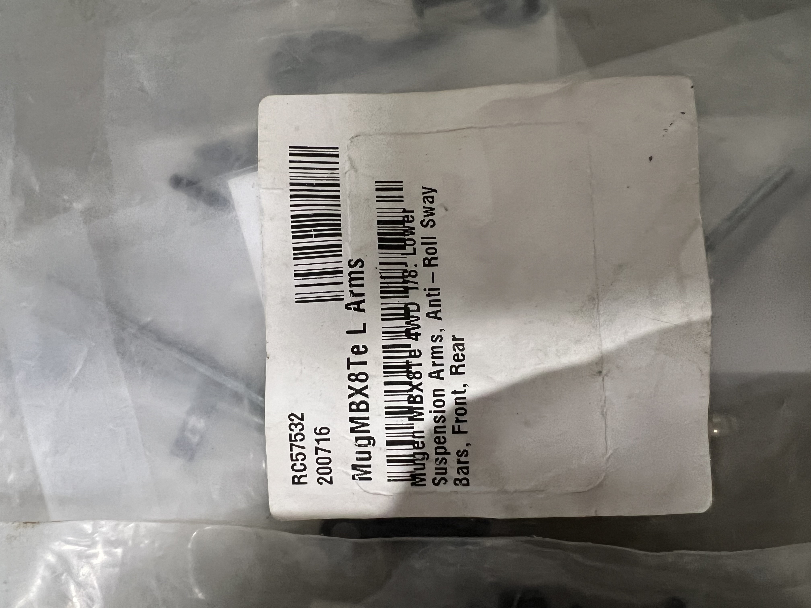
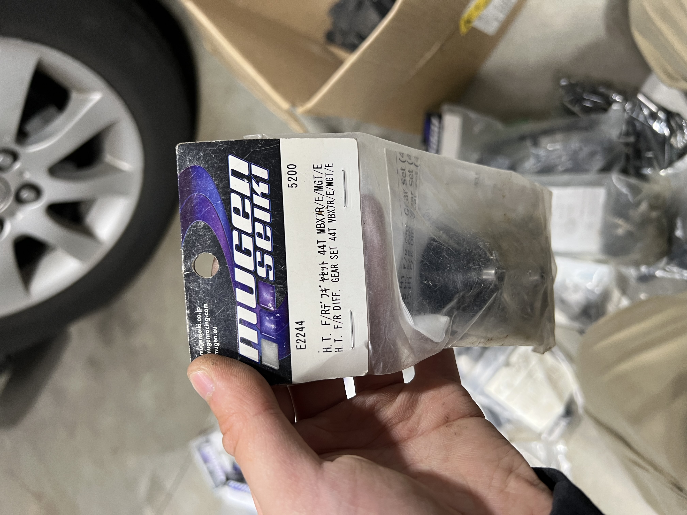

# Used-Lot Value Analysis — Mugen Seiki MBX8, converted to truggy (Eco / electric)

> **Verdict: worth buying — the value is the complete running truggy (Hobbywing XR8 + Savöx servo) plus the truggy conversion parts.** The car is an MBX8 **electric buggy chassis converted to a truggy** (confirmed). Because it's set up as a truggy, the two store **MBX8Te truggy** bags (longer arms + turnbuckles) are now the **conversion parts and DO fit** ✅ — but the two **buggy** bodies become spares-only (they fit only if you revert it to a buggy). The big box of new Mugen parts is still ~90% **MBX7/MGT** generation that does **not** fit the MBX8. Pay for the running truggy + electronics + wheels + the truggy conversion bits; treat the MBX7 hoard as resale.

  &nbsp; 
  <em>MBX8Te truggy lower arms + sway bars — the conversion parts, so these FIT ✅ · a new diff gear set whose tag reads MBX7R/E/MGT/E (not MBX8) — resale only</em>

---

## Table of Contents

- [The car & electronics (confirmed from photos)](#the-car--electronics-confirmed-from-photos)
- [Known issues / condition](#known-issues--condition)
- [What you're buying](#what-youre-buying)
- [The big catch: MBX7 ≠ MBX8](#the-big-catch-mbx7--mbx8)
- [Compatibility buckets](#compatibility-buckets)
- [Verified compatibility audit](#verified-compatibility-audit)
- [Full spares inventory](#full-spares-inventory)
- [Value summary](#value-summary)
- [Buy / negotiate / walk](#buy--negotiate--walk)
- [Open items / need pics](#open-items--need-pics)

---

## The car & electronics (confirmed from photos)

A complete, **heavily used** Mugen **MBX8** roller, **converted from buggy to truggy** (running the MBX8Te truggy arms). Dirty, some corrosion (the steering turnbuckle is visibly rusted), but assembled and apparently functional.

| Item | What | Value note |
|---|---|---|
| **Chassis** | Mugen **MBX8**, electric (Eco), **converted to truggy** — 4 big-bore shocks, carbon shock towers, center diff | The backbone of the deal |
| **ESC + motor** | Hobbywing **Xerun XR8 Plus + 4274 G3 2250KV** combo (1/8 competition, **sensored**; cap, red button, EC5 lead) — **fan missing & apparently run fanless a long time** → possible heat degradation, **bench-test before trusting** | combo ~$280–330 new; **$60–200 used** depending on ESC health (could be cooked) |
| **Motor** | Hobbywing **Xerun 4274 G3, 2250KV** (sensored) — the combo motor | ~$110 new alone (counted in combo above) |
| **Steering servo** | **Savöx digital**, label reads ~**"SB-2273SG"** | Legit servo — ~$70–90 new / **$40–60 used** *(confirm exact prefix)* |
| **Battery** | LiPo pack included | $20–50 — **check it's not puffed**, health unknown |
| **Body (clear)** | **Leadfinger Racing (LFR)** 1/8 **buggy** body, untrimmed, film on | ~$30–45 new — **fits only if reverted to buggy** |
| **Body (painted)** | Blue→green fade **buggy** body, used | $0–15 — buggy spare |
| **Wheels** | 1× AKA race set + 1× Pro-Line Badlands (basher) — *not mounted in these pics* | ~$60–95 the pair — **confirm they're 1/8 truggy size, not buggy** |

> ⚠️ **As a truggy it needs a truggy body + truggy-size tires.** Confirm what body it currently runs, and that at least one of the wheel sets is truggy-size. The two buggy bodies in the lot are for the buggy configuration.

---

## Known issues / condition

**Rear chassis worn — chewing rear pinions.** Per the seller the truck eats rear pinion gears. Diagnosed cause: the rear of the chassis plate is thin / wallowed enough that the **rear gearbox screws walk ~0.5mm rearward**, which opens up the **bevel pinion → conical (ring) gear mesh** and strips the pinion under power.

**Repair parts (all MBX8 truggy. None are in the MBX7 spares box):**

| Need | Part # | Note |
|---|---|---|
| Rear chassis plate | **E2435A** | MBX8TR ECO, ~$70–95 |
| Rear bevel pinion (the bad gear) | **E2263** | 10T straight-cut truggy bevel — **the only diff part needed** |
| Gear box housing | E2142 | only if the housing itself is worn (rear diff internals are OK) |
| Conical ring gear | E2264 | **not needed** — rear diff is fine |

- **Set the mesh** with a paper shim and blue-Loctite the gearbox screws after re-locating.
- **Check** the gearbox feet / screw holes aren't egg-shaped too. A new plate won't help if the gearbox side is also worn.
- **Note:** the box's `E2247` 46T conical is the **MBX7TR** version, NOT this. The MBX8 truggy 46T is **E2264**.
- **Value impact:** makes this a needs-work roller, not a clean runner. See the chassis line in the value summary; use it to negotiate.

**Front end fully worn (heavy).** Past "rusty." Needs a full refresh:

- **Every ball joint worn flat** (not even round anymore) and **all eyelets / rod ends blown out** — replace the lot. The box's usable hardware covers some of it: **H0867** pivot balls, **C0529A** link balls, **H0855** 6mm rod ends, plus **E0151** MBX8 ball cups. Buy extra rod ends + pivot balls to do the whole car.
- **Front upper arms loose** — the plastic pivot bushings/collars are blasted. Replace the MBX8 front upper-arm bushing set (verify P/N).
- **Front body mounts blasted** — **E2148B** MBX8 body-mount set (body mounts + chassis brace + upper plate).
- **Front bumper destroyed** — needs a new MBX8T front bumper (verify P/N). The box's `E0410` bumpers are **MBX7/6** and don't fit.
- **Front + rear skid plates missing** — this is the **root cause of the rear-chassis wear** (nothing protecting the plate). Replace with **steel skids** (e.g. T-Works front+rear set), not just stock plastic, so it doesn't recur.
- **Steering bellcrank balls** — already replaced, now mint ✅ (alloy bellcranks + found ball joints).

### Repair cost estimate (parts, US retail, DIY labor)

| Area | Parts | Est. |
|---|---|---|
| Rear chassis plate | E2435A | $80–95 |
| Rear bevel pinion (diff & conical are OK) | E2263 | $10–15 |
| Front bumper | MBX8T bumper | $12–18 |
| Front + rear skid plates | steel (T-Works etc.) | $15–30 |
| Front body mounts | E2148B | $22–30 |
| Ball joints / eyelets / ball cups | E0151 + rod ends + pivot balls (box covers some) | $20–45 |
| Front upper-arm bushings | verify P/N | $10–15 |
| ESC cooling fan (XR8 30mm) | missing on the XR8 Plus | $10–15 |
| **Total (parts)** | | **~$180–265** |

Trim to ~**$150–200** if the gear box/conical are reusable and you use the box's H0867 / C0529A / H0855 hardware for the balls and eyelets. Labor is your time.

---

## What you're buying

| Item | Notes |
|---|---|
| **Running MBX8 truggy** | Complete, used, with XR8 + Lightning 2300KV + Savöx servo |
| **Truggy conversion parts** | MBX8Te arms + sway bars + turnbuckle kit (already on the car / spares) ✅ |
| **2× buggy bodies** | LFR clear + painted — only fit if reverted to buggy |
| **2× wheel/tire sets** | AKA race + Pro-Line Badlands — confirm truggy size |
| **Mugen spares bin** | ~30 SKUs, mostly new-in-package — but mostly **MBX7/MGT** (see below) |

---

## The big catch: MBX7 ≠ MBX8

The one filter that still kills most of the spares is **generation**. Mugen's **MBX8 (2017) was a clean-sheet redesign** over MBX7/MBX7R/MGT — diffs, gearboxes, uprights, arm mounts, and driveshafts changed. Mugen prints the fitment on every bag, so the tag is ground truth:

- Tag lists **MBX8** (e.g. `MBX8/7R`, `MBX8/7/MGT`, `MBX8Te`) → **fits.** ✅
- Tag lists **only MBX7 / MBX7R / MGT / MBX6** → older gen, **won't fit the MBX8.** ♻️ resale
- Generic `MBX/MGT` on **diff internals** = the **MBX7-era diff**, *not* the MBX8 diff → treat as MBX7.

Now that the car is a **truggy**, the `MBX8Te` (MBX8 Truggy electric) arm + turnbuckle bags are spot-on. The nitro `E2712` is still useless (electric car). This looks like a seller who also ran an **MBX7/MGT** car for years — that's where the deep MBX7 hoard came from, and it doesn't belong to this truggy.

---

## Compatibility buckets

### ✅ Usable on your MBX8 truggy (fits / very likely fits)
| Part | What | Tag |
|---|---|---|
| **RC57532** | Lower arms + front/rear anti-roll sway bars | `MBX8Te` — truggy conversion part |
| **RC55509** | Turnbuckles, ballcups, pivot balls, steering tie rod | `MBX8Te` — truggy conversion part |
| **E2146** | Front upright | `MBX8/7R` |
| **E2116** | Titanium turnbuckle set | `MBX8/7/MGT` |
| Stainless steel screw kit | full-chassis hardware | `MBX8 & MBX8T` — fits ✅ |
| Alloy shock towers (×2, f+r) + mud guards | aftermarket | verify MBX8 truggy cut |
| Alloy steering bellcranks (×2, 32.0 g) | aftermarket | verify MBX8 fit |
| E2324 | Battery connector holder (electric) | `MBX/T/MGT` — verify |
| C0271 / H0867 / C0529A / H0855 / C0264 | Generic ball/link/pivot hardware | universal — verify sizes |

### 🔶 Buggy-only (fits only if you revert it to a buggy)
LFR clear body · painted body — both **buggy** shells; you'll want a **truggy body** for the current config.

### ♻️ Resale only — wrong generation (MBX7/MGT)
`E2244`/`E2248` HT diff gear sets · `E2203` 42T / `E2247` 46T conical gears · `E2201`/`E2202`/`E2232` diff cases · `E2241` diff gaskets · `E2242` diff o-rings · `E0146` gearbox · `E2101` center diff mount · `E2129` front upright · `E2123`/`E0160` kingpin balls · `E2301`/`E2316` servo savers · `E0410` foam bumpers · `E2138` rear sway bar · `E2015` rear universals (MBX7R buggy) · loose diff gears + center-trans assembly · MGT7/E springs

> These are the big-MSRP items (diff gear sets ¥5,200 each), genuinely valuable — just **not to your MBX8.** Sell them to MBX7/MGT owners to recoup cash.

### 🚫 N/A for an electric car
**E2712** Engine-mount washer (`MBX8/8T`) — nitro only.

### ❌ Damaged
**E2152** Rear lower arm mount R (`MBX8`, alloy) — hand-labeled **"Bent."** Would otherwise fit; budget $0 (straightening reference / scrap).

---

## Verified compatibility audit

Part-by-part fitment checks against the **MBX8 truggy**, verified against Mugen's published fitment listings. This **supersedes the buckets above where they differ** — the bag tags undersell several parts. The rule that emerged: diff **seals/consumables** + steering **small parts** carried forward MBX7→MBX8 and **fit**; diff **gears**, **mounts**, the **standard diff case**, and **gen-specific uprights** were redesigned and **don't**.

| Part | What | Verified fitment | Fits truggy? |
|---|---|---|---|
| E0160 | Front lower kingpin ball | MBX6 / 7 / **8** | ✅ |
| E2123 | Steel kingpin ball | MBX7 / MGT7 / **MBX8** | ✅ |
| E2146 | Front upright (non-trailing) | X8 / X8T / X7 | ✅ |
| E2301 | Servo saver set | MBX7 / 8 / MGT | ✅ |
| E2316 | Servo saver spring (hard) | X8 / X8T / X7R / GT7 | ✅ |
| H0855 | Ball link 6mm (C0111C) | MBX8 / MBX6 (universal) | ✅ |
| E2241 | HTD diff gasket | MBX7R / MGT7 / **MBX8** | ✅ |
| E2242 | HTD S6 diff o-rings | X8 / X8T / MBX7R | ✅ |
| E2243 | HTD diff washer set | MBX7R / MGT7 / **MBX8** | ✅ |
| E2232 | HTD diff **case** | MBX7R / MGT7 / **MBX8** | ✅ |
| E2324 | Battery connector holder | MBX8 / 8R / MBX8T | ✅ |
| E0410 | Front bumper (foam) | MBX6 / 7 only | 🚫 |
| E2101 | Center diff mount | MBX7 / MGT7 only | 🚫 |
| E2201 | Standard diff case | MBX7 only | 🚫 |
| E2203 | Conical gear 42T | MBX7 (MBX8 uses E2254) | 🚫 |
| E2244 | HTD gear set 44T | X7R / MGT (MBX8 uses E2255) | 🚫 |
| E2248 | HTD gear set 42T | X7R / MGT (MBX8 uses E2256) | 🚫 |
| E2129 | Front upright (trailing) | X7R / X7RE only (geometry; hub bearings are the same 8×16×5) | 🚫 |

> **Net effect:** the HTD diff **case + all seals/washers** (E2232 / E2241 / E2242 / E2243) plus the **steering & servo-saver small parts** (E0160 / E2123 / E2301 / E2316 / H0855) move from "resale" to **usable on the truck** — diff-rebuild + steering refresh stock for the actual MBX8. You'd still buy the MBX8 **gears** (E2254 / E2255 / E2256 + E2252 bevel). The big diff **gear sets** and **mounts** stay resale.

---

## Full spares inventory

Quantities are **conservative** — several SKUs were photographed multiple times and may be more than one pack (noted). Prices are the **Japanese MSRP printed on the tag** (¥); USD ≈ at **¥150 = $1**. US retail runs higher; used/open value lower.

| Part # | Description | Tag compat | Fits MBX8 truggy? | Qty | ¥ ea | ¥ subtotal |
|---|---|---|---|---|---|---|
| RC57532 | Lower arms + sway bars (f/r) | MBX8Te | ✅ yes | 1 | ~5,200* | 5,200 |
| RC55509 | Turnbuckles/ballcups/pivots/tie rod | MBX8Te | ✅ yes | 1 | ~3,000* | 3,000 |
| E2146 | Front upright | MBX8/7R | ✅ yes | 1 | 720 | 720 |
| E2116 | Titanium turnbuckle set | MBX8/7/MGT | ✅ yes | 1 | 1,100 | 1,100 |
| E2324 | Battery connector holder | MBX/T/MGT | ✅ verify | 1 | 1,100 | 1,100 |
| — | Stainless steel screw kit | MBX8 & MBX8T | ✅ yes | 1 | — | — |
| E2152 | Rear lower arm mount R (alloy) | MBX8 | ❌ **bent** | 1 | 2,710 | 0 |
| E2712 | Engine mount washer | MBX8/8T | 🚫 nitro | 1 | 290 | 290 |
| E2244 | HT F/R diff gear set 44T | MBX7R/E/MGT/E | ♻️ MBX7 | 1 (≤2?) | 5,200 | 5,200 |
| E2248 | HT F/R diff gear set 42T | MBX7R/E/MGT/E | ♻️ MBX7 | 1 | 5,200 | 5,200 |
| E2247 | Conical gear 46T (HTD) | MBX7TR/E | ♻️ MBX7 | 1 | 3,300 | 3,300 |
| E2203 | Conical gear 42T | MBX7/MGT | ♻️ MBX7 | 1 (≤3?) | 3,300 | 3,300 |
| E0146 | Gear box (plastic) | MBX/MGT | ♻️ MBX7 | 2 | 850 | 1,700 |
| E2101 | Center diff mount | MBX7/MGT | ♻️ MBX7 | 1 | 600 | 600 |
| E2202 | Diff case (HTD) | MBX/MGT | ♻️ MBX7 | 1 | 600 | 600 |
| E2201 | Diff case | MBX7 | ♻️ MBX7 | 1 | 400 | 400 |
| E2232 | Diff case/buffer (partial tag) | MBX/MGT | ♻️ MBX7 | 1 | ~400 | 400 |
| E2241 | Diff gasket (HTD) | MBX/MGT | ♻️ MBX7 | 3 (≤5?) | 560 | 1,680 |
| E2242 | S6 diff o-rings (silicone) | MBX/MGT | ♻️ MBX7 | 2 (≤3?) | 300 | 600 |
| E2138 | Rear anti-roll bar Ø2.5 | MBX7 | ♻️ MBX7 | 1 | 500 | 500 |
| E2129 | Front upright (plastic) | MBX7R/MGT | ♻️ MBX7 | 1 | 650 | 650 |
| E2123 | Kingpin ball (steel) | MBX7/MGT | ♻️ MBX7 | 1 | 1,200 | 1,200 |
| E0160 | Front lower kingpin ball | MBX7/6/6T | ♻️ MBX7 | 1 | 1,400 | 1,400 |
| E2301 | Servo saver | MBX7/MGT | ♻️ MBX7 | 2 | 400 | 800 |
| E2316 | Servo saver spring (hard) | MGT/MBX7 | ♻️ MBX7 | 1 | 280 | 280 |
| E0410 | Front bumper (foam) | MBX7/6 | ♻️ MBX7 | 3 (≤5?) | 350 | 1,050 |
| E2015 | Rear universal driveshafts | MBX7R buggy | ♻️ MBX7 | 1 | ~3,500* | 3,500 |
| C0529A | Link ball | universal | ✅ likely | 1 | 500 | 500 |
| H0855 | Ball link Ø6 (C0111C) | universal | ✅ likely | 2 | 300 | 600 |
| H0867 | Pivot ball | universal | ✅ likely | 1 | 500 | 500 |
| C0271 | Joint pin Ø3×13.8 | universal | ✅ likely | 1 | 200 | 200 |
| C0264 | Joint shaft | MBX/MGT | ♻️ verify | 1 | 300 | 300 |
| — | MGT7/E springs | MGT7/E | ♻️ MBX7 | 2 | 200 | 400 |
| — | Diff gear set (store re-pack, loose) | — | ♻️ MBX7 | 1 | ~3,000* | 3,000 |
| — | Loose diff bevel/spider gears | — | ♻️ MBX7 | 1 lot | — | — |
| — | Loose CVD/universal joints (used) | — | ♻️ verify | 1 lot | — | — |
| — | Center-transmission assembly (used) | — | ♻️ MBX7 | 1 | — | — |
| — | LFR clear + painted bodies | buggy | 🔶 buggy only | 2 | ~5,000* | 5,000 |
| — | Alloy shock towers (f+r) + mud guards | aftermarket | ✅ verify | 1 pr | ~9,000* | 9,000 |
| — | Alloy steering bellcranks — **32.0 g** | aftermarket | ✅ verify | 1 pr | ~5,000* | 5,000 |

\* No factory price tag (store bags, alloy, bodies) — estimated at typical retail, flagged `*`.

---

## Value summary

Realistic used-market value **to you** (USD):

| Bucket | Sticker / retail | Realistic to you |
|---|---|---|
| **MBX8 truggy roller** (complete, well-used) | $600+ new kit | **$200–350 used** |
| **Rear chassis worn** — chews pinions; needs E2435A plate (~$80) + new bevel pinion + remesh | — | **−$80 to −120** (repair) |
| **Front end + bumper + skids gone** — ball joints/eyelets shot, upper-arm bushings blasted, body mounts + front bumper destroyed, front/rear skid plates missing | — | **−$90 to −170** (repair; box covers some hardware) |
| **Hobbywing Xerun XR8 Plus + 4274 G3 2250KV combo** (fan missing, **run hot — test ESC health**) | ~$280–330 new | **$60–200 used** (ESC may be heat-degraded) |
| **Savöx ~SB-2273SG servo** | ~$80 new | **$40–60 used** |
| **AKA race + Pro-Line Badlands wheels** | ~$110 | **$60–95** (confirm truggy size) |
| **Spares — usable on the truggy** (MBX8Te arms + turnbuckles, E2146, E2116, hardware, alloy towers/cranks*, batt holder, **+ HTD diff case/seals E2232/E2241/E2242/E2243 + steering parts E0160/E2123/E2301/E2316 — see audit**) | ~$200 retail | **$90–150** |
| **Buggy bodies** (LFR + painted) — only if reverted to buggy | ~$50 | **$15–40** |
| **Spares — MBX7/MGT resale pile** (big diff **gear sets** E2244/E2248/E2247/E2203, std cases E2201/E2202, gearbox E0146, center mount E2101, upright E2129, bumpers E0410, E2138, E2015) | ~$250 retail | **$70–130 if parted out** (≈ $0 if you don't) |
| **N/A / damaged** (E2712 nitro, E2152 bent) | — | **$0** |

> **Bottom line:** the roller needs **~$180–265 of repair parts** (rear chassis + bevel pinion, missing skids, destroyed front bumper, full front-end refresh, ESC fan), so a fair "to you" number lands around **$300–500** — carried mostly by the **Xerun XR8 Plus combo + Savöx servo + two wheel sets**. **Big caveat:** that combo (the deal's main asset) **ran fanless a long time** and may be heat-degraded, so bench-test it before paying — if the ESC is cooked, realistic value drops toward **$150–300**. The big diff **gear sets and mounts** are still MBX7/MGT resale. Treat the roller as a **project, not a runner**, and price it that way.
>
> **Negotiation levers:** the **worn rear chassis** (new E2435A + bevel pinion + remesh, ~$80–120 of work), the bent E2152, the nitro-only E2712, the buggy-only bodies, and the MBX7 diff **gear sets / mounts** are all "not for this truggy" or "needs fixing." Confirm it **runs**, that the **wheels are truggy-size**, and what **truggy body** it currently wears before settling a runner price.

---

## Buy / negotiate / walk

Decision rests on the **asking price** (still TBD) minus **~$200–290 of repairs** (chassis, diff, skids, bumper, full front-end). This is a high-end 1/8 race platform, but in this condition a **strip-and-rebuild project**, not a grab-and-bash. Worth it for someone who'll wrench it, a bad buy if you wanted a runner.

- **Under ~$250** → buy; the **Xerun XR8 combo + Savöx** nearly cover it and you treat the roller as a rebuild project.
- **$250–400** → only fair if you'll do the full rebuild (chassis + diff + front end + skids + bumper) and part out the MBX7 pile to recoup.
- **$400–550** → overpaying unless the repairs are already done; this is a worn project roller, not a runner.
- **$550+** → walk. Corrosion + chewed chassis + missing skids + destroyed front end = a project priced like a car.

**Before money changes hands:**
1. **Power it up** — listen for diff/bearing grind, confirm steering works.
2. **Spin the wheels by hand** — smooth vs gritty (bearing/diff refresh due on a rusty car).
3. **Battery not puffed.** **Bench-test the XR8 Plus** under load with a fan fitted — it ran fanless a long time, so watch for thermal cutoff, hesitation, or a burnt smell. The ESC is the deal's main asset; if it's cooked, the value collapses.
4. **Confirm wheels are truggy-size** and what **truggy body** it wears.
5. **Eyeball the verify items** (alloy towers/bellcranks, E2324) against the car for fit.

---

## Open items / need pics

- [x] Roller / electronics photos received — **MBX8, converted to truggy**, with XR8 + Lightning 2300KV + Savöx servo.
- [ ] **Drop the roller/electronics photos in `inbox/`** to archive them in `src/` (they were pasted in chat, not saved to disk).
- [ ] **Confirm it runs** and both wheel sets (AKA + Badlands) are included, usable, and **truggy-size**.
- [ ] **What truggy body** does it currently run? (the two spare bodies are buggy)
- [ ] **XR8 variant** — XR8 / XR8 Plus / XR8 SCT? Affects value.
- [ ] **Savöx exact model** — confirm "SB-2273SG" vs another 2273 prefix.
- [ ] **Alloy shock towers + bellcranks** — confirm MBX8 truggy cut (no tags).
- [ ] **Rear chassis** — order E2435A, check gearbox feet for wear, replace chewed bevel pinion, re-mesh + Loctite.
- [ ] Quantities marked "≤N?" — count actual packs to firm up the resale total.

*All spares photos are in [`src/`](src/), named by part number.*
