# Rlaarlo Omni-Terminator

> 1/10 4WD brushless monster truck — **kept mostly stock**. This page is a build/maintenance log, not a deep parts analysis: the plan is stock running gear plus a few easy items (shock oil, wheels/tires, basic alloy hubs) and the cheap durability swaps the community already agrees on. The big takeaway from owners: **the driveline is what breaks — stock up on dog bones, diff cups, and gears.**

> 🎓 **Graduation gift** from my dad, **Hien Nguyen**, for finishing my **Electrical Engineering** degree at **Portland State University** (graduated June 14, 2026).

*Photo TBD.*

---

## Table of Contents

- [Overview](#overview)
- [Track & Setup Philosophy](#track--setup-philosophy)
- [Known Weak Points — what breaks](#known-weak-points--what-breaks)
- [Maintenance Parts to Keep On Hand](#maintenance-parts-to-keep-on-hand)
- [Planned Light Upgrades](#planned-light-upgrades)
- [Option Parts Catalog](#option-parts-catalog)
- [Parts List](#parts-list)
- [TODO / Notes](#todo--notes)
- [Sources](#sources)

---

## Overview

| Spec | Value |
|------|-------|
| Class | 1/10 4WD brushless monster truck |
| Version | **Carbon** |
| Motor | 3650 **2650KV** brushless |
| ESC | **60A** brushless w/ fan |
| Battery | 3S LiPo (2200–4400mAh) |
| Top speed | ~50 mph (claimed) |
| Carbon extras | CF plates on suspension arms, radio with **voltage telemetry + gyro**, better motor/ESC vs base |

---

## Track & Setup Philosophy

Same as the rest of the fleet: set up for **Meldrum Bar Park** (dirt track), with occasional **beach** running. Kept **mostly stock** — only spend where it stops breakage or matters for dirt/sand (paddle tires for the beach, sealed/rinsed hardware, cheap hardened driveline parts).

---

## Known Weak Points — what breaks

The truck has a "well-built basher" reputation, and the **failures cluster in the driveline**. Tagged by confidence: **👥 = owners directly report it** (ARRMA forum, RCTalk, Rlaarlo group), **🔧 = my inference** (catalog availability + general basher wear, *not* a specific owner complaint).

1. 👥 **Dog bones / CVD driveshafts** — the #1 failure. Driveline parts can need replacing after as few as **~10 packs**. Stock up, or upgrade to the hardened S2 / 45# steel CVDs.
2. 👥 **Differential drive cups** — round out / strip where the dog bone seats. The **S2 drive-cup upgrade** is the common fix.
3. 👥 **Pinion / spur gears strip** — stock gears strip; owners report a **hardened aftermarket pinion** (Amazon) lasts much longer.
4. 👥 **Steering knuckles** — you (the owner) confirmed the stock plastic knuckles break.
5. 🔧 **Center differential (65T)** — a metal upgrade is sold and it's in the driveline, but I didn't see it as a *loud* complaint.
6. 🔧 **Hexes / bearings / shocks** — normal wear on any basher, not Omni-specific.

**Arms & bumpers — why they're *not* high on the list:** I expected them too, but found **no strong owner reports of suspension arms or bumpers breaking**. The Carbon version adds CF plates to stiffen the arms (a hint they *can* break under abuse), but it's not a common complaint, which fits the "well-built" rep. There's no traditional bumper part either — the **body shell (R11078)** takes front hits. So arms/body are listed as low-confidence spares, not must-haves.

---

## Maintenance Parts to Keep On Hand

Prioritized — 🔴 buy before you run it hard, 🟡 nice to have, 🟢 occasional. **Confidence:** 👥 = owners directly report it failing; 🔧 = my call (sensible spare / catalog item, no specific owner quote). Part numbers are universal; pricing is TBD (see note below).

| Pri | Src | Part | Rlaarlo # | Why | Photo |
|---|---|---|---|---|---|
| 🔴 | 👥 | S2 hardened CVD driveshafts | R11141 (front) / R11142 (rear) | Dog bones fail first; S2 hardened outlasts stock | 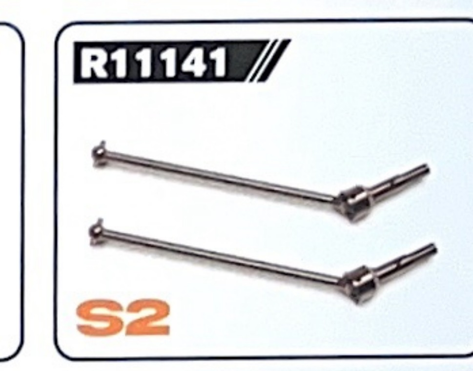 |
| 🔴 | 👥 | Standard front CVD driveshafts (2-pack) | R11036 | Cheaper stock-style spare to keep around | |
| 🔴 | 👥 | S2 diff drive cups | R11145 (also R11146/47/48) | Cups round out where the bone seats | 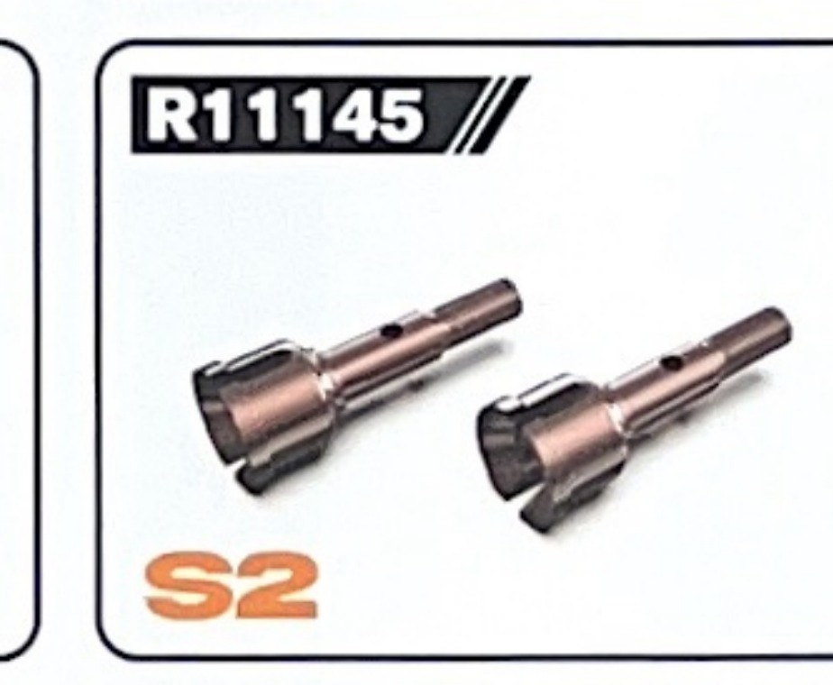 |
| 🔴 | 👥 | Hardened M1 pinion | R11155 (24T) / R11156 (26T) / R11157 (28T) | Stock pinion strips; hardened lasts far longer | 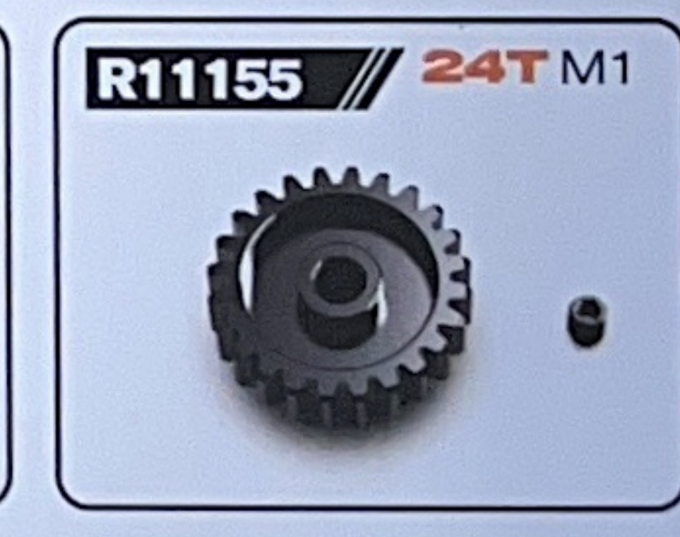 |
| 🔴 | 👥 | Steering knuckles / hubs (alloy) | R11132 (front) / R11133 (rear) | **Stock plastic knuckles break** — alloy is a real fix, not cosmetic | 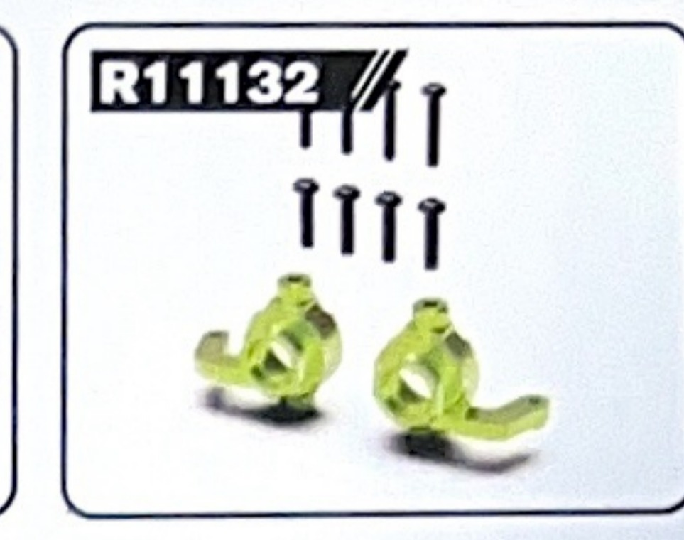 |
| 🟡 | 🔧 | 65T central differential | R11139 | In the driveline (34T diff = R11140); upgrade exists, not a loud complaint | 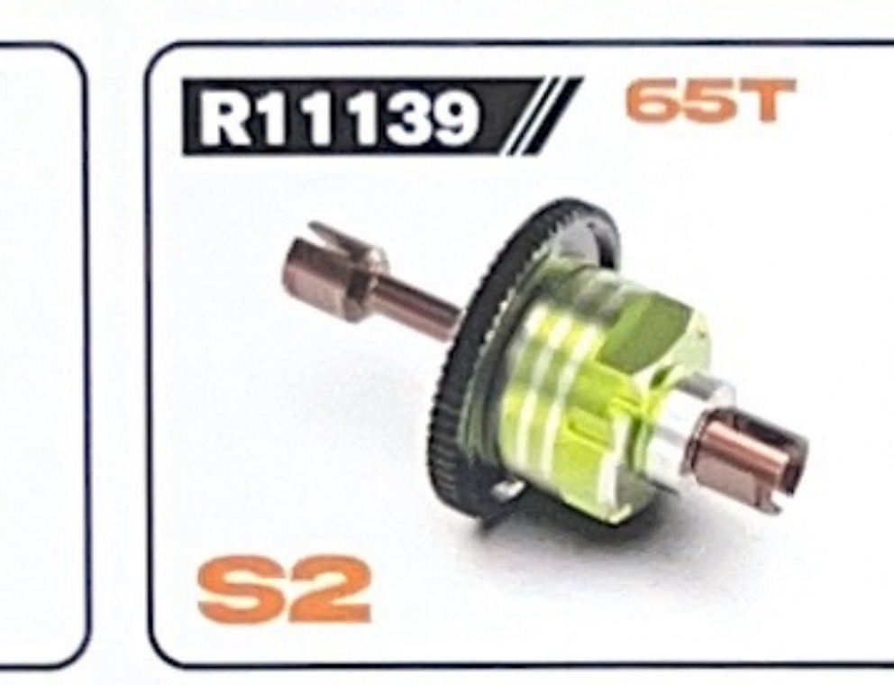 |
| 🟡 | 🔧 | 33T M1 center drive gear | R11154 (60T shaft = R11144) | Center driveline wear | 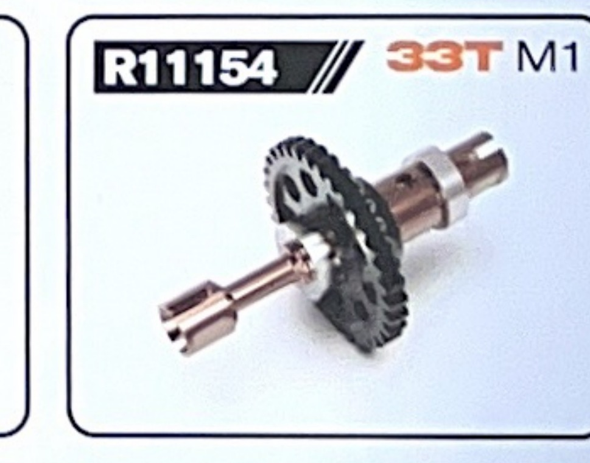 |
| 🟡 | 🔧 | Suspension arms (upper, S2) | R11130 (front) / R11131 (rear) | Carbon CF plates hint arms can break, but not a common report | |
| 🟡 | 🔧 | H17 alloy hex adaptors | RZ062 (or R11151) | Hexes round out | 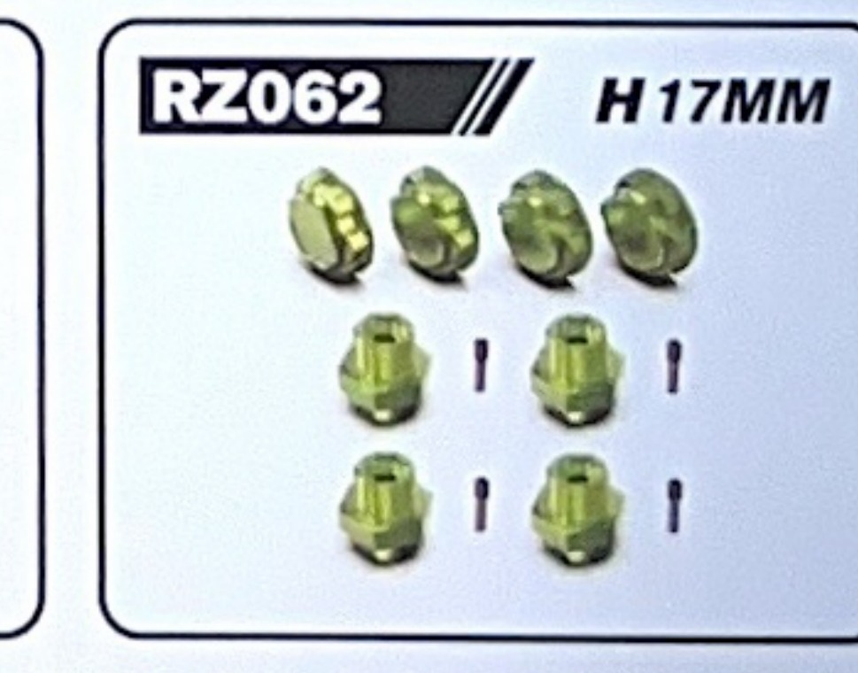 |
| 🟡 | 🔧 | Shock absorbers (2-pack) + oil | R11001 | Leak/bend; oil for tuning | |
| 🟡 | 🔧 | Full bearing kit | ABEC-3 set (eBay) | Dirt and sand kill bearings; keep a reseal set | |
| 🟢 | 🔧 | Servo saver (alloy upgrade) | R11137 (stock) | Protects the steering servo; alloy version available (fits RZ001 / 1/10 rally) | 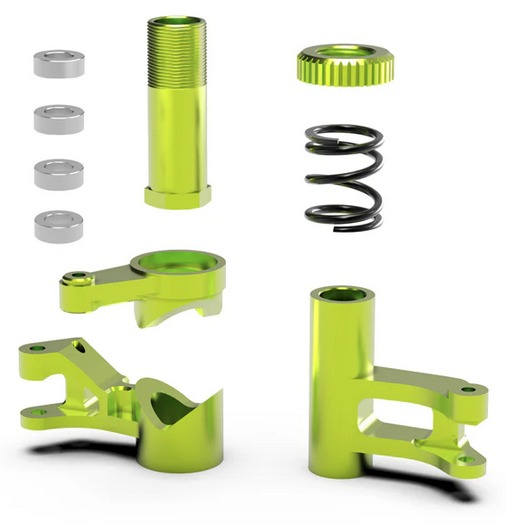 |
| 🟢 | 🔧 | Paddle sand tires / body shell | R11152 / R11078 | Beach grip + cosmetic wear | 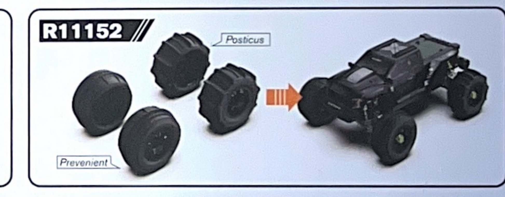 |

> **Pricing:** AliExpress (where the cheapest of these usually are) blocks automated price-scraping, so live $ figures are TBD. CVD driveshafts also show up on **Amazon / eBay** as "for Rlaarlo Omni-Terminator" parts. Paste an AliExpress listing or a cart total and I'll fill a price column.

---

## Planned Light Upgrades

Keeping it mostly stock — only these:

- **Hardened steel pinion** (cheap insurance against the most common strip).
- **S2 hardened CVDs + S2 diff drive cups** — the one durability swap every owner recommends.
- **Aluminum hubs / steering:** front steering hubs (R11132), rear hub carriers (R11133), alloy upper steering brace (R11134), alloy gearbox cover (R11138).
- **Shock oil tuning** — dial damping for dirt (analysis later if it's worth a doc).
- **Wheels/tires:** **paddle sand tires (R11152)** for beach days; a grippier dirt tire for Meldrum.

---

## Option Parts Catalog

Full Rlaarlo option/upgrade sheet (every part number) and the AL alloy modification-kit overview — handy for ordering spares by R-number.

  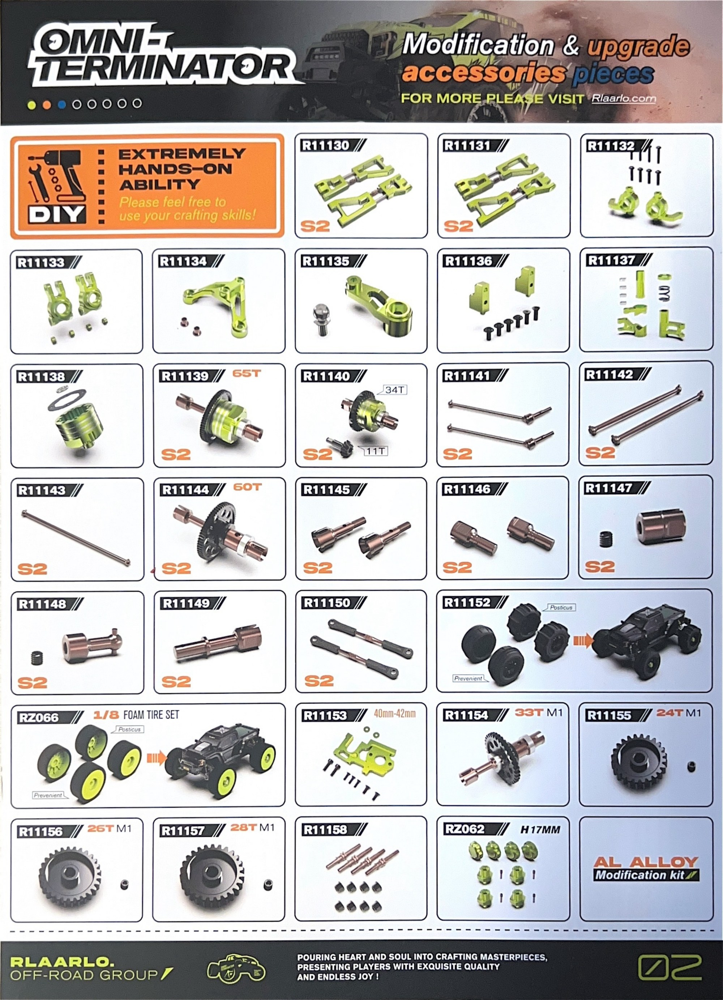&nbsp;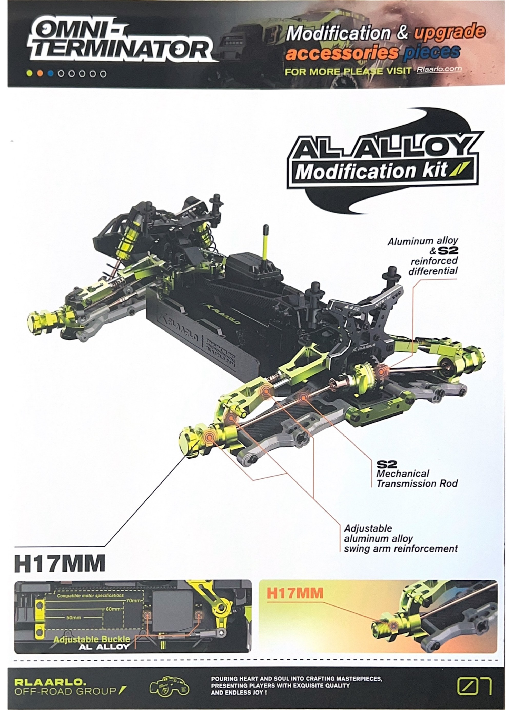 
  <em>Option parts (R11130–R11158, RZ062, RZ066) · AL alloy modification kit (reinforced diffs, S2 transmission rods, alloy swing-arm braces, H17 hexes)</em>

---

## Parts List

| Part # | Description | Category | Cost | Source | Photo |
|--------|-------------|----------|------|--------|-------|
| — | Rlaarlo Omni-Terminator **Carbon** | Base Car | gift | Rlaarlo (grad gift) | — |

---

## TODO / Notes

- [x] Version confirmed: **Carbon**
- [ ] Add a photo of the car
- [ ] Order the 🔴 driveline spares before hard running
- [ ] Decide on hardened pinion source

---

## Sources

- [Rlaarlo Omni-Terminator product page](https://rlaarlo.com/products/rlaarlo-carbon-fiber-black-omni-terminator-rz001b-c)
- [SeriousRC — Omni-Terminator spare parts & upgrades](https://www.seriousrc.co.uk/collections/rlaarlo-omni-terminator-truck-spare-parts-and-upgrades)
- [ARRMA RC Forum — Omni-Terminator thread](https://www.arrmaforum.com/threads/rlaarlo-omni-terminator-monster-truck.67774/)
- [RCTalk — Omni-Terminator thread](https://www.rctalk.com/forum/threads/omni-terminator.147457/)
- [Rlaarlo — differential / drive-cup upgrade guides](https://rlaarlo.com/blogs/support-video/rlaarlo-omni-terminator-upgrades-differential-housing-and-differential-drive-cup-upgrade-parts)
